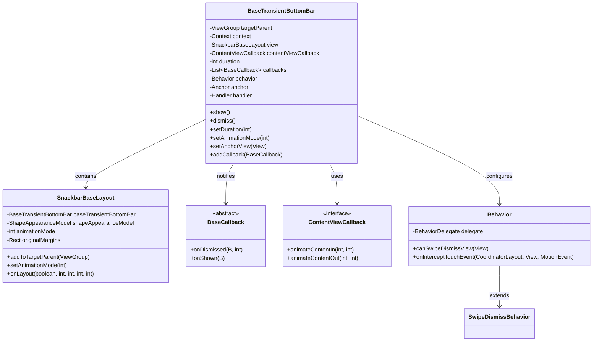
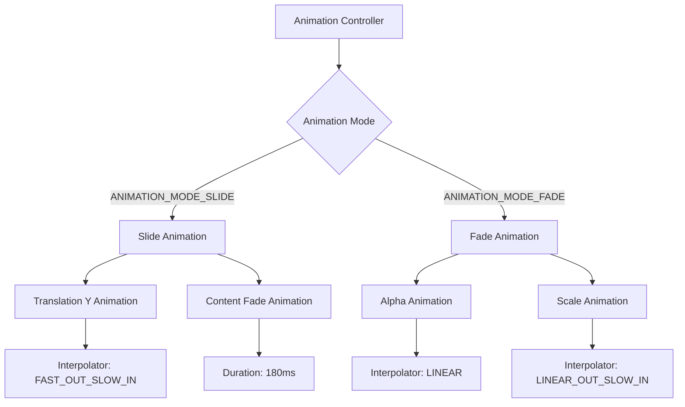
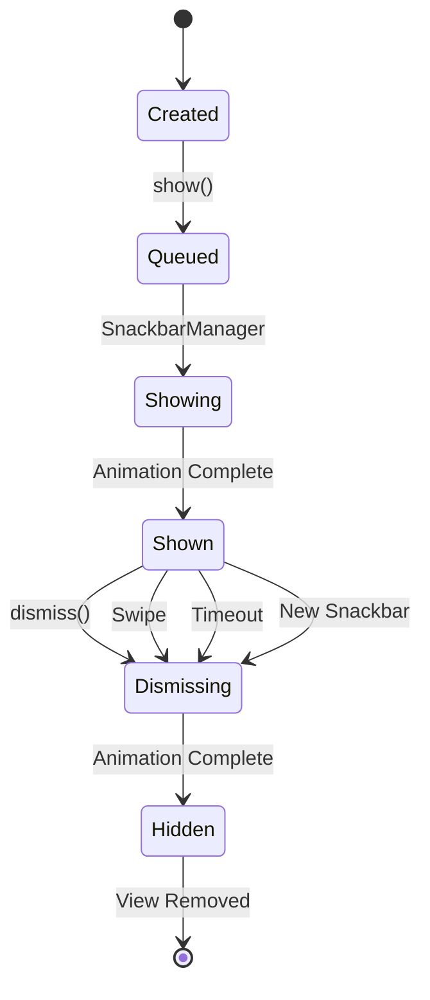
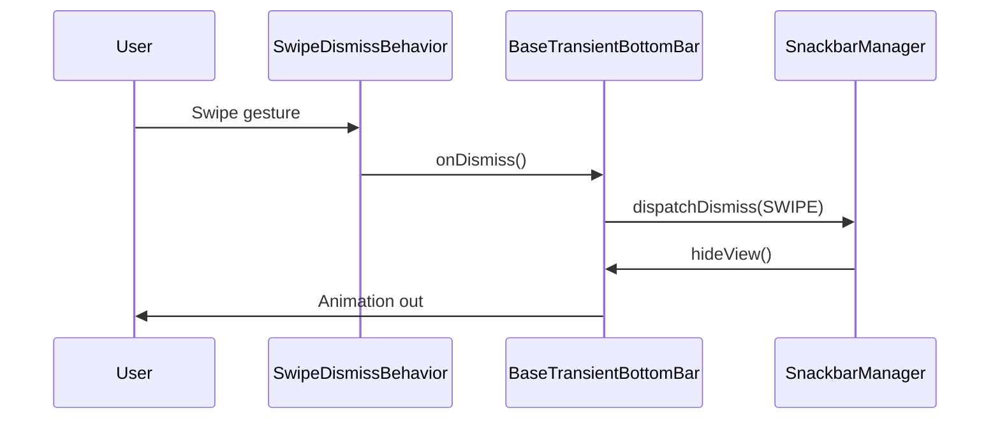
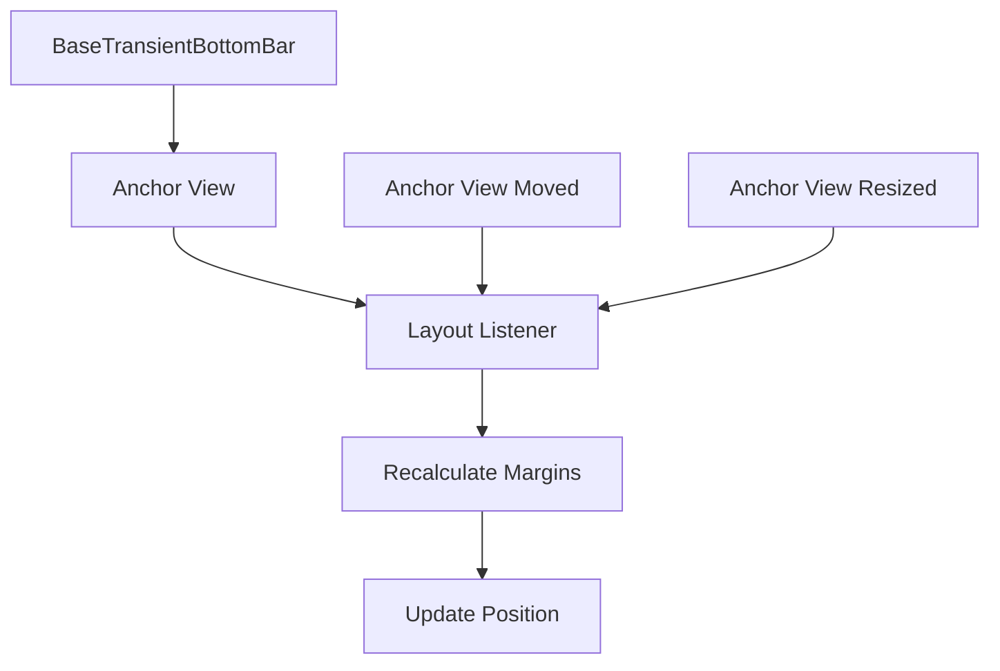
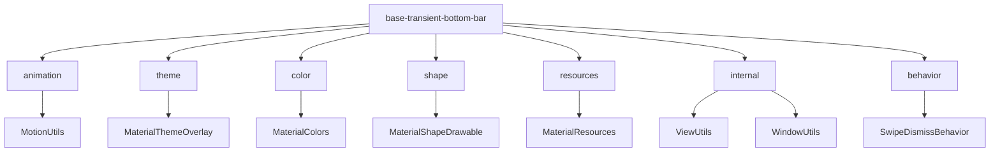
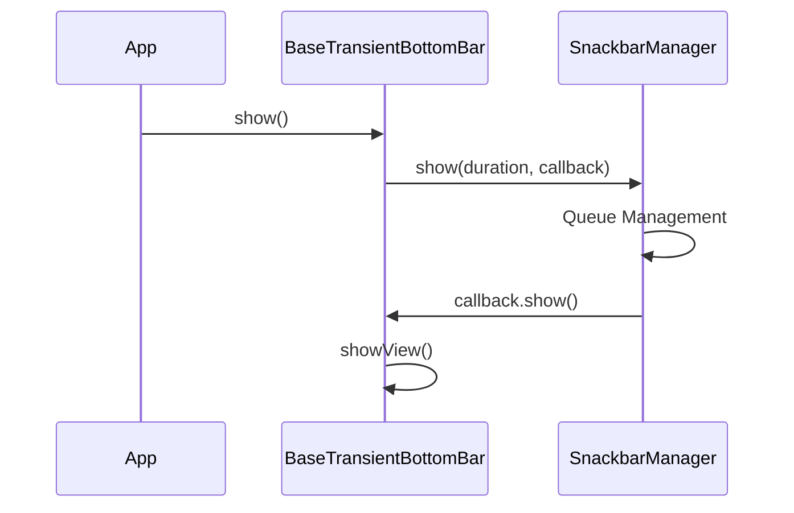

# Base Transient Bottom Bar Module

## Introduction

The `base-transient-bottom-bar` module provides the foundational framework for displaying lightweight transient notification bars along the bottom edge of the application window. This module serves as the base class for Material Design snackbars and similar transient UI components, offering a robust architecture for managing the lifecycle, animations, and interactions of bottom-positioned notification elements.

## Module Overview

The module implements a comprehensive system for creating and managing transient bottom bars with support for:
- Multiple animation modes (slide and fade)
- Swipe-to-dismiss functionality
- Accessibility features
- Anchor view positioning
- Gesture inset handling for Android Q+
- Customizable styling and theming
- Event callbacks and lifecycle management

## Core Architecture

### Primary Components


```mermaid
classDiagram
    class BaseTransientBottomBar {
        -ViewGroup targetParent
        -Context context
        -SnackbarBaseLayout view
        -ContentViewCallback contentViewCallback
        -int duration
        -List~BaseCallback~ callbacks
        -Behavior behavior
        -Anchor anchor
        -Handler handler
        +show()
        +dismiss()
        +setDuration(int)
        +setAnimationMode(int)
        +setAnchorView(View)
        +addCallback(BaseCallback)
    }

    class SnackbarBaseLayout {
        -BaseTransientBottomBar baseTransientBottomBar
        -ShapeAppearanceModel shapeAppearanceModel
        -int animationMode
        -Rect originalMargins
        +addToTargetParent(ViewGroup)
        +setAnimationMode(int)
        +onLayout(boolean, int, int, int, int)
    }

    class BaseCallback {
        <<abstract>>
        +onDismissed(B, int)
        +onShown(B)
    }

    class ContentViewCallback {
        <<interface>>
        +animateContentIn(int, int)
        +animateContentOut(int, int)
    }

    class Behavior {
        -BehaviorDelegate delegate
        +canSwipeDismissView(View)
        +onInterceptTouchEvent(CoordinatorLayout, View, MotionEvent)
    }

    BaseTransientBottomBar --> SnackbarBaseLayout : contains
    BaseTransientBottomBar --> ContentViewCallback : uses
    BaseTransientBottomBar --> BaseCallback : notifies
    BaseTransientBottomBar --> Behavior : configures
    Behavior --> SwipeDismissBehavior : extends
```

### Animation System


```mermaid
flowchart TD
    A[Animation Controller] --> B{Animation Mode}
    B -->|ANIMATION_MODE_SLIDE| C[Slide Animation]
    B -->|ANIMATION_MODE_FADE| D[Fade Animation]
    
    C --> C1[Translation Y Animation]
    C --> C2[Content Fade Animation]
    
    D --> D1[Alpha Animation]
    D --> D2[Scale Animation]
    
    C1 --> E[Interpolator: FAST_OUT_SLOW_IN]
    C2 --> F[Duration: 180ms]
    
    D1 --> G[Interpolator: LINEAR]
    D2 --> H[Interpolator: LINEAR_OUT_SLOW_IN]
```

### Lifecycle Management


```mermaid
stateDiagram-v2
    [*] --> Created
    Created --> Queued: show()
    Queued --> Showing: SnackbarManager
    Showing --> Shown: Animation Complete
    Shown --> Dismissing: dismiss()
    Dismissing --> Hidden: Animation Complete
    Hidden --> [*]: View Removed
    
    Shown --> Dismissing: Swipe
    Shown --> Dismissing: Timeout
    Shown --> Dismissing: New Snackbar
```

## Key Features

### 1. Animation Modes

The module supports two primary animation modes:

- **Slide Animation (Default)**: Vertical translation with content fade
- **Fade Animation**: Alpha and scale transformations

```java
// Animation configuration
public static final int ANIMATION_MODE_SLIDE = 0;
public static final int ANIMATION_MODE_FADE = 1;
```

### 2. Swipe Dismiss Behavior

Integrated with CoordinatorLayout and SwipeDismissBehavior for gesture-based dismissal:


```mermaid
sequenceDiagram
    participant User
    participant SwipeDismissBehavior
    participant BaseTransientBottomBar
    participant SnackbarManager
    
    User->>SwipeDismissBehavior: Swipe gesture
    SwipeDismissBehavior->>BaseTransientBottomBar: onDismiss()
    BaseTransientBottomBar->>SnackbarManager: dispatchDismiss(SWIPE)
    SnackbarManager->>BaseTransientBottomBar: hideView()
    BaseTransientBottomBar->>User: Animation out
```

### 3. Anchor View System

Supports anchoring above specific views with automatic position recalculation:


```mermaid
graph TD
    A[BaseTransientBottomBar] --> B[Anchor View]
    B --> C[Layout Listener]
    C --> D[Recalculate Margins]
    D --> E[Update Position]
    
    F[Anchor View Moved] --> C
    G[Anchor View Resized] --> C
```

### 4. Accessibility Features

Comprehensive accessibility support including:
- Screen reader compatibility
- Gesture navigation handling (Android Q+)
- Keyboard navigation support
- Accessibility announcements

### 5. Margin Management

Sophisticated margin calculation system handling:
- Window insets (system bars)
- Anchor view positioning
- Gesture insets (Android Q+)
- Original view margins preservation

## Dependencies

The module integrates with several Material Design components:


```mermaid
graph TD
    A[base-transient-bottom-bar] --> B[animation]
    A --> C[theme]
    A --> D[color]
    A --> E[shape]
    A --> F[resources]
    A --> G[internal]
    A --> H[behavior]
    
    B --> B1[MotionUtils]
    C --> C1[MaterialThemeOverlay]
    D --> D1[MaterialColors]
    E --> E1[MaterialShapeDrawable]
    F --> F1[MaterialResources]
    G --> G1[ViewUtils]
    G --> G2[WindowUtils]
    H --> H1[SwipeDismissBehavior]
```

## Integration Points

### 1. Snackbar Implementation

The module serves as the foundation for the main [snackbar-implementation](snackbar-implementation.md) component:

```java
public class Snackbar extends BaseTransientBottomBar<Snackbar> {
    // Extends base functionality with action buttons
    // and specific styling for Material Design snackbars
}
```

### 2. Content Layout

Works in conjunction with [content-layout](content-layout.md) for structured content presentation:

```java
// SnackbarContentLayout implements ContentViewCallback
view.addView(content); // Content is typically SnackbarContentLayout
```

### 3. Snackbar Manager

Integrates with the system-wide SnackbarManager for queue management and coordination:


```mermaid
sequenceDiagram
    participant App
    participant BaseTransientBottomBar
    participant SnackbarManager
    
    App->>BaseTransientBottomBar: show()
    BaseTransientBottomBar->>SnackbarManager: show(duration, callback)
    SnackbarManager->>SnackbarManager: Queue Management
    SnackbarManager->>BaseTransientBottomBar: callback.show()
    BaseTransientBottomBar->>BaseTransientBottomBar: showView()
```

## Configuration Options

### Duration Constants

```java
public static final int LENGTH_INDEFINITE = -2;  // Show until dismissed
public static final int LENGTH_SHORT = -1;       // Short duration
public static final int LENGTH_LONG = 0;         // Long duration
```

### Dismiss Events

```java
public static final int DISMISS_EVENT_SWIPE = 0;      // User swiped
public static final int DISMISS_EVENT_ACTION = 1;     // Action clicked
public static final int DISMISS_EVENT_TIMEOUT = 2;    // Time expired
public static final int DISMISS_EVENT_MANUAL = 3;     // Manual dismiss()
public static final int DISMISS_EVENT_CONSECUTIVE = 4; // New snackbar shown
```

### Animation Configuration

Default animation parameters:
- **Slide Duration**: 250ms
- **Fade In Duration**: 150ms  
- **Fade Out Duration**: 75ms
- **Scale From Value**: 0.8f

## Usage Patterns

### Basic Implementation

```java
// Create and show a transient bottom bar
BaseTransientBottomBar<?> bar = new CustomTransientBottomBar(
    parentViewGroup,
    contentView,
    contentViewCallback
);
bar.setDuration(BaseTransientBottomBar.LENGTH_LONG)
   .setAnimationMode(BaseTransientBottomBar.ANIMATION_MODE_FADE)
   .show();
```

### Advanced Configuration

```java
// Configure with anchor view and callbacks
bar.setAnchorView(anchorView)
   .setGestureInsetBottomIgnored(false)
   .addCallback(new BaseCallback<CustomTransientBottomBar>() {
       @Override
       public void onDismissed(CustomTransientBottomBar bar, int event) {
           // Handle dismissal
       }
       
       @Override
       public void onShown(CustomTransientBottomBar bar) {
           // Handle show
       }
   });
```

## Thread Safety

The module ensures thread safety through:
- Handler-based message system for UI operations
- Main thread enforcement for view modifications
- Synchronized access to shared state via SnackbarManager

## Performance Considerations

### Memory Management
- WeakReference usage for anchor views to prevent memory leaks
- Automatic cleanup on view detachment
- Resource recycling for animation objects

### Animation Optimization
- Hardware acceleration support
- Interpolator caching
- Batch property updates during animations

### Layout Efficiency
- Margin recalculation only when necessary
- Deferred layout operations
- View state optimization

## Error Handling

The module includes comprehensive error handling for:
- Invalid parent/child view relationships
- Missing content views or callbacks
- Animation failures
- Accessibility service issues
- Resource loading problems

## Extension Points

### Custom Transient Bottom Bars

Extend `BaseTransientBottomBar` to create custom implementations:

```java
public class CustomTransientBottomBar extends BaseTransientBottomBar<CustomTransientBottomBar> {
    // Override methods for custom behavior
    // Implement custom styling and interactions
}
```

### Custom Behaviors

Implement custom `BaseTransientBottomBar.Behavior` for specialized interaction patterns:

```java
public class CustomBehavior extends BaseTransientBottomBar.Behavior {
    // Override touch handling and dismissal logic
}
```

### Content View Callbacks

Implement `ContentViewCallback` for custom content animations:

```java
public class CustomContentCallback implements ContentViewCallback {
    // Implement custom content animation logic
}
```

## Best Practices

1. **Duration Selection**: Use appropriate duration constants for user experience
2. **Anchor View Management**: Properly manage anchor view lifecycle
3. **Accessibility**: Ensure content is accessible and properly announced
4. **Animation Performance**: Choose appropriate animation modes for device capabilities
5. **Memory Management**: Clean up callbacks and references when no longer needed
6. **Thread Safety**: Always interact with UI components on the main thread

## Related Documentation

- [snackbar-implementation](snackbar-implementation.md) - Main snackbar implementation
- [content-layout](content-layout.md) - Content layout management
- [behavior](behavior.md) - Swipe and interaction behaviors
- [animation](animation.md) - Animation utilities and interpolators
- [theme](theme.md) - Theming and styling system
- [color](color.md) - Color management and theming
- [shape](shape.md) - Shape appearance and background drawing