# Behavior System Module - Comprehensive Documentation

## Introduction

The behavior-system module provides the foundational framework for implementing Material Design behaviors across multiple UI components. This module contains core behavior classes that enable sophisticated view interactions, animations, and gesture handling within CoordinatorLayout environments. The behaviors defined here serve as building blocks for complex Material Design components including AppBarLayout, SideSheet, CollapsingToolbarLayout, and other interactive UI elements.

The module encompasses two distinct behavior domains:
1. **AppBar Behavior System** - Vertical scrolling behaviors for header components
2. **SideSheet Behavior System** - Horizontal sliding behaviors for side sheet components

## Module Architecture

### Component Hierarchy

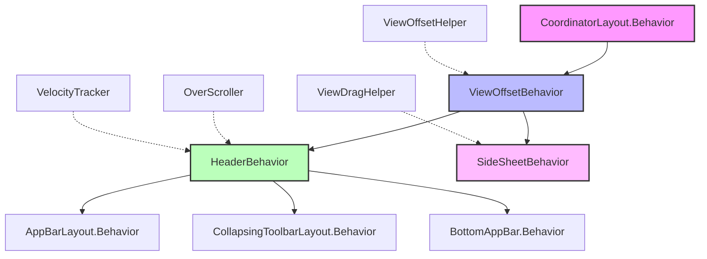

### Module Organization

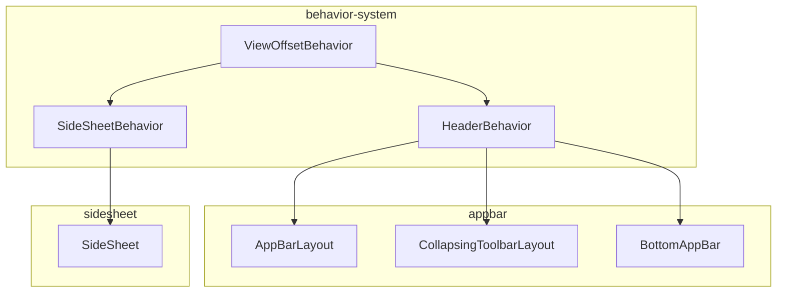

## Core Components

### HeaderBehavior

`HeaderBehavior<V extends View>` is an abstract behavior class that provides sophisticated vertical scrolling behavior for header components. It handles touch events, velocity tracking, and smooth scrolling animations.

**Key Features:**
- Touch event interception and handling
- Velocity tracking for fling gestures
- Smooth scrolling with OverScroller integration
- Configurable drag ranges and scroll limits
- Animation lifecycle management

**Core Methods:**
- `onInterceptTouchEvent()` - Determines when to intercept touch events for dragging
- `onTouchEvent()` - Handles touch events during active dragging
- `scroll()` - Performs smooth scrolling with offset constraints
- `fling()` - Initiates fling animations with velocity-based calculations
- `setHeaderTopBottomOffset()` - Manages vertical positioning with boundary constraints

### ViewOffsetBehavior

`ViewOffsetBehavior<V extends View>` is a foundational behavior class that provides view positioning capabilities through offset management. It serves as the base class for more specialized behaviors and handles the core mechanics of view positioning.

**Key Features:**
- Horizontal and vertical offset management
- ViewOffsetHelper integration for efficient positioning
- Temporary offset storage for pre-layout positioning
- Configurable offset enablement (horizontal/vertical)
- Layout coordination with CoordinatorLayout

### SideSheetBehavior

`SideSheetBehavior<V extends View>` extends `CoordinatorLayout.Behavior<V>` to provide horizontal sliding behavior for side sheet components. It implements the `Sheet<SideSheetCallback>` interface for state management and callback notifications.

**Key Features:**
- Horizontal drag gesture recognition
- State-based positioning (expanded, hidden, dragging, settling)
- Coplanar sibling view coordination
- Back gesture support for Android 13+
- Accessibility integration with pane announcements
- Material shape and elevation support

**Core Methods:**
- `setState()` - Controls sheet state transitions
- `expand()` / `hide()` - Convenience methods for state changes
- `onLayoutChild()` - Handles positioning based on current state
- `onTouchEvent()` - Processes drag gestures
- `calculateTargetStateOnViewReleased()` - Determines final state after drag release

## Data Flow Architecture

### AppBar Behavior Flow

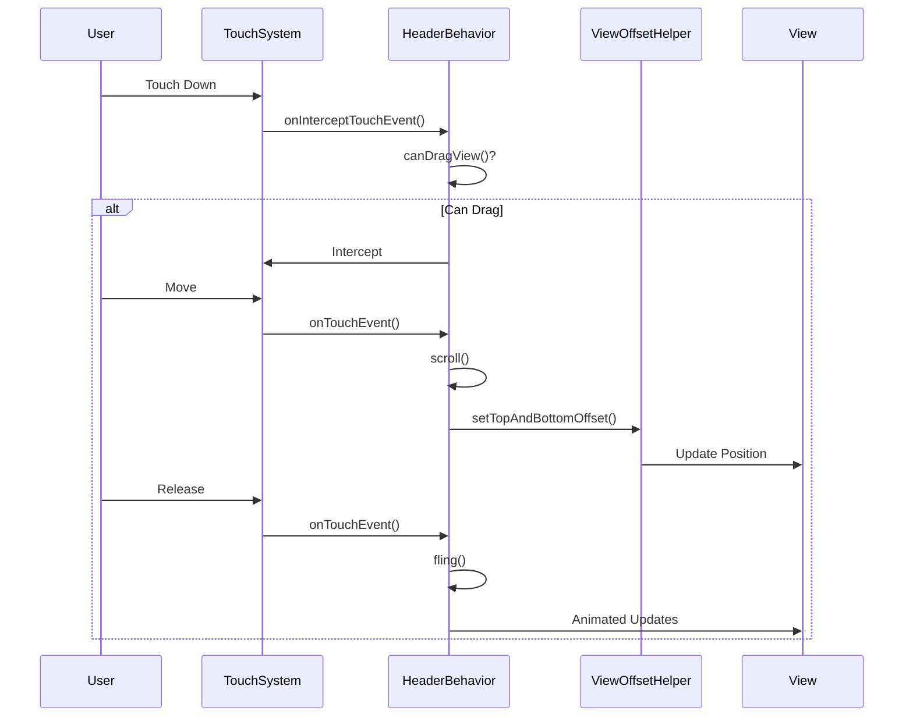

### SideSheet Behavior Flow

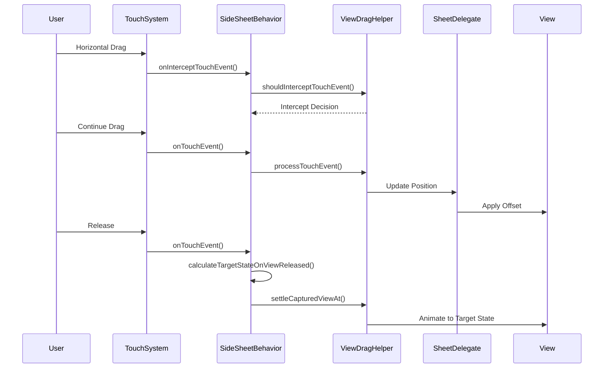

### State Management Flow

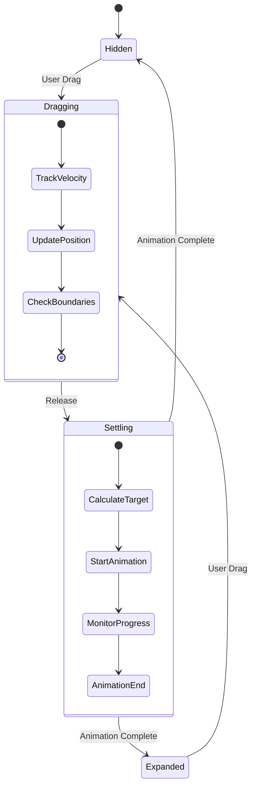

## Component Interactions

### AppBar System Integration

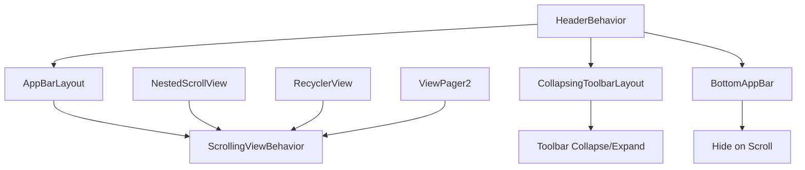

### SideSheet System Integration

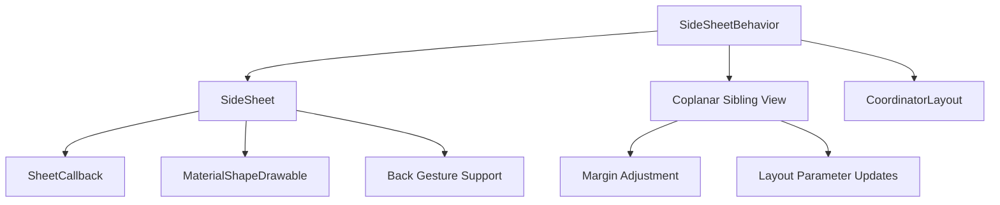

## Advanced Features

### Coplanar Sibling Coordination

SideSheetBehavior supports coplanar sibling views that adjust their layout as the sheet slides:

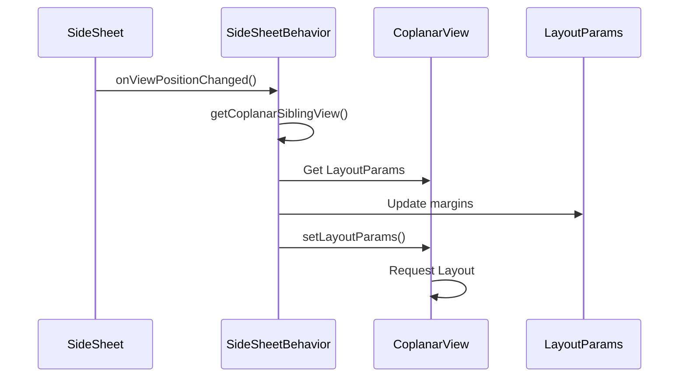

### Back Gesture Integration

For Android 13+ devices, SideSheetBehavior integrates with system back gestures:

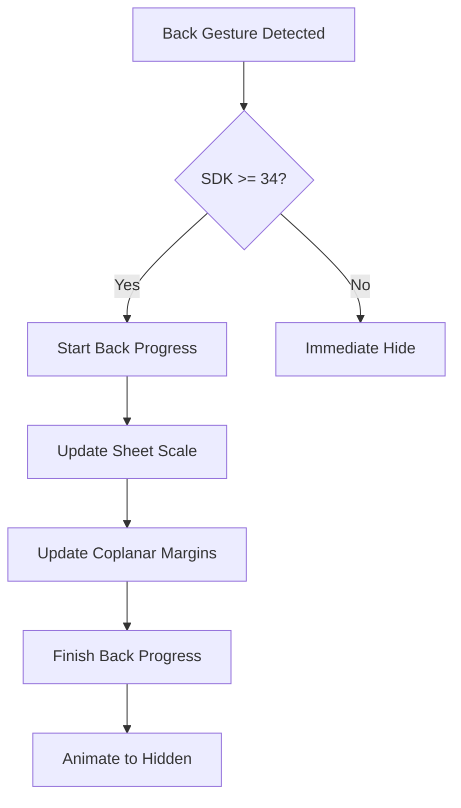

### Accessibility Integration

Both behavior systems provide comprehensive accessibility support:

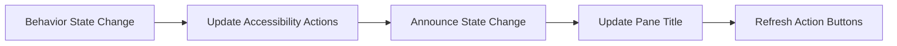

## Implementation Patterns

### Custom HeaderBehavior

```java
public class CustomHeaderBehavior extends HeaderBehavior<CustomHeaderView> {
    
    @Override
    boolean canDragView(CustomHeaderView view) {
        return view.isScrollable() && view.getScrollY() == 0;
    }
    
    @Override
    int getMaxDragOffset(@NonNull CustomHeaderView view) {
        return -view.getCollapsibleHeight();
    }
    
    @Override
    int getScrollRangeForDragFling(@NonNull CustomHeaderView view) {
        return view.getTotalScrollRange();
    }
    
    @Override
    void onFlingFinished(CoordinatorLayout parent, CustomHeaderView layout) {
        // Custom post-fling logic
        layout.onScrollAnimationFinished();
    }
}
```

### Custom SideSheetBehavior

```java
public class CustomSideSheetBehavior extends SideSheetBehavior<CustomSideSheetView> {
    
    @Override
    public void setState(@StableSheetState int state) {
        // Custom state validation
        if (state == STATE_EXPANDED && !isContentReady()) {
            return;
        }
        super.setState(state);
    }
    
    @Override
    protected int calculateCurrentOffset(int savedOuterEdge, V child) {
        // Custom offset calculation
        int baseOffset = super.calculateCurrentOffset(savedOuterEdge, child);
        return applyCustomTransform(baseOffset);
    }
}
```

## Performance Optimization

### Memory Management

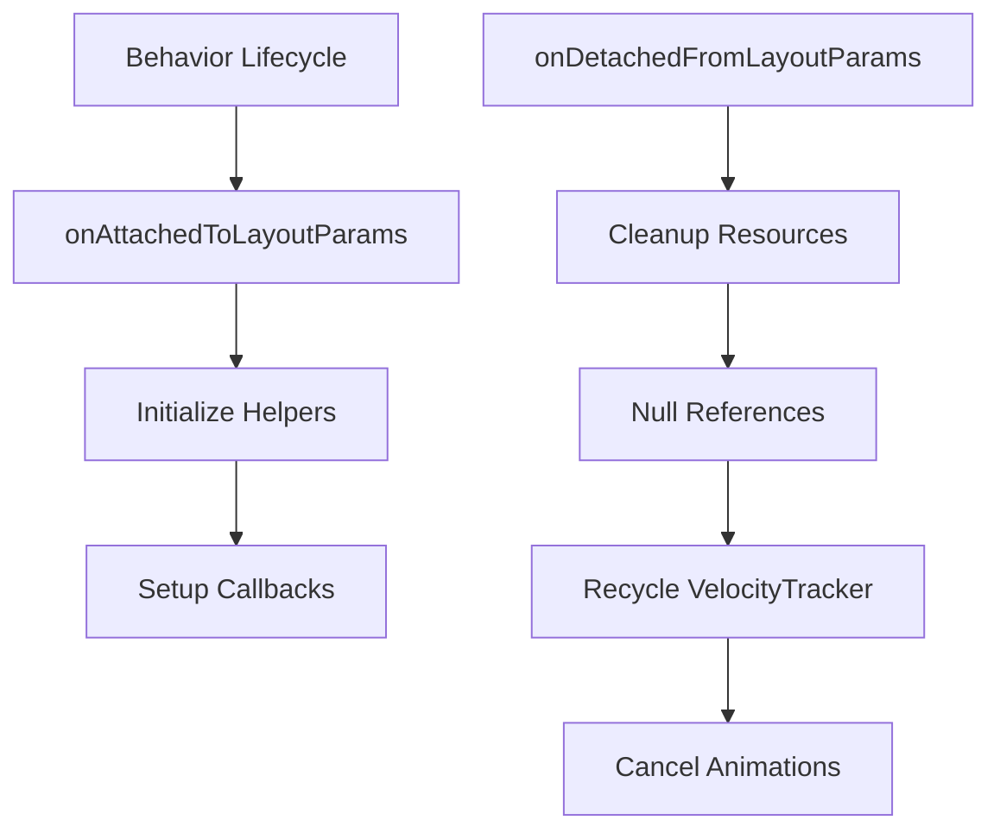

### Animation Optimization

- **Hardware Acceleration**: Utilize hardware-accelerated OverScroller for smooth animations
- **Animation Batching**: Group multiple property updates into single animation cycles
- **Early Termination**: Implement proper animation cancellation for conflicting interactions
- **State Caching**: Cache frequently calculated values to avoid redundant computations

## Error Handling

### Boundary Validation

```java
private int validateOffset(int offset, int minOffset, int maxOffset) {
    return MathUtils.clamp(offset, minOffset, maxOffset);
}
```

### Null Safety

```java
@Nullable
private View getCoplanarSiblingView() {
    return coplanarSiblingViewRef != null ? coplanarSiblingViewRef.get() : null;
}
```

### Resource Cleanup

```java
@Override
public void onDetachedFromLayoutParams() {
    super.onDetachedFromLayoutParams();
    if (velocityTracker != null) {
        velocityTracker.recycle();
        velocityTracker = null;
    }
    if (viewDragHelper != null) {
        viewDragHelper = null;
    }
}
```

## Testing Strategies

### Unit Testing

```java
@Test
public void testHeaderBehaviorDragValidation() {
    CustomHeaderView view = mock(CustomHeaderView.class);
    when(view.isScrollable()).thenReturn(true);
    when(view.getScrollY()).thenReturn(0);
    
    assertTrue(behavior.canDragView(view));
}
```

### Integration Testing

```java
@Test
public void testSideSheetStateTransitions() {
    // Test state transitions
    behavior.setState(STATE_EXPANDED);
    assertEquals(STATE_EXPANDED, behavior.getState());
    
    behavior.setState(STATE_HIDDEN);
    assertEquals(STATE_HIDDEN, behavior.getState());
}
```

## Best Practices

### Design Guidelines

1. **Consistent Motion**: Use consistent animation durations and interpolators
2. **Gesture Recognition**: Implement proper touch slop handling for reliable gesture recognition
3. **State Management**: Maintain consistent state across configuration changes
4. **Accessibility**: Ensure all behavior changes are properly announced
5. **Performance**: Minimize allocations during animation cycles

### Common Pitfalls

1. **Forgetting Super Calls**: Always call super methods when overriding behavior methods
2. **Ignoring Touch Slop**: Use touch slop to filter accidental movements
3. **Resource Leaks**: Properly clean up velocity trackers and animation resources
4. **State Inconsistency**: Ensure behavior state matches view state after animations
5. **Accessibility Gaps**: Test with accessibility services enabled

## Related Documentation

- [AppBarLayout Documentation](appbar.md) - Uses HeaderBehavior for scrolling interactions
- [SideSheet Documentation](sidesheet.md) - Extends ViewOffsetBehavior for horizontal sliding
- [CollapsingToolbar Documentation](collapsing-toolbar.md) - Specialized HeaderBehavior implementation
- [BottomAppBar Documentation](bottomappbar.md) - Uses HeaderBehavior for hide-on-scroll
- [CoordinatorLayout Documentation](coordinatorlayout.md) - Parent layout system for behaviors

## API Reference Summary

### HeaderBehavior

| Method | Purpose | Parameters | Returns |
|--------|---------|------------|---------|
| `onInterceptTouchEvent()` | Intercept touch events | CoordinatorLayout, V, MotionEvent | boolean |
| `onTouchEvent()` | Handle touch events | CoordinatorLayout, V, MotionEvent | boolean |
| `scroll()` | Perform smooth scrolling | CoordinatorLayout, V, int, int, int | int |
| `fling()` | Initiate fling animation | CoordinatorLayout, V, int, int, float | boolean |
| `canDragView()` | Check drag eligibility | V | boolean |

### ViewOffsetBehavior

| Method | Purpose | Parameters | Returns |
|--------|---------|------------|---------|
| `setTopAndBottomOffset()` | Set vertical offset | int | boolean |
| `setLeftAndRightOffset()` | Set horizontal offset | int | boolean |
| `getTopAndBottomOffset()` | Get current vertical offset | - | int |
| `onLayoutChild()` | Handle layout with offsets | CoordinatorLayout, V, int | boolean |

### SideSheetBehavior

| Method | Purpose | Parameters | Returns |
|--------|---------|------------|---------|
| `setState()` | Change sheet state | @StableSheetState int | void |
| `expand()` | Expand sheet | - | void |
| `hide()` | Hide sheet | - | void |
| `setDraggable()` | Enable/disable dragging | boolean | void |
| `addCallback()` | Add state callback | SideSheetCallback | void |

## Conclusion

The behavior-system module provides a comprehensive foundation for Material Design's interactive behaviors. By understanding and properly implementing these core behaviors, developers can create sophisticated, responsive UI components that align with Material Design principles while maintaining smooth performance and excellent user experience across both vertical scrolling (AppBar) and horizontal sliding (SideSheet) interaction patterns.