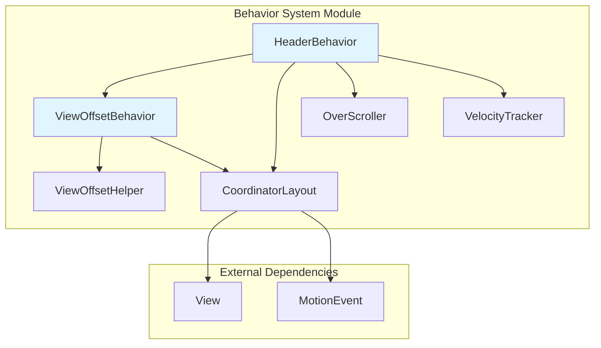
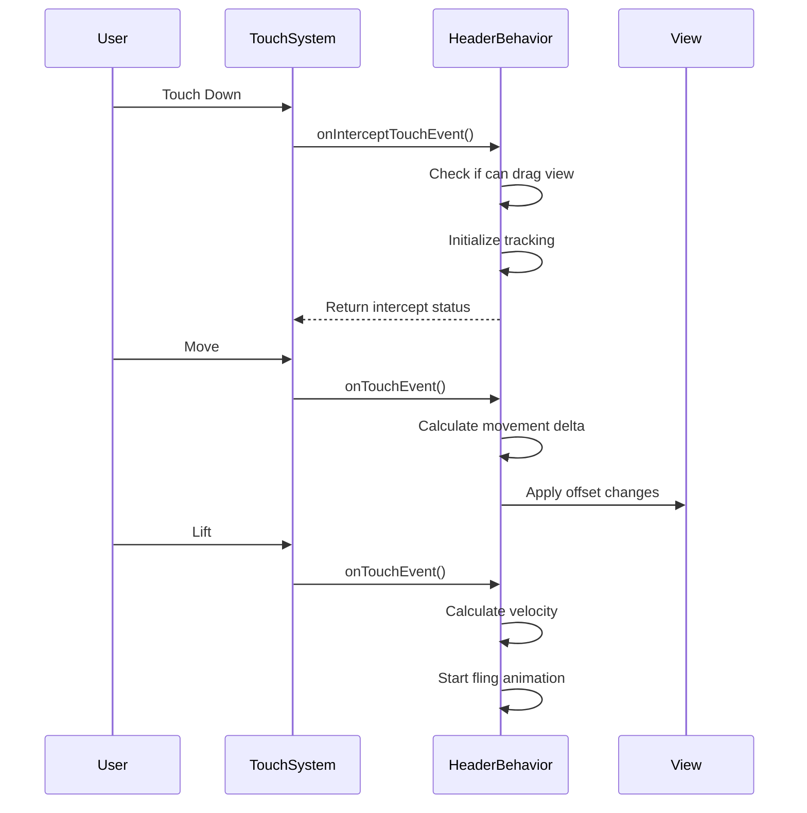
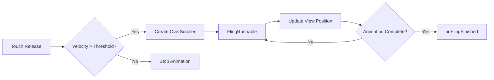
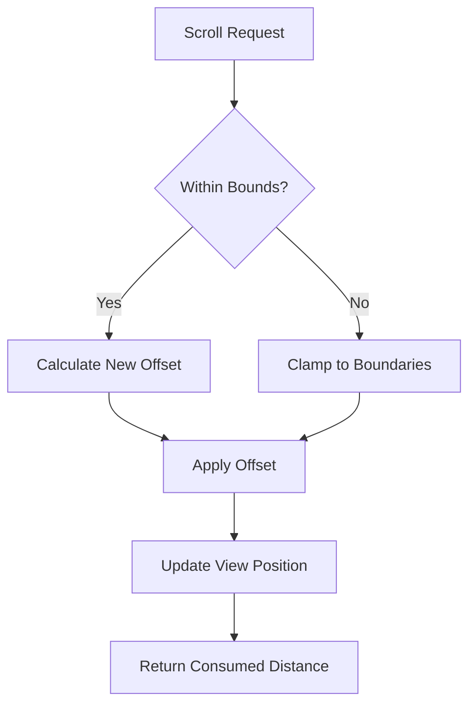
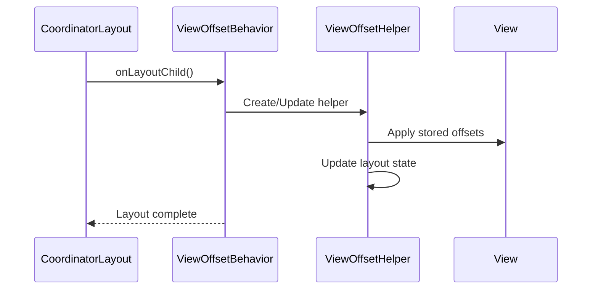
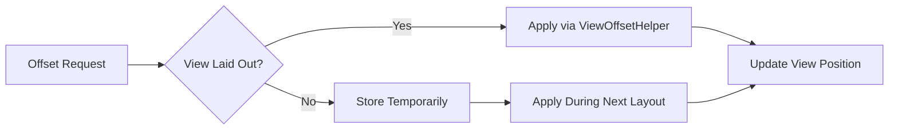
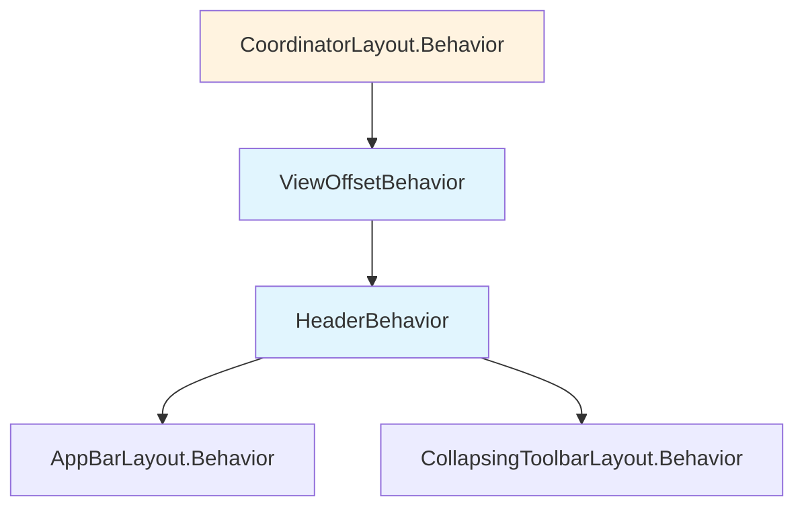
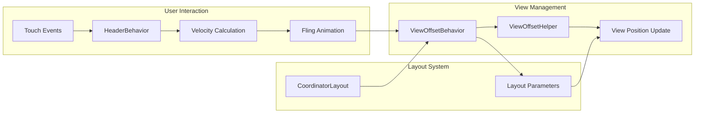
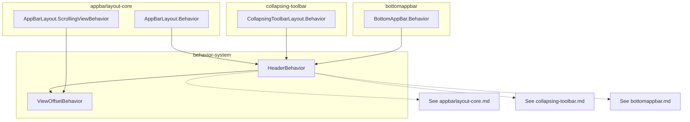

# Behavior System Module Documentation

## Introduction

The behavior-system module is a foundational component of the Material Design AppBar library that provides core behavioral patterns for header views and view offset management. This module implements the CoordinatorLayout behavior pattern to enable sophisticated scrolling interactions, touch handling, and view positioning within Material Design layouts.

The module consists of two primary components: `HeaderBehavior` and `ViewOffsetBehavior`, which work together to create responsive, interactive header behaviors that respond to user gestures and scrolling content.

## Architecture Overview

## Core Components

### HeaderBehavior

`HeaderBehavior<V extends View>` is an abstract behavior class that provides sophisticated touch interaction and scrolling capabilities for header views. It extends `ViewOffsetBehavior` to inherit offset management functionality while adding gesture recognition, velocity tracking, and fling animation support.

**Key Responsibilities:**
- Touch event interception and handling
- Drag gesture recognition and processing
- Velocity-based fling animations
- Scroll offset management with constraints
- Smooth scrolling with OverScroller integration

**Core Features:**

#### Touch Event Processing
The behavior implements a comprehensive touch handling system that distinguishes between taps, drags, and flings:

#### Fling Animation System
The fling system uses Android's `OverScroller` to create smooth, physics-based animations that continue after the user lifts their finger:

#### Offset Management
The behavior provides sophisticated offset management with boundary constraints:

### ViewOffsetBehavior

`ViewOffsetBehavior<V extends View>` is the base behavior class that provides view offset management capabilities. It automatically sets up and manages a `ViewOffsetHelper` to handle view positioning without requiring manual layout parameter modifications.

**Key Responsibilities:**
- Automatic ViewOffsetHelper setup and management
- Temporary offset storage before layout completion
- Horizontal and vertical offset application
- Offset state persistence across layout changes

**Core Features:**

#### Layout Integration
The behavior integrates with the CoordinatorLayout's layout process to ensure proper offset application:

#### Offset Management
The behavior provides both immediate and deferred offset application:

## Component Interactions

### Behavior Hierarchy

### Data Flow Architecture

## Integration with AppBar System

The behavior-system module serves as the foundation for the broader AppBar system:

## Key Design Patterns

### Template Method Pattern
`HeaderBehavior` uses the template method pattern to allow subclasses to customize specific behaviors:

- `canDragView(V view)` - Determine if a view can be dragged
- `getMaxDragOffset(V view)` - Define maximum drag offset
- `getScrollRangeForDragFling(V view)` - Specify scroll range for fling calculations
- `onFlingFinished(CoordinatorLayout parent, V layout)` - Handle post-fling cleanup

### Strategy Pattern
The behavior system employs strategy pattern through CoordinatorLayout's behavior attachment mechanism, allowing different views to adopt different interaction strategies.

### Observer Pattern
The system integrates with CoordinatorLayout's dependency system to observe and respond to changes in related views and layout states.

## Performance Considerations

### Memory Management
- VelocityTracker is properly recycled after use
- FlingRunnable is cleaned up when animations complete
- ViewOffsetHelper is reused across layout cycles

### Animation Optimization
- Uses hardware-accelerated OverScroller for smooth animations
- Implements proper animation lifecycle management
- Provides early termination for conflicting animations

### Touch Event Efficiency
- Implements early return patterns for non-relevant touch events
- Uses touch slop to filter out accidental movements
- Maintains minimal state during touch processing

## Usage Guidelines

### Implementation Requirements
When extending `HeaderBehavior`:
1. Implement `canDragView()` to define drag eligibility
2. Override offset calculation methods as needed
3. Handle `onFlingFinished()` for cleanup operations
4. Consider touch slop for consistent user experience

### Integration Best Practices
1. Ensure proper CoordinatorLayout setup
2. Configure touch handling boundaries appropriately
3. Test with various scroll velocities and directions
4. Consider accessibility implications of custom behaviors

### Common Pitfalls
- Forgetting to call super methods in overridden functions
- Not properly handling edge cases in offset calculations
- Ignoring the touch slop configuration
- Not cleaning up animation resources

## Dependencies

### Internal Dependencies
- [appbarlayout-core.md](appbarlayout-core.md) - Uses HeaderBehavior for AppBarLayout interactions
- [collapsing-toolbar.md](collapsing-toolbar.md) - Extends HeaderBehavior for collapsing functionality
- [utility-components.md](utility-components.md) - Utilizes ViewUtilsLollipop for compatibility

### External Dependencies
- AndroidX CoordinatorLayout for behavior framework
- Android ViewConfiguration for touch parameters
- Android OverScroller for fling animations
- Android VelocityTracker for gesture velocity calculation

## Future Considerations

The behavior-system module provides a solid foundation for Material Design scrolling interactions. Future enhancements might include:

- Enhanced accessibility support for custom behaviors
- Additional animation interpolators and effects
- Performance optimizations for complex view hierarchies
- Extended gesture recognition capabilities

This module represents a critical component in creating responsive, interactive Material Design layouts that provide smooth, intuitive user experiences across the Android ecosystem.