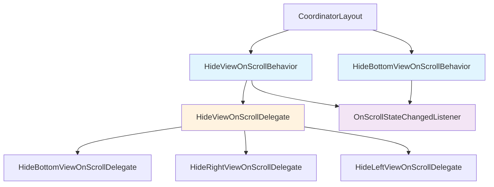
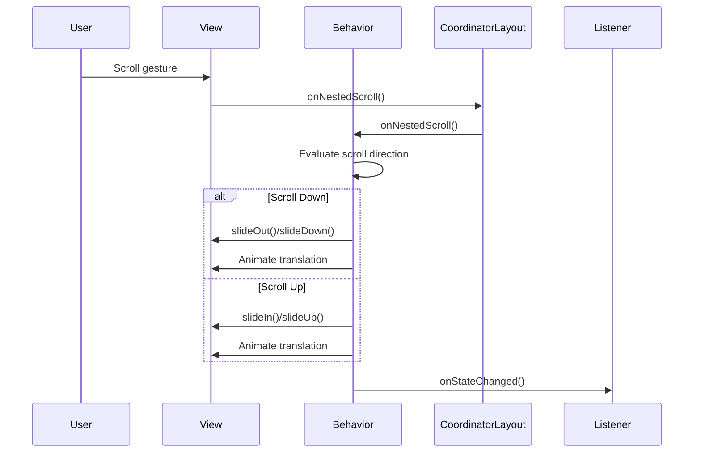

# Material Design Behavior Module

## Overview

The behavior module provides scroll-based view behaviors for Material Design components within CoordinatorLayout. It implements intelligent hiding and showing of UI elements based on scroll gestures, enhancing user experience by maximizing screen real estate when needed while maintaining accessibility standards.

## Architecture



## Core Functionality

### HideViewOnScrollBehavior
The primary behavior class that provides flexible view hiding capabilities for any edge of the screen (right, bottom, left). This is the recommended approach for implementing scroll-based view behaviors.

**Key Features:**
- Multi-edge support (right, bottom, left)
- Accessibility-aware (disables when touch exploration is enabled)
- Configurable animation durations and interpolators
- State change listeners for reactive UI updates
- Gravity-based automatic edge detection

### HideBottomViewOnScrollBehavior
A specialized behavior for bottom-edge hiding, maintained for backward compatibility. This class is deprecated in favor of `HideViewOnScrollBehavior`.

**Key Features:**
- Bottom-specific hiding behavior
- Same accessibility and animation features as HideViewOnScrollBehavior
- Legacy API compatibility

## Sub-modules

### [hide-view-on-scroll](hide-view-on-scroll.md)
Core implementation of the flexible view hiding behavior system, including delegate pattern for different edge orientations.

### [hide-bottom-view-on-scroll](hide-bottom-view-on-scroll.md)
Legacy bottom-specific implementation maintained for backward compatibility.

## Related Documentation

- [appbar](appbar.md) - App bar scrolling behaviors and coordination
- [bottomnavigation](bottomnavigation.md) - Bottom navigation integration
- [floatingactionbutton](floatingactionbutton.md) - FAB visibility behaviors
- [transition](transition.md) - Material motion system integration

## Integration with CoordinatorLayout



## Accessibility Features

The behavior module implements comprehensive accessibility support:

1. **Touch Exploration Detection**: Automatically disables hiding behavior when touch exploration is enabled
2. **State Management**: Prevents views from being hidden when accessibility services are active
3. **Listener Cleanup**: Properly manages accessibility service listeners to prevent memory leaks

## Animation System

Both behaviors utilize Material Design motion principles:

- **Enter Animation**: 225ms duration with `LINEAR_OUT_SLOW_IN_INTERPOLATOR`
- **Exit Animation**: 175ms duration with `FAST_OUT_LINEAR_IN_INTERPOLATOR`
- **Theme Integration**: Respects motion attributes from the current theme
- **Customization**: Supports custom animation durations and interpolators

## Usage Patterns

### Basic Implementation
```xml
<androidx.coordinatorlayout.widget.CoordinatorLayout>
    <com.google.android.material.bottomnavigation.BottomNavigationView
        app:layout_behavior="com.google.android.material.behavior.HideViewOnScrollBehavior" />
</androidx.coordinatorlayout.widget.CoordinatorLayout>
```

### Programmatic Control
```java
HideViewOnScrollBehavior<BottomNavigationView> behavior = 
    HideViewOnScrollBehavior.from(bottomNavigationView);
behavior.setViewEdge(HideViewOnScrollBehavior.EDGE_BOTTOM);
behavior.addOnScrollStateChangedListener((view, state) -> {
    // Handle state changes
});
```

## Dependencies

The behavior module integrates with several other Material Design components:

- **[appbar](appbar.md)**: Coordinates with AppBarLayout scrolling behaviors
- **[bottomnavigation](bottomnavigation.md)**: Provides hiding behavior for bottom navigation
- **[floatingactionbutton](floatingactionbutton.md)**: Works with FAB visibility behaviors
- **[motion system](transition.md)**: Utilizes Material motion curves and durations

## Migration Path

For applications using the deprecated `HideBottomViewOnScrollBehavior`:

1. Replace behavior class in XML layouts
2. Update programmatic references
3. Configure edge position if needed (defaults to bottom for compatibility)
4. Test accessibility features remain functional

## Best Practices

1. **Always test with accessibility services enabled**
2. **Provide visual indicators when views are hidden**
3. **Consider content padding when behavior is disabled**
4. **Use appropriate animation durations for your use case**
5. **Clean up listeners in activity/fragment lifecycle methods**

## Performance Considerations

- Animations are hardware accelerated when possible
- View state changes are batched to minimize layout passes
- Accessibility listeners are properly managed to prevent leaks
- Animation cancelation is handled gracefully to prevent visual glitches