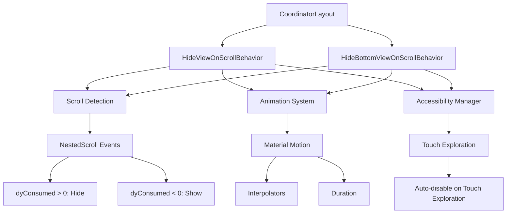

# Material Design Behavior Module

## Overview

The behavior module provides scroll-based interaction behaviors for Material Design components within CoordinatorLayout. It implements sophisticated hiding and showing animations that respond to user scroll gestures, enhancing the user experience by dynamically managing screen real estate.

## Purpose

This module serves as the foundation for creating intelligent scroll-aware behaviors that:
- Hide views when scrolling down to maximize content visibility
- Show views when scrolling up to restore navigation/interaction elements
- Support multiple screen edges (left, right, bottom) for hide animations
- Provide accessibility-aware behavior modifications
- Integrate seamlessly with Material Design motion principles

## Architecture


```mermaid
graph TD
    A[CoordinatorLayout] --> B[HideViewOnScrollBehavior]
    A --> C[HideBottomViewOnScrollBehavior]
    B --> D[Scroll Detection]
    B --> E[Animation System]
    B --> F[Accessibility Manager]
    C --> D
    C --> E
    C --> F
    
    D --> G[NestedScroll Events]
    E --> H[Material Motion]
    F --> I[Touch Exploration]
    
    G --> J[dyConsumed > 0: Hide]
    G --> K[dyConsumed < 0: Show]
    H --> L[Interpolators]
    H --> M[Duration]
    I --> N[Auto-disable on Touch Exploration]
```

## Core Components

### HideViewOnScrollBehavior
The primary behavior class that provides flexible scroll-based hiding/showing functionality for views within CoordinatorLayout. Supports hiding views off three screen edges (left, right, bottom) with smooth animations.

**Key Features:**
- Multi-edge support (left, right, bottom)
- Gravity-based automatic edge detection
- Configurable animation parameters
- Accessibility-aware behavior
- State change listeners

### HideBottomViewOnScrollBehavior
A specialized behavior focused on bottom-edge hiding (deprecated in favor of HideViewOnScrollBehavior). Provides legacy support for bottom navigation and similar components.

**Key Features:**
- Bottom-specific hiding behavior
- Smooth slide animations
- Touch exploration integration
- State management

## Sub-modules

### [Scroll-based Hiding Behaviors](scroll-behaviors.md)
- **HideViewOnScrollBehavior**: Modern, flexible behavior supporting multiple edges
- **HideBottomViewOnScrollBehavior**: Legacy bottom-specific behavior (deprecated)

For detailed implementation details, animation systems, and API reference, see the [scroll-behaviors](scroll-behaviors.md) documentation.

### Animation System
- Material Design motion principles integration
- Configurable duration and interpolation
- Theme-aware animation parameters
- Smooth property animations

### Accessibility Integration
- Automatic behavior modification for touch exploration
- Content padding recommendations
- State change notifications
- User preference respect

## Integration with Other Modules

The behavior module integrates with several other Material Design components:

- **[appbar](appbar.md)**: AppBarLayout behaviors for header scrolling
- **[bottom-app-bar](bottom-app-bar.md)**: Bottom app bar hiding behaviors  
- **[bottom-navigation](bottom-navigation.md)**: Navigation bar auto-hiding
- **[fab](fab.md)**: Floating action button scroll behaviors
- **[motion](motion.md)**: Material motion system integration

## Usage Patterns

### Basic Implementation
```xml
<androidx.coordinatorlayout.widget.CoordinatorLayout>
    <com.google.android.material.bottomnavigation.BottomNavigationView
        app:layout_behavior="com.google.android.material.behavior.HideViewOnScrollBehavior" />
</androidx.coordinatorlayout.widget.CoordinatorLayout>
```

### Programmatic Control
```java
HideViewOnScrollBehavior<BottomNavigationView> behavior = 
    HideViewOnScrollBehavior.from(bottomNavigationView);
behavior.setViewEdge(HideViewOnScrollBehavior.EDGE_BOTTOM);
behavior.addOnScrollStateChangedListener((view, state) -> {
    // Handle state changes
});
```

## Key Features

### Multi-Edge Support
- **EDGE_BOTTOM**: Traditional bottom sheet behavior
- **EDGE_LEFT**: Left-edge sliding (RTL support)
- **EDGE_RIGHT**: Right-edge sliding

### Accessibility Features
- Automatic touch exploration detection
- Behavior modification for accessibility
- Content padding recommendations
- State change notifications

### Animation Customization
- Theme-aware duration configuration
- Custom interpolator support
- Smooth property animations
- Cancel and restart handling

## State Management

The behaviors maintain two primary states:
- **STATE_SCROLLED_IN**: View is fully visible
- **STATE_SCROLLED_OUT**: View is hidden off-screen

State transitions are triggered by scroll events and can be monitored through listener interfaces.

## Performance Considerations

- Efficient nested scroll handling
- Animation lifecycle management
- Memory-conscious listener management
- Accessibility service integration

## Migration Notes

**HideBottomViewOnScrollBehavior** is deprecated in favor of **HideViewOnScrollBehavior**. The newer behavior provides:
- Enhanced functionality
- Better edge support
- Improved accessibility
- More flexible configuration

For migration guidance, see the individual behavior documentation.