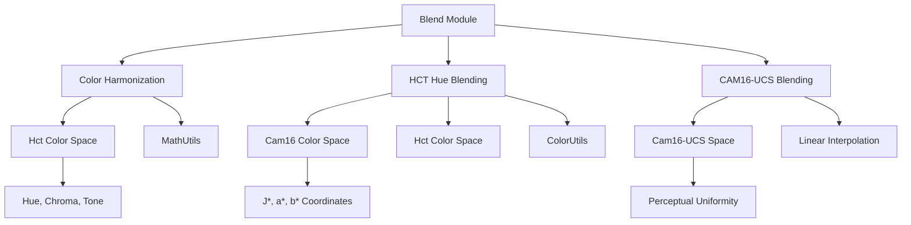
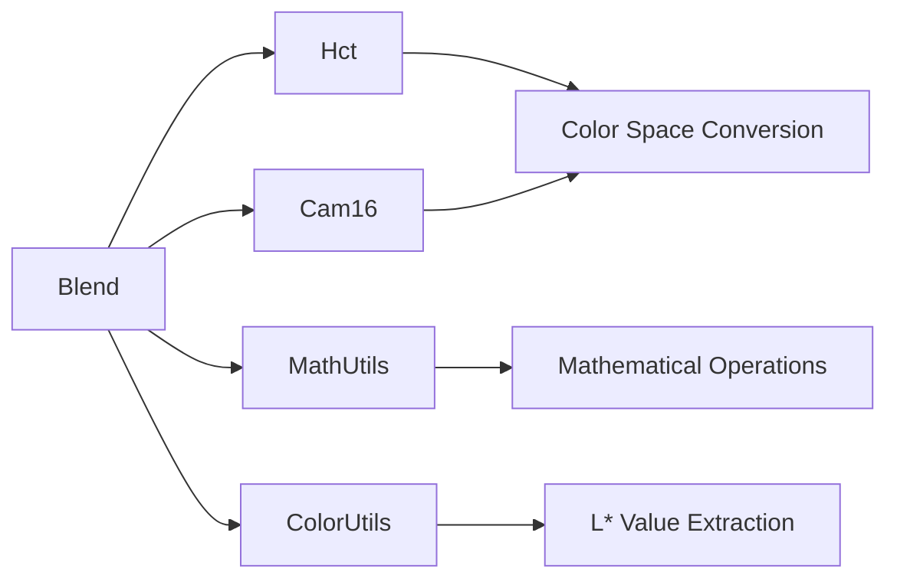
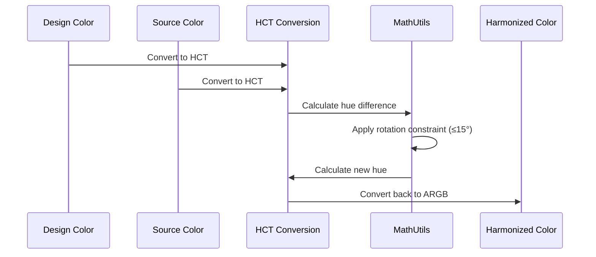
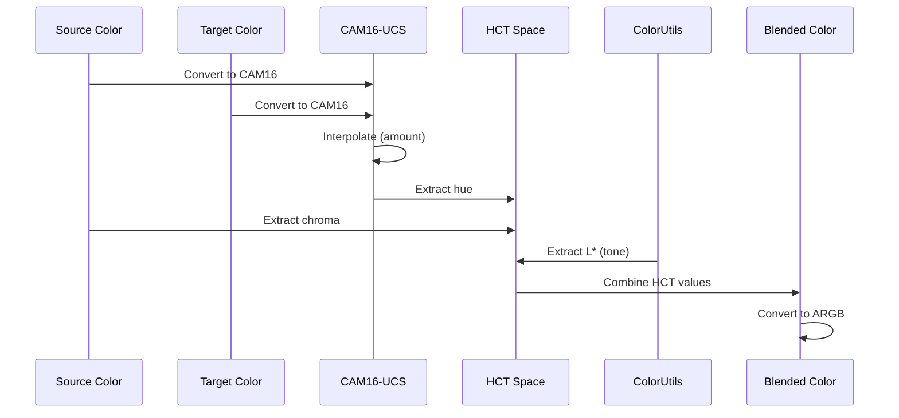
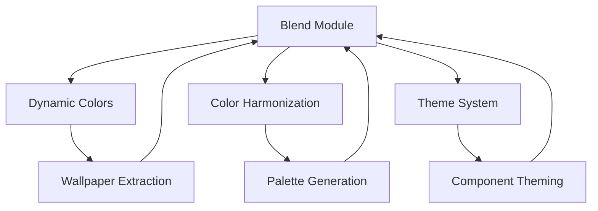

# Blend Module Documentation

## Overview

The **blend** module is a core component of the Material Design color system that provides advanced color blending algorithms. It implements sophisticated color manipulation techniques using HCT (Hue, Chroma, Tone) and CAM16 color spaces to create harmonious color transitions and effects. This module is essential for dynamic theming, color harmonization, and creating visually cohesive user interfaces.

## Purpose and Core Functionality

The blend module serves as the mathematical foundation for color manipulation in Material Design, offering three primary blending approaches:

1. **Color Harmonization** - Creates subtle hue shifts that maintain color recognizability while aligning with theme colors
2. **HCT Hue Blending** - Preserves chroma and tone while blending only the hue component
3. **CAM16-UCS Blending** - Performs comprehensive color space blending affecting hue, chroma, and tone

## Architecture

### Component Structure



### Dependencies

The blend module integrates with several key components of the Material Design color system:



## Core Components

### Blend Class

The `Blend` class provides static methods for color manipulation with the following key functions:

#### 1. Color Harmonization (`harmonize`)
- **Purpose**: Creates subtle hue shifts that align design colors with theme colors
- **Algorithm**: Calculates hue difference and applies controlled rotation (max 15°)
- **Use Case**: Maintaining brand consistency while preserving color identity

#### 2. HCT Hue Blending (`hctHue`)
- **Purpose**: Blends only the hue component while preserving chroma and tone
- **Algorithm**: Uses CAM16-UCS interpolation then applies original chroma/tone
- **Use Case**: Creating color variations with consistent saturation and brightness

#### 3. CAM16-UCS Blending (`cam16Ucs`)
- **Purpose**: Performs comprehensive color blending in perceptually uniform space
- **Algorithm**: Linear interpolation of J*, a*, b* coordinates
- **Use Case**: Smooth color transitions with perceptual accuracy

## Data Flow

### Color Harmonization Process



### HCT Hue Blending Process



## Integration with Material Design System

### Color Harmonization Usage

The blend module is integral to Material Design's dynamic color system, particularly in:

- **Theme Generation**: Harmonizing app colors with system wallpapers
- **Accessibility**: Ensuring sufficient color contrast while maintaining harmony
- **Brand Consistency**: Aligning custom colors with Material Design principles

### Relationship to Other Modules



## Technical Implementation

### Color Space Fundamentals

The blend module operates across multiple color spaces:

1. **ARGB**: Standard Android color format (Alpha, Red, Green, Blue)
2. **HCT**: Hue, Chroma, Tone - Material Design's perceptual color space
3. **CAM16-UCS**: Perceptually uniform color space for accurate interpolation

### Mathematical Operations

Key mathematical functions used in blending:

- **Hue Difference Calculation**: `MathUtils.differenceDegrees()`
- **Rotation Direction**: `MathUtils.rotationDirection()`
- **Degree Sanitization**: `MathUtils.sanitizeDegreesDouble()`
- **L* Extraction**: `ColorUtils.lstarFromArgb()`

## Performance Considerations

### Optimization Strategies

1. **Static Methods**: All blending operations are static for efficient access
2. **Immutable Operations**: No object creation overhead during calculations
3. **Primitive Types**: Uses primitive types (int, double) for performance
4. **RestrictTo Annotation**: Library-only access prevents misuse

### Memory Efficiency

- No instance variables or state maintenance
- Minimal object creation during color conversions
- Efficient color space transformations

## Usage Examples

### Basic Color Harmonization

```java
// Harmonize a design color with the primary theme color
int designColor = 0xFF2196F3; // Blue
int themeColor = 0xFF4CAF50;  // Green
int harmonizedColor = Blend.harmonize(designColor, themeColor);
```

### HCT Hue Blending

```java
// Blend hue while preserving chroma and tone
int fromColor = 0xFFE91E63;  // Pink
int toColor = 0xFF9C27B0;    // Purple
double blendAmount = 0.5;    // 50% blend
int blendedColor = Blend.hctHue(fromColor, toColor, blendAmount);
```

### CAM16-UCS Blending

```java
// Full color space blending
int color1 = 0xFFFF5722;     // Deep Orange
int color2 = 0xFF3F51B5;     // Indigo
double amount = 0.3;         // 30% towards color2
int result = Blend.cam16Ucs(color1, color2, amount);
```

## Best Practices

### When to Use Each Blending Method

1. **Harmonize**: Use for subtle theme alignment and brand consistency
2. **HCT Hue**: Use when you need color variations with consistent brightness/saturation
3. **CAM16-UCS**: Use for smooth transitions and animations

### Color Selection Guidelines

- Ensure sufficient contrast ratios for accessibility
- Test blended colors across different display technologies
- Consider cultural and contextual color meanings
- Validate color harmony with user testing

## Future Enhancements

### Potential Improvements

1. **Additional Color Spaces**: Support for LAB, LUV, or custom color spaces
2. **Advanced Algorithms**: Machine learning-based color harmony
3. **Performance Optimization**: GPU-accelerated color calculations
4. **Accessibility Features**: Automatic contrast optimization

### Integration Opportunities

- Enhanced [dynamic colors](dynamic-colors.md) system
- Advanced [theme generation](theme.md) capabilities
- Real-time color adaptation based on context

## References

- [Color Utilities](color-utilities.md) - Mathematical color operations
- [Dynamic Colors](dynamic-colors.md) - System-driven color theming
- [Color Harmonization](color-harmonization.md) - Color harmony algorithms
- [HCT Color Space](hct-solver.md) - Material Design color space
- [Math Utils](math-utils.md) - Mathematical utility functions