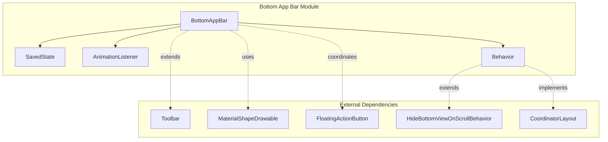
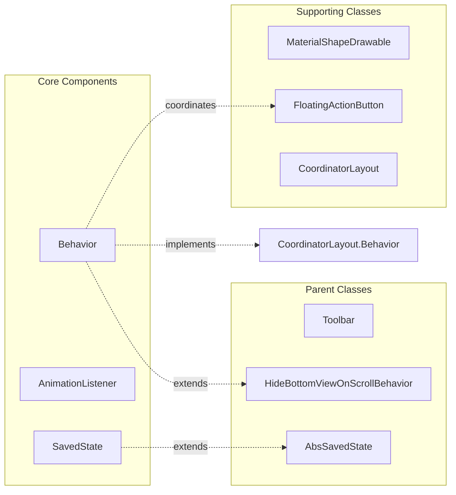
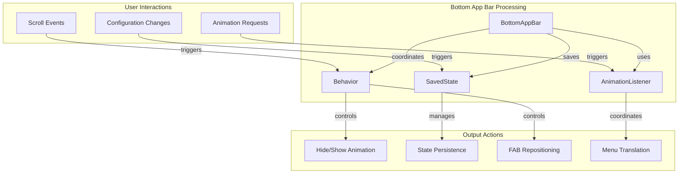
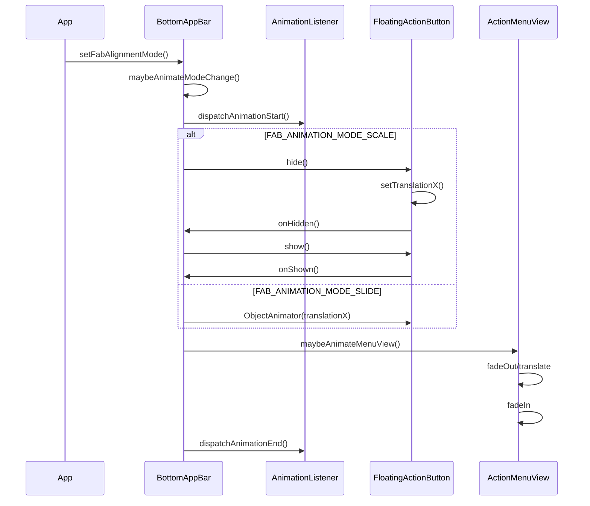
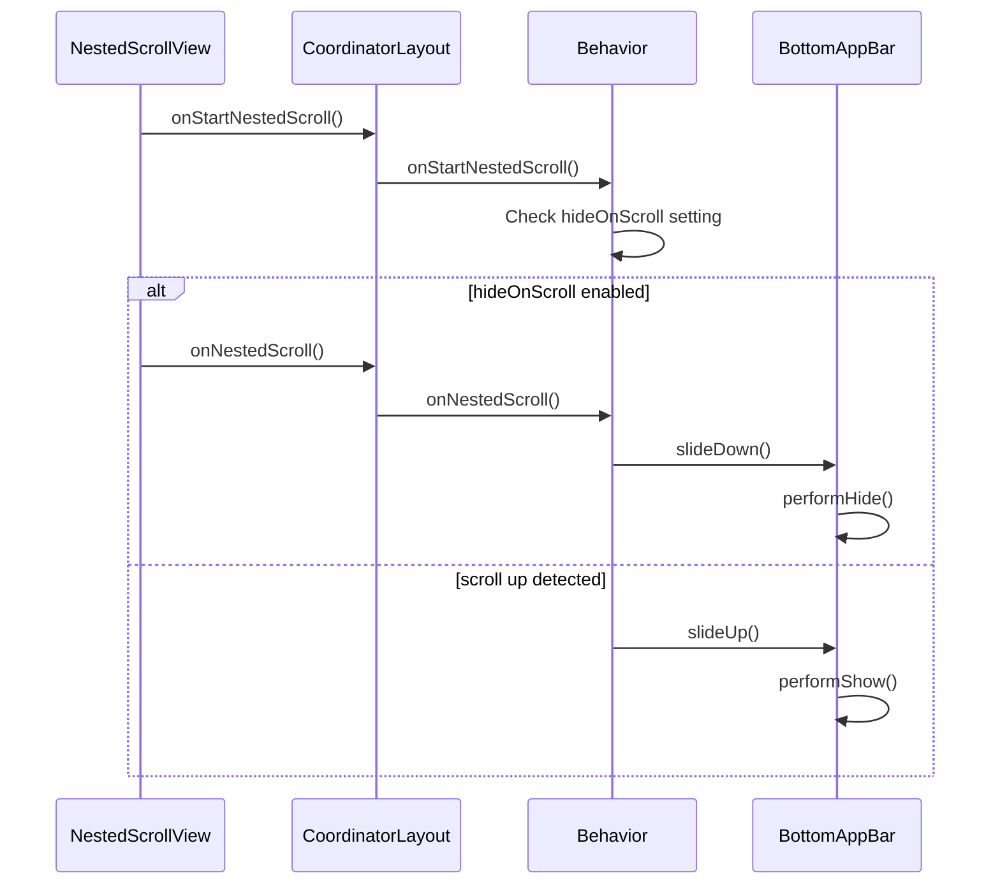

# Bottom App Bar Module Documentation

## Introduction

The Bottom App Bar is a Material Design component that extends the standard Toolbar to provide a specialized bottom navigation solution. It features a distinctive "cradle" design that can accommodate a Floating Action Button (FAB), creating a seamless integration between navigation and primary actions. This component is particularly useful for mobile applications where bottom navigation is preferred for ergonomic accessibility.

## Core Functionality

The Bottom App Bar module provides three main core components that work together to deliver a complete bottom navigation experience:

### 1. BottomAppBar.SavedState
**Purpose**: Manages the persistent state of the Bottom App Bar across configuration changes and activity lifecycle events.

**Key Responsibilities**:
- Preserves FAB alignment mode (center or end position)
- Maintains FAB attachment state (whether FAB is cradled or detached)
- Implements Parcelable for seamless state restoration
- Ensures UI consistency during device rotation or process recreation

### 2. BottomAppBar.AnimationListener
**Purpose**: Provides a callback interface for monitoring animation events during Bottom App Bar transitions.

**Key Responsibilities**:
- Notifies when Bottom App Bar animations start and end
- Enables synchronization of custom UI elements with built-in animations
- Supports multiple listeners for complex animation coordination
- Facilitates cleanup and resource management during animations

### 3. BottomAppBar.Behavior
**Purpose**: Implements CoordinatorLayout.Behavior to manage the interaction between Bottom App Bar and Floating Action Buttons.

**Key Responsibilities**:
- Handles FAB positioning and cradle integration
- Manages scroll-based hide/show behavior
- Coordinates FAB animations with Bottom App Bar movements
- Processes layout changes and system window insets
- Links FAB visibility changes to Bottom App Bar state

## Architecture Overview

## Component Relationships

## Data Flow Architecture

## Process Flow

### FAB Alignment Mode Change Process

### Scroll Behavior Process

## Key Features and Capabilities

### 1. FAB Integration Modes
- **Cradle Mode**: FAB sits in a curved cutout at the top of the bar
- **Embed Mode**: FAB is embedded within the bar itself
- **End Mode**: FAB positioned at the end of the bar

### 2. Animation System
- **Scale Animation**: FAB scales down and up during position changes
- **Slide Animation**: FAB slides smoothly between positions
- **Menu Animation**: Coordinated menu item translations
- **State Persistence**: Seamless restoration after configuration changes

### 3. Scroll Behavior
- **Auto-hide**: Bar hides when scrolling down, shows when scrolling up
- **Smart Detection**: Only responds to relevant scroll events
- **Configurable**: Can be enabled/disabled per instance

### 4. Layout Management
- **System Window Insets**: Handles navigation bars and cutouts
- **RTL Support**: Full right-to-left layout support
- **Dynamic Positioning**: Adapts to FAB size and position changes

## Integration with Other Modules

The Bottom App Bar module integrates with several other Material Design components:

### Dependencies
- **[appbar](appbar.md)**: Shares layout and behavior patterns with AppBarLayout
- **[behavior](behavior.md)**: Extends HideBottomViewOnScrollBehavior for scroll handling
- **[fab](fab.md)**: Coordinates closely with FloatingActionButton for positioning and animations
- **[shape](shape.md)**: Uses MaterialShapeDrawable for the distinctive cradle cutout

### Related Components
- **[bottom-navigation](bottom-navigation.md)**: Alternative bottom navigation solution
- **[coordinatorlayout](coordinatorlayout.md)**: Required parent layout for proper behavior
- **[animation](animation.md)**: Shares animation utilities and interpolators

## Usage Guidelines

### When to Use Bottom App Bar
- Primary navigation with a prominent action button
- Applications with 3-5 top-level destinations
- Mobile-first interfaces requiring thumb-friendly navigation
- Designs that benefit from the distinctive Material Design cradle aesthetic

### Best Practices
- Keep menu items minimal (3-5 items maximum)
- Ensure FAB action is the most prominent user action
- Consider scroll behavior impact on content visibility
- Test with different screen sizes and orientations
- Provide alternative navigation for accessibility

### Common Patterns
- **Primary Action**: FAB performs the main app action (compose, add, etc.)
- **Navigation Menu**: Left-side navigation drawer trigger
- **Contextual Actions**: Right-side overflow menu for secondary actions
- **Scroll Integration**: Auto-hide for content-heavy screens

## Technical Implementation Details

### State Management
The SavedState component ensures that:
- FAB alignment preferences persist across configuration changes
- Attachment state is maintained during activity recreation
- Animation states are properly restored
- User preferences for bar visibility are preserved

### Animation Coordination
The AnimationListener system provides:
- Synchronization points for custom animations
- Resource cleanup after animations complete
- Multiple listener support for complex UI coordination
- Performance optimization through batch notifications

### Behavior Integration
The Behavior component handles:
- CoordinatorLayout integration for proper positioning
- FAB lifecycle management and animation linking
- Scroll event processing and threshold detection
- System window inset handling for edge-to-edge layouts
- Layout parameter management for responsive positioning

This comprehensive system ensures that the Bottom App Bar provides a smooth, integrated experience that follows Material Design principles while offering flexibility for various application needs.