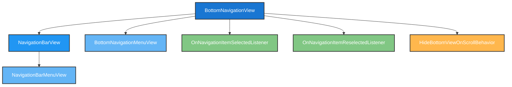
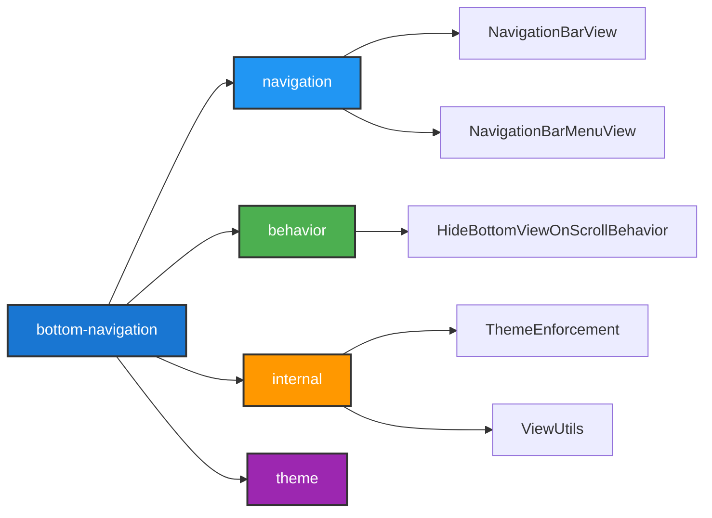
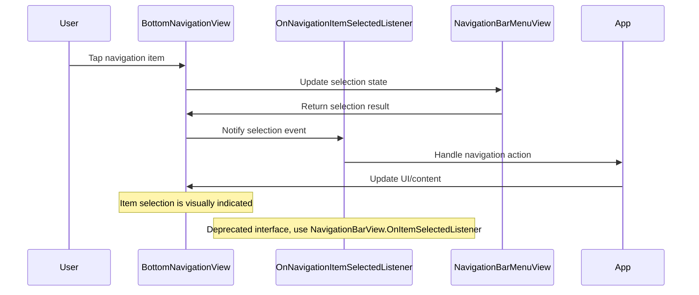
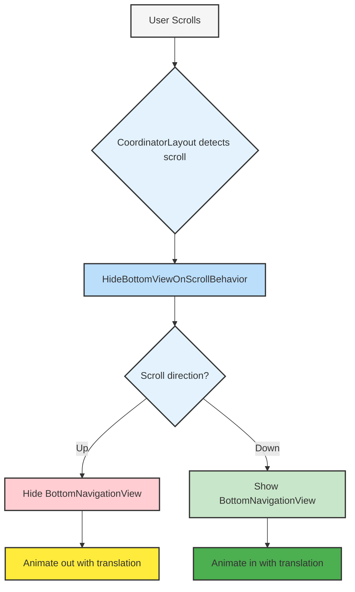
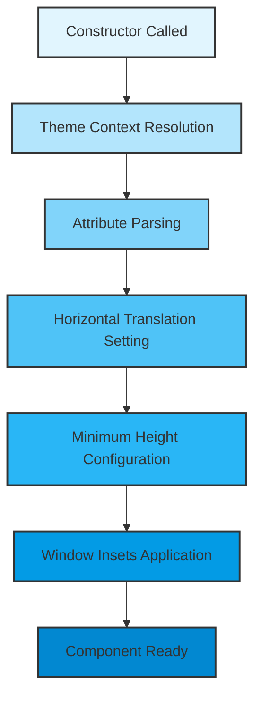
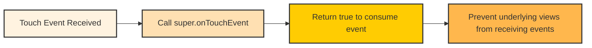

# Bottom Navigation Module Documentation

## Overview

The bottom-navigation module provides the BottomNavigationView component, a Material Design implementation of bottom navigation bars that enable users to explore and switch between top-level views in a single tap. This module is part of the Material Components for Android library and follows the Material Design guidelines for navigation patterns.

## Purpose and Core Functionality

The BottomNavigationView serves as a primary navigation component for applications with three to five top-level destinations. It provides:

- **Primary Navigation**: Easy access to top-level application sections
- **Visual Feedback**: Clear indication of the currently selected destination
- **Responsive Behavior**: Adaptive layout that works across different screen sizes
- **Scroll Integration**: Optional auto-hide behavior when scrolling
- **Accessibility**: Full support for accessibility features and screen readers

## Architecture and Component Relationships

### Core Components

The module consists of two main listener interfaces that handle user interaction:

1. **OnNavigationItemSelectedListener**: Handles selection events when users tap on navigation items
2. **OnNavigationItemReselectedListener**: Handles reselection events when users tap on the already selected item

### Component Hierarchy

### Dependencies

The BottomNavigationView extends NavigationBarView and integrates with several other Material Components:

## Data Flow and Component Interaction

### Navigation Item Selection Flow

### Scroll Behavior Integration

## Key Features and Configuration

### Item Management
- **Maximum Items**: Supports up to 6 navigation items (MAX_ITEM_COUNT = 6)
- **Horizontal Translation**: Configurable horizontal translation animation when items are selected
- **Menu Integration**: Uses standard Android menu resources for item definition

### Window Insets Handling
The component automatically handles system window insets:
- Applies bottom padding to avoid system navigation bar
- Handles RTL layout direction for proper start/end padding
- Integrates with edge-to-edge display modes

### Measurement and Layout
- Enforces minimum height requirements
- Supports both exact and at-most measurement modes
- Handles padding calculations automatically

## Process Flows

### Initialization Process

### Touch Event Handling

## Integration with Other Modules

### Navigation Module Integration
The bottom-navigation module extends the [navigation](navigation.md) module's NavigationBarView, inheriting:
- Menu management capabilities
- Item selection handling
- State persistence
- Accessibility features

### Behavior Module Integration
Integrates with [behavior](behavior.md) module for scroll-based hiding:
- HideBottomViewOnScrollBehavior for auto-hide functionality
- CoordinatorLayout integration for scroll detection
- Animation handling for show/hide transitions

### Theme Module Integration
Works with [theme](theme.md) module for:
- Material Design theming support
- Style attribute resolution
- Theme enforcement for consistent appearance

## Usage Guidelines

### When to Use
- Applications with 3-5 top-level destinations
- Primary navigation that should be always visible (except when scrolling)
- Mobile-first applications where thumb reachability is important

### When Not to Use
- Applications with more than 5 top-level destinations (consider [navigation-rail](navigation-rail.md) or drawer)
- Secondary navigation or deep navigation hierarchies
- Desktop or large tablet layouts where space is abundant

### Best Practices
- Keep labels short and meaningful
- Use recognizable icons
- Maintain consistent navigation structure
- Test with accessibility services
- Consider edge-to-edge layouts for modern Android versions

## API Reference

### Key Methods
- `setItemHorizontalTranslationEnabled(boolean)`: Controls horizontal translation animation
- `isItemHorizontalTranslationEnabled()`: Returns current translation setting
- `getMaxItemCount()`: Returns maximum supported items (6)
- `setOnNavigationItemSelectedListener()`: Sets selection listener (deprecated)
- `setOnNavigationItemReselectedListener()`: Sets reselection listener (deprecated)

### Deprecated APIs
The original listener interfaces are deprecated in favor of NavigationBarView's interfaces:
- Use `NavigationBarView.OnItemSelectedListener` instead of `OnNavigationItemSelectedListener`
- Use `NavigationBarView.OnItemReselectedListener` instead of `OnNavigationItemReselectedListener`

## Related Documentation

- [Navigation Module](navigation.md) - Base navigation functionality
- [Behavior Module](behavior.md) - Scroll behavior integration
- [Theme Module](theme.md) - Theming and styling support
- [Material Design Guidelines](https://m3.material.io/components/navigation-bar/overview) - Design specifications