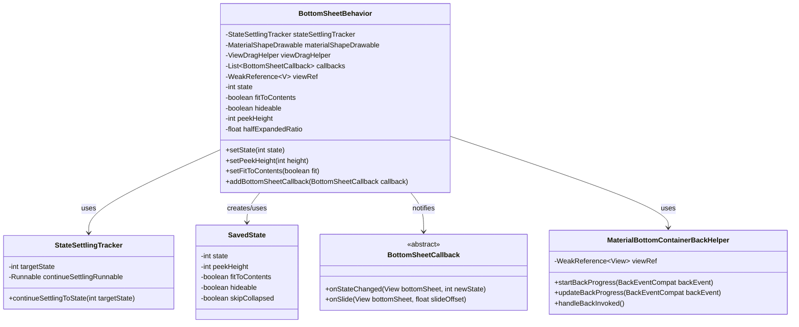
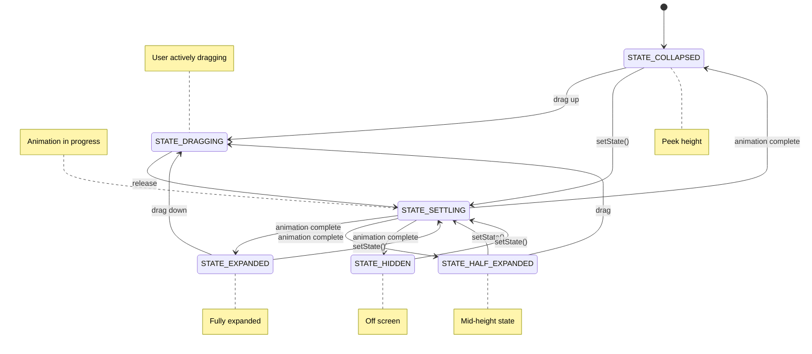
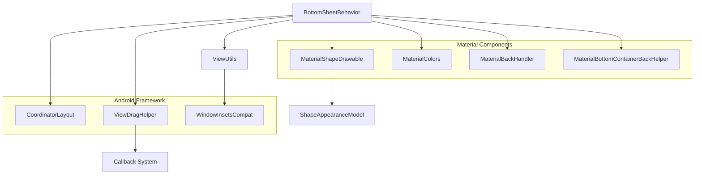
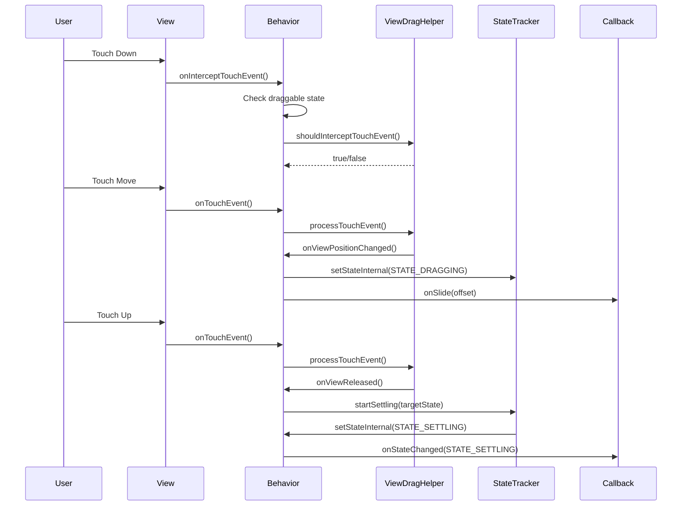
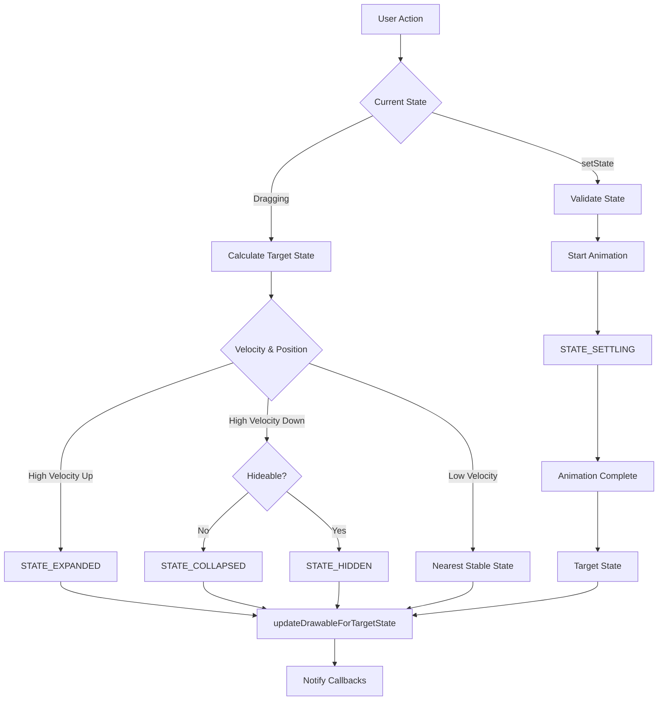

# Bottom Sheet Module Documentation

## Introduction

The bottom-sheet module provides a flexible and interactive bottom sheet component for Android applications, following Material Design guidelines. Bottom sheets are surfaces that slide up from the bottom of the screen, offering additional content or actions while maintaining context with the underlying interface.

This module implements the `BottomSheetBehavior` class, which serves as a CoordinatorLayout behavior that enables any child view to function as a bottom sheet with various states, animations, and interaction patterns.

## Core Functionality

The bottom-sheet module provides:

- **Multi-state Management**: Support for expanded, collapsed, half-expanded, hidden, dragging, and settling states
- **Touch Interaction**: Drag handling with velocity-based state transitions
- **Animation System**: Smooth transitions between states with customizable interpolators
- **Accessibility**: Comprehensive accessibility support with actions and announcements
- **System Integration**: Window insets handling, gesture navigation support, and predictive back navigation
- **Customization**: Configurable peek heights, expansion ratios, and visual properties

## Architecture

### Core Components



### State Management System



### Component Dependencies



## Data Flow

### Touch Event Processing



### State Transition Flow



## Key Features

### 1. Multi-State Support

The bottom sheet supports six distinct states:

- **STATE_COLLAPSED**: Sheet is at peek height
- **STATE_EXPANDED**: Sheet is fully expanded
- **STATE_HALF_EXPANDED**: Sheet is at mid-height (50% by default)
- **STATE_HIDDEN**: Sheet is off-screen
- **STATE_DRAGGING**: User is actively dragging
- **STATE_SETTLING**: Sheet is animating to target state

### 2. Touch Interaction

- **Drag Handling**: Uses ViewDragHelper for smooth drag interactions
- **Velocity Detection**: Considers swipe velocity for state transitions
- **Nested Scrolling**: Properly handles scrolling children within the sheet
- **Gesture Conflicts**: Resolves conflicts with system gestures

### 3. Animation System

- **State Transitions**: Smooth animations between all states
- **Shape Morphing**: Dynamic corner radius adjustments
- **Elevation Changes**: Visual feedback during state changes
- **Customizable Duration**: Configurable animation timing

### 4. Accessibility

- **State Announcements**: Accessibility events for state changes
- **Action Commands**: Expand/collapse actions for accessibility services
- **Focus Management**: Proper focus handling during transitions
- **Siblings Management**: Can dim/disable sibling views when expanded

### 5. System Integration

- **Window Insets**: Handles system window insets properly
- **Gesture Navigation**: Adapts to Android Q+ gesture navigation
- **Predictive Back**: Supports Android 13+ predictive back gestures
- **Configuration Changes**: Preserves state across configuration changes

## Configuration Options

### Behavior Attributes

- `behavior_peekHeight`: Height when collapsed
- `behavior_fitToContents`: Whether to fit content height
- `behavior_hideable`: Whether sheet can be hidden
- `behavior_draggable`: Whether sheet can be dragged
- `behavior_halfExpandedRatio`: Ratio for half-expanded state
- `behavior_expandedOffset`: Top offset when expanded

### Visual Properties

- `backgroundTint`: Background color tint
- `shapeAppearance`: Corner radius and shape
- `android:elevation`: Shadow elevation
- `android:maxWidth/maxHeight`: Size constraints

### Save Flags

- `SAVE_PEEK_HEIGHT`: Preserve peek height
- `SAVE_FIT_TO_CONTENTS`: Preserve fit-to-contents setting
- `SAVE_HIDEABLE`: Preserve hideable setting
- `SAVE_SKIP_COLLAPSED`: Preserve skip-collapsed setting
- `SAVE_ALL`: Preserve all settings

## Usage Patterns

### Basic Implementation

```xml
<androidx.coordinatorlayout.widget.CoordinatorLayout>
    <LinearLayout
        android:layout_width="match_parent"
        android:layout_height="300dp"
        app:layout_behavior="com.google.android.material.bottomsheet.BottomSheetBehavior"
        app:behavior_peekHeight="100dp"
        app:behavior_hideable="true" />
</androidx.coordinatorlayout.widget.CoordinatorLayout>
```

### Programmatic Control

```java
BottomSheetBehavior behavior = BottomSheetBehavior.from(bottomSheetView);
behavior.setState(BottomSheetBehavior.STATE_EXPANDED);
behavior.addBottomSheetCallback(new BottomSheetCallback() {
    @Override
    public void onStateChanged(@NonNull View bottomSheet, int newState) {
        // Handle state changes
    }
    
    @Override
    public void onSlide(@NonNull View bottomSheet, float slideOffset) {
        // Handle slide events
    }
});
```

## Integration with Other Modules

### CoordinatorLayout Integration

The bottom sheet behavior extends `CoordinatorLayout.Behavior`, enabling seamless integration with other Material Design components:

- **AppBarLayout**: Coordinated scrolling with app bars
- **FloatingActionButton**: Automatic FAB hiding/showing
- **NestedScrollView**: Proper nested scrolling support

### Related Modules

- **[appbar](appbar.md)**: For coordinated app bar behavior
- **[behavior](behavior.md)**: For scroll-based view behaviors
- **[shape](shape.md)**: For customizable corner radius and shape
- **[motion](motion.md)**: For animation and transition support

## Performance Considerations

### Memory Management

- Uses `WeakReference` for view references to prevent memory leaks
- Properly recycles `VelocityTracker` instances
- Cleans up animation resources when detached

### Animation Optimization

- Uses hardware acceleration for smooth animations
- Implements proper animation cancellation
- Optimizes drawable updates during state changes

### Touch Event Efficiency

- Efficient touch event interception
- Minimal overhead during drag operations
- Smart event filtering to reduce processing

## Testing

### Test Utilities

The module provides several testing utilities:

- `disableShapeAnimations()`: Disables animations for testing
- `isNestedScrollingCheckEnabled()`: Controls nested scroll behavior
- `shouldSkipHalfExpandedStateWhenDragging()`: Controls state transitions

### Common Test Scenarios

- State transitions and callbacks
- Touch event handling and drag behavior
- Animation completion and timing
- Accessibility action handling
- Configuration change preservation

## Migration Guide

### From Support Library

When migrating from the Android Support Library:

1. Update import statements to use `com.google.android.material`
2. Review new configuration attributes
3. Update callback implementations
4. Test state preservation behavior

### Version Compatibility

- Minimum SDK: 21 (Android 5.0)
- Target SDK: Latest stable
- Material Components version: 1.9.0+

## Troubleshooting

### Common Issues

**Sheet not responding to touch:**
- Ensure `draggable` is set to true
- Check that the sheet has sufficient height
- Verify no conflicting touch listeners

**State not preserved:**
- Set appropriate `saveFlags`
- Ensure proper ID assignment for views
- Check configuration change handling

**Animation issues:**
- Verify hardware acceleration is enabled
- Check for conflicting animations
- Ensure proper drawable initialization

### Debug Tips

- Use `BottomSheetCallback` to monitor state changes
- Check `calculateSlideOffset()` for position tracking
- Monitor `ViewDragHelper` state for touch issues
- Use layout inspector to verify view hierarchy

## References

- [Material Design Bottom Sheets](https://material.io/components/sheets-bottom)
- [Component Developer Guidance](https://github.com/material-components/material-components-android/blob/master/docs/components/BottomSheet.md)
- [CoordinatorLayout Behaviors](https://developer.android.com/reference/androidx/coordinatorlayout/widget/CoordinatorLayout.Behavior)
- [ViewDragHelper Documentation](https://developer.android.com/reference/androidx/customview/widget/ViewDragHelper)