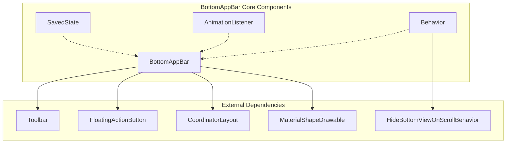
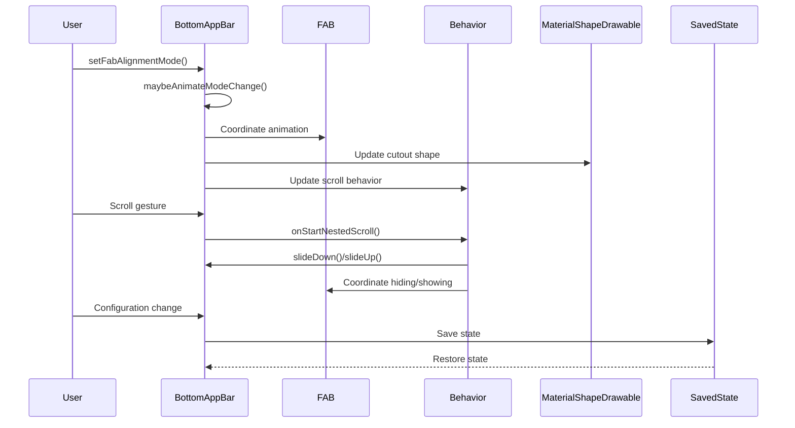
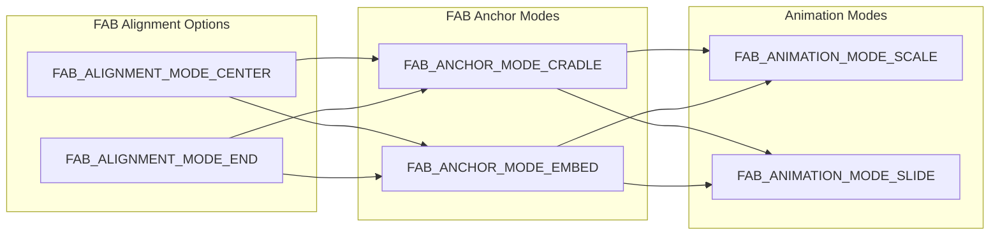
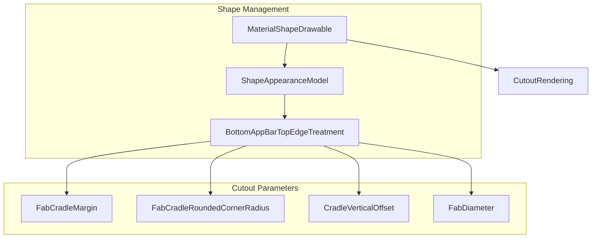
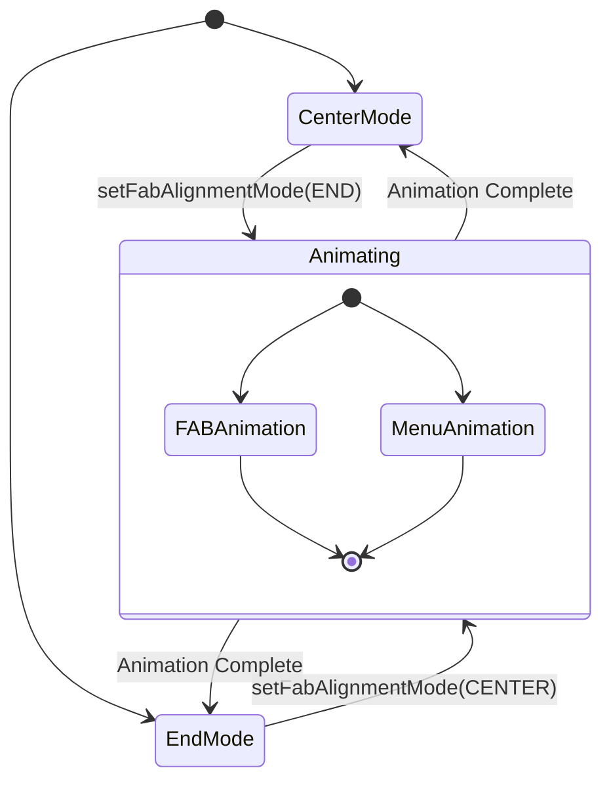
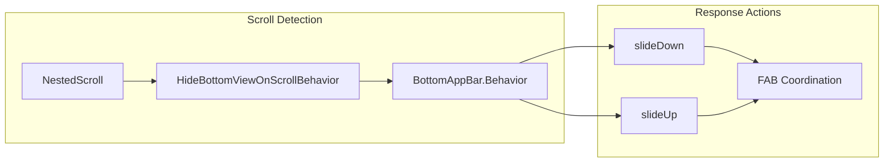
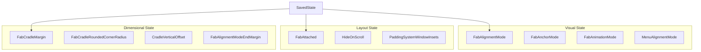
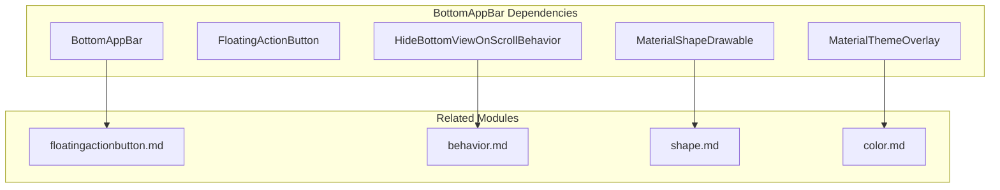
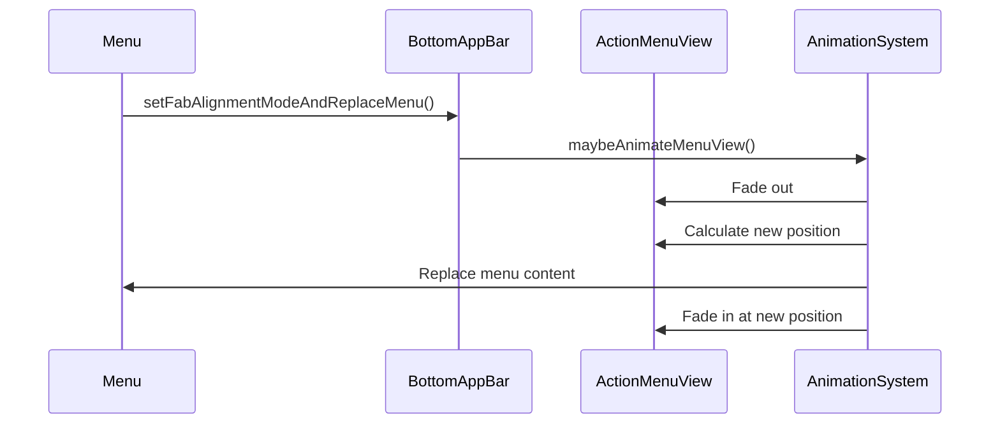
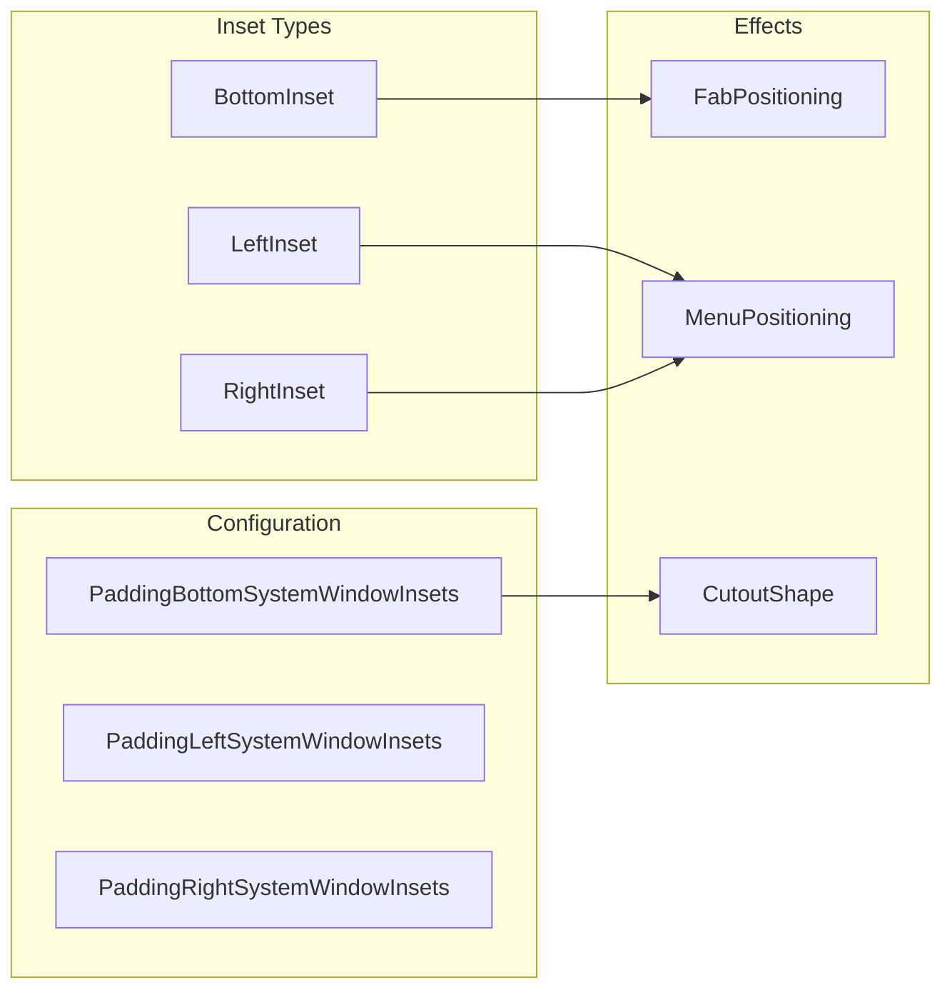

# BottomAppBar Module Documentation

## Introduction

The BottomAppBar module provides a specialized toolbar component that extends the standard Android Toolbar to create a bottom-positioned app bar with integrated FloatingActionButton (FAB) support. This Material Design component features a distinctive "cradle" shape that accommodates a FAB, creating a seamless visual integration between the navigation bar and the primary action button.

## Module Overview

The BottomAppBar module is part of the Material Components for Android library and provides a sophisticated bottom navigation solution that goes beyond traditional toolbars. It supports dynamic FAB positioning, animated transitions, scroll-based behaviors, and customizable shape treatments that create the signature cradle effect.

## Core Architecture

### Component Structure



### Key Components

#### 1. BottomAppBar Class
The main component that extends `Toolbar` and implements `AttachedBehavior`. It manages the overall functionality including:
- FAB positioning and animation coordination
- Menu item alignment and animation
- Shape appearance and cutout management
- Scroll behavior integration
- State persistence

#### 2. SavedState Class
Handles state persistence for configuration changes and process death/recreation. Stores:
- Current FAB alignment mode
- FAB attachment state
- Navigation and menu configurations

#### 3. AnimationListener Interface
Provides callbacks for animation lifecycle events:
- `onAnimationStart(BottomAppBar bar)` - Called when animations begin
- `onAnimationEnd(BottomAppBar bar)` - Called when animations complete

#### 4. Behavior Class
Extends `HideBottomViewOnScrollBehavior` to provide:
- Scroll-based hiding/showing functionality
- FAB coordination and layout management
- Nested scroll handling
- Window inset management

## Data Flow Architecture



## FAB Integration System

### FAB Alignment Modes



### Shape and Cutout Management

The BottomAppBar uses a sophisticated shape system to create the FAB cradle:



## Animation System

### Animation Coordination

The BottomAppBar manages complex animations between different states:



### Animation Types

1. **Scale Animation**: FAB scales down to a point and scales back up at the new position
2. **Slide Animation**: FAB slides smoothly from one position to another
3. **Menu Animation**: ActionMenuView fades and translates to accommodate FAB movement

## Scroll Behavior Integration

### Hide-on-Scroll Functionality



## State Management

### Configuration and Persistence

The BottomAppBar maintains several state categories:



## Integration with Other Modules

### Dependency Relationships



## Menu System Integration

### Menu Alignment and Animation

The BottomAppBar provides sophisticated menu management:



## Window Insets Handling

### System Window Integration



## Usage Patterns

### Basic Implementation

```xml
<androidx.coordinatorlayout.widget.CoordinatorLayout>
    <!-- Your content here -->
    
    <com.google.android.material.bottomappbar.BottomAppBar
        android:id="@+id/bottom_app_bar"
        android:layout_width="match_parent"
        android:layout_height="wrap_content"
        android:layout_gravity="bottom"
        app:fabAlignmentMode="center"
        app:fabAnimationMode="scale"
        app:hideOnScroll="true"
        app:backgroundTint="?attr/colorSurface" />
    
    <com.google.android.material.floatingactionbutton.FloatingActionButton
        android:id="@+id/fab"
        android:layout_width="wrap_content"
        android:layout_height="wrap_content"
        app:layout_anchor="@id/bottom_app_bar" />
</androidx.coordinatorlayout.widget.CoordinatorLayout>
```

### Programmatic Control

```java
BottomAppBar bottomAppBar = findViewById(R.id.bottom_app_bar);

// Change FAB alignment with animation
bottomAppBar.setFabAlignmentMode(BottomAppBar.FAB_ALIGNMENT_MODE_END);

// Customize cradle appearance
bottomAppBar.setFabCradleMargin(16dp);
bottomAppBar.setFabCradleRoundedCornerRadius(8dp);
bottomAppBar.setCradleVerticalOffset(12dp);

// Control scroll behavior
bottomAppBar.setHideOnScroll(true);
bottomAppBar.performHide(); // Manual hide
bottomAppBar.performShow(); // Manual show
```

## Performance Considerations

### Animation Optimization
- Uses hardware-accelerated property animations
- Coordinates multiple animations with AnimatorSet
- Cancels conflicting animations to prevent visual glitches
- Uses interpolation for smooth transitions

### Memory Management
- WeakReference usage for view references in Behavior
- Proper cleanup of animation listeners
- Efficient state restoration with Parcelable

### Layout Optimization
- Minimal layout passes through careful view measurement
- Efficient cutout shape calculations
- Smart menu positioning to avoid unnecessary translations

## Accessibility Features

### Screen Reader Support
- Proper content descriptions for navigation elements
- Semantic meaning through toolbar inheritance
- State announcements for mode changes

### Keyboard Navigation
- Full keyboard accessibility through Toolbar base class
- Proper focus management during animations
- Logical tab order maintenance

## Testing Considerations

### Unit Testing
- State persistence validation
- Animation lifecycle verification
- FAB coordination testing
- Menu alignment calculations

### Integration Testing
- CoordinatorLayout interaction testing
- Scroll behavior validation
- Configuration change handling
- Window inset adaptation

## Migration Guide

### From Standard Toolbar
1. Replace `Toolbar` with `BottomAppBar` in layouts
2. Add FAB anchoring with `app:layout_anchor`
3. Configure cradle properties as needed
4. Update theme references for Material Design 3

### Version Compatibility
- Minimum SDK: 21 (Android 5.0)
- Full feature support: SDK 23+
- Enhanced shadow rendering: SDK 28+

## Troubleshooting

### Common Issues
1. **FAB not visible**: Ensure proper CoordinatorLayout usage and anchoring
2. **Cutout not rendering**: Check MaterialShapeDrawable configuration
3. **Animation glitches**: Verify no conflicting animations or layout changes
4. **Scroll behavior not working**: Confirm NestedScrollingChild implementation

### Debug Tools
- Layout bounds visualization
- Animation duration scaling
- Shape appearance inspection
- CoordinatorLayout dependency debugging

## References

- [FloatingActionButton Module](floatingactionbutton.md) - For FAB integration details
- [Behavior Module](behavior.md) - For scroll behavior implementation
- [Shape Module](shape.md) - For MaterialShapeDrawable and edge treatments
- [AppBar Module](appbar.md) - For related app bar components
- [Material Design Guidelines](https://material.io/components/bottom-app-bar) - Official design specifications