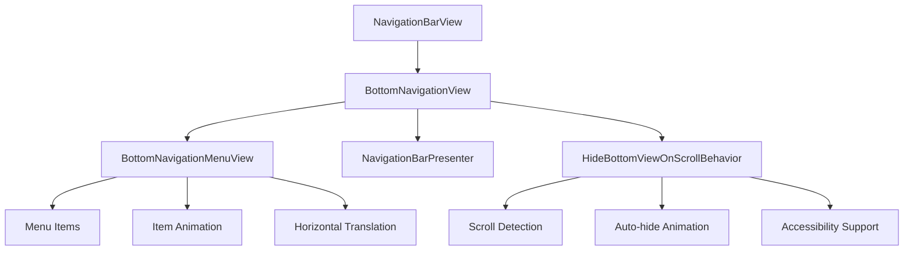
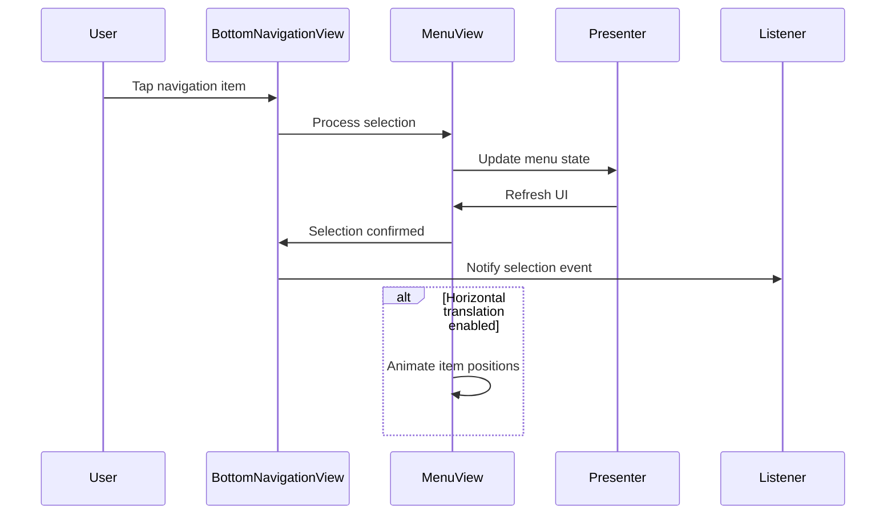
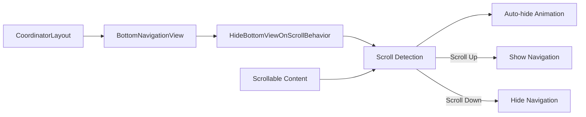
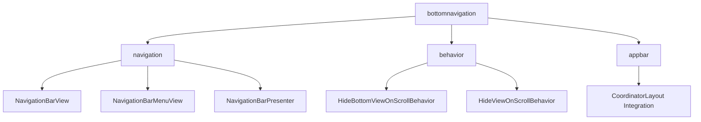
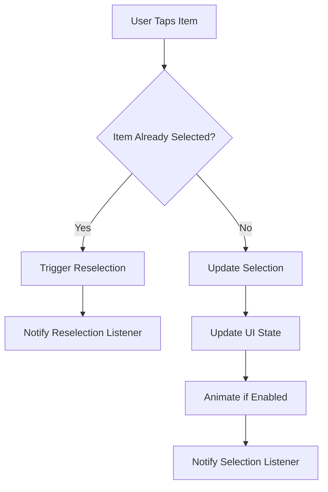
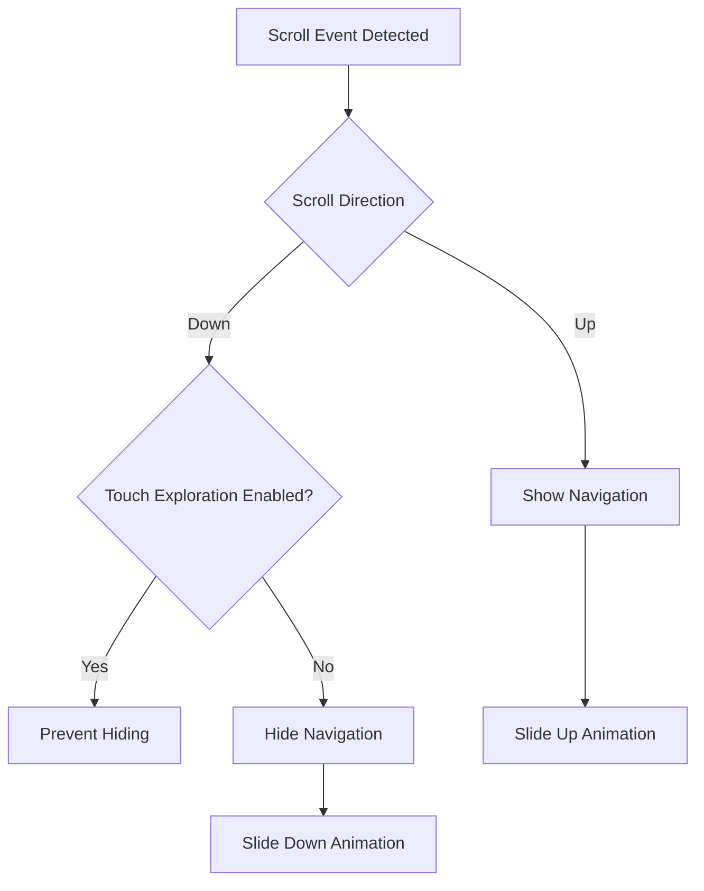

# BottomNavigation Module Documentation

## Introduction

The BottomNavigation module provides the Material Design bottom navigation component for Android applications. It implements a standard bottom navigation bar that enables users to quickly navigate between top-level destinations with a single tap. This module is designed for applications with three to five primary destinations and follows the Material Design guidelines for navigation patterns.

## Overview

The BottomNavigation module is built around the `BottomNavigationView` class, which extends `NavigationBarView` to provide a specialized implementation for bottom navigation patterns. The module supports dynamic behavior including auto-hiding on scroll, horizontal item translation, and comprehensive accessibility features.

## Core Architecture

### Component Hierarchy



### Key Components

#### 1. BottomNavigationView
The main component that extends `NavigationBarView` and provides the core bottom navigation functionality.

**Key Features:**
- Maximum of 6 navigation items
- Horizontal translation support for item selection
- Window insets handling for system navigation bars
- Touch event consumption to prevent underlying view interference

**Core Methods:**
- `setItemHorizontalTranslationEnabled(boolean)` - Controls item animation on selection
- `getMaxItemCount()` - Returns maximum allowed items (6)
- `createNavigationBarMenuView()` - Creates specialized menu view

#### 2. Listener Interfaces

##### OnNavigationItemSelectedListener
```java
@Deprecated
public interface OnNavigationItemSelectedListener extends OnItemSelectedListener {}
```
- **Purpose**: Handles navigation item selection events
- **Status**: Deprecated in favor of `NavigationBarView.OnItemSelectedListener`
- **Usage**: Notified when any navigation item is selected

##### OnNavigationItemReselectedListener
```java
@Deprecated
public interface OnNavigationItemReselectedListener extends OnItemReselectedListener {}
```
- **Purpose**: Handles reselection of already active navigation items
- **Status**: Deprecated in favor of `NavigationBarView.OnItemReselectedListener`
- **Usage**: Notified when the currently selected item is tapped again

## Data Flow Architecture



## Integration with System Components

### CoordinatorLayout Integration



The BottomNavigationView integrates with CoordinatorLayout through `HideBottomViewOnScrollBehavior`:

- **Scroll Detection**: Monitors vertical scroll events
- **Auto-hide**: Automatically hides/shows navigation based on scroll direction
- **Animation**: Smooth slide animations with customizable duration and interpolation
- **Accessibility**: Respects touch exploration settings

### Window Insets Handling

The module automatically handles system window insets:
- **Bottom Padding**: Adds space for system navigation bar
- **RTL Support**: Correctly handles right-to-left layouts
- **Edge Detection**: Applies appropriate padding based on screen edges

## Component Dependencies



### External Dependencies
- **Navigation Module**: Provides base `NavigationBarView` functionality
- **Behavior Module**: Supplies scroll-based hiding behaviors
- **AppBar Module**: CoordinatorLayout integration patterns
- **Theme System**: Material theming and styling support

## Configuration and Customization

### XML Attributes

```xml
<com.google.android.material.bottomnavigation.BottomNavigationView
    android:id="@+id/navigation"
    android:layout_width="match_parent"
    android:layout_height="56dp"
    android:layout_gravity="start"
    app:menu="@menu/my_navigation_items"
    app:itemHorizontalTranslationEnabled="true"
    android:minHeight="56dp" />
```

### Menu Resource Structure

```xml
<menu xmlns:android="http://schemas.android.com/apk/res/android">
    <item android:id="@+id/action_search"
         android:title="@string/menu_search"
         android:icon="@drawable/ic_search" />
    <item android:id="@+id/action_settings"
         android:title="@string/menu_settings"
         android:icon="@drawable/ic_add" />
</menu>
```

## Process Flows

### Item Selection Process



### Scroll Behavior Process



## Accessibility Features

### Touch Exploration Support
- **Automatic Detection**: Listens for accessibility service changes
- **Smart Behavior**: Prevents auto-hiding when touch exploration is active
- **Cleanup**: Properly removes listeners when view is detached

### Screen Reader Integration
- **Semantic Labels**: Proper content descriptions for navigation items
- **State Announcements**: Selected state changes are announced
- **Focus Management**: Logical focus traversal through navigation items

## Performance Considerations

### Memory Management
- **Listener Cleanup**: Automatic removal of accessibility listeners
- **Animation Optimization**: Cancels ongoing animations before starting new ones
- **Resource Recycling**: Efficient menu view creation and reuse

### Animation Performance
- **Hardware Acceleration**: Utilizes ViewPropertyAnimator for smooth animations
- **Duration Optimization**: Configurable animation durations based on Material Design specs
- **Interpolation**: Uses appropriate interpolators for natural motion

## Migration Path

### From Deprecated Listeners

```java
// Old approach (deprecated)
bottomNavigationView.setOnNavigationItemSelectedListener(listener);
bottomNavigationView.setOnNavigationItemReselectedListener(reselectionListener);

// New approach
bottomNavigationView.setOnItemSelectedListener(listener);
bottomNavigationView.setOnItemReselectedListener(reselectionListener);
```

## Best Practices

### Usage Guidelines
1. **Item Count**: Limit to 3-5 items for optimal usability
2. **Icon Selection**: Use recognizable, simple icons
3. **Label Clarity**: Keep labels short and descriptive
4. **Consistent Placement**: Always position at bottom of screen

### Performance Optimization
1. **Menu Preparation**: Prepare menu resources during design time
2. **State Management**: Cache selection state appropriately
3. **Animation Tuning**: Adjust animation durations based on context
4. **Accessibility Testing**: Verify behavior with accessibility services

## Related Documentation

- [Navigation Module](navigation.md) - Base navigation components
- [Behavior Module](behavior.md) - Scroll-based behaviors
- [AppBar Module](appbar.md) - CoordinatorLayout integration patterns
- [Material Design Guidelines](https://m3.material.io/components/navigation-bar/overview) - Official design specifications

## API Reference

### Key Classes
- `BottomNavigationView` - Main navigation component
- `OnNavigationItemSelectedListener` - Selection event handler (deprecated)
- `OnNavigationItemReselectedListener` - Reselection event handler (deprecated)

### Important Constants
- `MAX_ITEM_COUNT = 6` - Maximum allowed navigation items
- Default height: 56dp - Standard navigation bar height

### Inherited Functionality
The BottomNavigationView inherits extensive functionality from NavigationBarView, including:
- Menu management
- Item styling
- Badge support
- Color theming
- State persistence