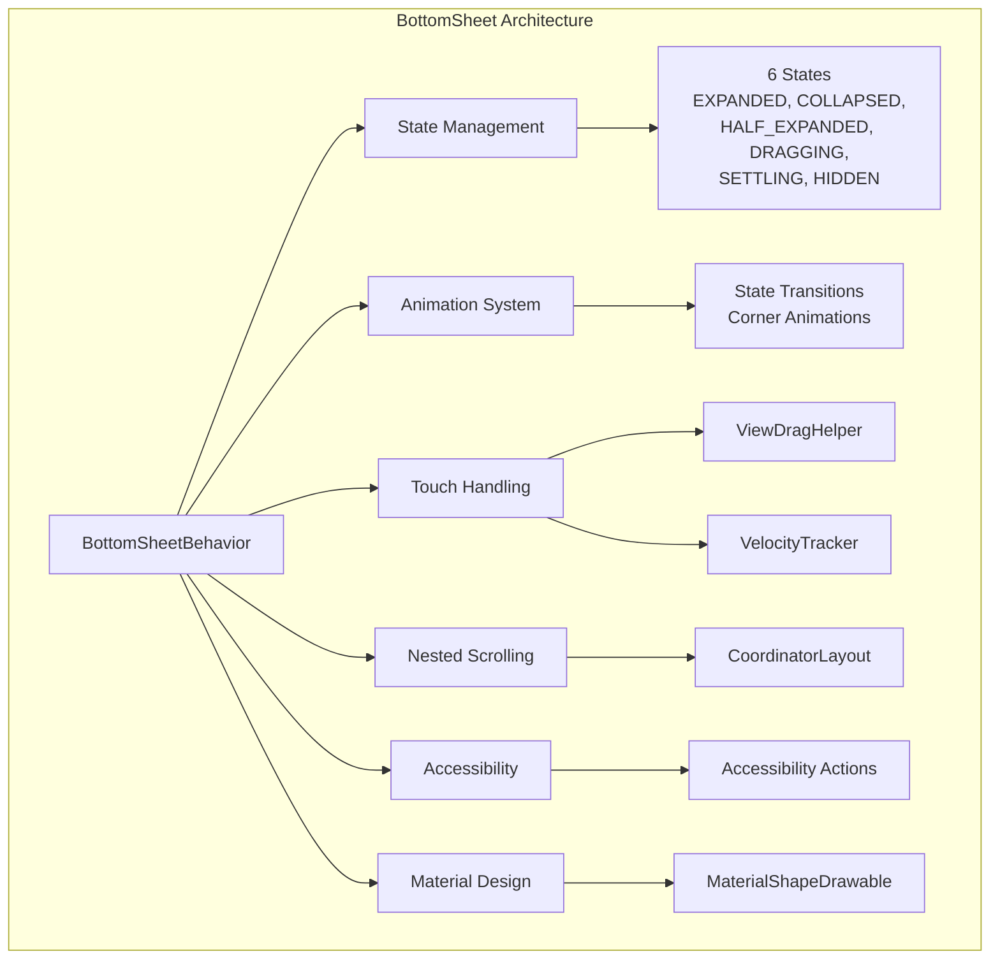
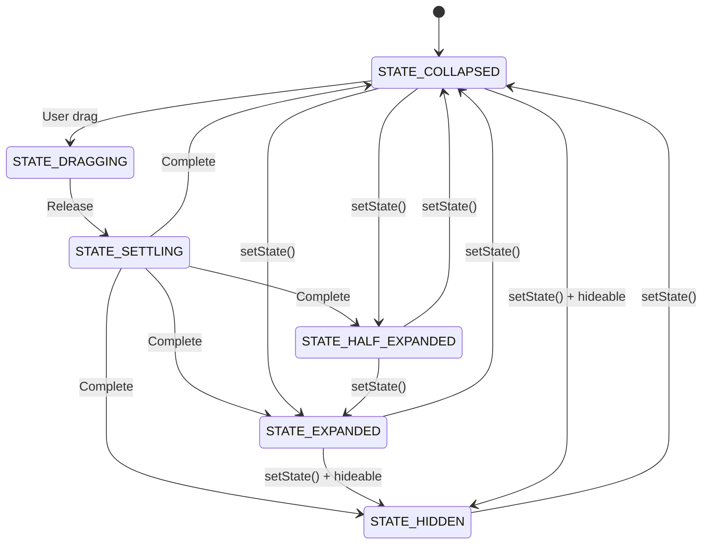
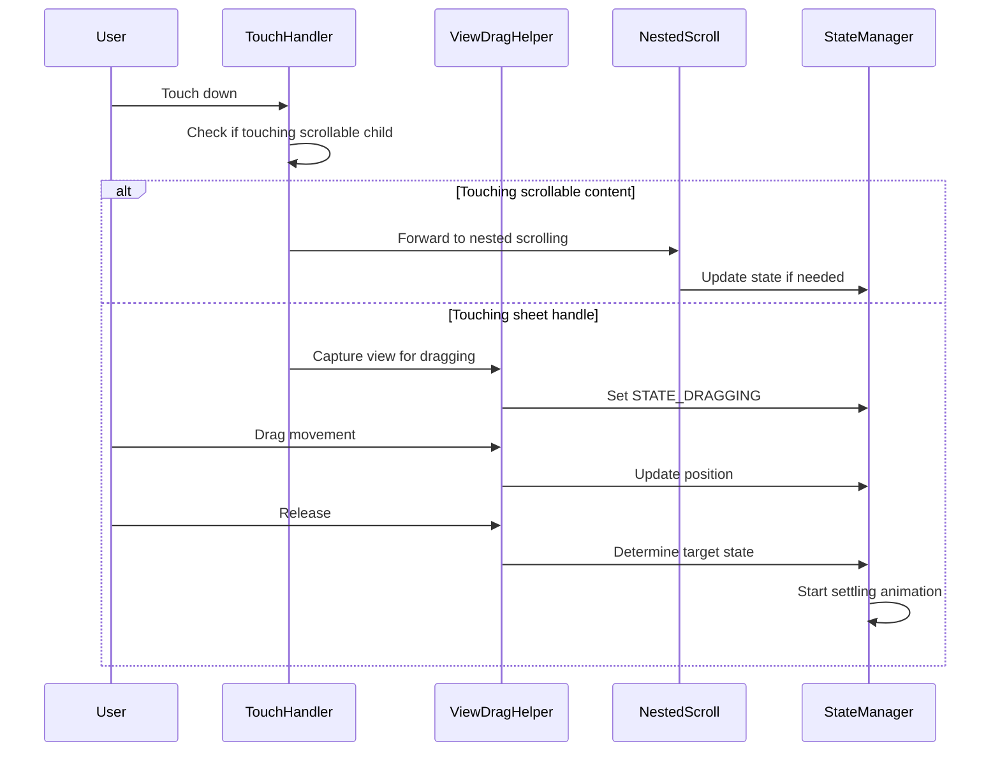
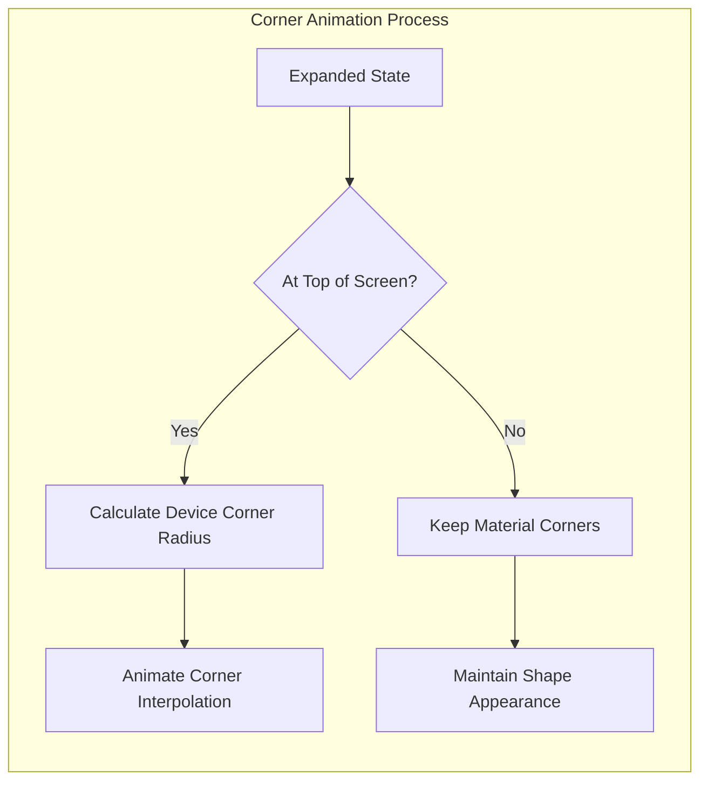

# BottomSheet Module Documentation

## Introduction

The BottomSheet module provides the core functionality for implementing bottom sheet UI components in Android applications using the Material Design Components library. Bottom sheets are surfaces that slide up from the bottom of the screen, providing additional content and actions while maintaining context of the underlying interface.

This module implements the `BottomSheetBehavior` class, which serves as the primary coordinator for bottom sheet interactions, animations, and state management within a `CoordinatorLayout`.

## Architecture Overview

The BottomSheet module is built around a behavior-based architecture that integrates with Android's CoordinatorLayout system. The core architecture consists of:

- **Behavior System**: Extends `CoordinatorLayout.Behavior` to provide drag handling and nested scrolling coordination
- **State Management**: Manages six distinct states (EXPANDED, COLLAPSED, HALF_EXPANDED, DRAGGING, SETTLING, HIDDEN)
- **Animation System**: Handles smooth transitions between states with configurable interpolators
- **Touch Handling**: Processes touch events, gestures, and velocity tracking for natural interactions
- **Accessibility**: Provides comprehensive accessibility support with custom actions and announcements



## Core Components

### BottomSheetBehavior

The primary class that implements the bottom sheet functionality. It extends `CoordinatorLayout.Behavior<V>` and implements `MaterialBackHandler` for predictive back gesture support.

**Key Responsibilities:**
- State management and transitions
- Touch event processing and gesture recognition
- Nested scrolling coordination
- Animation and visual effects
- Accessibility support
- Configuration persistence

### SavedState

A `Parcelable` implementation that preserves bottom sheet state across configuration changes and activity lifecycle events.

**Preserved State:**
- Current state (EXPANDED, COLLAPSED, etc.)
- Peek height configuration
- Fit-to-contents setting
- Hideable and skip-collapsed flags

### StateSettlingTracker

An internal utility class that manages the settling animation process when transitioning between states.

**Functionality:**
- Tracks target state during animations
- Manages animation continuation
- Handles animation interruption scenarios

## State Management

The bottom sheet operates in six distinct states, each representing a specific visual and interactive configuration:



### State Descriptions

- **STATE_EXPANDED**: Fully expanded state, showing maximum content
- **STATE_COLLAPSED**: Partially visible state at configured peek height
- **STATE_HALF_EXPANDED**: Intermediate state at 50% of parent height (when fitToContents=false)
- **STATE_DRAGGING**: User is actively dragging the sheet
- **STATE_SETTLING**: Sheet is animating to a stable state
- **STATE_HIDDEN**: Sheet is completely off-screen (when hideable=true)

## Touch and Gesture Handling

The bottom sheet implements sophisticated touch handling that distinguishes between scrolling content and dragging the sheet itself.



### Gesture Recognition

- **Vertical Swipes**: Primary interaction for expanding/collapsing
- **Horizontal Swipes**: Ignored for sheet movement, passed to content
- **Velocity-based Transitions**: Fast swipes can skip intermediate states
- **Edge Swipe Handling**: Prevents conflicts with system gestures

## Animation System

The animation system provides smooth transitions between states with configurable timing and interpolation.

### Corner Animation

When the sheet reaches the expanded state at the top of the screen, corner radius animations provide visual feedback:



### State Transition Animations

- **Settling Animations**: Smooth transitions to target states
- **Peek Height Changes**: Animated height adjustments
- **Shape Morphing**: Corner radius transitions based on position
- **Elevation Changes**: Shadow adjustments during movement

## Nested Scrolling Integration

The bottom sheet coordinates with nested scrolling children to provide seamless interaction:

### Scroll Handling Logic

1. **Upward Scrolling**: Content scrolls first, then sheet expands
2. **Downward Scrolling**: Sheet collapses first, then content scrolls
3. **Edge Detection**: Prevents over-scrolling and provides natural boundaries
4. **Velocity Transfer**: Maintains scroll momentum between content and sheet

### Configuration Options

- **draggableOnNestedScroll**: Enable/disable dragging via nested scroll
- **fitToContents**: Adjust behavior based on content size
- **significantVelocityThreshold**: Configure swipe sensitivity

## Accessibility Features

Comprehensive accessibility support ensures the bottom sheet is usable with screen readers and assistive technologies.

### Accessibility Actions

The system provides custom accessibility actions for each state:

- **Expand Action**: Available in collapsed/half-expanded states
- **Collapse Action**: Available in expanded/half-expanded states
- **Expand Halfway**: Optional action for half-expanded state
- **Dismiss Action**: Available when hideable is true

### Screen Reader Support

- **State Announcements**: Automatic announcements of state changes
- **Pane Titles**: Support for descriptive titles
- **Focus Management**: Proper focus handling during transitions
- **Important For Accessibility**: Dynamic adjustment of sibling view accessibility

## Material Design Integration

The bottom sheet integrates with Material Design theming and styling systems:

### Shape Theming

- **MaterialShapeDrawable**: Customizable shape appearance
- **Corner Radius**: Configurable corner radius with animation support
- **Elevation**: Shadow effects that respond to state changes
- **Background Tint**: Theme-aware background coloring

### Theme Attributes

- `colorSurface`: Background color
- `colorSurfaceContainerLow`: Gradient protection color
- `bottomSheetStyle`: Comprehensive styling attributes

## Configuration and Customization

### Key Configuration Options

| Property | Type | Default | Description |
|----------|------|---------|-------------|
| peekHeight | int | AUTO | Height when collapsed |
| fitToContents | boolean | true | Expand based on content height |
| hideable | boolean | false | Allow hiding the sheet |
| skipCollapsed | boolean | false | Skip collapsed when hiding |
| draggable | boolean | true | Enable drag interactions |
| halfExpandedRatio | float | 0.5 | Ratio for half-expanded state |
| expandedOffset | int | 0 | Top offset in expanded state |

### Save Flags

Control which properties persist across configuration changes:

- **SAVE_PEEK_HEIGHT**: Preserve peek height
- **SAVE_FIT_TO_CONTENTS**: Preserve fit-to-contents setting
- **SAVE_HIDEABLE**: Preserve hideable flag
- **SAVE_SKIP_COLLAPSED**: Preserve skip-collapsed flag
- **SAVE_ALL**: Preserve all configurable properties
- **SAVE_NONE**: Preserve only positional state

## Integration with Other Modules

The bottom sheet module interacts with several other Material Design components:

### CoordinatorLayout Integration

Works as a `CoordinatorLayout.Behavior`, enabling coordination with other behaviors like:
- [AppBarLayout](appbar.md) scrolling behavior
- [FloatingActionButton](floatingactionbutton.md) anchoring
- Custom behavior implementations

### Related Components

- **BottomSheetDialog**: Dialog-based bottom sheet implementation
- **BottomSheetDialogFragment**: Fragment-based bottom sheet
- **BottomSheetDragHandleView**: Drag handle component
- **MaterialBottomContainerBackHelper**: Predictive back gesture support

## Usage Examples

### Basic Implementation

```xml
<androidx.coordinatorlayout.widget.CoordinatorLayout>
    <LinearLayout
        android:layout_width="match_parent"
        android:layout_height="300dp"
        android:background="?attr/colorSurface"
        app:layout_behavior="com.google.android.material.bottomsheet.BottomSheetBehavior"
        app:behavior_peekHeight="100dp"
        app:behavior_hideable="true"
        app:behavior_fitToContents="false">
        <!-- Bottom sheet content -->
    </LinearLayout>
</androidx.coordinatorlayout.widget.CoordinatorLayout>
```

### Programmatic Control

```java
BottomSheetBehavior<LinearLayout> behavior = BottomSheetBehavior.from(bottomSheet);
behavior.setState(BottomSheetBehavior.STATE_EXPANDED);
behavior.addBottomSheetCallback(new BottomSheetBehavior.BottomSheetCallback() {
    @Override
    public void onStateChanged(@NonNull View bottomSheet, int newState) {
        // Handle state changes
    }
    
    @Override
    public void onSlide(@NonNull View bottomSheet, float slideOffset) {
        // Handle sliding events
    }
});
```

## Performance Considerations

### Optimization Strategies

1. **View Recycling**: Reuse bottom sheet instances when possible
2. **State Batching**: Minimize rapid state changes
3. **Animation Throttling**: Use appropriate animation durations
4. **Memory Management**: Proper cleanup of references and listeners

### Memory Efficiency

- **WeakReferences**: Used for view references to prevent memory leaks
- **Listener Management**: Proper addition/removal of callbacks
- **Resource Cleanup**: Animation and velocity tracker disposal

## Testing Support

The module includes testing utilities:

- **disableShapeAnimations()**: Disable animations for stable testing
- **VisibleForTesting**: Annotated methods for test access
- **State Verification**: Methods to verify internal state

## Best Practices

### Design Guidelines

1. **Content Organization**: Keep content concise and actionable
2. **State Management**: Choose appropriate default states
3. **Gesture Conflicts**: Avoid conflicts with system gestures
4. **Accessibility**: Always provide descriptive titles and actions

### Implementation Recommendations

1. **Measure Performance**: Profile animation performance on target devices
2. **Test Gestures**: Verify touch handling across different screen sizes
3. **Accessibility Testing**: Test with screen readers and switch access
4. **Configuration Changes**: Handle rotations and theme changes gracefully

## API Reference

For detailed API documentation, refer to the [Material Design Components documentation](https://material.io/components/bottom-sheets).

### Key Classes

- `BottomSheetBehavior<V>`: Main behavior implementation
- `BottomSheetBehavior.SavedState`: State persistence
- `BottomSheetBehavior.BottomSheetCallback`: Event callbacks
- `BottomSheetBehavior.StateSettlingTracker`: Animation management

### Related Documentation

- [Material Design Bottom Sheet Guidelines](https://material.io/components/bottom-sheets)
- [CoordinatorLayout Documentation](https://developer.android.com/reference/androidx/coordinatorlayout/widget/CoordinatorLayout)
- [Material Motion Patterns](https://material.io/design/motion/)

---

*This documentation covers the core functionality of the BottomSheet module. For implementation-specific details and advanced usage patterns, consult the source code and Material Design Component library documentation.*