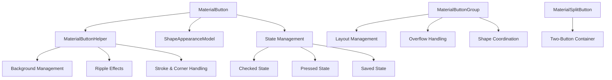

# Button Module Documentation

## Overview

The Button module is a core component of the Material Design Components library for Android, providing a comprehensive set of button implementations that follow Material Design principles. This module offers flexible, customizable button components with support for various states, icons, shapes, and interactive behaviors.

## Architecture

The Button module is structured around several key components that work together to provide a complete button system:



## Core Components

### MaterialButton
The primary button implementation that extends AppCompatButton and provides Material Design styling and behavior. Key features include:

- **Icon Support**: Configurable icon positioning (start, end, top, text-start, text-end, text-top)
- **Shape Customization**: Corner radius, stroke width and color, background tint
- **State Management**: Checkable interface with checked/unchecked states
- **Accessibility**: Full accessibility support with proper announcements
- **Animation**: Spring-based animations for size changes and corner morphing

### MaterialButtonGroup
A container for managing multiple MaterialButtons as a cohesive group with features like:

- **Connected Styling**: Automatic shape coordination between adjacent buttons
- **Overflow Handling**: Three modes (none, menu, wrap) for handling space constraints
- **Spacing Control**: Configurable spacing with stroke overlap prevention
- **Layout Management**: Horizontal and vertical orientations with proper margin adjustments

### MaterialSplitButton
A specialized two-button container that creates split button functionality:

- **Dual Button Layout**: Leading button with label/icon and trailing button with chevron
- **Expandable Behavior**: Trailing button acts as a toggle with animated state changes
- **Accessibility**: Proper content descriptions for expanded/collapsed states

## Key Features

### Visual Customization
- **Shape Appearance**: Full control over corner sizes and shapes
- **Color States**: Support for color state lists for backgrounds, strokes, and icons
- **Icon Handling**: Tinting, sizing, and positioning with gravity options
- **Typography**: Integration with Material typography scales

### Interactive Behaviors
- **Checkable Interface**: Toggle button functionality with state change listeners
- **Ripple Effects**: Material Design ripple animations with customizable colors
- **Spring Animations**: Physics-based animations for size and corner changes
- **Touch Feedback**: Proper pressed state handling and visual feedback

### Layout Flexibility
- **Weight Support**: Integration with LinearLayout weight system
- **Overflow Management**: Intelligent handling of space constraints
- **Responsive Design**: Adapts to different screen sizes and orientations
- **Margin Optimization**: Automatic stroke overlap prevention

## Integration with Other Modules

The Button module integrates with several other Material Design Components:

- **[Shape Module](shape.md)**: Uses ShapeAppearanceModel for corner and shape customization
- **[Theme Module](theme.md)**: Leverages theme attributes for consistent styling
- **[Motion Module](motion.md)**: Utilizes spring animations and motion curves
- **[Color Module](color.md)**: Integrates with Material color system for theming

## Usage Patterns

### Basic Button
```xml
<com.google.android.material.button.MaterialButton
    android:layout_width="wrap_content"
    android:layout_height="wrap_content"
    android:text="Button"
    app:icon="@drawable/ic_icon" />
```

### Button Group
```xml
<com.google.android.material.button.MaterialButtonGroup
    android:layout_width="wrap_content"
    android:layout_height="wrap_content">
    
    <com.google.android.material.button.MaterialButton
        android:layout_width="wrap_content"
        android:layout_height="wrap_content"
        android:text="Option 1" />
        
    <com.google.android.material.button.MaterialButton
        android:layout_width="wrap_content"
        android:layout_height="wrap_content"
        android:text="Option 2" />
        
</com.google.android.material.button.MaterialButtonGroup>
```

### Split Button
```xml
<com.google.android.material.button.MaterialSplitButton
    android:layout_width="wrap_content"
    android:layout_height="wrap_content">
    
    <Button
        android:layout_width="wrap_content"
        android:layout_height="wrap_content"
        android:text="Action"
        app:icon="@drawable/ic_action" />
        
    <Button
        style="?attr/materialSplitButtonIconFilledStyle"
        android:layout_width="wrap_content"
        android:layout_height="wrap_content"
        app:icon="@drawable/m3_split_button_chevron_avd" />
        
</com.google.android.material.button.MaterialSplitButton>
```

## Performance Considerations

- **Background Management**: Efficient background drawable handling with state caching
- **Layout Optimization**: Smart measurement and layout passes to minimize recalculations
- **Animation Performance**: Hardware-accelerated animations with proper invalidation
- **Memory Management**: Proper cleanup of listeners and callbacks

## Accessibility

The Button module provides comprehensive accessibility support:

- **Screen Reader Support**: Proper content descriptions and role announcements
- **Keyboard Navigation**: Full keyboard accessibility with proper focus handling
- **High Contrast**: Support for high contrast modes and color adjustments
- **Touch Targets**: Minimum touch target sizes as per Material Design guidelines

## Sub-modules

For detailed information about specific components, see:

- [MaterialButton Core](materialbutton-core.md) - Core button functionality and state management
- [MaterialButtonGroup](materialbutton-group.md) - Group container and layout management
- [MaterialSplitButton](materialsplit-button.md) - Split button implementation

## Related Modules

The Button module works closely with:

- [Shape Module](shape.md) - For corner and shape customization
- [Theme Module](theme.md) - For consistent theming and styling
- [Motion Module](motion.md) - For animations and transitions
- [Color Module](color.md) - For color theming and state lists