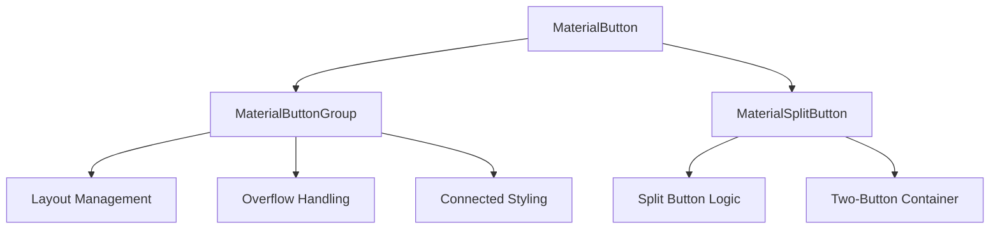

# Button Module Documentation

## Overview

The Button module is a core component of the Material Design Components library for Android, providing enhanced button functionality with Material Design principles. This module extends the standard Android button capabilities with advanced styling, theming, and interaction features that align with Material Design guidelines.

## Purpose

The Button module serves as the foundation for creating interactive buttons in Android applications following Material Design principles. It provides:

- **Material Design Compliance**: Implements Material Design button specifications including elevation, shape, color, and state behaviors
- **Enhanced Functionality**: Supports checkable buttons, icon integration, and advanced styling options
- **Flexible Grouping**: Enables creation of button groups with connected styling and overflow handling
- **Accessibility**: Built-in accessibility features and proper state management
- **Theming Integration**: Seamless integration with Material Design themes and color systems

## Architecture

The Button module is structured around three main components that work together to provide comprehensive button functionality:


```mermaid
graph TD
    A[MaterialButton] --> B[MaterialButtonGroup]
    A --> C[MaterialSplitButton]
    B --> D[Layout Management]
    B --> E[Overflow Handling]
    B --> F[Connected Styling]
    C --> G[Split Button Logic]
    C --> H[Two-Button Container]
```

### Core Components

#### 1. MaterialButton
The primary button implementation that extends AppCompatButton with Material Design features:
- **Shape Management**: Custom shape appearance with corner radius and stroke support
- **Icon Integration**: Flexible icon positioning and styling
- **State Handling**: Checkable state with proper visual feedback
- **Theming**: Integration with Material Design color schemes
- **Accessibility**: Enhanced accessibility features and proper state announcements

#### 2. MaterialButtonGroup
A container for managing multiple MaterialButtons as a cohesive group:
- **Layout Management**: Handles spacing, margins, and connected styling
- **Overflow Handling**: Supports multiple overflow modes (none, menu, wrap)
- **Shape Morphing**: Coordinates corner radius between adjacent buttons
- **Size Animation**: Manages button size changes with spring animations

#### 3. MaterialSplitButton
A specialized two-button container for split button functionality:
- **Dual Button Layout**: Manages exactly two buttons in a split configuration
- **Toggle Behavior**: Handles the trailing button's checkable state
- **Accessibility**: Proper content descriptions for expanded/collapsed states

## Key Features

### Material Design Integration
- **Elevation Management**: Proper elevation handling for different button states
- **Ripple Effects**: Material Design ripple animations
- **Color Theming**: Integration with Material Design color systems
- **Shape System**: Support for Material Design shape appearance

### Advanced Styling
- **Icon Support**: Multiple icon gravity options (start, end, top, text positions)
- **Stroke Customization**: Configurable stroke color and width
- **Corner Radius**: Flexible corner radius configuration
- **Background Tint**: Material Design background tint support

### Group Functionality
- **Connected Styling**: Seamless visual connection between grouped buttons
- **Overflow Modes**: Multiple strategies for handling button overflow
- **Responsive Layout**: Adaptive layout based on available space
- **State Coordination**: Coordinated state management across button groups

## Dependencies

The Button module integrates with several other Material Design modules:

- **[Shape Module](shape.md)**: For shape appearance and corner radius management
- **[Theme Module](theme.md)**: For Material Design theming integration
- **[Motion Module](motion.md)**: For spring animations and transitions
- **[Internal Utilities](internal.md)**: For theme enforcement and view utilities

## Usage Patterns

### Single MaterialButton
```xml
<com.google.android.material.button.MaterialButton
    android:layout_width="wrap_content"
    android:layout_height="wrap_content"
    android:text="Material Button"
    app:icon="@drawable/ic_icon"
    app:iconGravity="start"
    app:cornerRadius="8dp"
    app:strokeColor="@color/stroke_color"
    app:strokeWidth="2dp" />
```

### MaterialButtonGroup
```xml
<com.google.android.material.button.MaterialButtonGroup
    android:layout_width="wrap_content"
    android:layout_height="wrap_content"
    app:spacing="4dp"
    app:innerCornerSize="8dp">
    
    <com.google.android.material.button.MaterialButton
        android:layout_width="wrap_content"
        android:layout_height="wrap_content"
        android:text="Button 1" />
        
    <com.google.android.material.button.MaterialButton
        android:layout_width="wrap_content"
        android:layout_height="wrap_content"
        android:text="Button 2" />
        
</com.google.android.material.button.MaterialButtonGroup>
```

### MaterialSplitButton
```xml
<com.google.android.material.button.MaterialSplitButton
    android:layout_width="wrap_content"
    android:layout_height="wrap_content">
    
    <Button
        android:layout_width="wrap_content"
        android:layout_height="wrap_content"
        android:text="Split Button"
        app:icon="@drawable/ic_edit" />
        
    <Button
        style="?attr/materialSplitButtonIconFilledStyle"
        android:layout_width="wrap_content"
        android:layout_height="wrap_content"
        app:icon="@drawable/m3_split_button_chevron" />
        
</com.google.android.material.button.MaterialSplitButton>
```

## Detailed Sub-modules

For detailed information about specific sub-modules, refer to:

- **[MaterialButton Component](material-button.md)**: Detailed documentation for the core MaterialButton implementation, including state management, icon handling, and shape customization
- **[MaterialButtonGroup Component](material-button-group.md)**: Comprehensive guide to button grouping, overflow handling, and connected styling
- **[MaterialSplitButton Component](material-split-button.md)**: Specific documentation for split button functionality and two-button container implementation

## Best Practices

### Performance Considerations
- Use appropriate overflow modes to handle large button groups
- Leverage shape morphing for visual consistency
- Implement proper state management for checkable buttons

### Accessibility
- Provide meaningful content descriptions
- Use proper accessibility class names
- Ensure proper state announcements

### Theming
- Follow Material Design color guidelines
- Use appropriate elevation levels
- Maintain consistent corner radius across related buttons

## Integration with Other Modules

The Button module works seamlessly with other Material Design components:

- **AppBar Integration**: Buttons can be integrated into app bars and toolbars
- **Card Integration**: Buttons work naturally within Material cards
- **Dialog Integration**: Proper styling within Material dialogs
- **Theme Integration**: Automatic adaptation to Material themes

This comprehensive button system provides developers with powerful tools for creating consistent, accessible, and visually appealing button interfaces that follow Material Design principles while offering extensive customization options.