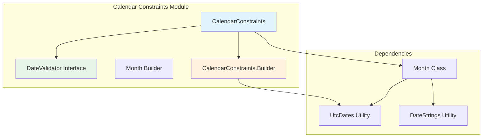
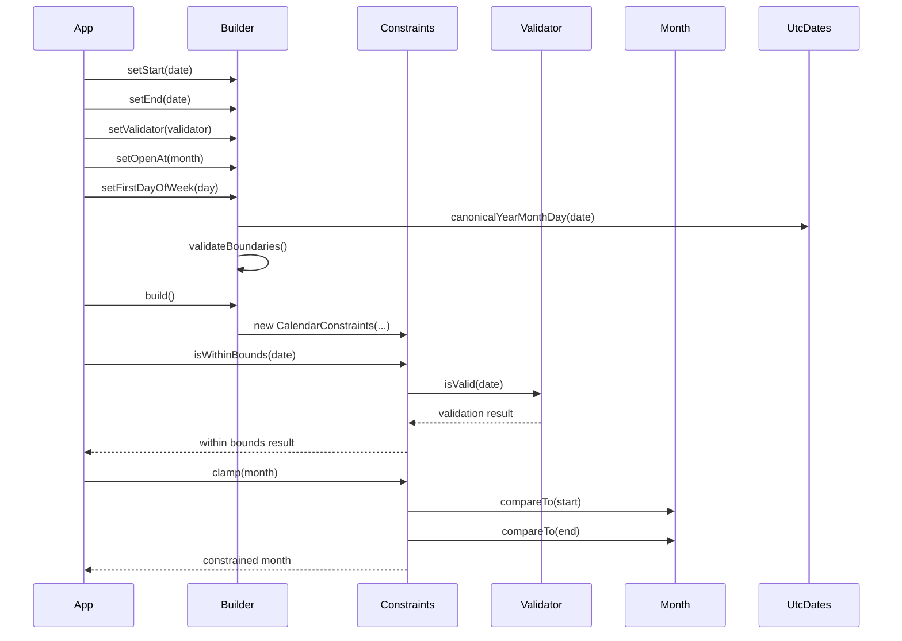
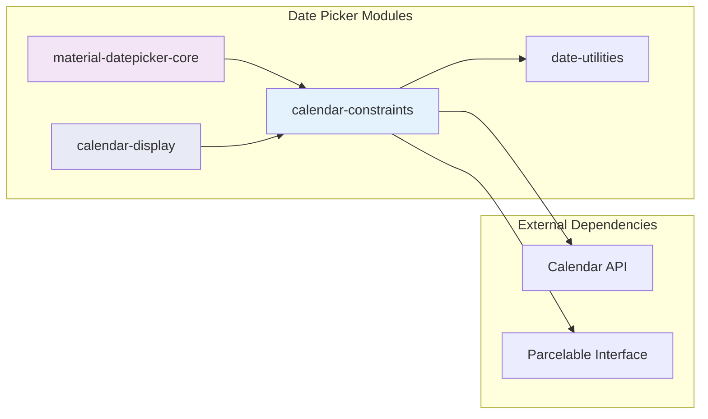

# Calendar Constraints Module

The calendar-constraints module provides the foundational date validation and boundary management system for Material Design date picker components. It defines the temporal boundaries, validation rules, and configuration options that govern how users can interact with calendar interfaces.

## Overview

The calendar-constraints module serves as the core constraint engine for the Material Design date picker system. It enables developers to define valid date ranges, restrict selectable dates, and configure calendar behavior while maintaining consistency across different date picker implementations.

## Core Architecture

### Component Structure



### Key Components

#### CalendarConstraints
The main constraint container that encapsulates all date boundaries and validation rules. It provides:
- Start and end date boundaries
- Date validation through the DateValidator interface
- Opening month configuration
- First day of week customization
- Parcelable support for configuration persistence

#### DateValidator Interface
A pluggable validation system that allows custom date selection rules:
- Validates individual dates for selection eligibility
- Extends Parcelable for state preservation
- Enables complex business logic integration
- Supports composite validation patterns

#### CalendarConstraints.Builder
A fluent builder pattern implementation that provides:
- Intuitive constraint configuration
- Default boundary values (1900-2100)
- UTC time handling
- Validation rule composition
- Error prevention through validation

## Data Flow Architecture



## Integration with Date Picker System



## Configuration Options

### Temporal Boundaries
- **Start Date**: Defines the earliest selectable month (default: January 1900)
- **End Date**: Defines the latest selectable month (default: December 2100)
- **Open At**: Specifies the initial display month (defaults to current month if within bounds)

### Validation System
- **DateValidator**: Custom validation logic for date selection
- **Default Validator**: All dates valid (DateValidatorPointForward.from(Long.MIN_VALUE))
- **Composite Validation**: Support for multiple validation rules

### Localization Support
- **First Day of Week**: Configurable week start day (Sunday, Monday, etc.)
- **UTC Time Handling**: Consistent time zone management across locales
- **Calendar System**: Gregorian calendar support with proper localization

## Usage Patterns

### Basic Constraint Configuration
```java
CalendarConstraints constraints = new CalendarConstraints.Builder()
    .setStart(startMonthMillis)
    .setEnd(endMonthMillis)
    .setOpenAt(openMonthMillis)
    .setFirstDayOfWeek(Calendar.MONDAY)
    .build();
```

### Custom Date Validation
```java
CalendarConstraints constraints = new CalendarConstraints.Builder()
    .setValidator(new DateValidator() {
        @Override
        public boolean isValid(long date) {
            // Custom validation logic
            return isBusinessDay(date) && !isHoliday(date);
        }
        
        @Override
        public int describeContents() {
            return 0;
        }
        
        @Override
        public void writeToParcel(Parcel dest, int flags) {
            // Parcelable implementation
        }
    })
    .build();
```

## State Management

### Parcelable Implementation
The module implements comprehensive Parcelable support for:
- Configuration persistence across device rotations
- State restoration in multi-window scenarios
- Process-safe data transfer
- Memory-efficient serialization

### Validation State
- Immutable constraint objects ensure thread safety
- Deep copy validation prevents external modification
- Bundle-based state preservation for complex validators

## Error Handling

### Boundary Validation
- Prevents invalid date ranges (start after end)
- Validates month consistency across constraints
- Ensures first day of week validity
- Provides clear exception messages for debugging

### Date Validation
- Graceful handling of invalid dates
- Boundary clamping for out-of-range values
- Consistent UTC time normalization
- Locale-aware date processing

## Performance Considerations

### Memory Efficiency
- Lazy initialization of month names
- Cached calendar calculations
- Minimal object creation during validation
- Efficient month span calculations

### Computational Optimization
- Pre-calculated month and year spans
- Cached comparison operations
- Optimized boundary checking
- Efficient date range validation

## Relationship to Other Modules

### [material-datepicker-core](material-datepicker-core.md)
The calendar-constraints module provides the foundational validation system that the Material Date Picker uses to control date selection behavior and display boundaries.

### [date-utilities](date-utilities.md)
Leverages UtcDates for consistent time zone handling and date normalization across all calendar operations.

### [calendar-display](calendar-display.md)
Supplies the constraint boundaries that determine which months and years are available for navigation and display in calendar views.

## Best Practices

### Constraint Design
- Define reasonable date ranges to improve user experience
- Implement efficient DateValidator implementations
- Consider localization requirements for first day of week
- Test boundary conditions thoroughly

### Validation Implementation
- Keep DateValidator implementations lightweight
- Avoid complex calculations in validation methods
- Consider caching validation results for performance
- Ensure proper Parcelable implementation for state preservation

### Integration Guidelines
- Always validate constraints before applying to date pickers
- Handle configuration changes gracefully through Parcelable support
- Consider accessibility implications of date restrictions
- Provide clear user feedback for invalid date selections

## API Reference

### CalendarConstraints
- `getStart()`: Returns the earliest allowed month
- `getEnd()`: Returns the latest allowed month
- `getOpenAt()`: Returns the initial display month
- `getDateValidator()`: Returns the date validation logic
- `isWithinBounds(long date)`: Validates if a date is within constraints
- `clamp(Month month)`: Constrains a month to valid bounds

### CalendarConstraints.Builder
- `setStart(long month)`: Sets the earliest selectable month
- `setEnd(long month)`: Sets the latest selectable month
- `setOpenAt(long month)`: Sets the initial display month
- `setFirstDayOfWeek(int day)`: Configures the first day of week
- `setValidator(DateValidator validator)`: Sets custom validation logic
- `build()`: Creates the CalendarConstraints instance