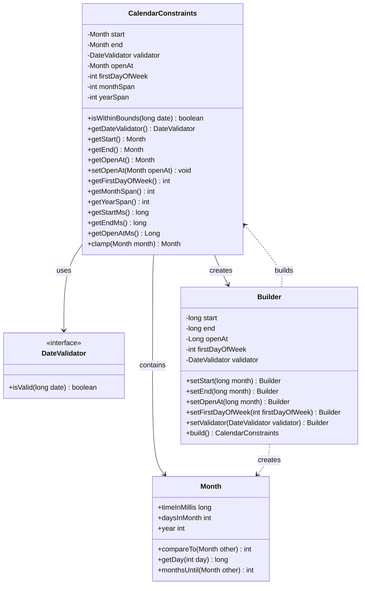
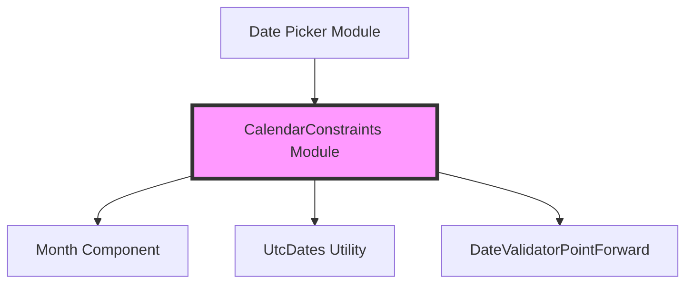
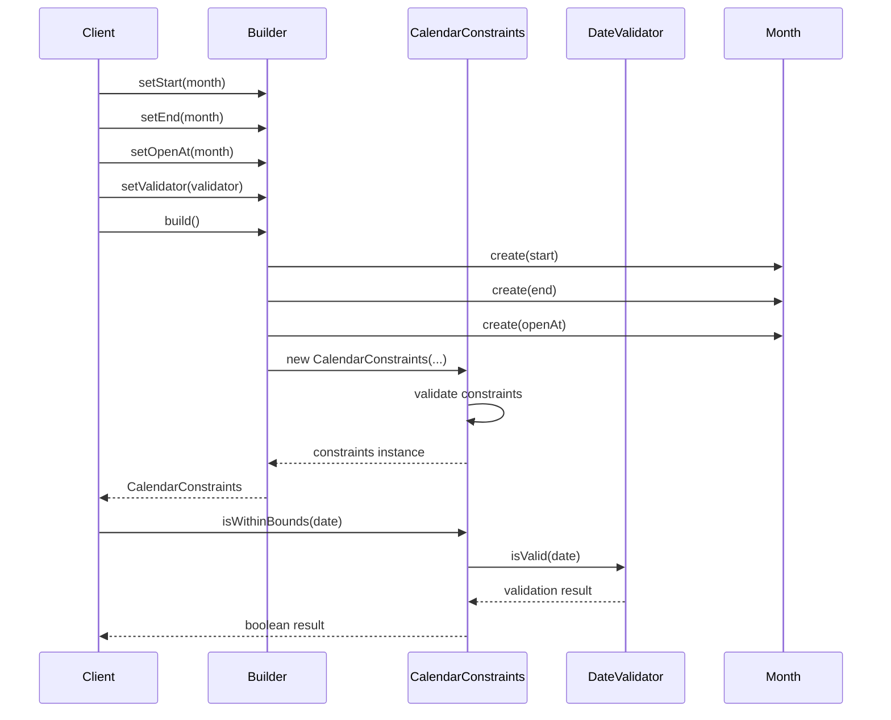
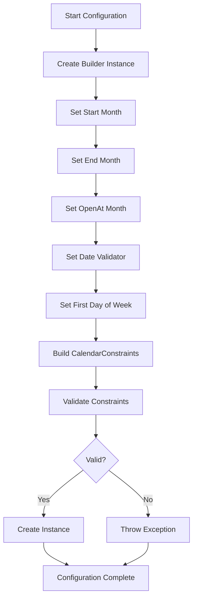
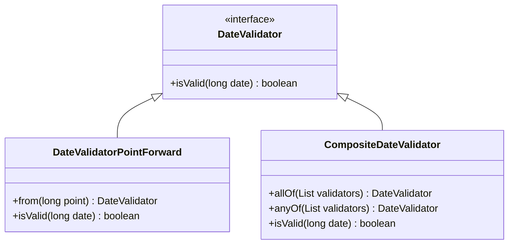

# Calendar Constraints Module

## Introduction

The calendar-constraints module is a core component of the Material Design date picker system that provides date range validation and boundary management for calendar interfaces. It defines the temporal boundaries within which users can select dates, ensuring that date selection remains within specified limits while maintaining consistency across device configuration changes.

## Overview

The `CalendarConstraints` class serves as the central configuration object that encapsulates all temporal limitations for date picker components. It provides a comprehensive system for defining valid date ranges, setting initial display months, and validating date selections through customizable validators. The module implements the Parcelable interface to maintain state across configuration changes and activity lifecycle events.

## Architecture

### Core Components


```mermaid
classDiagram
    class CalendarConstraints {
        -Month start
        -Month end
        -DateValidator validator
        -Month openAt
        -int firstDayOfWeek
        -int monthSpan
        -int yearSpan
        +isWithinBounds(long date) boolean
        +getDateValidator() DateValidator
        +getStart() Month
        +getEnd() Month
        +getOpenAt() Month
        +setOpenAt(Month openAt) void
        +getFirstDayOfWeek() int
        +getMonthSpan() int
        +getYearSpan() int
        +getStartMs() long
        +getEndMs() long
        +getOpenAtMs() Long
        +clamp(Month month) Month
    }

    class DateValidator {
        <<interface>>
        +isValid(long date) boolean
    }

    class Builder {
        -long start
        -long end
        -Long openAt
        -int firstDayOfWeek
        -DateValidator validator
        +setStart(long month) Builder
        +setEnd(long month) Builder
        +setOpenAt(long month) Builder
        +setFirstDayOfWeek(int firstDayOfWeek) Builder
        +setValidator(DateValidator validator) Builder
        +build() CalendarConstraints
    }

    class Month {
        +timeInMillis long
        +compareTo(Month other) int
        +getDay(int day) long
        +daysInMonth int
        +monthsUntil(Month other) int
        +year int
    }

    CalendarConstraints --> DateValidator : uses
    CalendarConstraints --> Month : contains
    CalendarConstraints --> Builder : creates
    Builder ..> CalendarConstraints : builds
    Builder ..> Month : creates
```

### Module Dependencies


```mermaid
graph TD
    CalendarConstraints[CalendarConstraints Module]
    DatePicker[Date Picker Module]
    Month[Month Component]
    UtcDates[UtcDates Utility]
    DateValidatorPointForward[DateValidatorPointForward]
    
    CalendarConstraints --> Month
    CalendarConstraints --> UtcDates
    CalendarConstraints --> DateValidatorPointForward
    DatePicker --> CalendarConstraints
    
    style CalendarConstraints fill:#f9f,stroke:#333,stroke-width:4px
```

## Component Details

### CalendarConstraints Class

The `CalendarConstraints` class is the primary component that encapsulates all date boundary logic. It maintains immutable references to the start and end months, along with an optional open-at month and a date validator. The class provides comprehensive methods for querying date boundaries, validating dates, and managing temporal spans.

Key responsibilities include:
- **Boundary Management**: Defines the earliest and latest selectable dates
- **Validation Integration**: Applies custom date validation rules through the DateValidator interface
- **State Persistence**: Implements Parcelable for configuration change survival
- **Temporal Calculations**: Computes month and year spans between boundaries
- **Date Clamping**: Ensures dates fall within specified constraints

### DateValidator Interface

The `DateValidator` interface provides a pluggable validation system that allows custom logic for determining date validity. This interface extends Parcelable to maintain validation state across configuration changes. Implementations can define complex business rules for date selection, such as excluding weekends, holidays, or specific date ranges.

### Builder Pattern Implementation

The `Builder` class implements a comprehensive builder pattern that provides fluent configuration of calendar constraints. It includes default values for common scenarios (January 1900 to December 2100) and supports method chaining for intuitive configuration. The builder handles UTC time conversion and ensures constraint consistency through validation checks.

## Data Flow


```mermaid
sequenceDiagram
    participant Client
    participant Builder
    participant CalendarConstraints
    participant DateValidator
    participant Month
    
    Client->>Builder: setStart(month)
    Client->>Builder: setEnd(month)
    Client->>Builder: setOpenAt(month)
    Client->>Builder: setValidator(validator)
    Client->>Builder: build()
    
    Builder->>Month: create(start)
    Builder->>Month: create(end)
    Builder->>Month: create(openAt)
    
    Builder->>CalendarConstraints: new CalendarConstraints(...)
    CalendarConstraints->>CalendarConstraints: validate constraints
    
    CalendarConstraints-->>Builder: constraints instance
    Builder-->>Client: CalendarConstraints
    
    Client->>CalendarConstraints: isWithinBounds(date)
    CalendarConstraints->>DateValidator: isValid(date)
    DateValidator-->>CalendarConstraints: validation result
    CalendarConstraints-->>Client: boolean result
```

## Configuration Process


```mermaid
flowchart TD
    Start[Start Configuration] --> CreateBuilder[Create Builder Instance]
    CreateBuilder --> SetStart[Set Start Month]
    SetStart --> SetEnd[Set End Month]
    SetEnd --> SetOpenAt[Set OpenAt Month]
    SetOpenAt --> SetValidator[Set Date Validator]
    SetValidator --> SetFirstDay[Set First Day of Week]
    SetFirstDay --> Build[Build CalendarConstraints]
    
    Build --> Validate[Validate Constraints]
    Validate --> Valid{Valid?}
    Valid -->|Yes| Create[Create Instance]
    Valid -->|No| Error[Throw Exception]
    
    Create --> End[Configuration Complete]
    Error --> End
```

## Integration with Date Picker System

The calendar-constraints module integrates seamlessly with the broader date picker ecosystem:

- **MaterialDatePicker**: Uses CalendarConstraints to define selectable date ranges
- **Month Display**: References constraints for determining which months to display
- **Date Validation**: Applies constraints during date selection events
- **Navigation Control**: Uses bounds to enable/disable month navigation

## Validation System

The validation system provides flexible date filtering capabilities:


```mermaid
classDiagram
    class DateValidator {
        <<interface>>
        +isValid(long date) boolean
    }
    
    class DateValidatorPointForward {
        +from(long point) DateValidator
        +isValid(long date) boolean
    }
    
    class CompositeDateValidator {
        +allOf(List validators) DateValidator
        +anyOf(List validators) DateValidator
        +isValid(long date) boolean
    }
    
    DateValidator <|-- DateValidatorPointForward
    DateValidator <|-- CompositeDateValidator
```

## Error Handling

The module implements comprehensive validation with specific error conditions:

- **Invalid Date Ranges**: Throws IllegalArgumentException when start is after end
- **OpenAt Validation**: Ensures openAt month falls within start-end range
- **First Day Validation**: Validates firstDayOfWeek against Calendar constants
- **Null Safety**: Enforces non-null requirements for critical components

## Performance Considerations

The module is optimized for performance in several ways:

- **Immutable Design**: CalendarConstraints instances are immutable after creation
- **Cached Calculations**: Month and year spans are computed once during construction
- **Efficient Comparisons**: Uses timeInMillis for fast date comparisons
- **Parcelable Optimization**: Minimal parcel size for fast serialization

## Usage Examples

### Basic Date Range Configuration

```java
CalendarConstraints constraints = new CalendarConstraints.Builder()
    .setStart(startMonthTime)
    .setEnd(endMonthTime)
    .setOpenAt(currentMonthTime)
    .build();
```

### Custom Validation Configuration

```java
CalendarConstraints constraints = new CalendarConstraints.Builder()
    .setStart(startMonthTime)
    .setEnd(endMonthTime)
    .setValidator(DateValidatorPointForward.from(minimumDate))
    .build();
```

### First Day of Week Configuration

```java
CalendarConstraints constraints = new CalendarConstraints.Builder()
    .setStart(startMonthTime)
    .setEnd(endMonthTime)
    .setFirstDayOfWeek(Calendar.MONDAY)
    .build();
```

## Related Documentation

- [Date Picker Module](material-date-picker.md) - Main date picker implementation
- [Calendar Adapters](calendar-adapters.md) - Month and year display adapters
- [Date Formatting](date-formatting.md) - Date string formatting utilities

## API Reference

### CalendarConstraints Methods

| Method | Return Type | Description |
|--------|-------------|-------------|
| `isWithinBounds(long date)` | boolean | Checks if a date falls within the constraints |
| `getDateValidator()` | DateValidator | Returns the date validator |
| `getStart()` | Month | Gets the start month |
| `getEnd()` | Month | Gets the end month |
| `getOpenAt()` | Month | Gets the open-at month |
| `getMonthSpan()` | int | Gets the total number of months |
| `getYearSpan()` | int | Gets the total number of years |
| `clamp(Month month)` | Month | Clamps a month to the constraints |

### Builder Methods

| Method | Return Type | Description |
|--------|-------------|-------------|
| `setStart(long month)` | Builder | Sets the start month |
| `setEnd(long month)` | Builder | Sets the end month |
| `setOpenAt(long month)` | Builder | Sets the open-at month |
| `setFirstDayOfWeek(int day)` | Builder | Sets the first day of week |
| `setValidator(DateValidator)` | Builder | Sets the date validator |
| `build()` | CalendarConstraints | Builds the constraints instance |