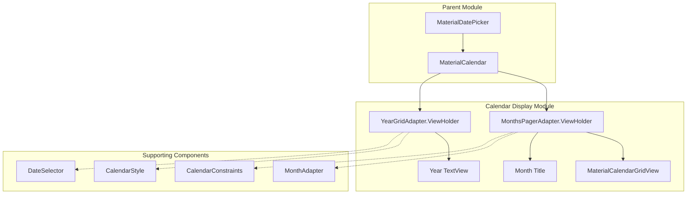
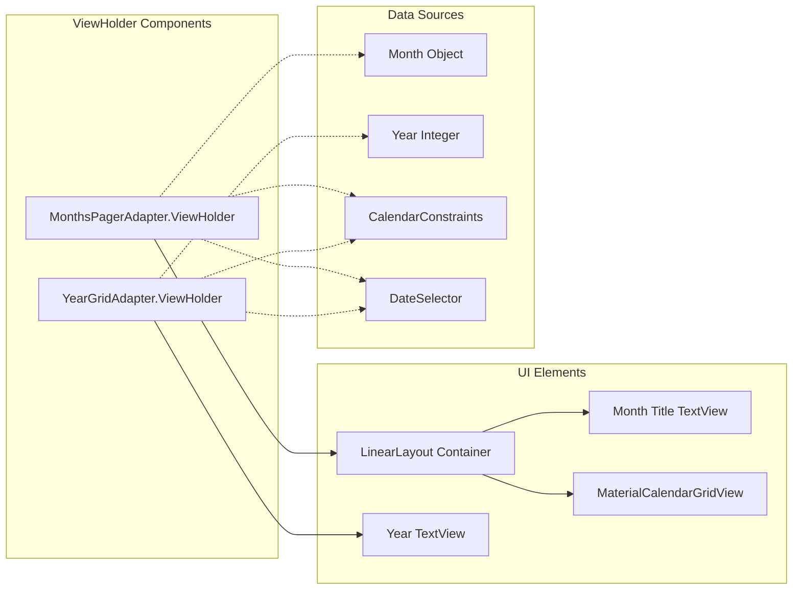
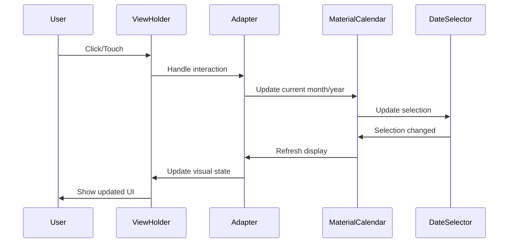
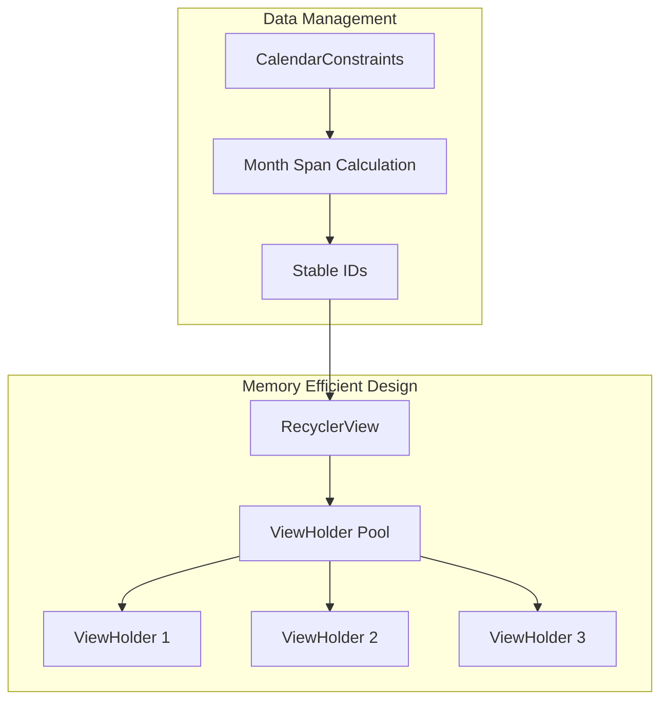

# Calendar Display Module

The calendar-display module provides the visual presentation layer for the Material Design date picker component, managing the display of months and years in a scrollable, efficient manner. This module handles the UI rendering and user interaction for calendar navigation.

## Overview

The calendar-display module is responsible for rendering the visual calendar interface that users interact with when selecting dates. It provides two main display modes: month view (showing a full month grid) and year view (showing a grid of years). The module uses RecyclerView-based adapters to efficiently manage memory while providing smooth scrolling through large date ranges.

## Core Components

### MonthsPagerAdapter.ViewHolder
- **Purpose**: ViewHolder for month grid items in the calendar pager
- **Location**: `lib.java.com.google.android.material.datepicker.MonthsPagerAdapter.ViewHolder`
- **Key Features**:
  - Manages month title display with accessibility heading support
  - Controls visibility of month labels based on fullscreen mode
  - Holds references to month title TextView and month grid MaterialCalendarGridView

### YearGridAdapter.ViewHolder  
- **Purpose**: ViewHolder for year grid items in the year selection view
- **Location**: `lib.java.com.google.android.material.datepicker.YearGridAdapter.ViewHolder`
- **Key Features**:
  - Simple TextView-based ViewHolder for year display
  - Supports year selection and navigation to month view
  - Handles accessibility content descriptions for years

## Architecture



## Component Relationships



## Data Flow



## Display Modes

### Month View Mode
- **Component**: `MonthsPagerAdapter.ViewHolder`
- **Layout**: LinearLayout containing month title and MaterialCalendarGridView
- **Features**:
  - Scrollable month grid with 7 columns (days of week)
  - Month title with accessibility heading
  - Day selection with visual feedback
  - Efficient memory usage through RecyclerView recycling

### Year View Mode  
- **Component**: `YearGridAdapter.ViewHolder`
- **Layout**: Simple TextView for each year
- **Features**:
  - Grid layout of selectable years
  - Visual styling based on selection state
  - Smooth transition to month view on selection
  - Accessibility support with content descriptions

## Memory Management



## Integration with Date Picker System

The calendar-display module integrates with the broader date picker system through:

1. **MaterialCalendar**: Parent component that manages display mode switching
2. **DateSelector**: Handles date selection logic and state
3. **CalendarConstraints**: Defines valid date ranges and navigation bounds
4. **CalendarStyle**: Provides theming and visual styling information

## Accessibility Features

- **Screen Reader Support**: All date elements include proper content descriptions
- **Keyboard Navigation**: Full keyboard support for date selection
- **Focus Management**: Proper focus handling during mode transitions
- **Semantic Headings**: Month titles marked as accessibility headings

## Performance Optimizations

- **View Recycling**: RecyclerView-based implementation minimizes memory usage
- **Stable IDs**: Ensures smooth animations and efficient updates
- **Lazy Loading**: Only visible months/years are rendered
- **Efficient Updates**: Smart invalidation prevents unnecessary redraws

## Dependencies

The calendar-display module depends on:

- [Material Date Picker Core](material-datepicker-core.md) - For date selection logic and dialog management
- [Calendar Constraints](calendar-constraints.md) - For date range validation
- [Date Utilities](date-utilities.md) - For date calculations and UTC handling
- [Date Strings](date-strings.md) - For localized date formatting

## Usage Patterns

### Month Display
```java
// MonthsPagerAdapter creates ViewHolders for month display
MonthsPagerAdapter adapter = new MonthsPagerAdapter(
    context, 
    dateSelector, 
    calendarConstraints, 
    dayViewDecorator, 
    onDayClickListener
);
```

### Year Display
```java
// YearGridAdapter creates ViewHolders for year selection
YearGridAdapter adapter = new YearGridAdapter(materialCalendar);
```

## Extensibility

The ViewHolder pattern allows for:
- Custom month/year layouts through layout inflation
- Extended styling through CalendarStyle system
- Custom day decoration through DayViewDecorator
- Enhanced accessibility through content description customization

## Error Handling

- **Invalid Date Ranges**: CalendarConstraints prevent navigation beyond valid ranges
- **Null Safety**: Proper null checking for optional components like DayViewDecorator
- **State Consistency**: ViewHolder recycling maintains proper visual state
- **Accessibility Fallbacks**: Default content descriptions when custom ones aren't provided