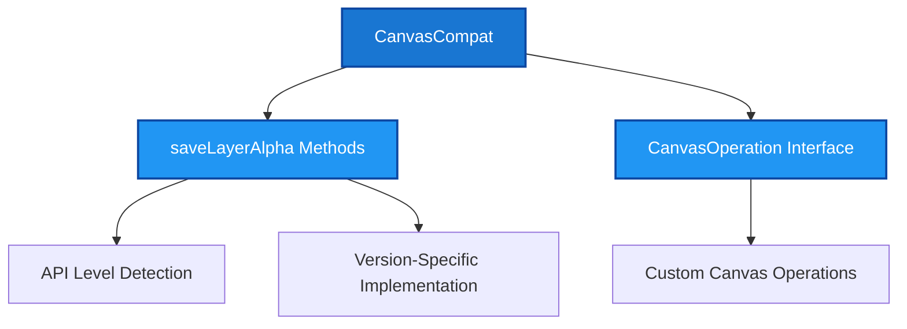
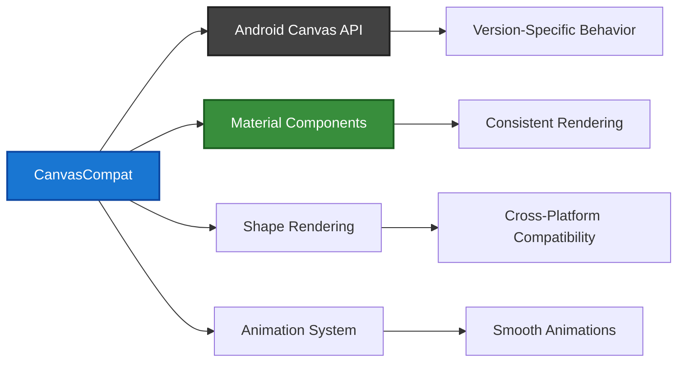
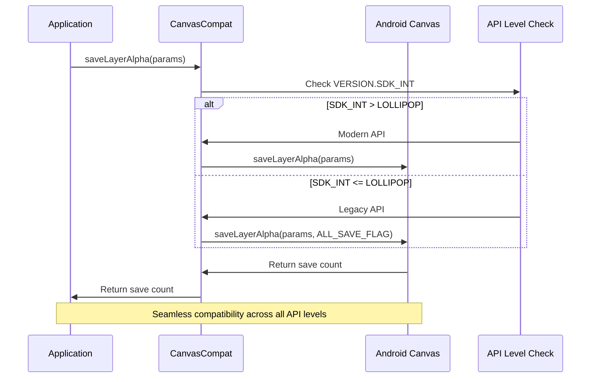
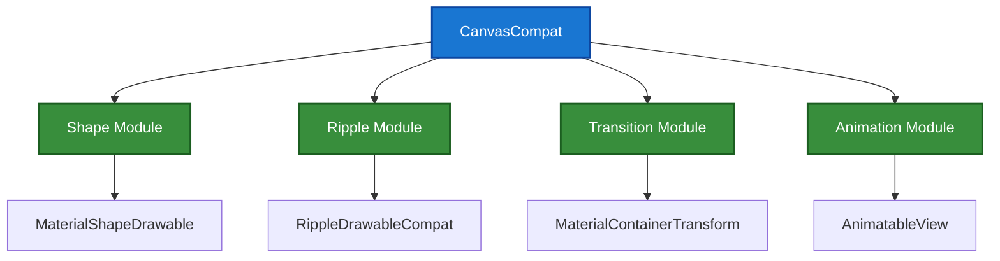

# Canvas Compatibility Module

## Introduction

The canvas-compatibility module provides essential compatibility utilities for Android Canvas operations across different API levels. This module ensures consistent canvas behavior and rendering capabilities across the wide range of Android versions supported by the Material Design Components library.

## Overview

The canvas-compatibility module is a critical part of the Material Design Components ecosystem, providing version-specific implementations of Canvas operations to maintain visual consistency across different Android API levels. It serves as a compatibility layer that abstracts away API differences, allowing developers to use modern canvas features while maintaining backward compatibility.

## Core Components

### CanvasCompat

The primary component of this module is `CanvasCompat`, a utility class that provides compatibility methods for Canvas operations. This class addresses API-level differences in canvas rendering, particularly for operations that behave differently across Android versions.

#### Key Features:
- **Layer Alpha Saving**: Provides consistent `saveLayerAlpha` functionality across API levels
- **Version-Aware Operations**: Automatically handles API differences based on the device's Android version
- **Backward Compatibility**: Ensures older Android versions can utilize modern canvas features

#### Main Methods:

1. **saveLayerAlpha(Canvas, RectF, int)**
   - Saves a layer with specified alpha value
   - Handles API differences between pre-Lollipop and post-Lollipop devices
   - Automatically includes the `ALL_SAVE_FLAG` for older API levels

2. **saveLayerAlpha(Canvas, float, float, float, float, int)**
   - Overloaded version taking individual coordinate values
   - Provides the same compatibility layer as the RectF version
   - Offers flexibility in specifying layer boundaries

3. **CanvasOperation Interface**
   - Helper interface for custom canvas operations
   - Allows delegates to modify canvas before and after operations
   - Enables extensible canvas manipulation patterns

## Architecture

### Component Structure



### System Integration



## Data Flow

### Canvas Operation Flow



## Dependencies

### Internal Dependencies

The canvas-compatibility module has minimal internal dependencies, making it a lightweight and reliable utility:

- **Android SDK**: Direct integration with Android's Canvas API
- **Support Annotations**: Uses `@NonNull`, `@Nullable`, and `@RestrictTo` annotations
- **Build Version Utilities**: Leverages `Build.VERSION` for API level detection

### External Module Dependencies

The canvas-compatibility module is utilized by various other modules within the Material Design Components library:

- **[shape](shape.md)**: Used for shape rendering and path operations
- **[animation-utilities](common-utils.md#animation-utilities)**: Supports animation rendering
- **[transition](transition.md)**: Enables smooth transition animations
- **[ripple](ripple.md)**: Provides ripple effect rendering

## Usage Patterns

### Basic Layer Saving

```java
// Save a layer with alpha transparency
RectF bounds = new RectF(0, 0, width, height);
int saveCount = CanvasCompat.saveLayerAlpha(canvas, bounds, 128);
// Perform drawing operations
canvas.restoreToCount(saveCount);
```

### Coordinate-Based Layer Saving

```java
// Save layer using individual coordinates
int saveCount = CanvasCompat.saveLayerAlpha(
    canvas, 0, 0, width, height, 255);
// Draw with full opacity
canvas.restoreToCount(saveCount);
```

### Custom Canvas Operations

```java
CanvasCompat.CanvasOperation customOp = new CanvasCompat.CanvasOperation() {
    @Override
    public void run(@NonNull Canvas canvas) {
        // Custom drawing logic
        canvas.drawRect(rect, paint);
    }
};
// Execute custom operation
customOp.run(canvas);
```

## Compatibility Matrix

### Supported API Levels

| Method | API 16+ | API 21+ | API 23+ | Notes |
|--------|---------|---------|---------|-------|
| saveLayerAlpha | ✓ | ✓ | ✓ | Automatic flag handling |
| CanvasOperation | ✓ | ✓ | ✓ | Interface-based approach |

### Version-Specific Behavior

- **Pre-Lollipop (API < 21)**: Automatically includes `Canvas.ALL_SAVE_FLAG`
- **Lollipop and above (API ≥ 21)**: Uses modern API without additional flags
- **All Versions**: Consistent return values and behavior

## Performance Considerations

### Optimization Strategies

1. **Minimal Overhead**: Single API level check per operation
2. **Static Methods**: No object instantiation required
3. **Efficient Flag Handling**: Automatic flag inclusion only when necessary
4. **Memory Management**: Proper save/restore pairing prevents memory leaks

### Best Practices

- Always pair `saveLayerAlpha` with `restoreToCount`
- Use the most specific method variant for your use case
- Consider layer complexity when choosing alpha values
- Test on multiple API levels to ensure consistent behavior

## Integration with Material Components

### Common Use Cases

The canvas-compatibility module plays a crucial role in various Material Design Components:

1. **Shape Rendering**: Ensures consistent shape appearance across API levels
2. **Elevation Shadows**: Provides proper shadow rendering compatibility
3. **Ripple Effects**: Maintains ripple animation consistency
4. **Card Surfaces**: Ensures proper card background rendering
5. **FAB Animations**: Supports floating action button transformations

### Cross-Module Collaboration



## Testing and Quality Assurance

### Compatibility Testing

The canvas-compatibility module undergoes rigorous testing across multiple Android versions to ensure:

- Consistent visual output across API levels
- Proper handling of edge cases
- Performance optimization verification
- Memory leak prevention

### Quality Metrics

- **Zero Dependencies**: Minimal external dependencies reduce failure points
- **Thread Safety**: All methods are thread-safe for concurrent usage
- **Memory Efficiency**: No object allocation during operations
- **API Coverage**: Comprehensive coverage of canvas compatibility issues

## Future Considerations

### Potential Enhancements

1. **Extended Canvas Operations**: Additional compatibility methods as needed
2. **Performance Monitoring**: Built-in performance tracking capabilities
3. **Custom Shader Support**: Compatibility layer for shader operations
4. **Hardware Acceleration**: Enhanced support for hardware-accelerated rendering

### Maintenance Strategy

The module follows a conservative maintenance approach:

- **Minimal API Changes**: Stable interface to prevent breaking changes
- **Version-Specific Updates**: Targeted updates for new Android versions
- **Backward Compatibility**: Maintained support for legacy API levels
- **Documentation Updates**: Continuous documentation improvements

## Conclusion

The canvas-compatibility module serves as a foundational component in the Material Design Components library, ensuring consistent canvas operations across the diverse Android ecosystem. By providing a clean abstraction layer over version-specific Canvas API differences, it enables developers to create visually consistent applications without worrying about underlying platform variations. Its lightweight design, comprehensive compatibility coverage, and seamless integration with other Material components make it an essential utility for maintaining the high-quality visual experience expected from Material Design applications.