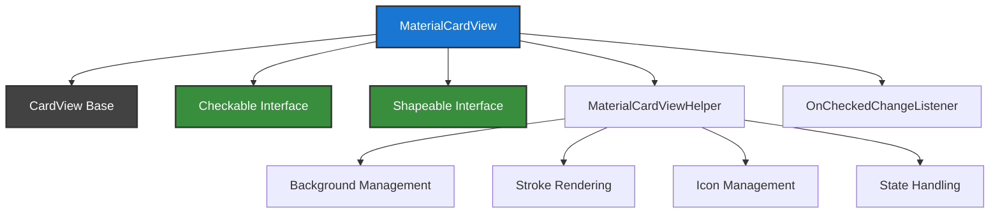
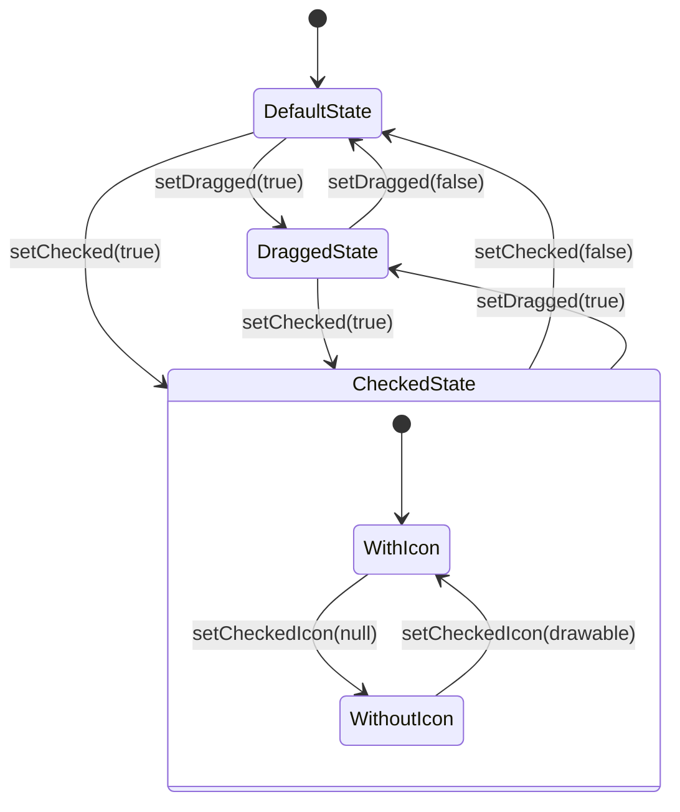
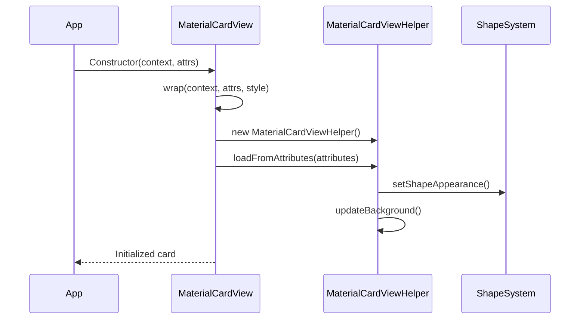
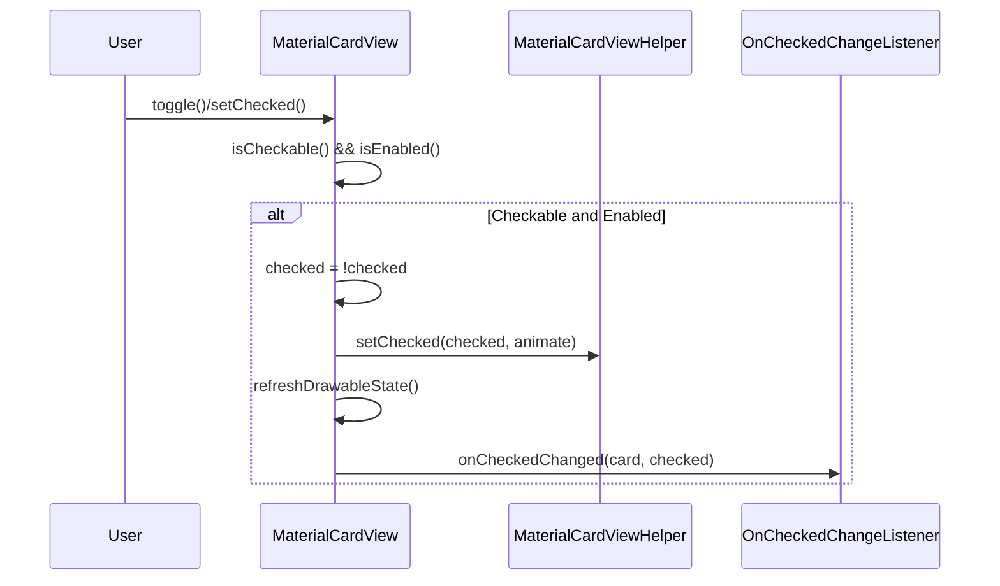

# Card Module Documentation

## Introduction

The Card module provides Material Design card components that serve as containers for content and actions. MaterialCardView extends the standard CardView with Material Design styling, interactive states, and enhanced customization options including checkable behavior, stroke customization, and shape appearance support.

## Core Components

### MaterialCardView
The primary component that provides a Material Design card with enhanced features beyond the standard CardView.

**Key Features:**
- Material Design styling with proper theming
- Checkable behavior with visual feedback
- Stroke customization (width and color)
- Shape appearance support for custom corner treatments
- Drag state support for interactive scenarios
- Ripple effects and elevation handling
- Checked icon support with positioning options

**Core Interface:**
- `OnCheckedChangeListener` - Callback interface for card checked state changes

## Architecture

### Component Structure


### State Management


## Dependencies

### Internal Dependencies
- **Shape Module**: Uses [MaterialShapeDrawable](shape.md) and [ShapeAppearanceModel](shape.md) for custom card shapes and corner treatments
- **Theme Module**: Integrates with Material theming system for consistent styling
- **Internal Utilities**: Uses ThemeEnforcement for proper attribute handling

### External Dependencies
- **AndroidX CardView**: Extends androidx.cardview.widget.CardView as the base implementation
- **AppCompat**: Uses AppCompatResources for resource compatibility
- **Material Theme Overlay**: Applies proper Material theming through MaterialThemeOverlay

## Data Flow

### Card Initialization Flow


### State Change Flow


## Key Features Implementation

### Checkable Behavior
MaterialCardView implements the Checkable interface, allowing cards to have checked/unchecked states. The implementation includes:
- Visual feedback through checked icons
- Color state changes for the checked state
- Accessibility support for screen readers
- Animation support for state transitions

### Stroke Customization
Cards support customizable strokes with:
- Configurable stroke width and color
- ColorStateList support for different states
- Proper rendering integration with the background drawable

### Shape Appearance
Full support for Material shape system:
- Custom corner treatments and edge treatments
- Shape interpolation for animations
- Integration with MaterialShapeDrawable for complex shapes

### Drag State Support
Special state for drag interactions:
- Visual elevation changes to convey motion
- Overlay color modifications
- Integration with drag-and-drop systems

## Usage Patterns

### Basic Card
```xml
<com.google.android.material.card.MaterialCardView
    android:layout_width="match_parent"
    android:layout_height="wrap_content"
    app:cardElevation="4dp"
    app:cardCornerRadius="8dp">
    <!-- Card content -->
</com.google.android.material.card.MaterialCardView>
```

### Checkable Card
```xml
<com.google.android.material.card.MaterialCardView
    android:layout_width="match_parent"
    android:layout_height="wrap_content"
    android:checkable="true"
    app:checkedIcon="@drawable/ic_check"
    app:checkedIconGravity="top_end">
    <!-- Card content -->
</com.google.android.material.card.MaterialCardView>
```

### Stroked Card
```xml
<com.google.android.material.card.MaterialCardView
    android:layout_width="match_parent"
    android:layout_height="wrap_content"
    app:strokeWidth="2dp"
    app:strokeColor="@color/stroke_color">
    <!-- Card content -->
</com.google.android.material.card.MaterialCardView>
```

## Integration with Other Modules

### Shape System Integration
The card module heavily relies on the [shape module](shape.md) for:
- Custom corner radius and treatments
- Shape appearance model management
- Material shape drawable implementation

### Theme System Integration
Cards integrate with the Material theme system for:
- Consistent color schemes
- Elevation and shadow handling
- Typography and spacing

### Accessibility Integration
Full accessibility support including:
- Screen reader compatibility
- Touch target sizing
- State announcement for checkable cards
- Proper focus handling

## Performance Considerations

### Background Management
- Efficient background drawable handling
- Proper state caching to avoid unnecessary redraws
- Optimized elevation and shadow calculations

### State Updates
- Minimal invalidation during state changes
- Efficient drawable state management
- Proper animation handling for smooth transitions

## Best Practices

### Design Guidelines
- Use cards to group related content and actions
- Maintain consistent elevation and spacing
- Ensure proper touch target sizes (48dp minimum)
- Use appropriate corner radius for your design system

### Implementation Guidelines
- Set appropriate content padding for readability
- Use stroke colors that provide sufficient contrast
- Implement proper checked state handling for checkable cards
- Consider drag state for interactive card scenarios

### Accessibility Guidelines
- Provide meaningful content descriptions
- Ensure proper contrast ratios for text and icons
- Test with screen readers for state announcements
- Maintain keyboard navigation support

## API Reference

### Key Methods
- `setChecked(boolean)` - Set the checked state
- `setCheckable(boolean)` - Enable/disable checkable behavior
- `setDragged(boolean)` - Set the drag state
- `setStrokeWidth(int)` - Set stroke width
- `setStrokeColor(ColorStateList)` - Set stroke color
- `setShapeAppearanceModel(ShapeAppearanceModel)` - Set custom shape

### Key Attributes
- `android:checkable` - Enable checkable behavior
- `app:checkedIcon` - Icon for checked state
- `app:strokeWidth` - Stroke width
- `app:strokeColor` - Stroke color
- `app:cardForegroundColor` - Foreground/ripple color

## Related Documentation
- [Shape Module](shape.md) - For custom card shapes and corner treatments
- [Theme System](color.md) - For Material theming and color integration
- [Material Design Guidelines](https://material.io/components/cards) - Official design specifications