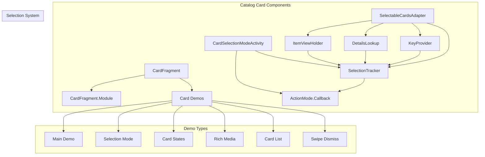
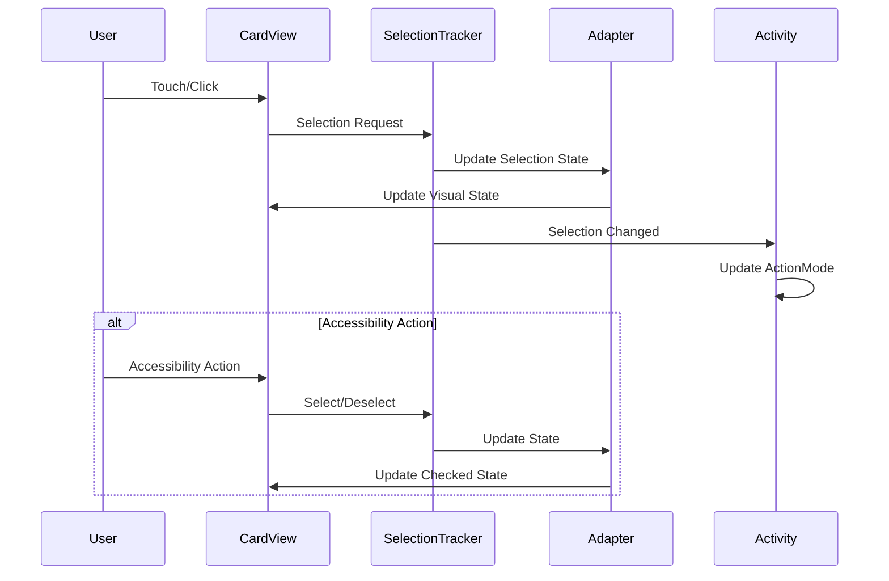
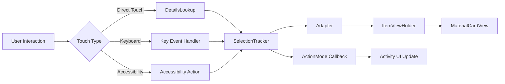
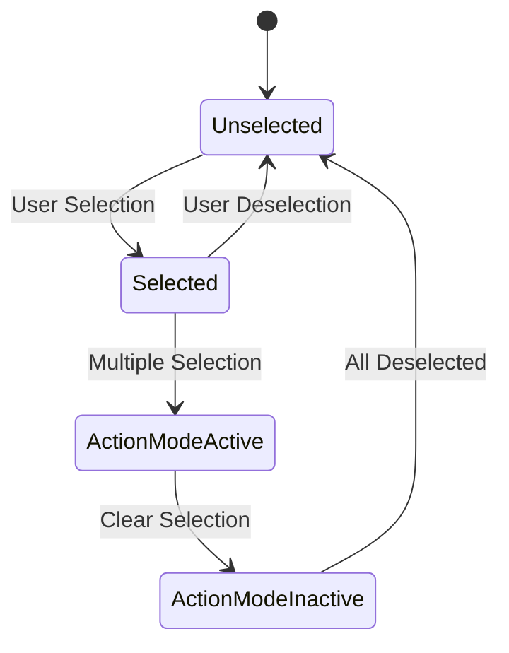
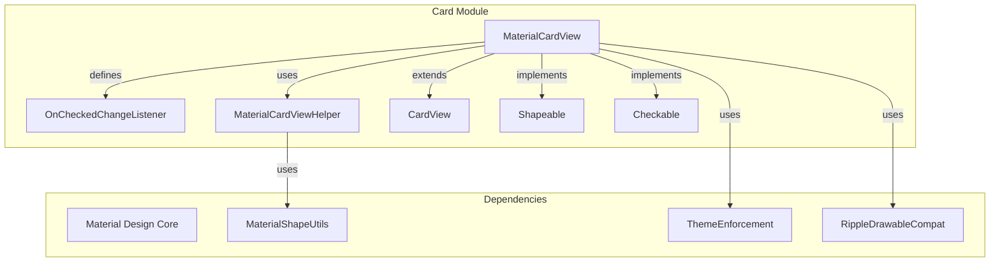
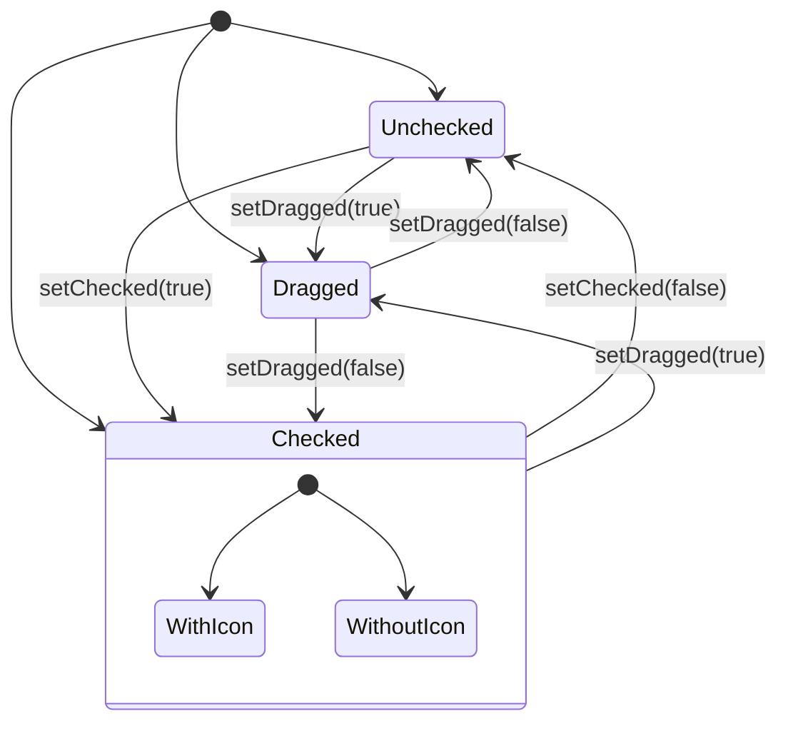
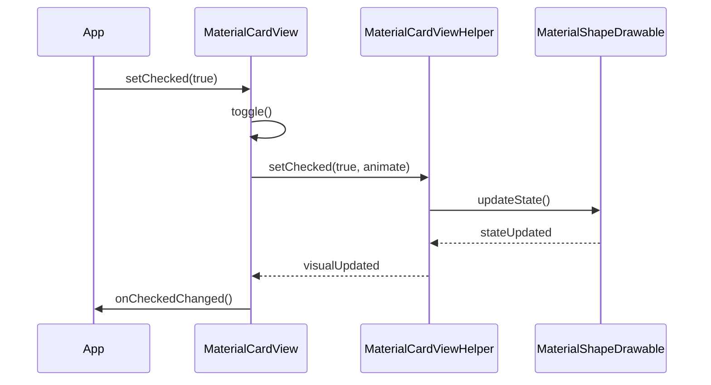
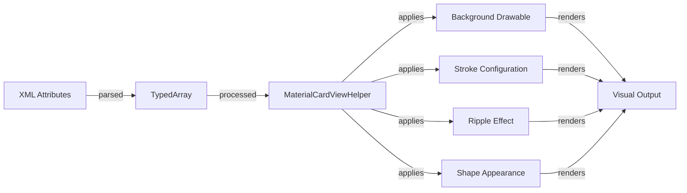
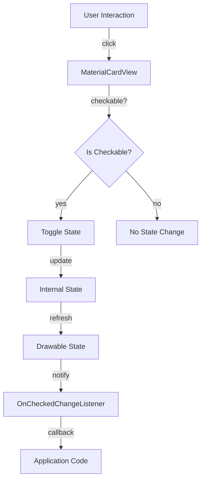

# Card Module Documentation

## Introduction

The Card module provides Material Design card components for Android applications, offering a comprehensive set of UI elements for displaying content in a visually appealing and consistent manner. Cards serve as containers for related information and actions, following Material Design principles to create intuitive and accessible user interfaces.

## Module Overview

The Card module is part of the Material Design Components library and provides both the core MaterialCardView implementation and extensive demonstration capabilities through the Catalog application. The module showcases various card usage patterns including selection modes, states, rich media content, lists, and swipe-to-dismiss functionality.

## Core Functionality

### MaterialCardView

The primary component `MaterialCardView` extends `CardView` to provide Material Design styling and enhanced functionality. Key features include:

- **Material Design Styling**: Automatic application of Material Design themes and styles
- **Checkable Interface**: Support for selectable cards with visual feedback
- **Customizable Appearance**: Configurable stroke, background, foreground, and ripple colors
- **Shape Customization**: Integration with Material Design shape system
- **Drag State Support**: Visual feedback for draggable cards
- **Accessibility**: Full accessibility support with proper state announcements

### Key Features

1. **Stroke Support**: Configurable border width and color
2. **Checked State**: Visual indication when cards are selected
3. **Drag State**: Visual feedback for draggable cards
4. **Ripple Effects**: Material Design ripple animations
5. **Shape Customization**: Custom corner radius and shape appearance
6. **Content Padding**: Flexible content padding management
7. **Elevation**: Material Design elevation shadows

## Catalog Application Architecture

The Card module includes comprehensive demonstration components that showcase various card usage patterns and interactions.

### Component Structure


```mermaid
graph TB
    subgraph "Catalog Card Components"
        CF[CardFragment] --> CFM[CardFragment.Module]
        CSA[CardSelectionModeActivity] --> AM[ActionMode.Callback]
        SCA[SelectableCardsAdapter] --> IVH[ItemViewHolder]
        SCA --> DL[DetailsLookup]
        SCA --> KP[KeyProvider]
        SCA --> SI[SelectionTracker]
        CF --> CD[Card Demos]
    end
    
    subgraph "Demo Types"
        CD --> Main[Main Demo]
        CD --> Selection[Selection Mode]
        CD --> States[Card States]
        CD --> RichMedia[Rich Media]
        CD --> List[Card List]
        CD --> Swipe[Swipe Dismiss]
    end
    
    subgraph "Selection System"
        CSA --> SI
        IVH --> SI
        DL --> SI
        KP --> SI
        SI --> AM
    end
```

### Key Catalog Components

#### 1. CardFragment.Module
- **Purpose**: Dagger dependency injection module for card catalog functionality
- **Responsibilities**:
  - Fragment lifecycle management
  - Feature demo registration in the Catalog app
  - Dependency provision for card demonstrations

#### 2. CardSelectionModeActivity
- **Purpose**: Demonstrates multi-selection functionality with cards
- **Key Features**:
  - ActionMode integration for contextual actions
  - SelectionTracker for managing selection state
  - Accessibility support for selection operations
  - Real-time selection count updates

#### 3. SelectableCardsAdapter
- **Purpose**: RecyclerView adapter for displaying selectable card items
- **Components**:
  - **ItemViewHolder**: Manages individual card views and their selection state
  - **DetailsLookup**: Provides selection details for touch interactions
  - **KeyProvider**: Maps positions to selection keys
  - **Item**: Simple data model containing title and subtitle

## Data Flow Architecture

### Selection System Flow


```mermaid
sequenceDiagram
    participant User
    participant CardView
    participant SelectionTracker
    participant Adapter
    participant Activity
    
    User->>CardView: Touch/Click
    CardView->>SelectionTracker: Selection Request
    SelectionTracker->>Adapter: Update Selection State
    Adapter->>CardView: Update Visual State
    SelectionTracker->>Activity: Selection Changed
    Activity->>Activity: Update ActionMode
    
    alt Accessibility Action
        User->>CardView: Accessibility Action
        CardView->>SelectionTracker: Select/Deselect
        SelectionTracker->>Adapter: Update State
        Adapter->>CardView: Update Checked State
    end
```

### Component Interactions


```mermaid
graph LR
    A[User Interaction] --> B{Touch Type}
    B -->|Direct Touch| C[DetailsLookup]
    B -->|Keyboard| D[Key Event Handler]
    B -->|Accessibility| E[Accessibility Action]
    
    C --> F[SelectionTracker]
    D --> F
    E --> F
    
    F --> G[Adapter]
    G --> H[ItemViewHolder]
    H --> I[MaterialCardView]
    
    F --> J[ActionMode Callback]
    J --> K[Activity UI Update]
```

### State Management


```mermaid
stateDiagram-v2
    [*] --> Unselected
    Unselected --> Selected: User Selection
    Selected --> Unselected: User Deselection
    Selected --> ActionModeActive: Multiple Selection
    ActionModeActive --> ActionModeInactive: Clear Selection
    ActionModeInactive --> Unselected: All Deselected
```

## Catalog Demonstration Features

### 1. Main Demo Fragment
- Basic card implementation showcasing core functionality
- Material Design compliance demonstration
- Interactive card behaviors and state management

### 2. Selection Mode Demo
- Multi-selection implementation using SelectionTracker
- ActionMode integration for contextual actions
- Accessibility-first design with keyboard navigation
- Visual feedback for selection states
- Real-time selection count updates in action bar

### 3. Card States Demo
- Various card states (enabled, disabled, checked, dragged)
- State-dependent visual styling
- Interactive state transitions
- Accessibility state announcements

### 4. Rich Media Demo
- Cards with complex content layouts
- Image integration and media handling
- Responsive content adaptation
- Overlay content and gradient effects

### 5. Card List Demo
- RecyclerView integration patterns
- Efficient card recycling and view pooling
- Performance optimization techniques
- Smooth scrolling with card animations

### 6. Swipe Dismiss Demo
- Swipe-to-dismiss gesture implementation
- Animation and transition effects
- Undo functionality patterns
- Haptic feedback integration

## Accessibility Features

### Keyboard Navigation
- Full keyboard support for selection operations
- Enter and DPAD center key handling for card selection
- Focus management and visual indicators
- Tab navigation through selectable cards

### Screen Reader Support
- Descriptive content labels for card content
- Selection state announcements
- Action descriptions for accessibility services
- Proper content descriptions for checked states

### Visual Accessibility
- High contrast mode support
- Large text scaling compatibility
- Color contrast compliance with WCAG guidelines
- Focus indicators for keyboard navigation

### Selection Accessibility
- Accessibility actions for select/deselect operations
- Custom accessibility announcements for selection changes
- Support for switch access and other assistive technologies
- Proper role and state information for screen readers

## Architecture

### Component Structure


```mermaid
graph TB
    subgraph "Card Module"
        MCV[MaterialCardView]
        MCVOCL[OnCheckedChangeListener]
        MCVH[MaterialCardViewHelper]
        CV[CardView]
        SHAPE[Shapeable]
        CHECK[Checkable]
    end
    
    subgraph "Dependencies"
        MD[Material Design Core]
        SHAPEUTILS[MaterialShapeUtils]
        THEME[ThemeEnforcement]
        RIPPLE[RippleDrawableCompat]
    end
    
    MCV -->|extends| CV
    MCV -->|implements| SHAPE
    MCV -->|implements| CHECK
    MCV -->|uses| MCVH
    MCV -->|defines| MCVOCL
    
    MCVH -->|uses| SHAPEUTILS
    MCV -->|uses| THEME
    MCV -->|uses| RIPPLE
```

### State Management


```mermaid
stateDiagram-v2
    [*] --> Unchecked
    [*] --> Checked
    [*] --> Dragged
    
    Unchecked --> Checked: setChecked(true)
    Checked --> Unchecked: setChecked(false)
    Unchecked --> Dragged: setDragged(true)
    Checked --> Dragged: setDragged(true)
    Dragged --> Unchecked: setDragged(false)
    Dragged --> Checked: setDragged(false)
    
    state Checked {
        [*] --> WithIcon
        [*] --> WithoutIcon
    }
```

## Component Interactions

### MaterialCardView and Helper Classes


```mermaid
sequenceDiagram
    participant App
    participant MCV as MaterialCardView
    participant MCVH as MaterialCardViewHelper
    participant Drawable as MaterialShapeDrawable
    
    App->>MCV: setChecked(true)
    MCV->>MCV: toggle()
    MCV->>MCVH: setChecked(true, animate)
    MCVH->>Drawable: updateState()
    Drawable-->>MCVH: stateUpdated
    MCVH-->>MCV: visualUpdated
    MCV->>App: onCheckedChanged()
```

## Data Flow

### Attribute Processing


```mermaid
flowchart LR
    XML[XML Attributes] -->|parsed| TA[TypedArray]
    TA -->|processed| MCVH[MaterialCardViewHelper]
    MCVH -->|applies| BG[Background Drawable]
    MCVH -->|applies| Stroke[Stroke Configuration]
    MCVH -->|applies| Ripple[Ripple Effect]
    MCVH -->|applies| Shape[Shape Appearance]
    
    BG -->|renders| Visual[Visual Output]
    Stroke -->|renders| Visual
    Ripple -->|renders| Visual
    Shape -->|renders| Visual
```

### State Change Flow


```mermaid
flowchart TD
    User[User Interaction] -->|click| MCV[MaterialCardView]
    MCV -->|checkable?| Decision{Is Checkable?}
    Decision -->|yes| Toggle[Toggle State]
    Decision -->|no| End[No State Change]
    
    Toggle -->|update| State[Internal State]
    State -->|refresh| Drawable[Drawable State]
    Drawable -->|notify| Listener[OnCheckedChangeListener]
    Listener -->|callback| App[Application Code]
```

## Key Dependencies

### Internal Dependencies

- **[MaterialShapeUtils](../shape.md)**: Provides shape appearance and customization
- **[ThemeEnforcement](../internal.md)**: Ensures proper Material Design theming
- **[MaterialThemeOverlay](../theme.md)**: Applies Material Design theme overlays

### External Dependencies

- **AndroidX CardView**: Base card functionality
- **AppCompatResources**: Resource loading and compatibility
- **Accessibility Services**: Screen reader and accessibility support

## Configuration Options

### XML Attributes

| Attribute | Type | Description |
|-----------|------|-------------|
| `strokeWidth` | dimension | Border width of the card |
| `strokeColor` | color | Border color of the card |
| `cardForegroundColor` | color | Foreground/ripple color |
| `checkedIcon` | drawable | Icon shown when checked |
| `checkedIconTint` | color | Tint for checked icon |
| `checkedIconGravity` | enum | Position of checked icon |
| `android:checkable` | boolean | Whether card is checkable |

### Programmatic Configuration

```java
// Basic setup
MaterialCardView card = findViewById(R.id.card);
card.setStrokeColor(ColorStateList.valueOf(Color.BLUE));
card.setStrokeWidth(2);
card.setCheckable(true);

// Checked state handling
card.setOnCheckedChangeListener((cardView, isChecked) -> {
    // Handle state change
});

// Shape customization
card.setShapeAppearanceModel(
    ShapeAppearanceModel.builder()
        .setAllCorners(CornerFamily.ROUNDED, 16)
        .build()
);
```

## Usage Patterns

### Basic Card

```xml
<com.google.android.material.card.MaterialCardView
    android:layout_width="match_parent"
    android:layout_height="wrap_content"
    android:layout_margin="8dp"
    app:cardElevation="4dp"
    app:cardCornerRadius="8dp">
    
    <!-- Card content -->
    
</com.google.android.material.card.MaterialCardView>
```

### Selectable Card

```xml
<com.google.android.material.card.MaterialCardView
    android:layout_width="match_parent"
    android:layout_height="wrap_content"
    android:checkable="true"
    app:checkedIcon="@drawable/ic_check"
    app:checkedIconGravity="top_end"
    app:strokeColor="@color/stroke_color"
    app:strokeWidth="2dp">
    
    <!-- Card content -->
    
</com.google.android.material.card.MaterialCardView>
```

### Stroked Card

```xml
<com.google.android.material.card.MaterialCardView
    android:layout_width="match_parent"
    android:layout_height="wrap_content"
    app:strokeColor="@color/stroke_color"
    app:strokeWidth="1dp"
    app:cardElevation="0dp">
    
    <!-- Card content -->
    
</com.google.android.material.card.MaterialCardView>
```

## Integration with Other Modules

### Shape Module Integration

Cards integrate with the [shape module](../shape.md) to provide customizable corner treatments and shape appearances:

- **ShapeAppearanceModel**: Defines the card's shape
- **MaterialShapeDrawable**: Renders the shaped background
- **Corner treatments**: Custom corner radius and treatments

### Theme Module Integration

Cards work with the [theme module](../theme.md) for consistent theming:

- **MaterialThemeOverlay**: Applies theme attributes
- **ColorStateList**: Manages color states
- **Elevation overlays**: Handles elevation-based color changes

### Ripple Module Integration

Cards use the [ripple module](../ripple.md) for touch feedback:

- **RippleDrawableCompat**: Provides ripple effects
- **Foreground drawable**: Handles touch interactions
- **State-based ripples**: Different ripples for different states

## Best Practices

### Performance

1. **Reuse card instances** in RecyclerViews when possible
2. **Set fixed dimensions** for cards in lists to avoid remeasurement
3. **Use appropriate elevation** levels for consistent UI hierarchy
4. **Optimize drawable resources** for checked icons and backgrounds

### Accessibility

1. **Provide content descriptions** for card content
2. **Use appropriate click handling** for interactive cards
3. **Ensure proper focus order** in card layouts
4. **Test with screen readers** for state announcements

### Design Consistency

1. **Follow Material Design elevation guidelines**
2. **Use consistent corner radius** across the app
3. **Maintain proper spacing** between cards
4. **Apply appropriate stroke colors** for different states

## Common Use Cases

1. **Content Cards**: Displaying articles, media, or information
2. **Action Cards**: Interactive cards with buttons or clickable areas
3. **Selection Cards**: Multi-select interfaces with checkable cards
4. **Draggable Cards**: Reorderable lists or grid layouts
5. **Media Cards**: Image or video content with overlay information

## Troubleshooting

### Common Issues

1. **Background not showing**: Ensure `setBackgroundOverwritten` is not set to true
2. **Stroke not visible**: Check that stroke color is set along with stroke width
3. **Checked icon not appearing**: Verify the card is checkable and icon is set
4. **Ripple effect not working**: Ensure the card is clickable and foreground color is set

### Debug Tips

1. **Check state arrays**: Verify drawable state arrays are properly merged
2. **Validate attributes**: Ensure all required attributes are set in XML
3. **Test accessibility**: Use accessibility services to verify state announcements
4. **Monitor performance**: Profile card rendering in lists and grids