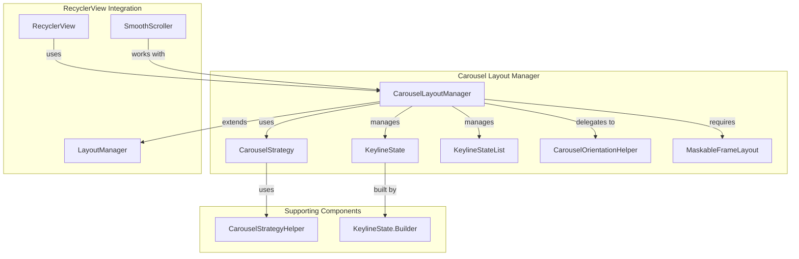
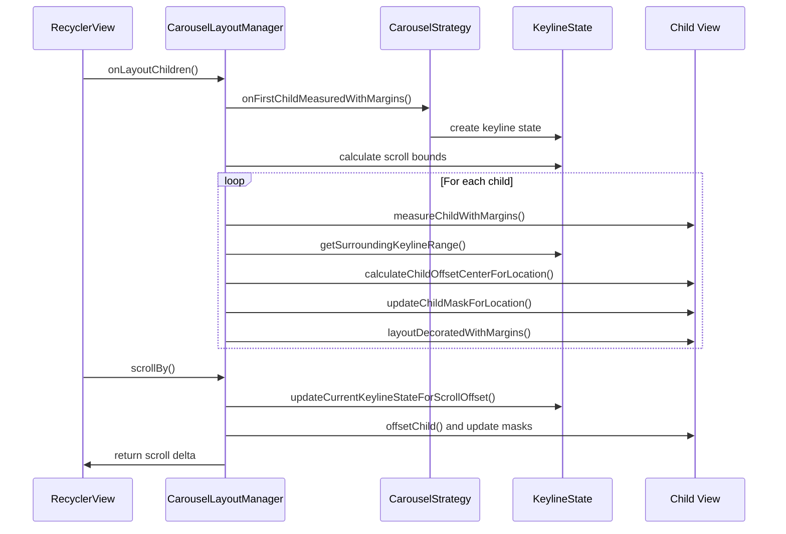
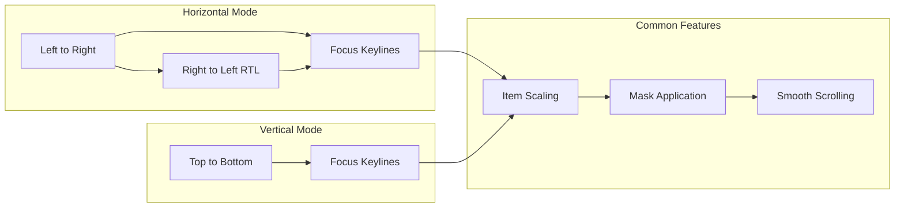

# Carousel Layout Manager Module

## Introduction

The Carousel Layout Manager module provides a sophisticated RecyclerView LayoutManager implementation that creates stylized carousel experiences with dynamic item masking, scaling, and positioning. This module enables the creation of visually appealing horizontal and vertical scrolling lists where items transform as they move through focal points, creating engaging user interfaces for content browsing and selection.

## Core Functionality

The CarouselLayoutManager extends RecyclerView.LayoutManager to provide:

- **Dynamic Item Transformation**: Items automatically scale and mask as they scroll through defined keyline positions
- **Flexible Orientation Support**: Works in both horizontal and vertical orientations with proper RTL support
- **Strategic Layout Control**: Uses pluggable CarouselStrategy implementations to control item sizing and positioning behavior
- **Smooth Scrolling**: Integrates with RecyclerView's smooth scrolling mechanisms for fluid navigation
- **Accessibility Support**: Provides proper accessibility events and focus navigation
- **Debug Visualization**: Built-in debugging tools to visualize keylines and layout behavior

## Architecture

### Component Overview



### Key Components

#### CarouselLayoutManager
The main layout manager that orchestrates the carousel behavior. It:
- Manages child view layout and recycling
- Calculates scroll offsets and boundaries
- Applies item transformations based on keyline positions
- Handles orientation changes and RTL layouts
- Provides smooth scrolling and focus navigation

#### KeylineState and KeylineStateList
These components define the transformation rules:
- **KeylineState**: Represents a single configuration of keylines (transformation points)
- **KeylineStateList**: Manages multiple keyline states for different scroll positions
- **Keylines**: Define specific positions where items should have certain sizes and masks

#### CarouselStrategy
Abstract strategy pattern for controlling carousel behavior:
- Determines item sizing and keyline placement
- Supports different carousel types (contained, unconstrained)
- Pluggable design allows custom carousel behaviors

#### CarouselOrientationHelper
Handles orientation-specific calculations:
- Abstracts horizontal vs vertical layout differences
- Manages parent bounds calculations
- Handles mask rectangle transformations

## Data Flow



## Layout Process

### Initial Layout
1. **Keyline State Creation**: Measures first child and creates initial keyline state
2. **Scroll Bounds Calculation**: Determines minimum and maximum scroll positions
3. **Child Layout**: Positions children based on keyline transformations
4. **Mask Application**: Applies size and visibility masks to each child

### Scroll Handling
1. **Scroll Request**: Receives scroll delta from RecyclerView
2. **Bounds Checking**: Clamps scroll within min/max bounds
3. **Keyline Update**: Updates current keyline state based on new scroll position
4. **Child Transformation**: Re-positions and re-masks all visible children
5. **View Recycling**: Removes out-of-bounds views and adds new ones

### Item Transformation
Items are transformed based on their position relative to keylines:
- **Size Scaling**: Items scale based on keyline mask values
- **Position Offset**: Items are repositioned to create focal points
- **Mask Application**: Portions of items may be masked to create visual effects

## Key Features

### Orientation Support


### Alignment Options
- **ALIGNMENT_START**: Aligns large items to the start of the carousel
- **ALIGNMENT_CENTER**: Centers large items in the carousel

### Strategy Types
- **CONTAINED**: Items are constrained within carousel bounds
- **UNCONSTRAINED**: Items can extend beyond carousel edges

## Integration with Other Modules

### Dependencies
- **[carousel-strategy-helper](carousel-strategy-helper.md)**: Provides utility functions for carousel strategy implementations
- **[keyline-state-builder](keyline-state-builder.md)**: Builds keyline state configurations
- **[maskable-frame-layout](maskable-frame-layout.md)**: Required base class for all carousel items

### Related Components
- **[carousel](carousel.md)**: Parent module containing all carousel-related components
- **[animation](animation.md)**: Provides animation utilities used for smooth transitions
- **[math-utils](math-utils.md)**: Mathematical utilities for interpolation calculations

## Usage Patterns

### Basic Setup
```java
// Create layout manager with default strategy
CarouselLayoutManager layoutManager = new CarouselLayoutManager();

// Set custom strategy
layoutManager.setCarouselStrategy(new MultiBrowseCarouselStrategy());

// Configure orientation
layoutManager.setOrientation(RecyclerView.HORIZONTAL);

// Set alignment
layoutManager.setCarouselAlignment(CarouselLayoutManager.ALIGNMENT_CENTER);
```

### Advanced Configuration
```java
// Enable debugging
layoutManager.setDebuggingEnabled(recyclerView, true);

// Handle item size changes
layoutManager.notifyItemSizeChanged();

// Custom scroll behavior
recyclerView.smoothScrollToPosition(targetPosition);
```

## Performance Considerations

### Optimization Strategies
- **View Recycling**: Efficiently recycles views that move out of bounds
- **Lazy Keyline Calculation**: Only recalculates keylines when necessary
- **Incremental Layout**: Only lays out visible and near-visible items
- **Scroll State Caching**: Caches scroll state to avoid redundant calculations

### Memory Management
- **Bounded Child Count**: Limits number of simultaneously laid out children
- **State Cleanup**: Properly cleans up state when detached from RecyclerView
- **Resource Recycling**: Recycles decoration resources and paint objects

## Accessibility

### Focus Navigation
- Supports directional focus navigation (DPAD, keyboard)
- Handles focus search failures by adding appropriate views
- Maintains logical focus order matching visual layout

### Screen Reader Support
- Provides proper accessibility events with from/to indices
- Maintains semantic relationships between items
- Supports scroll position announcements

## Debugging and Development

### Debug Features
- **Keyline Visualization**: Draws colored lines showing keyline positions
- **Child Order Validation**: Throws exceptions on invalid child ordering
- **State Logging**: Logs internal state for troubleshooting

### Common Issues
- **Invalid Child Order**: Usually indicates incorrect scroll offset calculations
- **Mask Bleeding**: Can be resolved by using CONTAINED strategy type
- **RTL Layout Issues**: Check layout direction handling in custom strategies

## Best Practices

### Implementation Guidelines
1. **Always use MaskableFrameLayout**: All carousel items must extend this class
2. **Handle Configuration Changes**: Refresh keyline state on size changes
3. **Test RTL Layouts**: Ensure proper behavior in right-to-left locales
4. **Optimize Strategy**: Choose appropriate strategy for your use case
5. **Handle Item Changes**: Call appropriate notification methods when data changes

### Performance Tips
1. **Minimize Keyline Recalculations**: Only refresh when necessary
2. **Use Appropriate Strategies**: Contained strategies are more performant
3. **Limit Visible Items**: Keep reasonable number of items in adapter
4. **Enable Debugging**: Use debug mode during development to catch issues early

## API Reference

### Key Methods
- `setCarouselStrategy()`: Sets the layout strategy
- `setOrientation()`: Configures horizontal/vertical layout
- `setCarouselAlignment()`: Sets item alignment behavior
- `notifyItemSizeChanged()`: Refreshes layout when item sizes change
- `setDebuggingEnabled()`: Enables debug visualization

### Important Constants
- `HORIZONTAL`/`VERTICAL`: Orientation constants
- `ALIGNMENT_START`/`ALIGNMENT_CENTER`: Alignment options
- `NO_POSITION`: Indicates no valid position

This module provides a powerful foundation for creating engaging carousel interfaces while maintaining performance and accessibility standards.