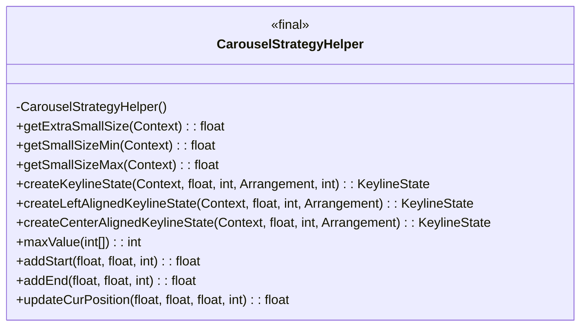
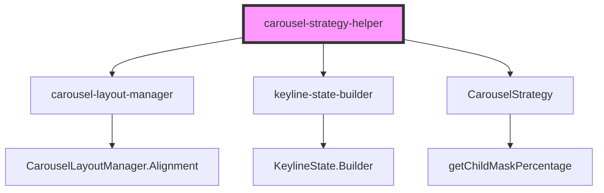
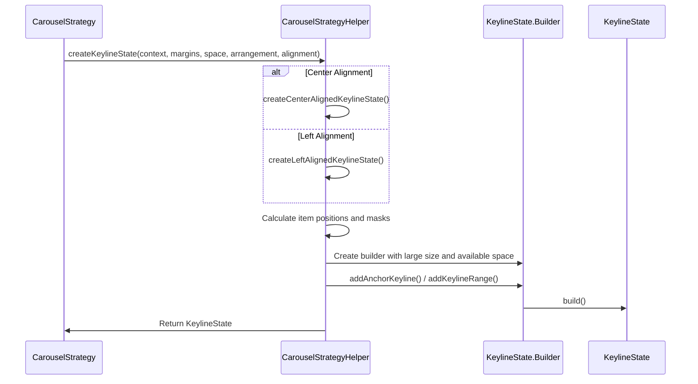
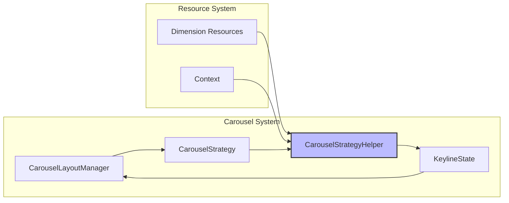

# Carousel Strategy Helper Module

## Introduction

The `carousel-strategy-helper` module provides utility methods and calculations for implementing carousel layout strategies in Material Design components. This module serves as a computational engine that helps determine optimal item positioning, sizing, and alignment within carousel layouts.

## Module Overview

The carousel-strategy-helper is a specialized utility module within the larger carousel system that focuses on:
- Calculating keyline states for carousel item positioning
- Determining optimal item arrangements based on available space
- Supporting both center-aligned and left-aligned carousel layouts
- Managing item size calculations and mask percentages

## Core Architecture

### Component Structure

### Module Dependencies

## Key Components

### CarouselStrategyHelper Class

The `CarouselStrategyHelper` is a final utility class that provides static methods for carousel layout calculations. It cannot be instantiated and serves purely as a helper class.

#### Key Methods:

**Size Calculation Methods:**
- `getExtraSmallSize()`: Retrieves the dimension for extra small carousel items
- `getSmallSizeMin()`: Gets the minimum size for small carousel items
- `getSmallSizeMax()`: Gets the maximum size for small carousel items

**Keyline State Creation:**
- `createKeylineState()`: Main entry point for creating keyline states based on alignment
- `createLeftAlignedKeylineState()`: Creates keyline state for left-aligned carousels
- `createCenterAlignedKeylineState()`: Creates keyline state for center-aligned carousels

**Utility Methods:**
- `maxValue()`: Finds the maximum value in an integer array
- `addStart()`, `addEnd()`, `updateCurPosition()`: Helper methods for keyline position calculations

## Data Flow Architecture

## Layout Strategy Implementation

### Left-Aligned Carousel

For left-aligned carousels, the helper creates a keyline state with the following structure:
1. Extra small anchor keyline at the head
2. Large item keyline range
3. Medium item keyline (if present)
4. Small item keyline range (if present)
5. Extra small anchor keyline at the tail

### Center-Aligned Carousel

For center-aligned carousels, the layout is symmetric around the center:
1. Extra small anchor keyline at the head
2. First half of small items
3. First half of medium items
4. Large item keyline range (center focal point)
5. Second half of medium items
6. Second half of small items
7. Extra small anchor keyline at the tail

## Integration with Carousel System

## Resource Dependencies

The module relies on specific dimension resources for carousel sizing:
- `R.dimen.m3_carousel_gone_size`: Size for hidden/extra small items
- `R.dimen.m3_carousel_small_item_size_min`: Minimum small item size
- `R.dimen.m3_carousel_small_item_size_max`: Maximum small item size

## Mathematical Calculations

### Keyline Position Calculations

The helper uses geometric calculations to determine optimal item positioning:

1. **Start Position Calculation**: `start + itemSize / 2F`
2. **End Position Calculation**: `startKeylinePos + (max(0, count - 1) * itemSize)`
3. **Position Update**: `lastEndKeyline + itemSize / 2F`

### Mask Percentage Calculation

Item masks are calculated using the `getChildMaskPercentage()` method from `CarouselStrategy` to determine how much of an item should be visible based on its size relative to the large item size.

## Usage Patterns

### Typical Usage Flow

1. **Strategy Implementation**: A `CarouselStrategy` implementation calls the helper
2. **Parameter Preparation**: Context, margins, available space, and arrangement are provided
3. **Alignment Selection**: Based on the carousel's alignment requirement
4. **Keyline Generation**: The helper generates the appropriate keyline state
5. **Layout Application**: The keyline state is used by the layout manager for positioning

## Performance Considerations

- All methods are static, avoiding object instantiation overhead
- Calculations are performed using primitive types for efficiency
- Resource lookups are cached within method calls
- Mathematical operations are optimized for performance

## Error Handling

The module includes defensive programming practices:
- Null safety through `@NonNull` annotations
- Array bounds checking in `maxValue()` method
- Safe division operations in position calculations
- Resource existence validation through Android's resource system

## Related Documentation

- [carousel-layout-manager.md](carousel-layout-manager.md) - For layout manager integration
- [keyline-state-builder.md](keyline-state-builder.md) - For keyline state construction details
- [CarouselStrategy implementation details](carousel-strategy.md) - For strategy pattern implementation

## Version Information

This documentation corresponds to the Material Design Components library implementation and is subject to updates as the carousel system evolves.