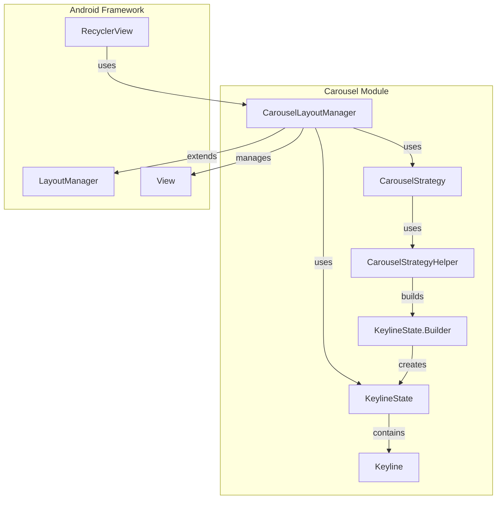

# Carousel Module Documentation

## Overview

The Carousel module provides a sophisticated layout manager for Android RecyclerView that creates dynamic, stylized scrolling experiences. It implements a unique masking and offsetting system that allows items to transform their appearance as they move along the scrolling axis, creating fluid animations tied to scroll position.

## Purpose

The Carousel module is designed to:
- Create visually appealing scrollable lists with dynamic item transformations
- Provide smooth, interpolated animations based on scroll position
- Support both horizontal and vertical orientations
- Enable customizable item masking and sizing behaviors
- Offer multiple alignment strategies (start, center)
- Integrate seamlessly with RecyclerView's recycling mechanism

## Architecture



## Core Components

### 1. CarouselLayoutManager
The main layout manager that orchestrates the carousel behavior. It:
- Manages item positioning and masking
- Handles scroll events and animations
- Coordinates with RecyclerView's recycling mechanism
- Supports both horizontal and vertical orientations

### 2. KeylineState System
A sophisticated state management system that:
- Defines item transformations at specific positions
- Enables smooth interpolation between states
- Supports focal and non-focal keylines
- Handles RTL layout support

### 3. CarouselStrategy
Abstract strategy pattern for defining carousel behaviors:
- Determines item sizing and masking patterns
- Supports multiple strategy types (contained, unrestricted)
- Enables customizable alignment options

### 4. CarouselStrategyHelper
Utility class providing:
- Dimension calculations for different item sizes
- Keyline state creation helpers
- Alignment-specific layout calculations

## Key Features

### Dynamic Item Masking
Items are dynamically masked based on their position along the scrolling axis, creating smooth transitions between different visual states.

### Keyline-Based Animation
The system uses keylines - specific points along the scroll axis where items should be in particular states. Items interpolate between these states as they scroll.

### Flexible Alignment
Supports both start-aligned and center-aligned layouts, allowing for different visual presentations.

### Orientation Support
Works in both horizontal and vertical orientations with appropriate behavior adaptations.

### RTL Support
Full right-to-left layout support with proper keyline reversal.

## Integration Points

The Carousel module integrates with:
- **RecyclerView**: As a custom LayoutManager
- **Material Design Components**: Following Material Design principles
- **Android Animation Framework**: For smooth interpolations
- **View System**: Through custom view behaviors and masking

## Usage Patterns

### Basic Implementation
```java
CarouselLayoutManager layoutManager = new CarouselLayoutManager();
recyclerView.setLayoutManager(layoutManager);
```

### Custom Strategy
```java
CarouselLayoutManager layoutManager = 
    new CarouselLayoutManager(new MultiBrowseCarouselStrategy());
```

### Orientation Configuration
```java
layoutManager.setOrientation(CarouselLayoutManager.VERTICAL);
```

## Performance Considerations

- Efficient view recycling through RecyclerView integration
- Lazy keyline state calculation
- Optimized scroll handling with clamping
- Minimal memory footprint for state management

## Related Documentation

- [appbar.md](appbar.md) - For app bar integration patterns
- [transition.md](transition.md) - For animation transition details
- [shape.md](shape.md) - For custom shape implementations

## Sub-modules

The carousel module consists of several interconnected sub-modules:

- **[layout-manager-core](layout-manager-core.md)**: Core layout management functionality including orientation handling, scroll management, and view positioning
- **[keyline-system](keyline-system.md)**: Keyline state management, interpolation algorithms, and RTL support for dynamic item transformations
- **[strategy-framework](strategy-framework.md)**: Strategy pattern implementation for customizable carousel behaviors, alignment options, and sizing calculations