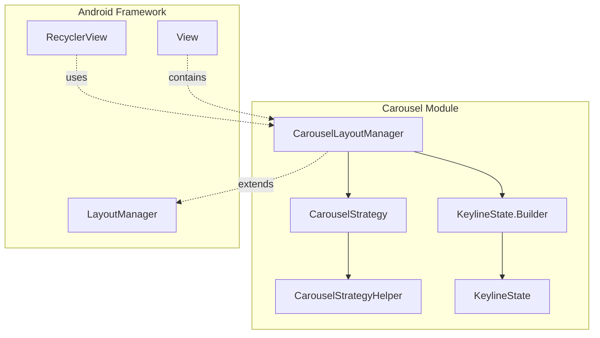

# Carousel Module Documentation

## Overview

The Carousel module provides a sophisticated layout manager for creating stylized, scrollable lists with dynamic item masking and positioning effects. It implements a unique viewing experience where items are transformed as they scroll through focal points, creating fluid animations and visual hierarchy.

## Purpose

The Carousel module is designed to:
- Create visually appealing scrollable lists with dynamic item transformations
- Provide smooth animations and transitions between different item states
- Support both horizontal and vertical orientations
- Enable customizable item masking and positioning strategies
- Integrate seamlessly with RecyclerView for efficient memory management

## Architecture


```mermaid
graph TB
    subgraph "Carousel Module"
        CLM[CarouselLayoutManager]
        CS[CarouselStrategy]
        KSB[KeylineState.Builder]
        CSH[CarouselStrategyHelper]
        
        CLM --> CS
        CLM --> KSB
        CS --> CSH
        KSB --> KS[KeylineState]
    end
    
    subgraph "Android Framework"
        RV[RecyclerView]
        LM[LayoutManager]
        V[View]
    end
    
    CLM -.->|extends| LM
    RV -.->|uses| CLM
    V -.->|contains| CLM
```

## Core Components

### CarouselLayoutManager
The main layout manager that orchestrates the carousel behavior. It:
- Manages item positioning and masking based on keyline states
- Handles scroll events and animations
- Coordinates with RecyclerView for efficient view recycling
- Supports both horizontal and vertical orientations

### KeylineState.Builder
A builder pattern implementation for creating keyline states that define:
- Item positioning along the scroll axis
- Masking percentages for visual effects
- Focal points where items are fully visible
- Anchor points for boundary conditions

### CarouselStrategyHelper
Utility class providing:
- Dimension calculations for different item sizes
- Keyline state creation for various alignment options
- Helper methods for positioning calculations

## Key Features

### Dynamic Item Masking
Items are dynamically masked as they scroll, creating smooth transitions between different visual states. The masking is controlled by keylines that define how much of each item should be visible at different positions.

### Flexible Alignment
Supports multiple alignment strategies:
- **Start Alignment**: Large items align to the start of the carousel
- **Center Alignment**: Large items center within the carousel

### Orientation Support
Works in both horizontal and vertical orientations, adapting the keyline calculations and item positioning accordingly.

### Efficient Recycling
Integrates with RecyclerView's recycling mechanism to maintain performance even with large datasets.

## Usage Patterns

### Basic Implementation
```java
CarouselLayoutManager layoutManager = new CarouselLayoutManager();
recyclerView.setLayoutManager(layoutManager);
```

### Custom Strategy
```java
CarouselLayoutManager layoutManager = 
    new CarouselLayoutManager(new MultiBrowseCarouselStrategy());
```

### Orientation Configuration
```java
layoutManager.setOrientation(CarouselLayoutManager.HORIZONTAL);
// or
layoutManager.setOrientation(CarouselLayoutManager.VERTICAL);
```

## Integration Points

The Carousel module integrates with:
- **RecyclerView**: As a custom LayoutManager
- **MaskableFrameLayout**: Required for all carousel items
- **Material Design Components**: For consistent theming and styling

## Performance Considerations

- Uses view recycling for memory efficiency
- Implements lazy loading of keyline states
- Provides debug mode for performance monitoring
- Supports item prefetching for smooth scrolling

## Related Documentation

- [CarouselLayoutManager Documentation](carousel-layout-manager.md) - Detailed documentation of the main layout manager component
- [CarouselStrategyHelper Documentation](carousel-strategy-helper.md) - Utility methods and helper functions for carousel strategies
- [KeylineState.Builder Documentation](keyline-state-builder.md) - Builder pattern for creating keyline states
- [Material Design Carousel Guidelines](https://material.io/components/carousel)