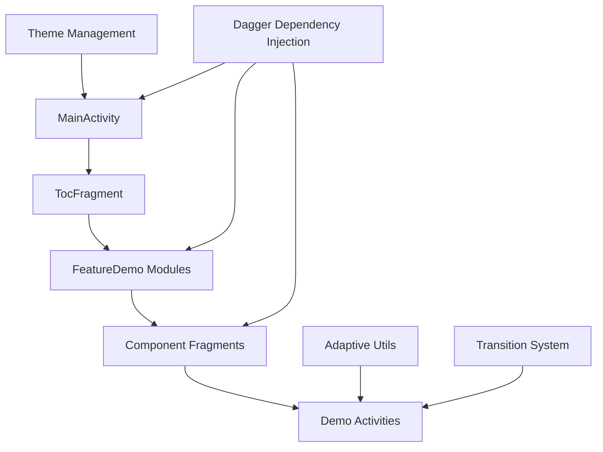
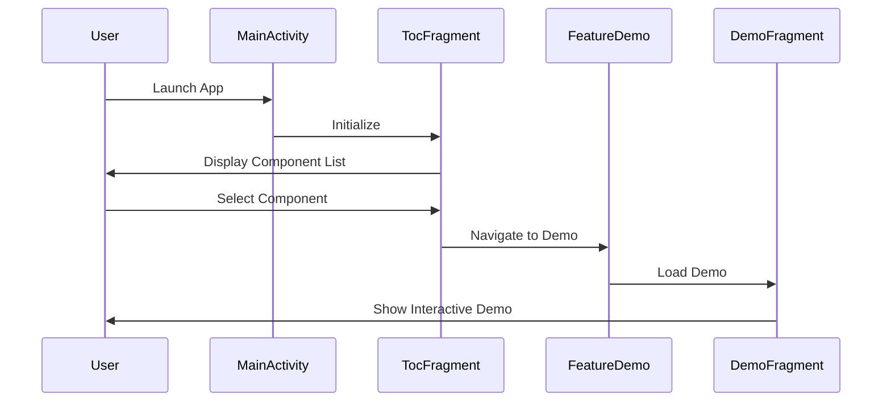

# Material Design Catalog Module

## Overview

The Catalog module serves as the primary demonstration and testing platform for the Material Design Components library. It provides an interactive showcase of all Material Design components, allowing developers to explore, test, and understand the various UI components and their behaviors.

## Purpose

The Catalog module is designed to:
- Demonstrate all Material Design components in action
- Provide interactive examples for each component
- Serve as a testing ground for component functionality
- Offer a reference implementation for developers
- Showcase adaptive design patterns and responsive layouts

## Architecture

The Catalog module follows a hierarchical structure with the following key architectural patterns:

### Core Architecture Pattern

### Navigation Flow

## Module Structure

The Catalog module is organized into several sub-modules, each focusing on specific aspects of the Material Design system:

### 1. Application Framework (`application`)
The core application infrastructure including dependency injection, application lifecycle, and global configuration.

### 2. Component Demonstrations
Individual modules for each Material Design component:
- **Adaptive Design** (`adaptive`) - Responsive layouts for different screen sizes
- **App Bar** (`appbar`) - Top application bars and navigation
- **Bottom Navigation** (`bottomnav`) - Bottom navigation patterns
- **Bottom Sheet** (`bottomsheet`) - Modal bottom sheets
- **Buttons** (`button`) - Various button styles and behaviors
- **Cards** (`card`) - Material Design cards
- **Carousel** (`carousel`) - Horizontal scrolling content
- **Chips** (`chip`) - Compact elements for actions or selection
- **Color System** (`color`) - Material Design color theming
- **Date/Time Pickers** (`datepicker`, `timepicker`) - Date and time selection
- **Dialogs** (`dialog`) - Material Design dialogs
- **Elevation** (`elevation`) - Shadow and elevation effects
- **FAB** (`fab`) - Floating Action Buttons
- **Lists** (`listitem`) - List components and patterns
- **Navigation** (`navigationdrawer`, `navigationrail`) - Navigation patterns
- **Progress Indicators** (`progressindicator`, `loadingindicator`) - Loading states
- **Search** (`search`) - Search bar and functionality
- **Shape Theming** (`shapetheming`) - Material Design shape system
- **Side Sheet** (`sidesheet`) - Side navigation panels
- **Sliders** (`slider`) - Range and value selection
- **Tabs** (`tabs`) - Tab navigation
- **Text Fields** (`textfield`) - Input fields and forms
- **Transitions** (`transition`) - Material Design motion

### 3. Feature Framework (`feature`)
Core functionality shared across all demos including navigation, preferences, and utilities.

### 4. Internal Tools (`internal`)
Development and debugging tools for internal use.

### 5. Preferences System (`preferences`)
Theme management, user preferences, and configuration options.

## Key Components

### MainActivity
The main entry point that hosts the table of contents and manages navigation between different component demos.

### TocFragment (Table of Contents)
Displays the main navigation menu listing all available component demonstrations.

### DemoLandingFragment
Base class for all component demo fragments, providing consistent navigation and demo presentation.

### Adaptive Design System
A sophisticated system for handling different screen sizes and form factors, including:
- Foldable device support
- Multi-window layouts
- Responsive navigation patterns
- Dynamic content adaptation

## Integration Points

The Catalog module integrates with the broader Material Design Components library through:

1. **Component Dependencies**: Each demo module depends on the corresponding Material component
2. **Theme Integration**: Uses Material Design theming system for consistent appearance
3. **Motion System**: Leverages Material Design transition patterns
4. **Adaptive Layouts**: Demonstrates responsive design principles

## Usage

The Catalog module serves multiple purposes:

### For Developers
- Reference implementation for Material Design components
- Testing ground for component behavior and customization
- Source of best practices for component usage

### For Designers
- Visual reference for Material Design patterns
- Interactive exploration of component states and behaviors
- Understanding of adaptive design principles

### For Quality Assurance
- Comprehensive testing of component functionality
- Validation of cross-device compatibility
- Performance testing and optimization

## Dependencies

The Catalog module depends on all Material Design component modules and provides a unified interface for exploring them. Key dependencies include:

- All Material Design component modules (appbar, bottomnav, button, etc.)
- AndroidX libraries for compatibility
- Dagger for dependency injection
- Window Manager for adaptive layouts

## Extending the Catalog

To add new component demonstrations:

1. Create a new fragment extending `DemoLandingFragment`
2. Implement the required demo methods
3. Add the module to `TocModule`
4. Create corresponding demo activities/fragments
5. Add navigation and demo entries

## Best Practices Demonstrated

The Catalog module demonstrates several Material Design best practices:

- Consistent navigation patterns
- Proper theming and styling
- Accessibility considerations
- Performance optimization
- Adaptive design principles
- Motion and transition guidelines

For detailed information about specific sub-modules, refer to their individual documentation files.