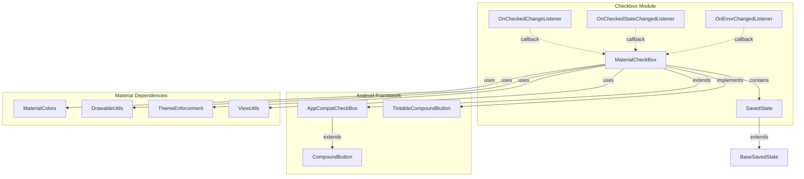
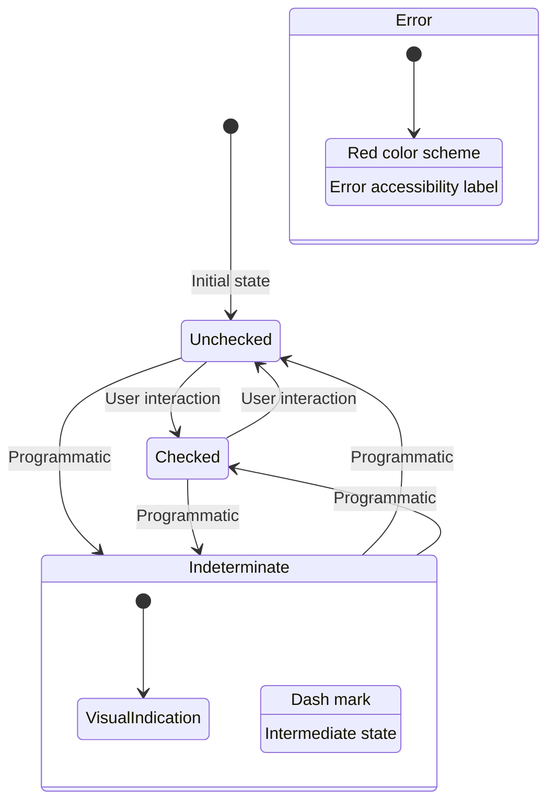
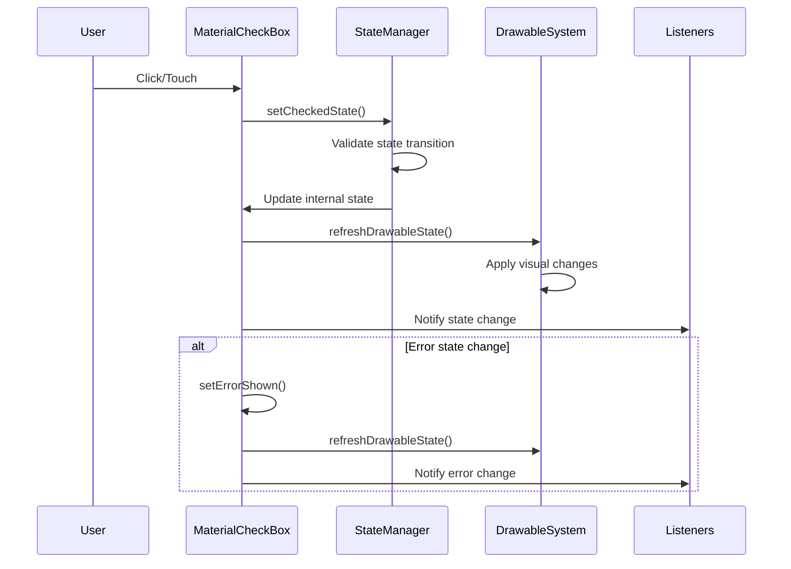
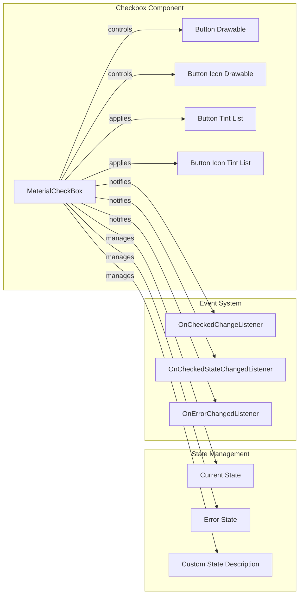
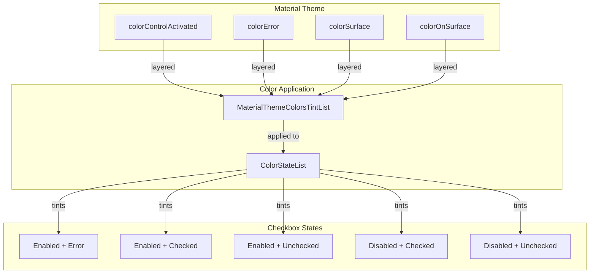
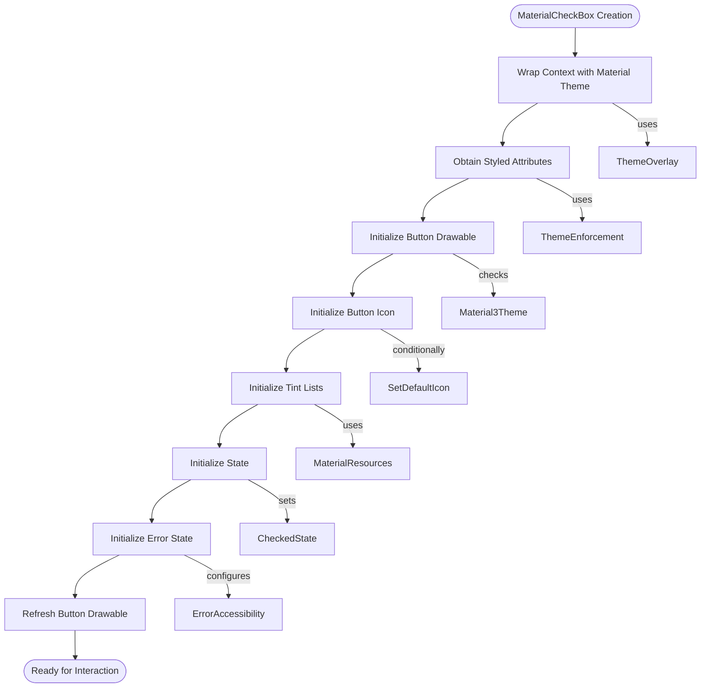
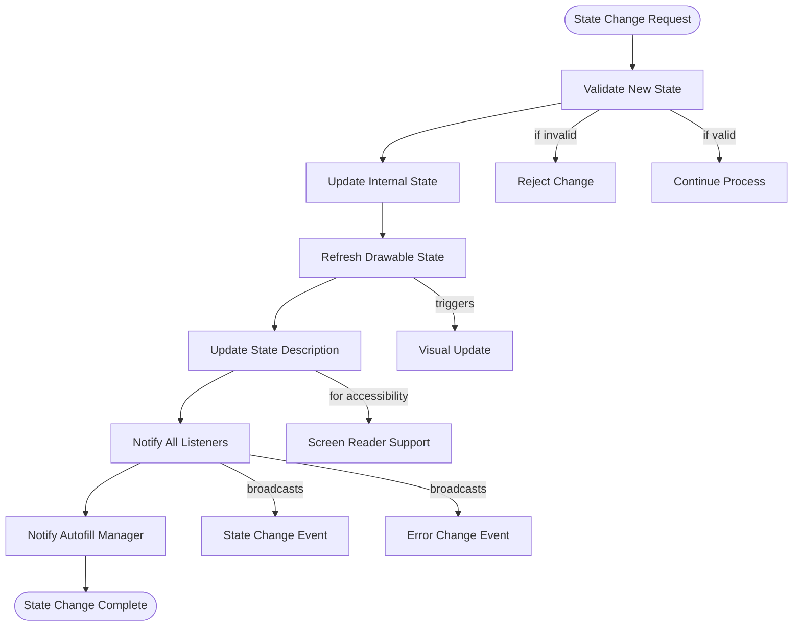

# Material Design Checkbox Module

## Overview

The checkbox module provides a Material Design implementation of checkbox components, offering enhanced functionality beyond standard Android checkboxes. It supports three distinct states (unchecked, checked, and indeterminate), error state handling, and comprehensive theming capabilities that align with Material Design principles.

## Core Components

### MaterialCheckBox

The primary component `MaterialCheckBox` extends `AppCompatCheckBox` to provide Material Design styling and additional features. Key capabilities include:

- **Three-state support**: Unchecked, checked, and indeterminate states
- **Error state handling**: Visual error indication with accessibility support
- **Custom theming**: Material theme color integration
- **Animation support**: Smooth transitions between states
- **Accessibility**: Enhanced screen reader support with state descriptions

### SavedState

The `SavedState` class handles state persistence during configuration changes, ensuring that checkbox states (including indeterminate state) are properly maintained.

## Architecture

## State Management

The checkbox supports three distinct states with corresponding visual representations:

## Data Flow

## Component Interactions

## Theming and Styling

The checkbox module integrates with Material Design theming system:

## Process Flow

### Initialization Process

### State Change Process

## Key Features

### Three-State Support
- **Unchecked**: Default state with empty checkbox
- **Checked**: Filled checkbox with checkmark icon
- **Indeterminate**: Dash mark indicating partial selection

### Error State Management
- Visual error indication through color changes
- Accessibility support with error labels
- Independent error state management

### Theming Integration
- Material Design color system integration
- Automatic color scheme application
- Custom tint list support

### Animation Support
- Smooth transitions between checked/unchecked states
- AnimatedVectorDrawable integration
- Color transition animations (API 24+)

### Accessibility Features
- Enhanced state descriptions for screen readers
- Error state announcements
- Autofill manager integration

## Dependencies

The checkbox module relies on several Material Design components:

- **[Material Colors](color.md)**: For theme color integration
- **[Drawable Utilities](drawable.md)**: For drawable manipulation and tinting
- **[Theme Enforcement](theme.md)**: For consistent theming application
- **[View Utilities](view.md)**: For layout and RTL support

## Usage Considerations

### Performance
- Drawable state caching for optimal performance
- Efficient state change notifications
- Minimal redraw operations

### Customization
- Support for custom button drawables
- Independent icon and button tinting
- Custom state description support

### Compatibility
- Backward compatibility with AppCompatCheckBox
- Material 3 theme detection and adaptation
- API level specific feature handling

## Integration Points

The checkbox module integrates with the broader Material Design system through:

- **Theme system**: Color and style inheritance
- **Drawable system**: Custom drawable support and tinting
- **Accessibility system**: Enhanced accessibility features
- **Animation system**: Smooth state transitions
- **State management system**: Comprehensive state handling

This modular approach ensures consistent behavior across the Material Design component library while providing flexibility for customization and extension.