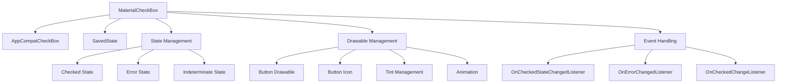
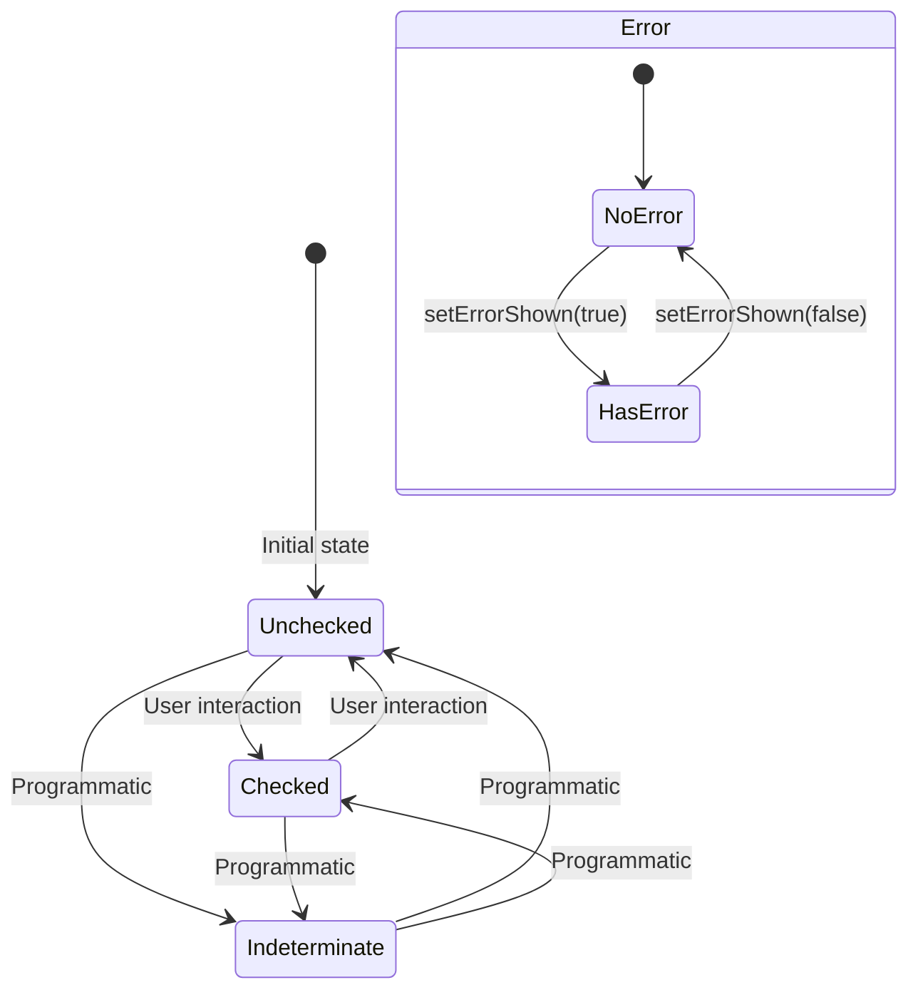
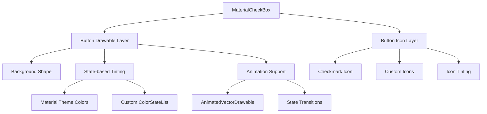
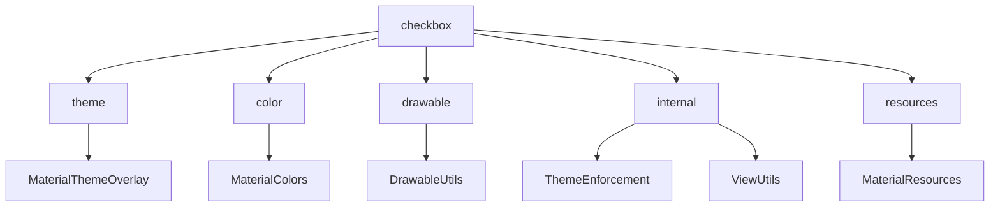
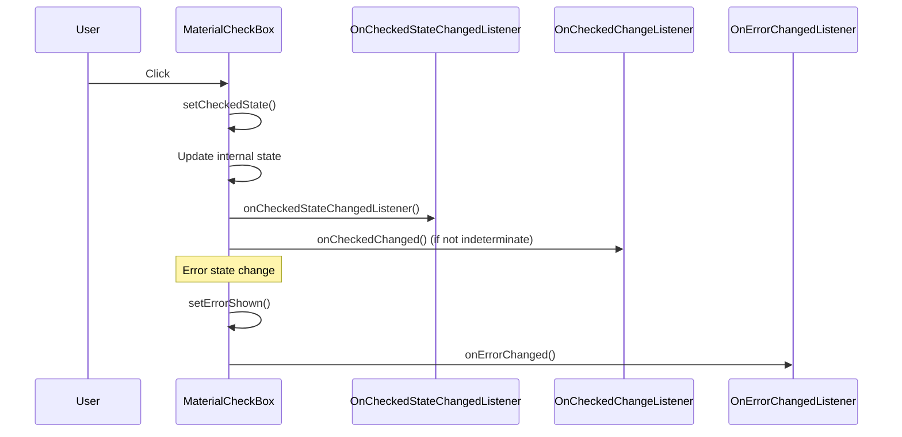

# Material Components Checkbox Module

## Overview

The checkbox module provides Material Design-compliant checkbox components for Android applications. It extends the standard Android checkbox functionality with Material Design principles, offering enhanced visual design, animation support, and additional states beyond the traditional checked/unchecked paradigm.

## Core Functionality

The checkbox module implements a comprehensive checkbox component that supports:

- **Three-state functionality**: Unchecked, checked, and indeterminate states
- **Material Design theming**: Automatic color adaptation based on Material Design themes
- **Error state support**: Visual indication of validation errors
- **Customizable appearance**: Support for custom drawables, icons, and colors
- **Accessibility features**: Enhanced screen reader support and state descriptions
- **Animation support**: Smooth transitions between states with color animations

## Architecture

### Component Structure


```mermaid
graph TD
    A[MaterialCheckBox] --> B[AppCompatCheckBox]
    A --> C[SavedState]
    A --> D[State Management]
    A --> E[Drawable Management]
    A --> F[Event Handling]
    
    D --> D1[Checked State]
    D --> D2[Error State]
    D --> D3[Indeterminate State]
    
    E --> E1[Button Drawable]
    E --> E2[Button Icon]
    E --> E3[Tint Management]
    E --> E4[Animation]
    
    F --> F1[OnCheckedStateChangedListener]
    F --> F2[OnErrorChangedListener]
    F --> F3[OnCheckedChangeListener]
```

### Key Components

#### MaterialCheckBox
The main component that extends `AppCompatCheckBox` to provide Material Design functionality. It manages:
- State transitions between unchecked, checked, and indeterminate
- Error state visualization
- Material theme color application
- Custom drawable composition
- Accessibility enhancements

#### SavedState
Handles state persistence across configuration changes, storing the current checked state to ensure proper restoration.

## State Management

### Supported States


```mermaid
stateDiagram-v2
    [*] --> Unchecked: Initial state
    Unchecked --> Checked: User interaction
    Checked --> Unchecked: User interaction
    Unchecked --> Indeterminate: Programmatic
    Checked --> Indeterminate: Programmatic
    Indeterminate --> Unchecked: Programmatic
    Indeterminate --> Checked: Programmatic
    
    state Error {
        [*] --> NoError
        NoError --> HasError: setErrorShown(true)
        HasError --> NoError: setErrorShown(false)
    }
```

### State Constants
- `STATE_UNCHECKED` (0): Default unchecked state
- `STATE_CHECKED` (1): Selected/checked state  
- `STATE_INDETERMINATE` (2): Intermediate state for partial selections

## Visual Design System

### Drawable Architecture


```mermaid
graph TD
    A[MaterialCheckBox] --> B[Button Drawable Layer]
    A --> C[Button Icon Layer]
    
    B --> B1[Background Shape]
    B --> B2[State-based Tinting]
    B --> B3[Animation Support]
    
    C --> C1[Checkmark Icon]
    C --> C2[Custom Icons]
    C --> C3[Icon Tinting]
    
    B2 --> D[Material Theme Colors]
    B2 --> E[Custom ColorStateList]
    
    B3 --> F[AnimatedVectorDrawable]
    B3 --> G[State Transitions]
```

### Color System
The checkbox supports multiple color configuration approaches:

1. **Material Theme Colors**: Automatic color extraction from Material Design themes
2. **Custom ColorStateList**: Developer-defined colors for different states
3. **Button Tint**: Color application to the main button drawable
4. **Icon Tint**: Separate color control for overlay icons

### Animation System
- **State Transitions**: Smooth color animations when changing between checked/unchecked states
- **Vector Animation**: Support for AnimatedVectorDrawable for complex transitions
- **Tint Animation**: Color interpolation during state changes

## Dependencies

### Internal Dependencies


```mermaid
graph TD
    A[checkbox] --> B[theme]
    A --> C[color]
    A --> D[drawable]
    A --> E[internal]
    A --> F[resources]
    
    B --> B1[MaterialThemeOverlay]
    
    C --> C1[MaterialColors]
    
    D --> D1[DrawableUtils]
    
    E --> E1[ThemeEnforcement]
    E --> E2[ViewUtils]
    
    F --> F1[MaterialResources]
```

### External Dependencies
- **AndroidX AppCompat**: Base checkbox functionality
- **AndroidX VectorDrawable**: Vector drawable and animation support
- **Material Components Core**: Theme and color utilities

## Integration Patterns

### Basic Usage
```xml
<com.google.android.material.checkbox.MaterialCheckBox
    android:layout_width="wrap_content"
    android:layout_height="wrap_content"
    android:text="Check me"
    app:useMaterialThemeColors="true" />
```

### Advanced Configuration
```xml
<com.google.android.material.checkbox.MaterialCheckBox
    android:layout_width="wrap_content"
    android:layout_height="wrap_content"
    android:text="Advanced checkbox"
    app:buttonIcon="@drawable/custom_icon"
    app:buttonIconTint="@color/custom_icon_color"
    app:buttonTint="@color/custom_button_color"
    app:errorShown="@{viewModel.hasError}"
    app:errorAccessibilityLabel="@string/error_message" />
```

## Event Handling

### State Change Listeners


```mermaid
sequenceDiagram
    participant User
    participant MaterialCheckBox
    participant OnCheckedStateChangedListener
    participant OnCheckedChangeListener
    participant OnErrorChangedListener
    
    User->>MaterialCheckBox: Click
    MaterialCheckBox->>MaterialCheckBox: setCheckedState()
    MaterialCheckBox->>MaterialCheckBox: Update internal state
    MaterialCheckBox->>OnCheckedStateChangedListener: onCheckedStateChangedListener()
    MaterialCheckBox->>OnCheckedChangeListener: onCheckedChanged() (if not indeterminate)
    
    Note over MaterialCheckBox: Error state change
    MaterialCheckBox->>MaterialCheckBox: setErrorShown()
    MaterialCheckBox->>OnErrorChangedListener: onErrorChanged()
```

### Listener Types
- **OnCheckedStateChangedListener**: Fired for any state change (checked/unchecked/indeterminate)
- **OnCheckedChangeListener**: Traditional checkbox change listener (checked/unchecked only)
- **OnErrorChangedListener**: Fired when error state changes

## Accessibility Features

### Screen Reader Support
- **State Descriptions**: Automatic generation of state descriptions for screen readers
- **Error Announcements**: Custom error messages for accessibility services
- **Custom State Descriptions**: Support for developer-defined state descriptions

### Visual Accessibility
- **High Contrast Support**: Proper color contrast ratios for accessibility
- **Focus Indicators**: Clear visual focus indicators
- **Touch Target Sizing**: Adequate touch target sizes for motor accessibility

## Performance Considerations

### Optimization Strategies
- **Drawable Caching**: Efficient drawable state management
- **State Batch Updates**: Minimized drawable refreshes during state changes
- **Animation Optimization**: Hardware-accelerated animations where available
- **Memory Management**: Proper cleanup of animation callbacks and listeners

### Best Practices
- Use `useMaterialThemeColors="true"` for automatic theme integration
- Implement proper listener cleanup in lifecycle methods
- Consider using `centerIfNoTextEnabled` for better visual alignment
- Leverage error states for form validation feedback

## Testing Considerations

### Unit Testing
- State transition logic verification
- Listener invocation testing
- State persistence validation
- Accessibility feature testing

### UI Testing
- Visual state verification
- Animation testing
- Theme integration testing
- Error state visualization

## Related Documentation

- [Material Design Checkbox Guidelines](https://material.io/components/checkbox)
- [Android Accessibility Guide](https://developer.android.com/guide/topics/ui/accessibility)
- [Color System Documentation](color.md)
- [Theme System Documentation](theme.md)
- [Drawable Utilities Documentation](drawable.md)