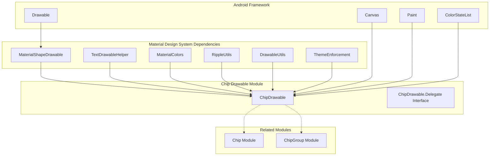
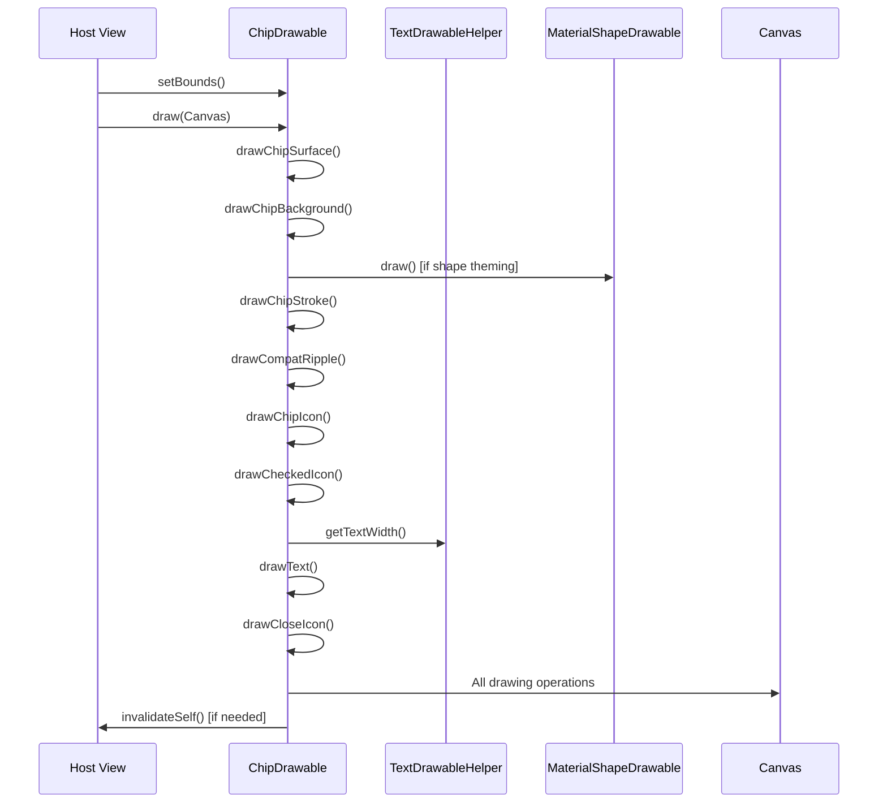
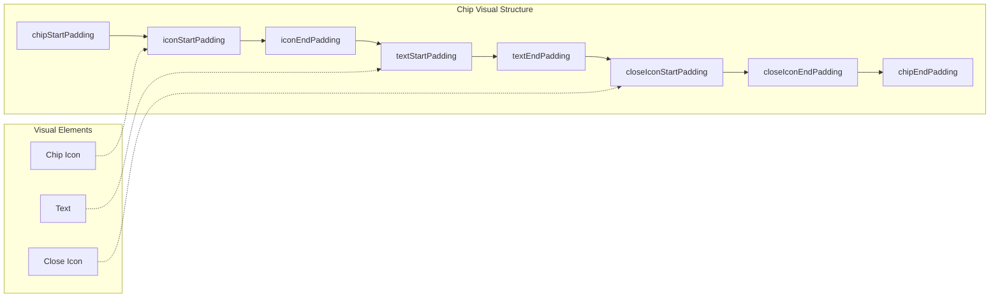
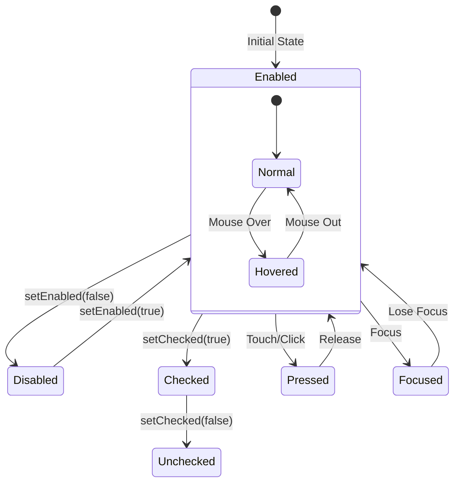
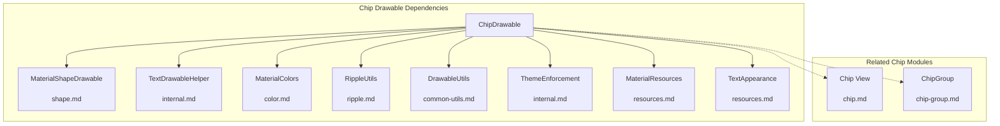

# Chip Drawable Module Documentation

## Overview

The chip-drawable module is a core component of the Material Design Chip system, providing the visual rendering and drawable functionality for Material Design chips. It contains the `ChipDrawable` class, which encapsulates all layout and drawing logic for chip components, enabling both standalone usage and integration with the broader chip system.

## Purpose and Core Functionality

The chip-drawable module serves as the foundational rendering engine for Material Design chips, offering:

- **Visual Rendering**: Complete drawing logic for chip appearance including background, text, icons, and effects
- **State Management**: Comprehensive state handling for different chip states (enabled, disabled, checked, pressed)
- **Customization**: Extensive theming and styling capabilities through XML attributes and programmatic APIs
- **Standalone Usage**: Ability to use chips as drawables in contexts like auto-complete text fields
- **Performance Optimization**: Efficient drawing operations with proper invalidation and caching

## Architecture and Component Relationships

### Core Architecture



### Component Interaction Flow



## Key Components and Interfaces

### ChipDrawable Class

The `ChipDrawable` class is the primary component that extends `MaterialShapeDrawable` and implements multiple interfaces:

- **TintAwareDrawable**: Supports color tinting
- **Drawable.Callback**: Handles drawable lifecycle events
- **TextDrawableDelegate**: Manages text rendering coordination

### Delegate Interface

The `ChipDrawable.Delegate` interface provides a callback mechanism for views that own a ChipDrawable:

```java
public interface Delegate {
    void onChipDrawableSizeChange();
}
```

This interface enables the host view to respond to size changes in the chip drawable, ensuring proper layout updates.

## Visual Structure and Layout

### Chip Layout Architecture



### Drawing Order and Layers

The chip drawable follows a specific drawing order to ensure proper visual layering:

1. **Surface Layer**: 100% opaque background for transparent effects
2. **Background**: Main chip background color
3. **Shape Theming**: Custom shape appearance if enabled
4. **Stroke**: Border around the chip
5. **Compat Ripple**: Ripple effect for older Android versions
6. **Chip Icon**: Leading icon (left side)
7. **Checked Icon**: Icon shown when chip is checked
8. **Text**: Main chip text content
9. **Close Icon**: Trailing icon (right side)

## State Management System

### State Change Architecture



### State-Driven Visual Updates

The chip drawable responds to state changes through a comprehensive state management system:

- **Color State Lists**: All colors (background, stroke, text, icons) support state-based changes
- **Drawable State Propagation**: Child drawables inherit parent state for consistent appearance
- **Separate Close Icon State**: Close icon maintains independent state for focused/pressed behavior
- **Performance Optimization**: Only invalidates when visual changes actually occur

## Integration with Material Design System

### Dependency Relationships



### Theme Integration

The chip drawable integrates deeply with the Material Design theming system:

- **Theme Attributes**: Supports standard Material Design theme attributes
- **Color Harmonization**: Works with the color system for consistent theming
- **Shape Theming**: Integrates with shape appearance models for customizable corners
- **Typography**: Supports Material Design text appearances and styles

## Performance Considerations

### Drawing Optimization

- **Layer Management**: Uses canvas layers only when alpha < 255
- **Invalidation Minimization**: Only invalidates when visual changes occur
- **Caching**: Caches calculated bounds and text measurements
- **State Change Optimization**: Groups related state changes to minimize redraws

### Memory Management

- **Weak References**: Uses weak references for delegate to prevent memory leaks
- **Drawable Mutations**: Properly mutates child drawables to prevent state conflicts
- **Resource Cleanup**: Properly unapplies child drawables when removed

## Usage Patterns

### Standalone Usage

ChipDrawable can be used independently of the Chip view system:

```xml
<chip xmlns:app="http://schemas.android.com/apk/res-auto"
    android:text="Hello, World!"
    app:chipIcon="@drawable/custom_icon"/>
```

### Programmatic Creation

```java
ChipDrawable chip = ChipDrawable.createFromResource(context, R.xml.chip_resource);
chip.setBounds(left, top, right, bottom);
chip.draw(canvas);
```

### Integration with Text Views

ChipDrawable is particularly useful in auto-complete scenarios where chips need to be embedded within text content.

## Accessibility and Internationalization

### Accessibility Features

- **Content Descriptions**: Supports content descriptions for close icons
- **Touch Targets**: Calculates proper touch bounds for interaction
- **State Announcements**: Integrates with accessibility services for state changes

### RTL Support

- **Layout Direction**: Properly handles right-to-left layouts
- **Icon Positioning**: Adjusts icon positions based on layout direction
- **Text Alignment**: Correctly aligns text for RTL languages

## Error Handling and Edge Cases

### Input Validation

- **Null Safety**: Handles null inputs gracefully
- **Bounds Checking**: Validates bounds before drawing operations
- **Resource Validation**: Checks resource availability before loading

### Fallback Behaviors

- **Default Values**: Provides sensible defaults for missing attributes
- **Graceful Degradation**: Continues operation when optional features fail
- **Compatibility**: Maintains backward compatibility with deprecated attributes

## Testing and Debugging

### Debug Features

- **Debug Painting**: Optional debug overlay for visual debugging
- **State Inspection**: Comprehensive state tracking and reporting
- **Performance Metrics**: Built-in performance monitoring capabilities

### Testability

- **Mock Support**: Designed for easy mocking in unit tests
- **State Verification**: Provides methods to verify current state
- **Isolation**: Can be tested independently of view system

## Future Considerations

### Extensibility

The chip drawable architecture supports future enhancements:

- **Custom Drawing**: Extensible for custom visual effects
- **Animation Support**: Built-in support for motion specs
- **Theming Evolution**: Adaptable to future Material Design updates

### Performance Enhancements

- **Hardware Acceleration**: Optimized for hardware-accelerated drawing
- **Memory Optimization**: Continuous improvements to memory usage
- **Rendering Pipeline**: Efficient rendering pipeline for complex chips

## References

- [Chip Module Documentation](chip.md) - For the complete chip view system
- [Chip Group Module Documentation](chip-group.md) - For chip grouping and management
- [Material Shape Drawable Documentation](shape.md) - For shape theming details
- [Color System Documentation](color.md) - For color management and theming
- [Ripple System Documentation](ripple.md) - For ripple effect implementation
- [Internal Utilities Documentation](internal.md) - For internal utility functions
- [Resources System Documentation](resources.md) - For resource management
- [Common Utilities Documentation](common-utils.md) - For shared utility functions