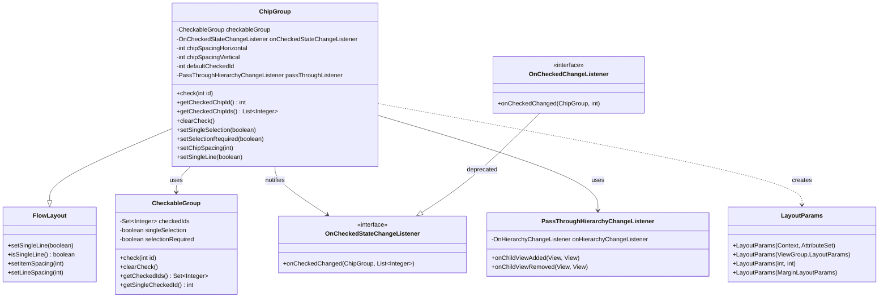
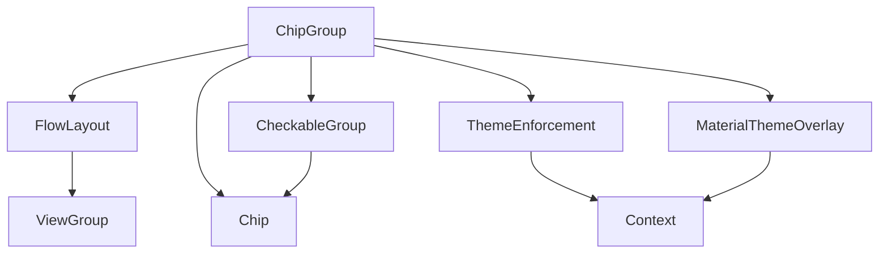
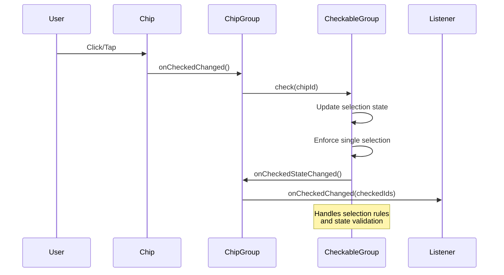
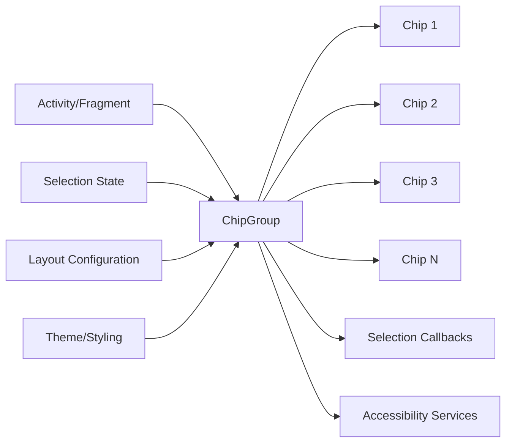

# ChipGroup Module Documentation

## Overview

The ChipGroup module is a core component of the Material Design Components library that provides a container for managing multiple Chip components. It extends FlowLayout to create flexible, reflowable layouts of chips with support for single or multiple selection modes, spacing configuration, and accessibility features.

## Purpose and Core Functionality

ChipGroup serves as a specialized ViewGroup that:
- **Manages Chip Collections**: Provides a container for organizing multiple Chip components in a flexible layout
- **Supports Selection Modes**: Implements single-selection (radio button behavior) and multi-selection modes
- **Handles Layout Flowing**: Automatically reflows chips across multiple lines or constrains to single line
- **Maintains State**: Preserves checked states and manages selection requirements
- **Provides Accessibility**: Implements proper accessibility features for screen readers

## Architecture

### Component Structure



### Key Dependencies



## Core Components

### 1. ChipGroup Class
The main container class that extends FlowLayout to provide chip-specific functionality.

**Key Features:**
- **Layout Management**: Controls chip spacing (horizontal/vertical) and line wrapping
- **Selection Control**: Manages single/multiple selection modes with selection requirements
- **State Management**: Maintains checked states and provides access to selected chips
- **Accessibility**: Implements proper accessibility features for collection navigation

**Core Methods:**
- `check(int id)`: Selects a specific chip by ID
- `getCheckedChipId()`: Returns the ID of the selected chip (single selection mode)
- `getCheckedChipIds()`: Returns list of all selected chip IDs
- `clearCheck()`: Clears all selections
- `setSingleSelection(boolean)`: Toggles between single and multiple selection modes
- `setSelectionRequired(boolean)`: Prevents complete deselection in single selection mode

### 2. OnCheckedStateChangeListener Interface
Modern callback interface for handling selection changes with support for multiple selections.

```java
public interface OnCheckedStateChangeListener {
    void onCheckedChanged(@NonNull ChipGroup group, @NonNull List<Integer> checkedIds);
}
```

### 3. OnCheckedChangeListener Interface (Deprecated)
Legacy interface for single selection mode callbacks, maintained for backward compatibility.

```java
@Deprecated
public interface OnCheckedChangeListener {
    void onCheckedChanged(@NonNull ChipGroup group, @IdRes int checkedId);
}
```

### 4. LayoutParams Class
Custom layout parameters for ChipGroup children, extending MarginLayoutParams.

**Constructors:**
- `LayoutParams(Context context, AttributeSet attrs)`: From XML attributes
- `LayoutParams(ViewGroup.LayoutParams source)`: From existing layout params
- `LayoutParams(int width, int height)`: Direct dimension specification
- `LayoutParams(MarginLayoutParams source)`: From margin layout params

## Data Flow and State Management



## Configuration and Attributes

### XML Attributes
- `app:chipSpacing`: Sets both horizontal and vertical spacing
- `app:chipSpacingHorizontal`: Horizontal spacing between chips
- `app:chipSpacingVertical`: Vertical spacing between chips
- `app:singleLine`: Constrains chips to single horizontal line
- `app:singleSelection`: Enables single selection mode
- `app:selectionRequired`: Prevents complete deselection
- `app:checkedChip`: Pre-selects a chip by ID

### Programmatic Configuration
```java
// Basic setup
ChipGroup chipGroup = findViewById(R.id.chip_group);
chipGroup.setSingleSelection(true);
chipGroup.setSelectionRequired(true);
chipGroup.setChipSpacing(8dp);

// Selection handling
chipGroup.setOnCheckedStateChangeListener((group, checkedIds) -> {
    // Handle selection changes
});

// Programmatic selection
chipGroup.check(chipId);
List<Integer> selectedIds = chipGroup.getCheckedChipIds();
```

## Integration with Other Modules

### Related Components
- **[Chip Module](chip.md)**: Individual chip components that ChipGroup manages
- **[FlowLayout Module](flow-layout.md)**: Base layout class providing reflowable layout behavior
- **[CheckableGroup Module](checkable-group.md)**: Internal component managing selection logic
- **[Theme Module](theme.md)**: Provides Material Design theming support

### Usage Patterns


## Accessibility Features

ChipGroup implements comprehensive accessibility support:

- **Collection Information**: Reports row/column information to accessibility services
- **Selection Mode**: Indicates single or multiple selection capability
- **Navigation**: Supports keyboard navigation through chips
- **State Announcement**: Announces selection changes to screen readers

```java
@Override
public void onInitializeAccessibilityNodeInfo(@NonNull AccessibilityNodeInfo info) {
    super.onInitializeAccessibilityNodeInfo(info);
    AccessibilityNodeInfoCompat infoCompat = AccessibilityNodeInfoCompat.wrap(info);
    int columnCount = isSingleLine() ? getVisibleChipCount() : -1;
    infoCompat.setCollectionInfo(
        CollectionInfoCompat.obtain(
            getRowCount(),
            columnCount,
            false,
            isSingleSelection() 
                ? CollectionInfoCompat.SELECTION_MODE_SINGLE
                : CollectionInfoCompat.SELECTION_MODE_MULTIPLE));
}
```

## Best Practices

### 1. Selection Mode Configuration
- Use single selection for mutually exclusive choices (radio button behavior)
- Use multiple selection for independent on/off choices (checkbox behavior)
- Consider `selectionRequired` to prevent user confusion in single selection mode

### 2. Layout Optimization
- Set appropriate chip spacing for visual clarity
- Use `singleLine` with HorizontalScrollView for horizontal scrolling
- Consider screen size and orientation for multi-line layouts

### 3. State Management
- Listen to `OnCheckedStateChangeListener` for modern multi-selection support
- Use `getCheckedChipIds()` for reliable state access
- Handle configuration changes by preserving selection state

### 4. Performance Considerations
- Avoid frequent selection changes in rapid succession
- Consider chip count impact on layout performance
- Use appropriate spacing to prevent layout thrashing

## Migration and Compatibility

### From RadioGroup
ChipGroup with `singleSelection=true` provides similar behavior to RadioGroup but with Material Design styling and chip-based presentation.

### From Legacy OnCheckedChangeListener
Migrate from deprecated `OnCheckedChangeListener` to `OnCheckedStateChangeListener`:

```java
// Old approach (deprecated)
chipGroup.setOnCheckedChangeListener((group, checkedId) -> {
    // Handle single selection
});

// New approach
chipGroup.setOnCheckedStateChangeListener((group, checkedIds) -> {
    // Handle both single and multiple selection
    if (checkedIds.size() > 0) {
        int checkedId = checkedIds.get(0); // For single selection
    }
});
```

## Common Use Cases

### 1. Filter Selection
```xml
<com.google.android.material.chip.ChipGroup
    android:id="@+id/filter_chip_group"
    android:layout_width="match_parent"
    android:layout_height="wrap_content"
    app:singleSelection="true"
    app:selectionRequired="true"
    app:chipSpacing="8dp" />
```

### 2. Multi-Select Tags
```xml
<com.google.android.material.chip.ChipGroup
    android:id="@+id/tag_chip_group"
    android:layout_width="match_parent"
    android:layout_height="wrap_content"
    app:singleSelection="false"
    app:chipSpacing="4dp" />
```

### 3. Horizontal Scrolling Categories
```xml
<HorizontalScrollView
    android:layout_width="match_parent"
    android:layout_height="wrap_content">
    
    <com.google.android.material.chip.ChipGroup
        android:id="@+id/category_chip_group"
        android:layout_width="wrap_content"
        android:layout_height="wrap_content"
        app:singleLine="true"
        app:singleSelection="true"
        app:chipSpacing="12dp" />
        
</HorizontalScrollView>
```

This comprehensive documentation provides developers with the knowledge needed to effectively implement and customize ChipGroup components within their Material Design applications.