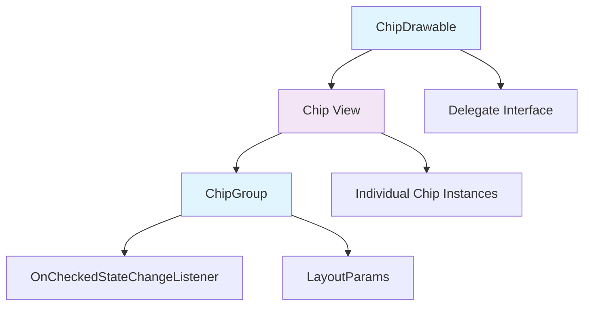
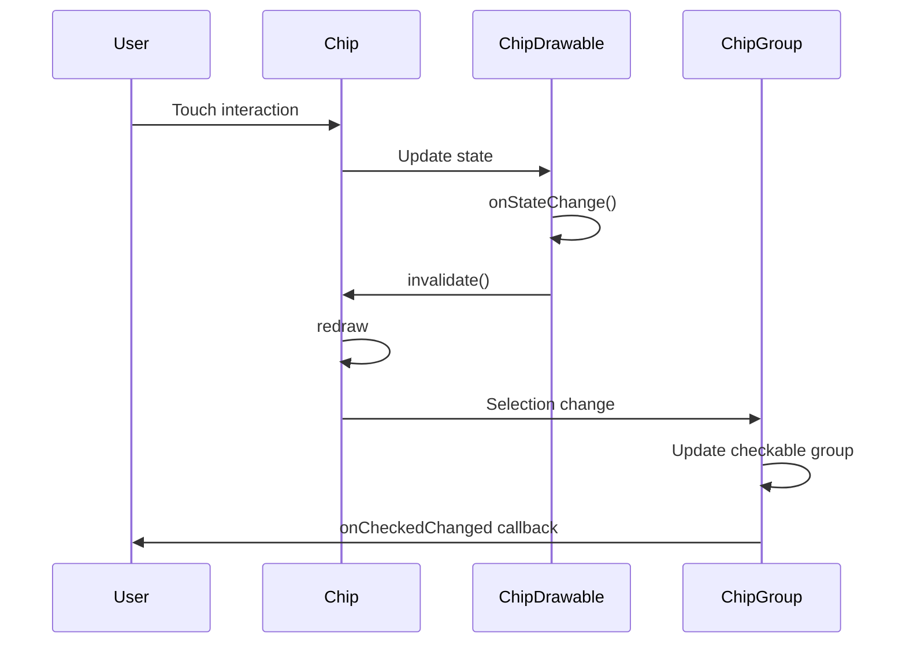

# Chip Module Documentation

## Overview

The Chip module provides Material Design chip components for Android applications. Chips are compact elements that represent an input, attribute, or action. They allow users to enter information, make selections, filter content, or trigger actions.

## Architecture

The chip module is organized into several key components that work together to provide a complete chip implementation:



## Core Components

### 1. ChipDrawable
The `ChipDrawable` class is the core drawable implementation that contains all layout and drawing logic for chips. It extends `MaterialShapeDrawable` and implements `TintAwareDrawable`, `Callback`, and `TextDrawableDelegate` interfaces.

**Key Responsibilities:**
- Drawing chip background, stroke, and ripple effects
- Managing chip icons (leading, checked, and close icons)
- Handling text rendering and ellipsization
- State management for different chip states (checked, pressed, focused)
- Touch interaction boundaries for chip and close icon areas

**Key Features:**
- Support for chip icons, checked icons, and close icons
- Customizable padding and spacing
- Text appearance and ellipsization support
- Ripple effects and state-based coloring
- Shape theming integration

### 2. ChipGroup
The `ChipGroup` class extends `FlowLayout` to manage multiple chips, providing layout and selection management capabilities.

**Key Responsibilities:**
- Managing multiple chips in a flexible layout
- Supporting single and multiple selection modes
- Handling chip spacing and layout direction
- Providing selection change callbacks
- Accessibility support

**Key Features:**
- Single-line and multi-line layout modes
- Single and multiple selection support
- Horizontal and vertical chip spacing
- Selection requirement enforcement
- Integration with CheckableGroup for selection management

## Sub-modules

### chipdrawable-core
Contains the core drawable implementation for individual chips. This sub-module handles the visual rendering, state management, and interaction logic for individual chip drawables. See [chipdrawable-core.md](chipdrawable-core.md) for detailed documentation on the ChipDrawable.Delegate interface and drawable implementation details.

### chipgroup-core  
Contains the group management and layout functionality for multiple chips. This sub-module provides the container logic for managing multiple chips, including selection management, layout algorithms, and event handling. See [chipgroup-core.md](chipgroup-core.md) for detailed documentation on the OnCheckedStateChangeListener, LayoutParams, and group management functionality.

## Data Flow



## Integration with Other Modules

The chip module integrates with several other Material Design components:

- **[MaterialShapeDrawable](shape.md)**: Inherits shape theming capabilities
- **[Color System](color.md)**: Uses MaterialColors for theming
- **[Ripple System](ripple.md)**: Integrates with RippleUtils for touch feedback
- **[Text Appearance](textfield.md)**: Uses TextAppearance for text styling
- **[Animation System](transition.md)**: Supports MotionSpec for animations

## Usage Patterns

### Individual Chip
```xml
<com.google.android.material.chip.Chip
    android:layout_width="wrap_content"
    android:layout_height="wrap_content"
    android:text="Sample Chip"
    app:chipIcon="@drawable/ic_icon"
    app:closeIconVisible="true" />
```

### Chip Group
```xml
<com.google.android.material.chip.ChipGroup
    android:layout_width="match_parent"
    android:layout_height="wrap_content"
    app:singleSelection="true"
    app:chipSpacingHorizontal="8dp">
    
    <com.google.android.material.chip.Chip
        android:layout_width="wrap_content"
        android:layout_height="wrap_content"
        android:text="Option 1" />
        
    <com.google.android.material.chip.Chip
        android:layout_width="wrap_content"
        android:layout_height="wrap_content"
        android:text="Option 2" />
        
</com.google.android.material.chip.ChipGroup>
```

## Key Features

### Visual Customization
- Background and stroke colors with state-based theming
- Customizable corner radius and shape appearance
- Icon support (leading, checked, and close icons)
- Text appearance and color customization
- Ripple effects with customizable colors

### Interaction Support
- Checkable chips with checked state management
- Close icon with separate touch handling
- Accessibility support with proper content descriptions
- Touch feedback through ripple effects
- State-based visual changes

### Layout Flexibility
- Single-line and multi-line chip groups
- Configurable spacing between chips
- RTL layout support
- Dynamic chip addition and removal
- Selection management with single and multiple modes

## Performance Considerations

- ChipDrawable uses efficient drawing with layer optimization
- Text measurement caching for performance
- State change optimization to minimize redraws
- Proper drawable lifecycle management
- Memory-efficient icon handling with drawable wrapping

## Accessibility

The chip module provides comprehensive accessibility support:
- Proper content descriptions for icons
- Accessibility node information for chip groups
- Selection state announcements
- Touch target sizing for better accessibility
- Support for screen readers and navigation