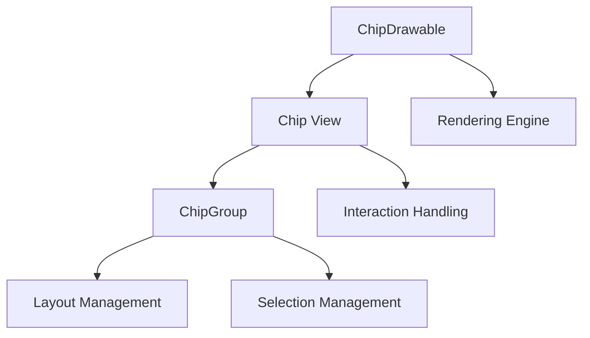
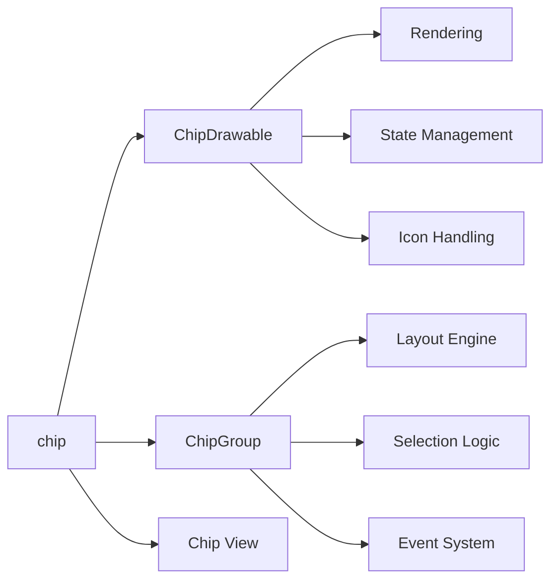

# Chip Module Documentation

## Overview

The Chip module provides Material Design chip components for Android applications. Chips are compact elements that represent an input, attribute, or action. They can be used for selection, filtering, or as actionable elements in user interfaces.

## Architecture

The chip module is organized into several key components that work together to provide a complete chip implementation:


```mermaid
graph TD
    A[ChipDrawable] --> B[Chip View]
    B --> C[ChipGroup]
    C --> D[Layout Management]
    C --> E[Selection Management]
    B --> F[Interaction Handling]
    A --> G[Rendering Engine]
```

## Core Components

### 1. [ChipDrawable](chip-drawable.md)
The foundational drawable class that handles all rendering logic for chips. It manages:
- Visual appearance (background, stroke, ripple effects)
- Text rendering and layout
- Icon management (chip icon, checked icon, close icon)
- State-based styling
- Touch interactions

**Key Features:**
- Standalone drawable usage for custom implementations
- Comprehensive state management
- RTL support
- Accessibility features
- Shape theming integration

For detailed implementation details, see [ChipDrawable Documentation](chip-drawable.md).

### 2. [ChipGroup](chip-group.md)
A container component that manages multiple chips with advanced layout and selection capabilities:

**Layout Features:**
- Multi-line reflow layout
- Single-line horizontal scrolling
- Configurable spacing
- Flow-based arrangement

**Selection Management:**
- Single selection mode (RadioGroup-like behavior)
- Multiple selection support
- Selection requirement enforcement
- Programmatic selection control

**Event Handling:**
- Checked state change listeners
- Hierarchical event delegation
- Accessibility support

For detailed implementation details, see [ChipGroup Documentation](chip-group.md).

## Module Structure


```mermaid
graph LR
    A[chip] --> B[ChipDrawable]
    A --> C[ChipGroup]
    A --> D[Chip View]
    
    B --> E[Rendering]
    B --> F[State Management]
    B --> G[Icon Handling]
    
    C --> H[Layout Engine]
    C --> I[Selection Logic]
    C --> J[Event System]
```

## Key Capabilities

### Visual Customization
- **Background Colors**: Surface and background color state lists
- **Stroke Styling**: Configurable stroke color and width
- **Corner Radius**: Customizable rounded corners
- **Ripple Effects**: Material Design ripple animations
- **Shape Theming**: Integration with Material shape system

### Content Management
- **Text Support**: Full text rendering with ellipsize support
- **Icon System**: Three distinct icon types (chip, checked, close)
- **Padding Control**: Granular padding for all elements
- **Size Constraints**: Minimum height and maximum width controls

### Interaction Models
- **Checkable Chips**: Toggle state support
- **Action Chips**: Click-only behavior
- **Filter Chips**: Selection with visual feedback
- **Input Chips**: Removable with close icons

### Accessibility
- **Screen Reader Support**: Proper content descriptions
- **Touch Targets**: Minimum 48dp touch areas
- **State Announcements**: Checked state changes
- **Navigation**: Proper focus handling

## Integration Points

### Related Modules
- **[shape](shape.md)**: Shape appearance and theming
- **[ripple](ripple.md)**: Ripple effect implementation
- **[color](color.md)**: Color state list management
- **[resources](resources.md)**: Resource loading utilities
- **[internal](internal.md)**: Internal utilities and helpers

### Dependencies
- **MaterialShapeDrawable**: Base class for shape rendering
- **TextDrawableHelper**: Text rendering assistance
- **ThemeEnforcement**: Theme attribute resolution
- **MotionSpec**: Animation specifications

## Usage Patterns

### Basic Chip Implementation
```xml
<com.google.android.material.chip.Chip
    android:layout_width="wrap_content"
    android:layout_height="wrap_content"
    android:text="Sample Chip"
    app:chipIcon="@drawable/ic_sample"
    app:chipBackgroundColor="@color/chip_background" />
```

### ChipGroup with Selection
```xml
<com.google.android.material.chip.ChipGroup
    android:layout_width="match_parent"
    android:layout_height="wrap_content"
    app:singleSelection="true"
    app:chipSpacing="8dp">
    
    <com.google.android.material.chip.Chip
        android:id="@+id/chip1"
        android:text="Option 1" />
    
    <com.google.android.material.chip.Chip
        android:id="@+id/chip2"
        android:text="Option 2" />
</com.google.android.material.chip.ChipGroup>
```

### Programmatic Chip Creation
```java
ChipDrawable chipDrawable = ChipDrawable.createFromResource(context, R.xml.standalone_chip);
chipDrawable.setText("Dynamic Chip");
chipDrawable.setChipIconResource(R.drawable.ic_dynamic);
chipDrawable.setBounds(0, 0, chipDrawable.getIntrinsicWidth(), chipDrawable.getIntrinsicHeight());
```

## Performance Considerations

### Rendering Optimization
- Efficient canvas drawing with layer management
- Smart invalidation based on state changes
- Optimized text measurement and layout
- Icon caching and reuse

### Memory Management
- Weak reference delegate pattern
- Drawable state optimization
- Resource cleanup on detach
- Efficient state array handling

## Customization Guide

### Creating Custom Chip Styles
1. Define XML attributes for appearance
2. Extend ChipDrawable for custom rendering
3. Implement custom state management
4. Handle accessibility requirements

### Advanced Layout Scenarios
- Custom ChipGroup implementations
- Integration with RecyclerView
- Dynamic chip generation
- Complex selection logic

## Best Practices

### Design Guidelines
- Maintain minimum touch target sizes
- Use appropriate chip types for use cases
- Ensure proper color contrast
- Provide clear selection feedback

### Implementation Tips
- Reuse ChipDrawable instances when possible
- Use appropriate caching strategies
- Handle configuration changes properly
- Test accessibility thoroughly

## API Reference

### ChipDrawable
- `createFromAttributes()`: Factory method with attributes
- `createFromResource()`: XML resource creation
- State management methods
- Visual property setters/getters

### ChipGroup
- `check()`: Programmatic selection
- `setOnCheckedStateChangeListener()`: Selection callbacks
- `setChipSpacing()`: Layout configuration
- `isSingleSelection()`: Mode queries

For detailed API information, refer to the official Material Design documentation and source code comments.