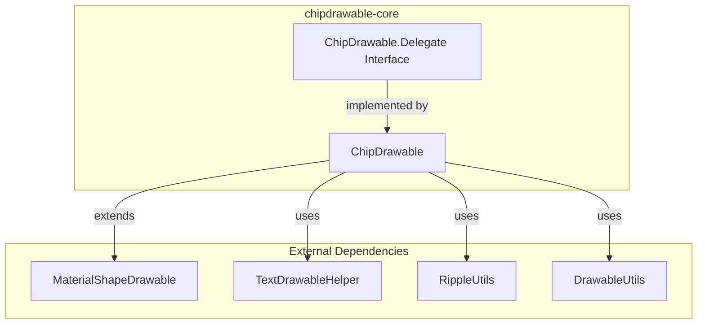
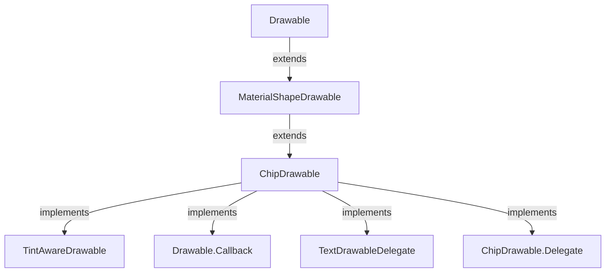
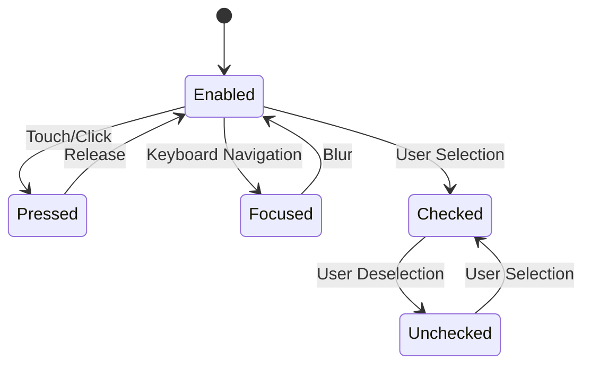
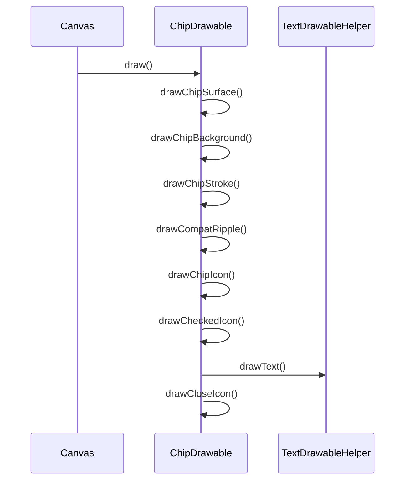
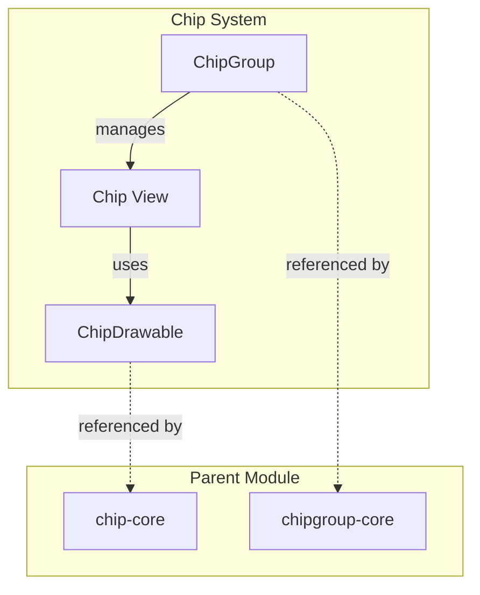
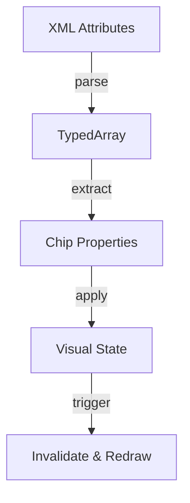

# ChipDrawable Core Module Documentation

## Introduction

The chipdrawable-core module provides the foundational rendering and state management capabilities for Material Design chips in Android applications. This module contains the `ChipDrawable.Delegate` interface and the core `ChipDrawable` class, which serves as the primary drawable implementation for chip components. The module handles all visual aspects of chip rendering, including text, icons, backgrounds, borders, and interactive states.

## Module Architecture

### Core Components



### Component Hierarchy



## Core Functionality

### ChipDrawable Class

The `ChipDrawable` class is the central component of this module, extending `MaterialShapeDrawable` to provide chip-specific functionality. It manages the complete visual representation of chips, including:

- **Text Rendering**: Custom text drawing with proper alignment and ellipsization
- **Icon Management**: Support for chip icons, checked icons, and close icons
- **State Management**: Comprehensive state handling for enabled, pressed, focused, and checked states
- **Visual Styling**: Background colors, stroke colors, corner radius, and ripple effects
- **Layout Management**: Precise padding and positioning calculations

### Key Features

#### 1. Multi-Element Layout System

```mermaid
graph LR
    A[Chip Start Padding] --> B[Icon Start Padding]
    B --> C[Chip Icon]
    C --> D[Icon End Padding]
    D --> E[Text Start Padding]
    E --> F[Chip Text]
    F --> G[Text End Padding]
    G --> H[Close Icon Start Padding]
    H --> I[Close Icon]
    I --> J[Close Icon End Padding]
    J --> K[Chip End Padding]
```



#### 2. State Management Architecture



#### 3. Drawing Pipeline



## Component Relationships

### Integration with Chip System



### External Dependencies

The chipdrawable-core module integrates with several Material Design components:

- **[MaterialShapeDrawable](../shape.md)**: Provides shape theming and elevation support
- **[TextDrawableHelper](../textfield.md)**: Handles text rendering and appearance
- **[RippleUtils](../color.md)**: Manages ripple effect animations
- **[DrawableUtils](../color.md)**: Provides utility functions for drawable operations

## Data Flow

### Attribute Loading Flow



### State Change Propagation


## Key Interfaces

### ChipDrawable.Delegate

The `Delegate` interface provides a callback mechanism for views that host `ChipDrawable` instances:

```java
public interface Delegate {
    void onChipDrawableSizeChange();
}
```

This interface allows the hosting view to respond to size changes in the chip drawable, ensuring proper layout updates.

## Configuration Options

### Visual Properties

- **Background Colors**: Surface and background color state lists
- **Stroke Properties**: Color, width, and corner radius
- **Text Properties**: Appearance, size, color, and ellipsize behavior
- **Icon Properties**: Size, tint, and visibility for all icon types

### Layout Properties

- **Padding Values**: Configurable padding for all chip elements
- **Icon Sizing**: Fixed or dynamic icon dimensions
- **Text Constraints**: Maximum width and truncation behavior

### Behavioral Properties

- **Checkable State**: Whether the chip supports checked/unchecked states
- **Ripple Effects**: Compatibility ripple drawing
- **Motion Specs**: Show/hide animation specifications

## Usage Patterns

### Standalone Usage

The `ChipDrawable` can be used independently of the `Chip` view for specialized use cases:

```java
// Create from XML resource
ChipDrawable chipDrawable = ChipDrawable.createFromResource(context, R.xml.chip);

// Create from attributes
ChipDrawable chipDrawable = ChipDrawable.createFromAttributes(
    context, attrs, defStyleAttr, defStyleRes);
```

### Integration Requirements

When used standalone, the host view must manage:
- Bounds setting with proper intrinsic dimensions
- Canvas drawing calls
- Callback registration for invalidations
- State management for interactions
- Layout direction support

## Performance Considerations

### Optimization Strategies

1. **Lazy Initialization**: Components are created only when needed
2. **State Caching**: Current colors and dimensions are cached to avoid recalculation
3. **Invalidation Batching**: Multiple property changes trigger a single redraw
4. **Text Measurement Caching**: Text width calculations are cached and invalidated only when necessary

### Memory Management

- Weak references are used for delegate objects to prevent memory leaks
- Child drawables are properly unapplied when no longer needed
- Resource cleanup is handled through standard drawable lifecycle methods

## Accessibility Support

The module provides comprehensive accessibility features:

- **Content Descriptions**: Support for close icon content descriptions
- **State Announcements**: Proper state changes for screen readers
- **Touch Targets**: Configurable touch bounds for proper accessibility sizing
- **RTL Support**: Full right-to-left layout support

## Testing and Debugging

### Debug Features

- Visual debug overlays can be enabled to show component boundaries
- Touch bounds are visually indicated in debug mode
- Text alignment and positioning are highlighted

### Validation

- Input validation for all property setters
- Bounds checking for icon and text dimensions
- State consistency validation during state changes

## Migration and Compatibility

### Version Compatibility

The module maintains backward compatibility through:
- Deprecated method preservation with forwarding to new implementations
- Attribute migration support for XML resources
- Compatibility ripple drawing for older Android versions

### Shape Theming Integration

Modern shape theming is supported alongside traditional corner radius properties:
- Shape appearance models can be applied when shape theming is enabled
- Legacy corner radius properties are maintained for backward compatibility
- Automatic fallback to traditional rendering when shape theming is disabled

This comprehensive approach ensures that the chipdrawable-core module provides a robust, flexible foundation for chip rendering while maintaining compatibility with existing implementations and supporting modern Material Design theming capabilities.