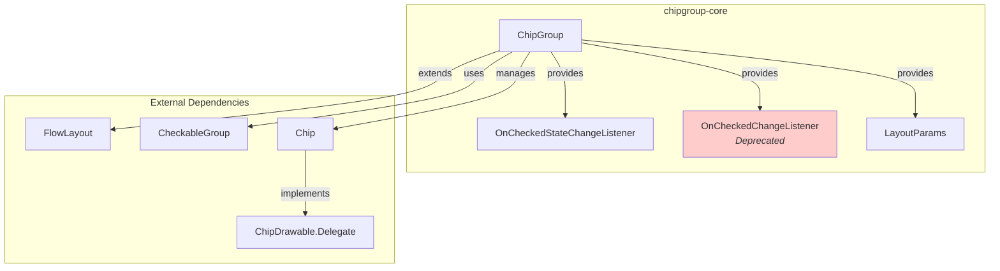
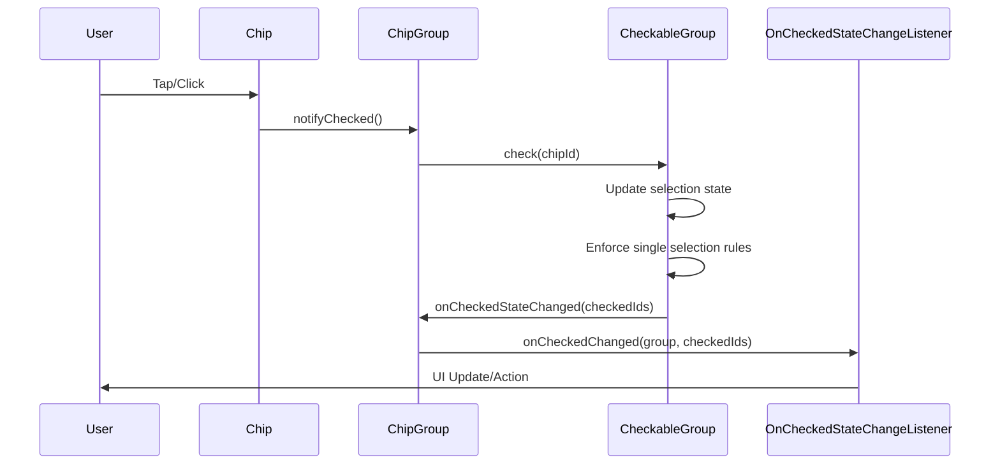
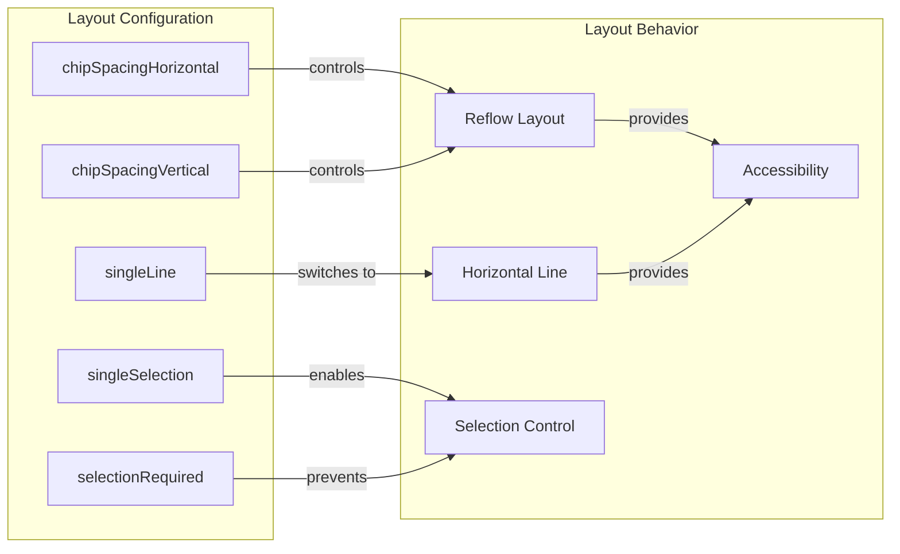
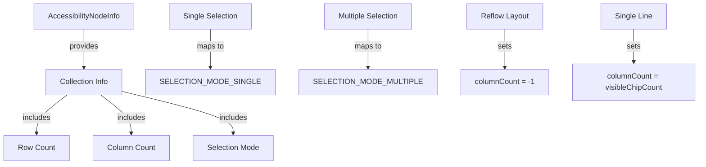

# ChipGroup Core Module Documentation

## Introduction

The chipgroup-core module provides the foundational components for managing groups of Material Design chips. It implements a container that manages multiple [Chip](chipdrawable-core.md) components with support for single/multiple selection, reflow layout, and accessibility features. This module is essential for creating interactive chip interfaces that follow Material Design guidelines.

## Core Components

### 1. ChipGroup.OnCheckedStateChangeListener

**Purpose**: Modern interface for handling chip selection state changes with support for multiple checked chips.

**Key Features**:
- Receives callbacks when chip selection changes
- Provides list of all currently checked chip IDs
- Supports both single and multiple selection modes
- Replaces the deprecated `OnCheckedChangeListener`

**Usage**:
```java
chipGroup.setOnCheckedStateChangeListener((group, checkedIds) -> {
    // Handle selection change
    Log.d("ChipGroup", "Selected chips: " + checkedIds);
});
```

### 2. ChipGroup.OnCheckedChangeListener (Deprecated)

**Purpose**: Legacy interface for single selection mode callbacks.

**Status**: Deprecated in favor of `OnCheckedStateChangeListener`
- Only works in single selection mode
- Provides single checked chip ID
- Maintained for backward compatibility

### 3. ChipGroup.LayoutParams

**Purpose**: Custom layout parameters for chips within a ChipGroup.

**Features**:
- Extends `MarginLayoutParams` for margin support
- Provides multiple constructors for different use cases
- Ensures proper layout behavior for chips

**Constructors**:
- `LayoutParams(Context, AttributeSet)` - XML inflation
- `LayoutParams(ViewGroup.LayoutParams)` - Copy constructor
- `LayoutParams(int, int)` - Width/height specification
- `LayoutParams(MarginLayoutParams)` - Margin parameter copy

## Architecture

### Component Relationships



### Data Flow Architecture



### Layout and Spacing System



## Key Features

### 1. Selection Management

**Single Selection Mode**:
- Only one chip can be checked at a time
- Checking a new chip automatically unchecks the previous one
- Provides `getCheckedChipId()` for single ID retrieval

**Multiple Selection Mode**:
- Multiple chips can be checked simultaneously
- Each chip operates independently
- Provides `getCheckedChipIds()` for list of checked IDs

**Selection Required**:
- Prevents all chips from being unchecked
- Maintains at least one selection
- Works in both single and multiple selection modes

### 2. Layout Options

**Reflow Layout (Default)**:
- Chips automatically wrap to new lines
- Configurable horizontal and vertical spacing
- Responsive to container width changes

**Single Line Layout**:
- All chips constrained to one horizontal line
- Requires `HorizontalScrollView` for overflow
- Set via `setSingleLine(true)`

### 3. Spacing Control

**Independent Spacing**:
- `setChipSpacingHorizontal()` - Horizontal gap between chips
- `setChipSpacingVertical()` - Vertical gap between lines
- `setChipSpacing()` - Sets both dimensions

**Resource-based Configuration**:
- `setChipSpacingHorizontalResource()`
- `setChipSpacingVerticalResource()`
- `setChipSpacingResource()`

## Integration Patterns

### Basic Implementation

```java
ChipGroup chipGroup = findViewById(R.id.chip_group);

// Add chips programmatically
Chip chip1 = new Chip(context);
chip1.setText("Option 1");
chip1.setId(View.generateViewId());
chipGroup.addView(chip1);

// Set selection listener
chipGroup.setOnCheckedStateChangeListener((group, checkedIds) -> {
    // Handle selection changes
});
```

### XML Configuration

```xml
<com.google.android.material.chip.ChipGroup
    android:id="@+id/chip_group"
    android:layout_width="match_parent"
    android:layout_height="wrap_content"
    app:singleSelection="true"
    app:chipSpacingHorizontal="8dp"
    app:chipSpacingVertical="4dp"
    app:checkedChip="@+id/chip1">
    
    <com.google.android.material.chip.Chip
        android:id="@+id/chip1"
        android:layout_width="wrap_content"
        android:layout_height="wrap_content"
        android:text="Option 1"/>
    
    <!-- More chips -->
</com.google.android.material.chip.ChipGroup>
```

### Advanced Selection Management

```java
// Configure selection behavior
chipGroup.setSingleSelection(true);
chipGroup.setSelectionRequired(true);

// Programmatic selection
chipGroup.check(R.id.chip2);

// Get current selection
int selectedId = chipGroup.getCheckedChipId();
List<Integer> selectedIds = chipGroup.getCheckedChipIds();

// Clear selection
chipGroup.clearCheck();
```

## Accessibility Features

### Screen Reader Support



**Key Accessibility Features**:
- Announces as collection to screen readers
- Provides row and column information
- Indicates selection mode (single/multiple)
- Supports keyboard navigation
- Maintains focus management

## Performance Considerations

### Efficient Updates

- **CheckableGroup Integration**: Uses internal `CheckableGroup` for efficient state management
- **Sorted ID Lists**: Maintains sorted lists for consistent ordering
- **Lazy Evaluation**: Defers expensive operations until necessary

### Memory Management

- **View Recycling**: Proper cleanup when chips are removed
- **Listener Management**: Automatic listener registration/cleanup
- **State Preservation**: Maintains selection state across configuration changes

## Dependencies

### Internal Dependencies

- **FlowLayout**: Base class for reflow layout behavior
- **CheckableGroup**: Manages selection state and logic
- **ThemeEnforcement**: Ensures proper theming
- **MaterialThemeOverlay**: Applies theme overlays

### Related Modules

- **[chipdrawable-core](chipdrawable-core.md)**: Individual chip components
- **[internal-components](internal-components.md)**: CheckableGroup and FlowLayout implementations

## Migration Guide

### From OnCheckedChangeListener to OnCheckedStateChangeListener

**Before (Deprecated)**:
```java
chipGroup.setOnCheckedChangeListener((group, checkedId) -> {
    // Handle single selection
});
```

**After (Recommended)**:
```java
chipGroup.setOnCheckedStateChangeListener((group, checkedIds) -> {
    // Handle any selection mode
    if (chipGroup.isSingleSelection() && !checkedIds.isEmpty()) {
        int checkedId = checkedIds.get(0);
        // Handle single selection
    }
});
```

## Best Practices

### 1. Selection Management
- Use `OnCheckedStateChangeListener` for new implementations
- Set `selectionRequired` when at least one option must be selected
- Provide clear visual feedback for selected states

### 2. Layout Optimization
- Use appropriate spacing for touch targets (minimum 8dp)
- Consider single-line mode for horizontal scrolling scenarios
- Test reflow behavior with different screen sizes

### 3. Accessibility
- Ensure chips have descriptive text
- Test with screen readers
- Provide keyboard navigation support
- Use appropriate content descriptions

### 4. Performance
- Avoid frequent selection changes in rapid succession
- Use `clearCheck()` for bulk deselection
- Consider view recycling for large datasets

## Troubleshooting

### Common Issues

**Chips Not Responding to Selection**:
- Verify chip IDs are properly set
- Check selection mode configuration
- Ensure listeners are registered

**Layout Issues**:
- Verify spacing values are appropriate
- Check parent container constraints
- Test with different screen densities

**Accessibility Problems**:
- Ensure content descriptions are set
- Verify selection announcements
- Test keyboard navigation

This documentation provides a comprehensive guide for implementing and managing chip groups in Material Design applications. For additional information about individual chip components, refer to the [chipdrawable-core](chipdrawable-core.md) documentation.