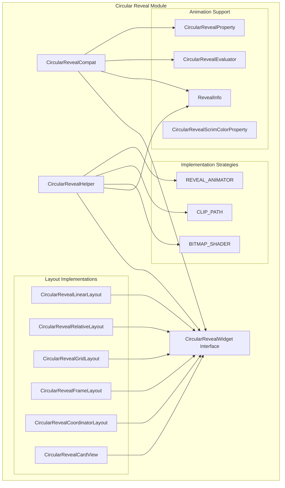
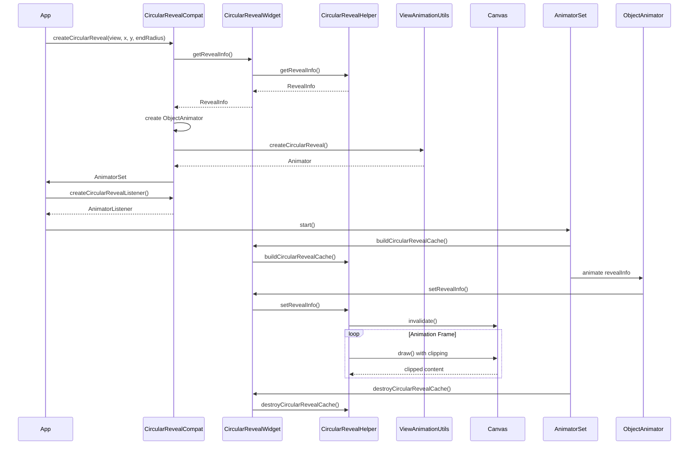
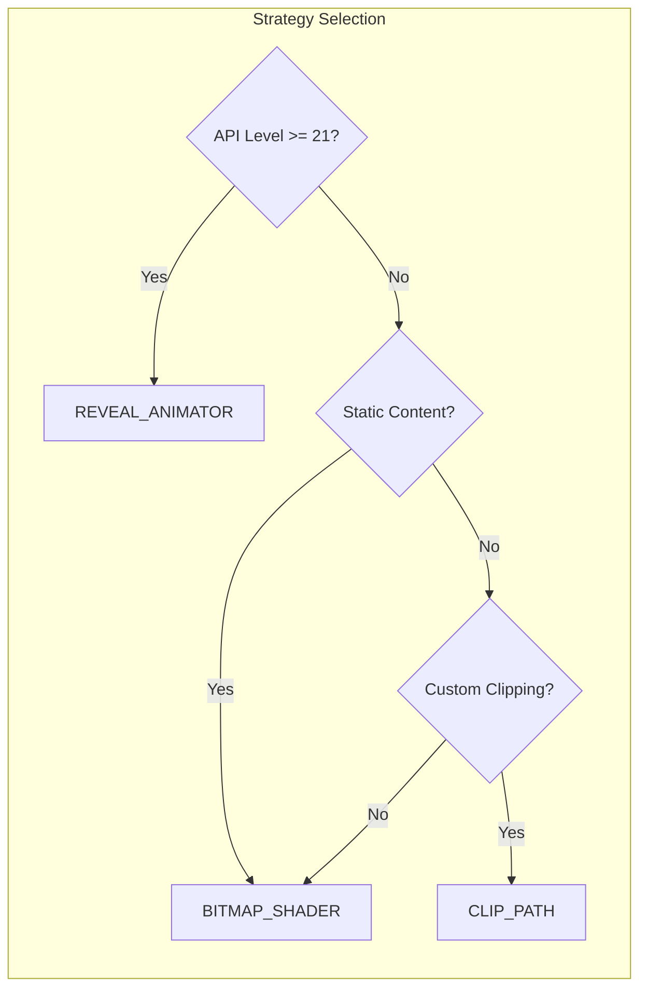

# Circular Reveal Module

## Overview

The Circular Reveal module provides a framework for implementing circular reveal animations in Android applications. This module enables developers to create smooth, circular reveal effects that can be applied to various layout types, providing a visually appealing way to show or hide content with a circular animation pattern.

## Purpose

The circular reveal animation is a Material Design pattern where content is revealed or hidden through a circular clipping animation, typically originating from a specific point (like a touch point or view center). This module provides:

- **Cross-platform compatibility**: Works across different Android API levels with graceful degradation
- **Multiple layout support**: Circular reveal capabilities for various layout types
- **Animation framework**: Helper utilities for creating and managing circular reveal animations
- **CoordinatorLayout integration**: Special support for CoordinatorLayout with circular reveal effects

## Architecture

The module follows a wrapper pattern where existing Android layouts are enhanced with circular reveal capabilities through the `CircularRevealWidget` interface.



## Core Components

### CircularRevealCompat
The main utility class that provides static methods for creating circular reveal animations. It acts as a compatibility layer for `ViewAnimationUtils.createCircularReveal()` and provides additional functionality for managing the animation lifecycle.

**Key Features:**
- Creates circular reveal animations with proper start/end radius configuration
- Provides animation listeners for cache management
- Handles both single radius and dual radius animations
- Ensures compatibility across different Android API levels

### CircularRevealWidget Interface
The core interface that defines the contract for views that support circular reveal animations. All circular reveal layouts implement this interface.

**Key Methods:**
- `buildCircularRevealCache()`: Prepares the view for circular reveal animation
- `destroyCircularRevealCache()`: Cleans up resources after animation
- `getRevealInfo()`/`setRevealInfo()`: Manages reveal animation parameters
- `getCircularRevealScrimColor()`/`setCircularRevealScrimColor()`: Controls overlay color
- `draw()`/`actualDraw()`: Handles custom drawing with circular clipping

### Layout Implementations
Specialized layout classes that wrap standard Android layouts with circular reveal capabilities:

- **CircularRevealLinearLayout**: LinearLayout with circular reveal support
- **CircularRevealRelativeLayout**: RelativeLayout with circular reveal support  
- **CircularRevealGridLayout**: GridLayout with circular reveal support
- **CircularRevealFrameLayout**: FrameLayout with circular reveal support
- **CircularRevealCoordinatorLayout**: CoordinatorLayout with circular reveal support
- **CircularRevealCardView**: MaterialCardView with circular reveal support

Each implementation delegates circular reveal functionality to `CircularRevealHelper` while maintaining the original layout behavior.

### CircularRevealHelper
The helper class that implements the actual circular reveal logic. It manages:
- Circular clipping calculations using multiple strategies (BitmapShader, ClipPath, RevealAnimator)
- Canvas transformations and custom drawing
- Overlay drawable management
- Opacity handling during animations
- Cache management for performance optimization
- Debug mode for development

**Implementation Strategies:**
- `BITMAP_SHADER`: Uses BitmapShader for static bitmap animations
- `CLIP_PATH`: Uses Canvas.clipPath() for circular clipping
- `REVEAL_ANIMATOR`: Uses ViewAnimationUtils.createCircularReveal() (default strategy)

### RevealInfo
Data class that holds the circular reveal parameters:
- `centerX`, `centerY`: Float coordinates for the reveal circle center
- `radius`: Float value for the reveal radius
- `INVALID_RADIUS`: Constant representing no circular reveal clip

### Animation Support Components
- **CircularRevealEvaluator**: TypeEvaluator for interpolating between RevealInfo states
- **CircularRevealProperty**: Property wrapper for animating circular reveal values
- **CircularRevealScrimColorProperty**: Property wrapper for animating scrim color values

## Data Flow and Animation Process



## Implementation Strategies

The CircularRevealHelper supports three different strategies for implementing circular reveal effects:

### REVEAL_ANIMATOR (Default)
Uses Android's native `ViewAnimationUtils.createCircularReveal()` on Lollipop and above. This is the most efficient strategy for modern devices.

**Use Cases:**
- Primary strategy for API 21+ devices
- Best performance on supported devices
- Native hardware acceleration support

### CLIP_PATH
Uses `Canvas.clipPath()` to create circular clipping. Provides good compatibility across Android versions.

**Use Cases:**
- Pre-Lollipop devices where native reveal is unavailable
- When fine control over clipping is needed
- Custom animation requirements

### BITMAP_SHADER
Uses `BitmapShader` to create circular reveal from a static bitmap. Useful for complex content that doesn't change during animation.

**Use Cases:**
- Static content animations
- Complex views that are expensive to redraw
- When content doesn't change during animation



## Usage Examples

### Basic Circular Reveal Animation
```java
// Create circular reveal animation
Animator reveal = CircularRevealCompat.createCircularReveal(
    circularRevealView, centerX, centerY, startRadius, endRadius);

// Add animation listener for proper cache management
reveal.addListener(CircularRevealCompat.createCircularRevealListener(circularRevealView));

// Start animation
reveal.start();
```

### Layout Integration
The module provides drop-in replacements for standard Android layouts:

```xml
<com.google.android.material.circularreveal.CircularRevealLinearLayout
    android:id="@+id/reveal_container"
    android:layout_width="match_parent"
    android:layout_height="match_parent">
    <!-- Your content here -->
</com.google.android.material.circularreveal.CircularRevealLinearLayout>
```

## Integration with Other Modules

The circular reveal module integrates with several other Material Design components:

- **[CoordinatorLayout](coordinatorlayout.md)**: Special integration for complex layout animations
- **[Animation utilities](common-utils.md)**: Leverages common animation helpers for smooth performance
- **[Theme system](theme.md)**: Respects theme colors and styling for consistent visual appearance

## Performance Considerations

- **Cache Management**: The module implements proper cache building and destruction to optimize animation performance
- **Hardware Acceleration**: Leverages hardware acceleration when available for smooth animations
- **Memory Efficiency**: Uses efficient clipping algorithms to minimize memory overhead

## Integration with Other Material Design Components

The circular reveal module integrates seamlessly with other Material Design components:

### CoordinatorLayout Integration
The `CircularRevealCoordinatorLayout` provides special integration for complex layout animations:

```xml
<com.google.android.material.circularreveal.coordinatorlayout.CircularRevealCoordinatorLayout
    android:id="@+id/coordinator_container"
    android:layout_width="match_parent"
    android:layout_height="match_parent">
    
    <!-- Your CoordinatorLayout content with Material components -->
    <com.google.android.material.appbar.AppBarLayout>
        <!-- App bar content -->
    </com.google.android.material.appbar.AppBarLayout>
    
    <com.google.android.material.floatingactionbutton.FloatingActionButton
        android:id="@+id/fab"
        android:layout_width="wrap_content"
        android:layout_height="wrap_content"
        android:src="@drawable/ic_add"
        app:layout_anchor="@id/coordinator_container"
        app:layout_anchorGravity="bottom|end" />
        
</com.google.android.material.circularreveal.coordinatorlayout.CircularRevealCoordinatorLayout>
```

### CardView Integration
The `CircularRevealCardView` combines Material card styling with circular reveal animations:

```java
// Create circular reveal on a Material card
CircularRevealCardView cardView = findViewById(R.id.card_view);
Animator reveal = CircularRevealCompat.createCircularReveal(
    cardView, centerX, centerY, 0, cardView.getWidth());
reveal.start();
```

### Theme Integration
The module respects Material theme attributes and can be styled using theme overlays:

```xml
<!-- Apply theme overlay to circular reveal container -->
<com.google.android.material.circularreveal.CircularRevealLinearLayout
    android:theme="@style/ThemeOverlay.MaterialComponents.Dark"
    android:layout_width="match_parent"
    android:layout_height="match_parent">
    <!-- Themed content -->
</com.google.android.material.circularreveal.CircularRevealLinearLayout>
```

## Compatibility

The module provides backward compatibility for pre-Lollipop devices through:
- Graceful degradation of circular reveal effects
- Alternative animation strategies for unsupported API levels
- Consistent API surface across all Android versions

## Advanced Features

### Scrim Color and Overlay Drawable
The circular reveal module supports visual enhancements through scrim colors and overlay drawables:

```java
// Set scrim color for overlay effect
circularRevealView.setCircularRevealScrimColor(Color.argb(128, 0, 0, 0));

// Set overlay drawable (drawn on top of everything)
circularRevealView.setCircularRevealOverlayDrawable(overlayDrawable);
```

### Custom Animation Properties
Create custom animations using the property wrappers:

```java
// Animate scrim color
ObjectAnimator scrimAnimator = ObjectAnimator.ofInt(
    circularRevealView,
    CircularRevealWidget.CIRCULAR_REVEAL_SCRIM_COLOR,
    Color.TRANSPARENT,
    Color.argb(128, 0, 0, 0));

// Combine with reveal animation
AnimatorSet combined = new AnimatorSet();
combined.playTogether(revealAnimator, scrimAnimator);
```

### Performance Optimization
The module includes several performance optimizations:

```java
// Build cache before animation for better performance
circularRevealView.buildCircularRevealCache();

// Destroy cache after animation to free resources
circularRevealView.destroyCircularRevealCache();
```

### Debug Mode
Enable debug mode to visualize the circular reveal boundary:

```java
// Set DEBUG = true in CircularRevealHelper to enable debug visualization
// This will draw the reveal circle boundary for development purposes
```

## Best Practices

1. **Always use animation listeners**: Include `CircularRevealCompat.createCircularRevealListener()` to ensure proper cache management
2. **Set reveal info before animation**: Ensure `RevealInfo` is properly configured before starting animations
3. **Consider performance**: Use appropriate radius values and animation durations for smooth performance
4. **Test on multiple devices**: Verify animation behavior across different Android versions and screen sizes
5. **Use scrim colors judiciously**: Scrim colors can impact performance, use them only when necessary
6. **Optimize for your use case**: Choose the appropriate implementation strategy based on your content and target API levels