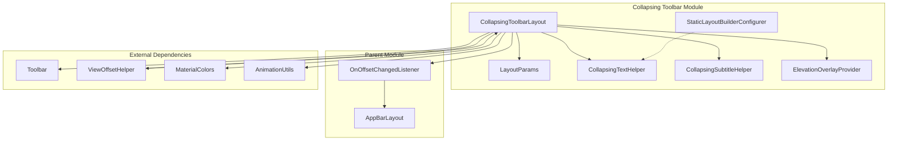
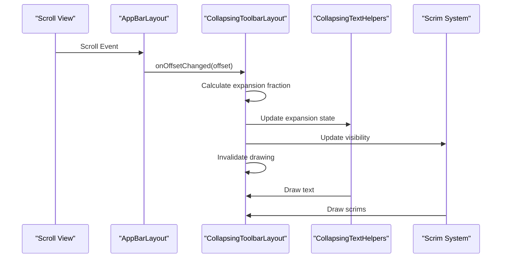
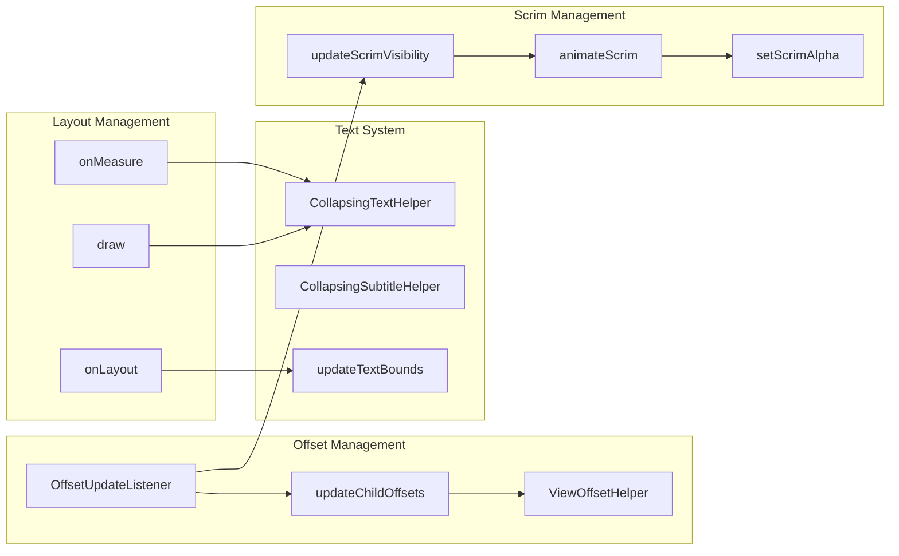
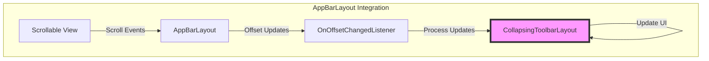

# Collapsing Toolbar Module

The collapsing-toolbar module provides the `CollapsingToolbarLayout` component, a sophisticated wrapper for Toolbar that implements a collapsing app bar with rich animation and interaction capabilities. This module is designed to work seamlessly with the [appbarlayout-core](appbarlayout-core.md) module to create dynamic, responsive top app bars that enhance user experience through visual feedback and smooth transitions.

## Overview

`CollapsingToolbarLayout` extends `FrameLayout` to provide a container that can house a `Toolbar` and other views while implementing sophisticated collapsing behavior. The layout responds to scroll events from its parent `AppBarLayout` to create engaging visual effects including title scaling, content scrims, and parallax scrolling.

## Core Components

### CollapsingToolbarLayout
The main component that orchestrates the collapsing behavior, managing title animations, scrim visibility, and child view interactions.

### StaticLayoutBuilderConfigurer
An interface for advanced customization of the `StaticLayout` used for title text rendering, allowing fine-grained control over text layout behavior.

### LayoutParams
Custom layout parameters that control how child views behave during the collapsing animation, supporting different collapse modes (off, pin, parallax).

## Architecture



## Key Features

### Collapsing Title System
The module implements a sophisticated title system with two `CollapsingTextHelper` instances:
- **Primary Title**: Main title text with configurable appearance and behavior
- **Subtitle**: Secondary text that collapses alongside the main title

### Title Collapse Modes
Two distinct animation modes for title transitions:
- **SCALE Mode** (`TITLE_COLLAPSE_MODE_SCALE`): Continuous scaling and translation
- **FADE Mode** (`TITLE_COLLAPSE_MODE_FADE`): Fade out/in with translation

### Scrim System
Dual scrim implementation for visual depth:
- **Content Scrim**: Overlays content when collapsed
- **Status Bar Scrim**: Handles system window insets

### Child View Behavior
Three collapse modes for child views:
- **OFF**: Normal behavior, no collapsing
- **PIN**: View remains fixed during collapse
- **PARALLAX**: View scrolls with parallax effect

## Data Flow



## Component Interactions



## Configuration and Customization

### Title Appearance
- **Expanded State**: Configurable text appearance, color, size, and gravity
- **Collapsed State**: Independent text appearance settings
- **Typography**: Custom typefaces for both states
- **Ellipsize**: Configurable text truncation behavior

### Layout Parameters
```xml
<com.google.android.material.appbar.CollapsingToolbarLayout
    android:layout_width="match_parent"
    android:layout_height="match_parent"
    app:layout_scrollFlags="scroll|exitUntilCollapsed"
    app:contentScrim="@color/colorPrimary"
    app:expandedTitleTextAppearance="@style/ExpandedTitle"
    app:collapsedTitleTextAppearance="@style/CollapsedTitle">
    
    <!-- Child views with collapse modes -->
    <ImageView
        android:layout_width="match_parent"
        android:layout_height="200dp"
        android:src="@drawable/header_image"
        app:layout_collapseMode="parallax"
        app:layout_collapseParallaxMultiplier="0.7" />
        
    <androidx.appcompat.widget.Toolbar
        android:layout_width="match_parent"
        android:layout_height="?attr/actionBarSize"
        app:layout_collapseMode="pin" />
        
</com.google.android.material.appbar.CollapsingToolbarLayout>
```

### Programmatic Configuration
```java
CollapsingToolbarLayout collapsingToolbar = findViewById(R.id.collapsing_toolbar);

// Set title and subtitle
collapsingToolbar.setTitle("Page Title");
collapsingToolbar.setSubtitle("Subtitle text");

// Configure title collapse mode
collapsingToolbar.setTitleCollapseMode(CollapsingToolbarLayout.TITLE_COLLAPSE_MODE_FADE);

// Set scrims
collapsingToolbar.setContentScrimColor(Color.BLUE);
collapsingToolbar.setStatusBarScrimColor(Color.TRANSPARENT);

// Configure animation duration
collapsingToolbar.setScrimAnimationDuration(300);
```

## Integration with AppBarLayout

The collapsing-toolbar module is designed to work seamlessly with the [appbarlayout-core](appbarlayout-core.md) module:



## Advanced Features

### Multi-line Title Support
The module supports multi-line titles with configurable line spacing and hyphenation:
- `setMaxLines()`: Control maximum lines in expanded state
- `setLineSpacingAdd()`: Configure line spacing
- `setHyphenationFrequency()`: Control text hyphenation

### System Window Insets
Advanced handling of system window insets:
- Automatic top inset application
- Force apply system window insets option
- Status bar scrim integration

### Experimental Features
Several experimental features for advanced use cases:
- `StaticLayoutBuilderConfigurer` for custom text layout
- RTL text direction heuristics
- Extra multiline height calculations

## Performance Considerations

### Optimization Strategies
1. **View Recycling**: Efficient view offset helper management
2. **Animation Optimization**: Hardware-accelerated scrim animations
3. **Text Bounds Caching**: Intelligent text bounds recalculation
4. **Drawing Optimization**: Selective invalidation and clipping

### Memory Management
- Drawable mutation for proper state management
- View offset helper reuse
- Efficient text measurement and layout

## Dependencies

The collapsing-toolbar module depends on:
- **[appbarlayout-core](appbarlayout-core.md)**: For scroll behavior integration
- **[behavior-system](behavior-system.md)**: For view offset management
- **[utility-components](utility-components.md)**: For utility functions
- **Material Components**: Animation, color, and theme utilities

## Best Practices

### Layout Structure
```xml
<androidx.coordinatorlayout.widget.CoordinatorLayout>
    <com.google.android.material.appbar.AppBarLayout>
        <com.google.android.material.appbar.CollapsingToolbarLayout
            android:layout_width="match_parent"
            android:layout_height="200dp"
            app:layout_scrollFlags="scroll|exitUntilCollapsed">
            
            <!-- Background content -->
            <ImageView
                app:layout_collapseMode="parallax" />
                
            <!-- Toolbar -->
            <androidx.appcompat.widget.Toolbar
                app:layout_collapseMode="pin" />
                
        </com.google.android.material.appbar.CollapsingToolbarLayout>
    </com.google.android.material.appbar.AppBarLayout>
    
    <!-- Scrollable content -->
    <androidx.core.widget.NestedScrollView
        app:layout_behavior="@string/appbar_scrolling_view_behavior">
    </androidx.core.widget.NestedScrollView>
</androidx.coordinatorlayout.widget.CoordinatorLayout>
```

### Performance Tips
1. Use appropriate `scrimVisibleHeightTrigger` values
2. Minimize complex drawable resources for scrims
3. Consider title collapse mode based on content complexity
4. Test with different text lengths and languages

### Accessibility
- Proper content descriptions from title text
- Support for screen readers
- High contrast mode compatibility
- Text scaling support

## Troubleshooting

### Common Issues
1. **Title not appearing**: Check `titleEnabled` and toolbar integration
2. **Scrim not showing**: Verify `scrimVisibleHeightTrigger` and content bounds
3. **Parallax not working**: Ensure proper `collapseMode` and multiplier settings
4. **Performance issues**: Optimize text complexity and animation duration

### Debug Techniques
- Use `getExpansionFraction()` to monitor collapse state
- Check `getScrimVisibleHeightTrigger()` for scrim behavior
- Verify `LayoutParams` configuration for child views
- Monitor `OnOffsetChangedListener` callbacks

## Migration Guide

### From Toolbar
When migrating from standard Toolbar to CollapsingToolbarLayout:
1. Wrap existing Toolbar in CollapsingToolbarLayout
2. Move title configuration to CollapsingToolbarLayout
3. Configure appropriate collapse modes
4. Test scroll behavior with AppBarLayout

### Version Compatibility
- Minimum API level considerations
- Feature availability across versions
- Backward compatibility strategies
- Material Design 3 compliance

This documentation provides a comprehensive guide to understanding and implementing the collapsing-toolbar module within the Material Design Components framework. For integration examples and advanced usage patterns, refer to the [appbarlayout-core](appbarlayout-core.md) documentation for complete app bar system implementation.