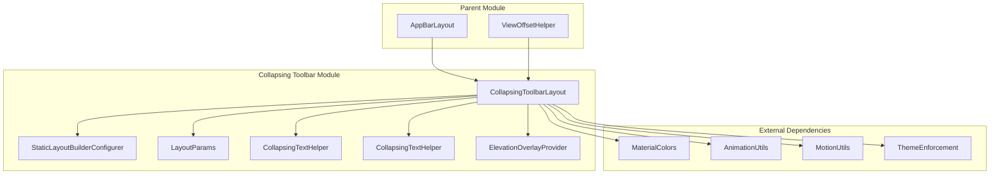
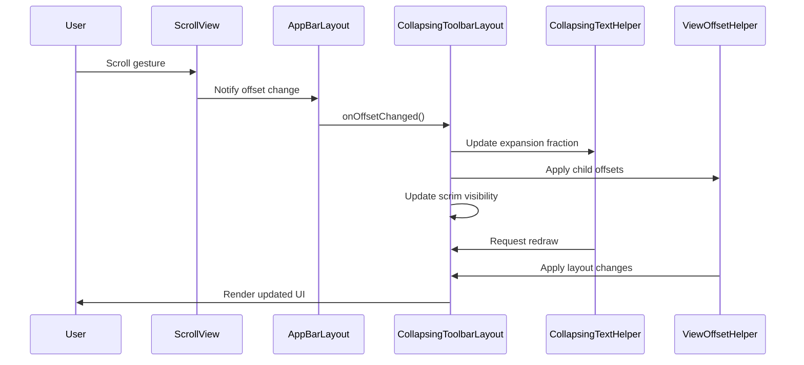
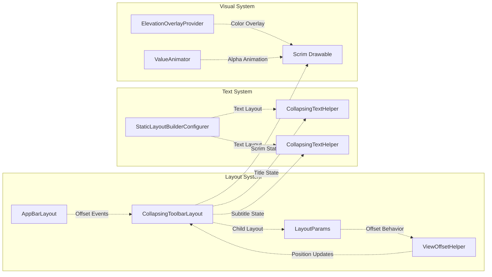

# Collapsing Toolbar Module

The collapsing-toolbar module provides the `CollapsingToolbarLayout` component, a sophisticated wrapper for Toolbar that implements Material Design's collapsing app bar pattern. This module enables smooth transitions between expanded and collapsed states with rich visual effects including parallax scrolling, title animations, and scrim overlays.

## Overview

The `CollapsingToolbarLayout` is designed to work as a direct child of `AppBarLayout` and provides advanced collapsing behavior for app bars. It supports multiple collapse modes, animated title transitions, and customizable visual effects that enhance the user experience during scroll interactions.

## Core Components

### CollapsingToolbarLayout
The main component that orchestrates the collapsing behavior and manages all visual effects.

### StaticLayoutBuilderConfigurer
An interface for customizing the `StaticLayout` used for title text rendering, allowing advanced text layout configurations.

### LayoutParams
Custom layout parameters that control how child views behave during the collapse animation, supporting different collapse modes (off, pin, parallax).

## Architecture


```mermaid
graph TB
    subgraph "Collapsing Toolbar Module"
        CTL[CollapsingToolbarLayout]
        SLC[StaticLayoutBuilderConfigurer]
        LP[LayoutParams]
        CTH[CollapsingTextHelper]
        CSUB[CollapsingTextHelper]
        EOP[ElevationOverlayProvider]
    end
    
    subgraph "Parent Module"
        ABL[AppBarLayout]
        VO[ViewOffsetHelper]
    end
    
    subgraph "External Dependencies"
        MC[MaterialColors]
        AU[AnimationUtils]
        MU[MotionUtils]
        TE[ThemeEnforcement]
    end
    
    CTL --> CTH
    CTL --> CSUB
    CTL --> EOP
    CTL --> LP
    CTL --> SLC
    
    ABL --> CTL
    VO --> CTL
    
    CTL --> MC
    CTL --> AU
    CTL --> MU
    CTL --> TE
```

## Key Features

### Collapsing Title Animation
- **Scale Mode**: Title continuously scales and translates between expanded and collapsed states
- **Fade Mode**: Expanded title fades out while collapsed title fades in
- **Customizable Typography**: Separate text appearances for expanded and collapsed states
- **Subtitle Support**: Full subtitle support with independent styling

### Visual Effects
- **Content Scrim**: Full-bleed overlay that appears/disappears based on scroll position
- **Status Bar Scrim**: System window scrim for immersive experiences
- **Parallax Scrolling**: Child views can scroll with parallax effects
- **Pinned Views**: Child views can remain fixed during collapse

### Advanced Layout Control
- **Collapse Modes**: OFF, PIN, PARALLAX for different child view behaviors
- **Margin Control**: Precise control over title positioning in both states
- **Multiline Support**: Advanced text layout with line spacing and hyphenation
- **RTL Support**: Full right-to-left text direction support

## Data Flow


```mermaid
sequenceDiagram
    participant User
    participant ScrollView
    participant AppBarLayout
    participant CollapsingToolbarLayout
    participant CollapsingTextHelper
    participant ViewOffsetHelper
    
    User->>ScrollView: Scroll gesture
    ScrollView->>AppBarLayout: Notify offset change
    AppBarLayout->>CollapsingToolbarLayout: onOffsetChanged()
    CollapsingToolbarLayout->>CollapsingTextHelper: Update expansion fraction
    CollapsingToolbarLayout->>ViewOffsetHelper: Apply child offsets
    CollapsingToolbarLayout->>CollapsingToolbarLayout: Update scrim visibility
    CollapsingTextHelper->>CollapsingToolbarLayout: Request redraw
    ViewOffsetHelper->>CollapsingToolbarLayout: Apply layout changes
    CollapsingToolbarLayout->>User: Render updated UI
```

## Component Interactions


```mermaid
graph LR
    subgraph "Layout System"
        CTL[CollapsingToolbarLayout]
        ABL[AppBarLayout]
        VO[ViewOffsetHelper]
        LP[LayoutParams]
    end
    
    subgraph "Text System"
        CTH[CollapsingTextHelper]
        CSUB[CollapsingTextHelper]
        SLC[StaticLayoutBuilderConfigurer]
    end
    
    subgraph "Visual System"
        SCRIM[Scrim Drawable]
        EOP[ElevationOverlayProvider]
        ANIM[ValueAnimator]
    end
    
    ABL -. Offset Events .-> CTL
    CTL -. Child Layout .-> LP
    LP -. Offset Behavior .-> VO
    VO -. Position Updates .-> CTL
    
    CTL -. Title State .-> CTH
    CTL -. Subtitle State .-> CSUB
    SLC -. Text Layout .-> CTH
    SLC -. Text Layout .-> CSUB
    
    CTL -. Scrim State .-> SCRIM
    EOP -. Color Overlay .-> SCRIM
    ANIM -. Alpha Animation .-> SCRIM
```

## Configuration Options

### Title Collapse Modes
- `TITLE_COLLAPSE_MODE_SCALE`: Smooth scaling transition (default)
- `TITLE_COLLAPSE_MODE_FADE`: Fade in/out transition

### Child Collapse Modes
- `COLLAPSE_MODE_OFF`: No special behavior
- `COLLAPSE_MODE_PIN`: View pins in place during collapse
- `COLLAPSE_MODE_PARALLAX`: View scrolls with parallax effect

### Scrim Triggers
- Automatic based on visible height threshold
- Manual control via `setScrimsShown()`
- Customizable animation duration and interpolators

## Usage Patterns

### Basic Implementation
```xml
<com.google.android.material.appbar.AppBarLayout>
    <com.google.android.material.appbar.CollapsingToolbarLayout
        app:layout_scrollFlags="scroll|exitUntilCollapsed"
        app:contentScrim="@color/primary"
        app:expandedTitleTextAppearance="@style/ExpandedTitle"
        app:collapsedTitleTextAppearance="@style/CollapsedTitle">
        
        <ImageView
            app:layout_collapseMode="parallax"
            app:layout_collapseParallaxMultiplier="0.7"/>
            
        <androidx.appcompat.widget.Toolbar
            app:layout_collapseMode="pin"/>
            
    </com.google.android.material.appbar.CollapsingToolbarLayout>
</com.google.android.material.appbar.AppBarLayout>
```

### Advanced Configuration
- Custom title position interpolators
- Multiline text with hyphenation
- Dynamic scrim colors based on elevation
- System window inset handling

## Integration with AppBarLayout

The `CollapsingToolbarLayout` is designed to work seamlessly with [`AppBarLayout`](appbar-layout.md) as its parent. It responds to scroll events and offset changes to coordinate the collapsing behavior with other app bar components.

### Key Dependencies
- **AppBarLayout**: Provides scroll offset information and coordination
- **ViewOffsetHelper**: Manages child view positioning during collapse
- **CollapsingTextHelper**: Handles complex text animation and rendering

## Performance Considerations

### Optimization Strategies
- **View Recycling**: Efficient handling of dummy views for title measurement
- **Animation Batching**: Coordinated animations to minimize redraws
- **Bounds Caching**: Smart recalculation of text bounds only when necessary
- **Scrim Optimization**: Efficient drawable state management

### Memory Management
- Drawable mutation for proper state isolation
- View tag usage for offset helper storage
- Careful listener registration and cleanup

## Related Modules

- **[AppBarLayout](appbar-layout.md)**: Parent container that provides scroll coordination
- **[AppBar Behaviors](appbar-behaviors.md)**: CoordinatorLayout behaviors for app bar components
- **[AppBar Utilities](appbar-utilities.md)**: Helper utilities for app bar functionality

## References

- [Material Design Top App Bar Guidelines](https://material.io/components/top-app-bar/overview)
- [Component Developer Guidance](https://github.com/material-components/material-components-android/blob/master/docs/components/TopAppBar.md)