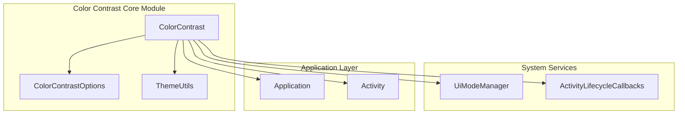
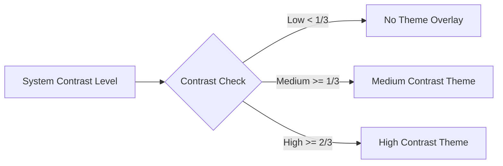
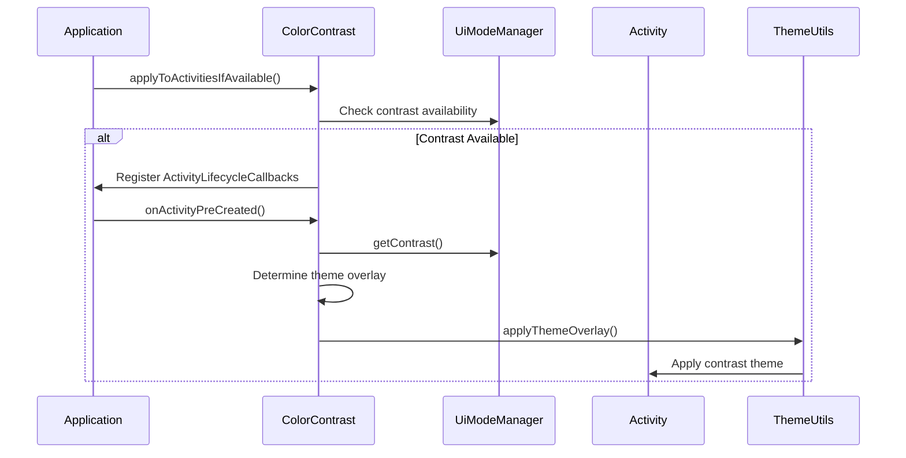
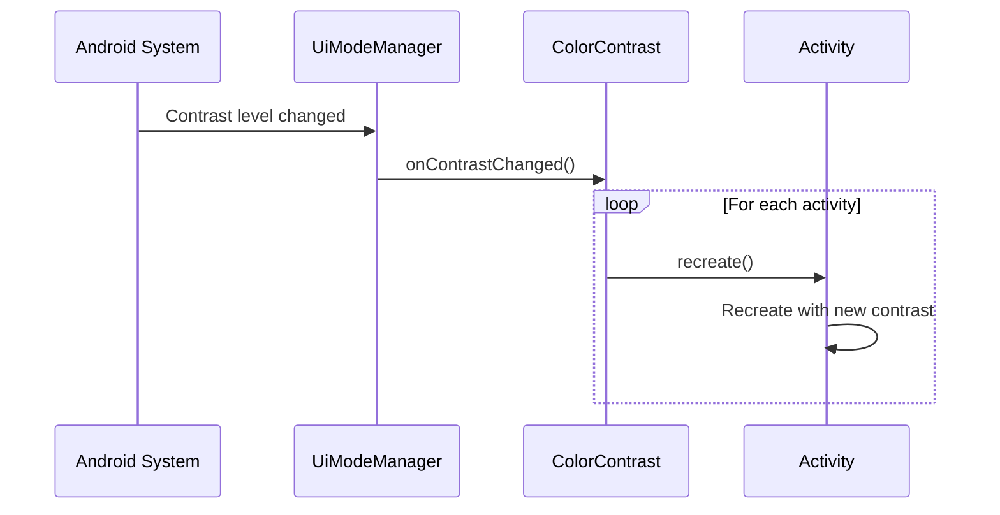
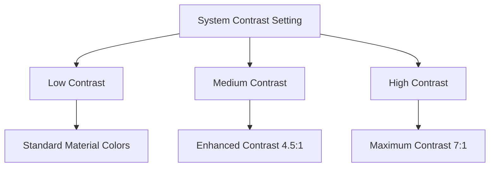

# Color Contrast Core Module

## Introduction

The color-contrast-core module provides essential functionality for implementing accessibility-compliant color contrast in Android applications. This module enables automatic adaptation of color themes based on system-wide contrast settings, ensuring optimal readability and accessibility for users with visual impairments.

## Core Functionality

The module's primary component, `ColorContrast`, offers a comprehensive solution for applying contrast-aware color themes across Android applications. It automatically detects system contrast levels and applies appropriate theme overlays to maintain WCAG (Web Content Accessibility Guidelines) compliance.

## Architecture

### Component Overview



### Key Components

#### ColorContrast Class
The main utility class that provides static methods for applying contrast themes:

- **Contrast Detection**: Automatically detects system contrast levels using `UiModeManager`
- **Theme Application**: Applies appropriate theme overlays based on contrast thresholds
- **Lifecycle Management**: Handles activity lifecycle for consistent contrast across the app
- **Context Wrapping**: Provides context wrapping for individual view creation

#### Contrast Thresholds
The module defines three contrast levels:



## Data Flow

### Contrast Application Process



### Runtime Contrast Changes



## Integration Patterns

### Application-Wide Contrast
For consistent contrast across all activities:

```java
public class YourApplication extends Application {
    @Override
    public void onCreate() {
        super.onCreate();
        ColorContrastOptions options = ColorContrastOptions.builder()
            .setMediumContrastThemeOverlay(R.style.Theme_MediumContrast)
            .setHighContrastThemeOverlay(R.style.Theme_HighContrast)
            .build();
        ColorContrast.applyToActivitiesIfAvailable(this, options);
    }
}
```

### Activity-Specific Contrast
For individual activity contrast application:

```java
ColorContrast.applyToActivityIfAvailable(activity, colorContrastOptions);
```

### Context Wrapping for Views
For creating contrast-aware views:

```java
Context contrastContext = ColorContrast.wrapContextIfAvailable(context, options);
View contrastView = new View(contrastContext);
```

## Dependencies

### Internal Dependencies
- **[color-contrast-options.md](color-contrast-options.md)**: Provides configuration options for contrast themes
- **[theme-utils.md](theme-utils.md)**: Handles theme overlay application

### System Dependencies
- **UiModeManager**: Android system service for accessing contrast settings
- **ActivityLifecycleCallbacks**: For monitoring activity lifecycle events
- **ContextThemeWrapper**: For applying theme overlays

### Platform Requirements
- **Minimum SDK**: Android 14 (API level 34) for contrast functionality
- **Target SDK**: Supports Android U+ (Upside Down Cake)

## Accessibility Compliance

### WCAG Guidelines
The module helps achieve compliance with:
- **WCAG 2.1 Level AA**: Minimum contrast ratio of 4.5:1 for normal text
- **WCAG 2.1 Level AAA**: Enhanced contrast ratio of 7:1 for normal text
- **WCAG 2.1 Level AA**: Minimum contrast ratio of 3:1 for large text

### Contrast Ratios
The module automatically applies appropriate contrast ratios based on system settings:



## Best Practices

### Theme Design
1. **Define Contrast Themes**: Create separate theme overlays for medium and high contrast
2. **Color Selection**: Use colors that meet WCAG contrast requirements
3. **Testing**: Test themes across all contrast levels

### Implementation
1. **Early Initialization**: Apply contrast in `Application.onCreate()`
2. **Consistent Application**: Use application-wide contrast for better UX
3. **Fallback Handling**: Ensure graceful degradation on unsupported platforms

### Performance
1. **Activity Recreation**: Be aware that contrast changes trigger activity recreation
2. **Memory Management**: The module automatically manages listener lifecycle
3. **Resource Optimization**: Use theme overlays to minimize resource usage

## Limitations

### Platform Support
- Contrast functionality is only available on Android 14+ (API 34+)
- Earlier Android versions will gracefully ignore contrast settings

### Theme Requirements
- Requires properly defined contrast theme overlays
- Theme overlays must be complete enough to override base themes

### System Integration
- Depends on system-wide contrast settings
- Cannot override user-selected contrast preferences

## Related Modules

- **[dynamic-colors-core.md](dynamic-colors-core.md)**: For automatic color theming that includes contrast
- **[harmonized-colors-core.md](harmonized-colors-core.md)**: For color harmonization with contrast support
- **[material-colors.md](material-colors.md)**: For base Material Design color system

## Migration Guide

### From Manual Contrast
If currently implementing manual contrast:

1. **Remove Custom Logic**: Replace custom contrast detection with `ColorContrast`
2. **Define Theme Overlays**: Create proper contrast theme overlays
3. **Update Application**: Use `applyToActivitiesIfAvailable()` for automatic management

### Integration with Dynamic Colors
When using with dynamic colors:

1. **Android U+**: Contrast is applied automatically with dynamic colors
2. **Pre-Android U**: Use `ColorContrast` for branded/custom themes
3. **Hybrid Approach**: Use both for comprehensive coverage

## Troubleshooting

### Common Issues

**Contrast Not Applied**
- Verify Android version supports contrast (API 34+)
- Check that theme overlays are properly defined
- Ensure `ColorContrastOptions` is correctly configured

**Inconsistent Contrast**
- Use `applyToActivitiesIfAvailable()` instead of per-activity application
- Verify all activities use the same contrast options
- Check for custom theme overrides

**Performance Issues**
- Minimize activity recreation by grouping contrast changes
- Use context wrapping for individual views instead of full activity recreation
- Optimize theme overlay resources