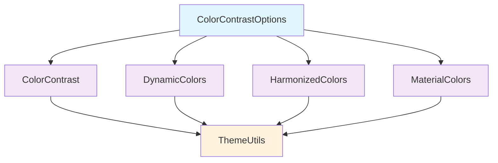
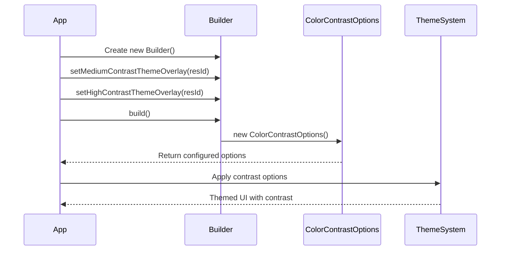
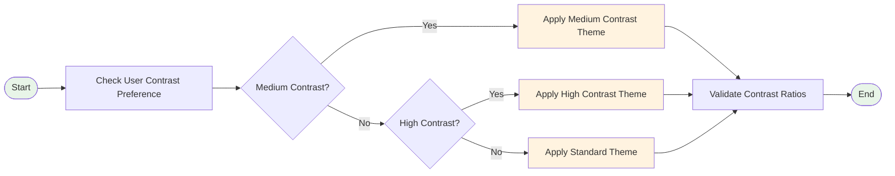

# Color Contrast Options Module

## Introduction

The `color-contrast-options` module provides a configuration system for managing color contrast levels in Material Design applications. It enables developers to specify theme overlays for different contrast modes (medium and high contrast), ensuring accessibility compliance and improved visual clarity for users with varying visual needs.

This module is part of the larger Material Design color system and works in conjunction with other color-related modules to provide comprehensive theming capabilities.

## Architecture

### Core Components

The module consists of a single primary component:

- **ColorContrastOptions.Builder**: A builder pattern implementation for creating `ColorContrastOptions` instances with customizable theme overlay configurations.

### Module Structure

```
color-contrast-options/
└── lib.java.com.google.android.material.color.ColorContrastOptions.Builder
```

## Component Details

### ColorContrastOptions Class

The `ColorContrastOptions` class serves as a wrapper for specifying color contrast options when applying contrast to branded and custom themes. It provides a structured way to define theme overlay resources for different contrast levels.

#### Key Features:
- **Medium Contrast Support**: Configurable theme overlay for medium contrast mode
- **High Contrast Support**: Configurable theme overlay for high contrast mode
- **Theme Overlay Integration**: Seamless integration with Android's theme system
- **Builder Pattern**: Fluent API for easy configuration

#### Supported Theme Overlay Types:
- Light mode contrast: `R.style.ThemeOverlay_XxxContrast_Light`
- Dark mode contrast: `R.style.ThemeOverlay_XxxContrast_Dark`
- DayNight mode contrast: `R.style.ThemeOverlay_XxxContrast_DayNight`

### ColorContrastOptions.Builder Class

The Builder class provides a fluent interface for constructing `ColorContrastOptions` instances with specific theme overlay configurations.

#### Methods:
- `setMediumContrastThemeOverlay(@StyleRes int)`: Sets the resource ID for medium contrast theme overlay
- `setHighContrastThemeOverlay(@StyleRes int)`: Sets the resource ID for high contrast theme overlay
- `build()`: Constructs the final `ColorContrastOptions` instance

## System Integration

### Relationship to Color System

The `color-contrast-options` module integrates with the broader Material Design color system:



### Data Flow



## Usage Patterns

### Basic Configuration

```java
ColorContrastOptions options = new ColorContrastOptions.Builder()
    .setMediumContrastThemeOverlay(R.style.ThemeOverlay_MediumContrast)
    .setHighContrastThemeOverlay(R.style.ThemeOverlay_HighContrast)
    .build();
```

### Integration with Color System

The `ColorContrastOptions` typically works with other color system components:

1. **With DynamicColors**: Contrast options can be applied when dynamic colors are enabled
2. **With HarmonizedColors**: Contrast settings complement color harmonization
3. **With ThemeUtils**: Contrast overlays are applied through theme utilities

## Accessibility Considerations

### WCAG Compliance

The module supports Web Content Accessibility Guidelines (WCAG) by enabling:
- **Enhanced contrast ratios** for text and UI elements
- **Improved visual hierarchy** through contrast differentiation
- **User preference respect** for high contrast modes

### Contrast Levels

- **Medium Contrast**: Provides moderate enhancement for users who need some contrast improvement
- **High Contrast**: Offers maximum contrast for users with significant visual impairments

## Dependencies

### Internal Dependencies

The module has minimal internal dependencies:
- AndroidX annotation library (`@NonNull`, `@StyleRes`)
- Error Prone annotations (`@CanIgnoreReturnValue`)
- Material Design resources (`R.style` references)

### External Dependencies

For complete functionality, this module integrates with:
- [color-contrast-core](color-contrast-core.md) - Core contrast implementation
- [dynamic-colors-core](dynamic-colors-core.md) - Dynamic color system
- [harmonized-colors-core](harmonized-colors-core.md) - Color harmonization

## Process Flow

### Contrast Application Process



## Best Practices

### Theme Overlay Design

1. **Consistent Naming**: Use consistent naming conventions for contrast theme overlays
2. **Complete Coverage**: Ensure all UI elements are properly themed in contrast modes
3. **Testing**: Test contrast modes across different devices and accessibility settings

### Performance Considerations

- Theme overlays are lightweight and don't impact performance significantly
- Resource IDs are stored as integers, minimizing memory footprint
- Builder pattern ensures immutable configuration objects

## Related Documentation

- [color-contrast-core](color-contrast-core.md) - Core contrast functionality
- [dynamic-colors-options](dynamic-colors-options.md) - Dynamic color configuration
- [harmonized-colors-options](harmonized-colors-options.md) - Color harmonization options
- [material-colors](material-colors.md) - Material color system overview

## API Reference

### ColorContrastOptions

| Method | Return Type | Description |
|--------|-------------|-------------|
| `getMediumContrastThemeOverlay()` | int | Returns medium contrast theme overlay resource ID |
| `getHighContrastThemeOverlay()` | int | Returns high contrast theme overlay resource ID |

### ColorContrastOptions.Builder

| Method | Return Type | Description |
|--------|-------------|-------------|
| `setMediumContrastThemeOverlay(int)` | Builder | Sets medium contrast theme overlay |
| `setHighContrastThemeOverlay(int)` | Builder | Sets high contrast theme overlay |
| `build()` | ColorContrastOptions | Builds the configuration object |