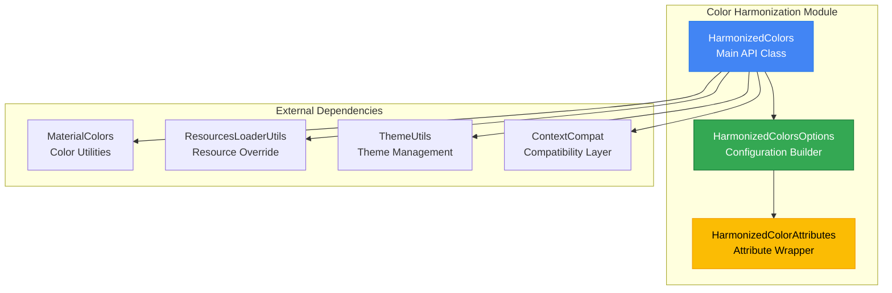
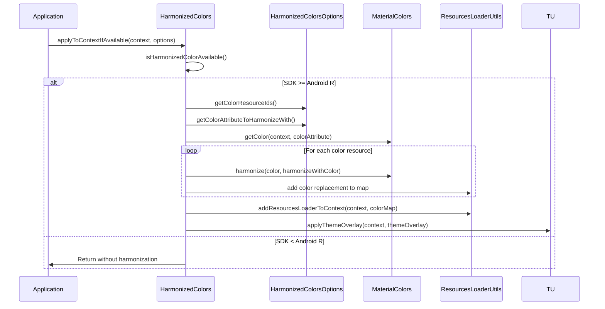
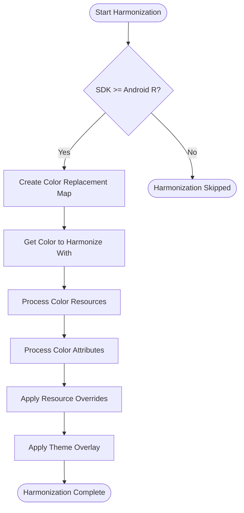
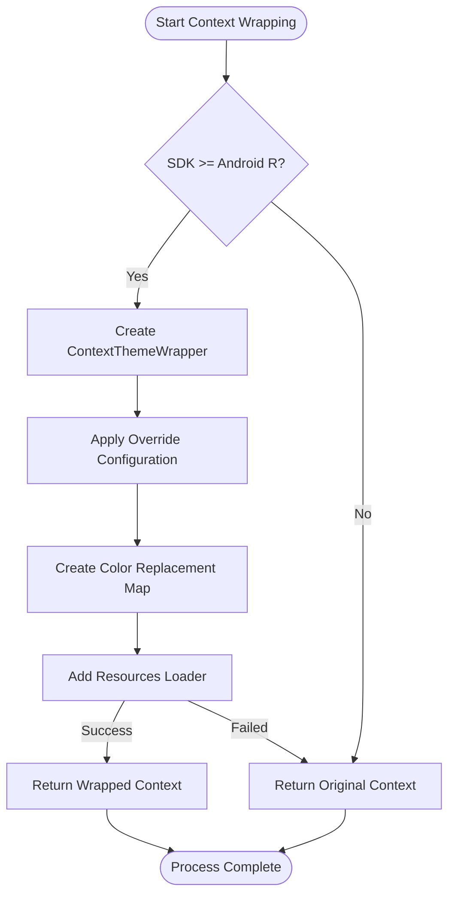
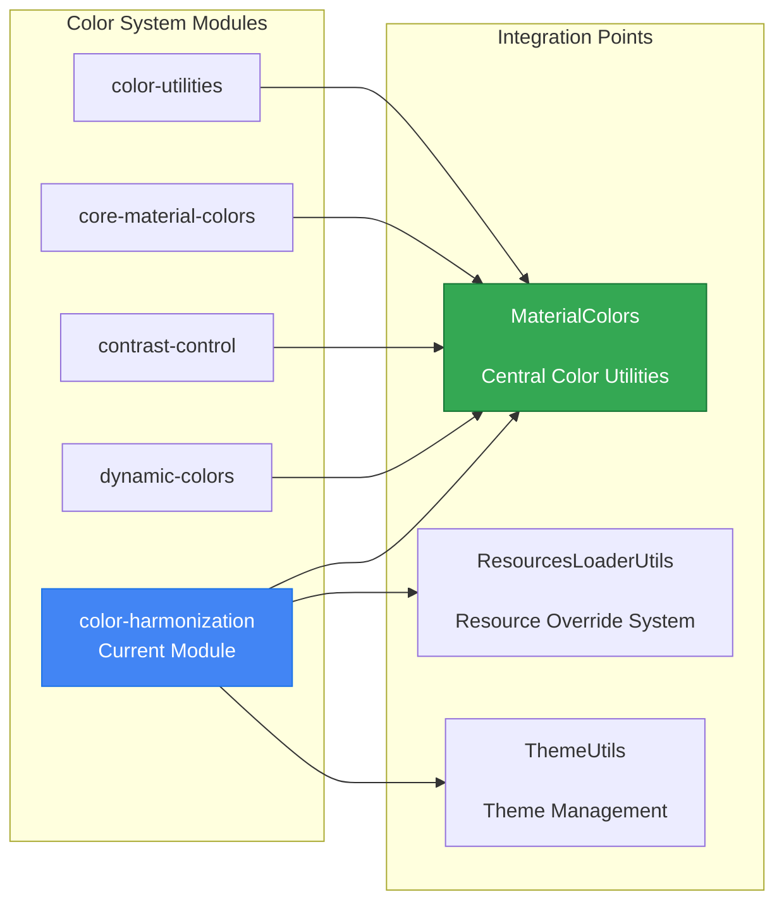

# Color Harmonization Module

## Introduction

The color-harmonization module provides a sophisticated system for harmonizing color resources and attributes within Android applications at runtime. This module enables dynamic color adjustment to create visually cohesive user interfaces by harmonizing colors with a primary color attribute, ensuring consistent visual aesthetics across the application.

## Core Functionality

The module offers two primary capabilities:

1. **Runtime Color Harmonization**: Dynamically harmonizes color resources and theme attributes with a specified primary color
2. **Context Wrapping**: Creates new contexts with harmonized colors while preserving the original context

## Architecture Overview



## Component Architecture

### HarmonizedColors Class

The main entry point providing static methods for color harmonization operations.

**Key Methods:**
- `applyToContextIfAvailable()`: Applies harmonization directly to an existing context
- `wrapContextIfAvailable()`: Creates a new context with harmonized colors
- `isHarmonizedColorAvailable()`: Checks if harmonization is supported on current SDK

### HarmonizedColorsOptions Class

Configuration wrapper that specifies which colors to harmonize and the target harmonization color.

**Key Features:**
- Builder pattern for flexible configuration
- Support for both color resources and theme attributes
- Material Design default configurations
- Theme overlay integration

## Data Flow Architecture



## Process Flow

### Color Harmonization Process



### Context Wrapping Process



## Integration with Material Design System

The color-harmonization module integrates with the broader Material Design color system:



## Key Features

### 1. SDK Compatibility
- Requires Android API level 30 (Android R) or higher
- Graceful degradation on unsupported SDK versions
- Compatibility checks before applying harmonization

### 2. Flexible Configuration
- Support for both color resources and theme attributes
- Builder pattern for easy configuration
- Material Design default configurations available

### 3. Resource Management
- Non-destructive color harmonization
- Preserves original context when wrapping
- Efficient resource override mechanism

### 4. Theme Integration
- Theme overlay support
- Attribute-based color harmonization
- Integration with Material Design themes

## Usage Patterns

### Direct Context Harmonization
```java
// Apply harmonization directly to existing context
HarmonizedColors.applyToContextIfAvailable(context, options);
```

### Context Wrapping
```java
// Create new context with harmonized colors
Context harmonizedContext = HarmonizedColors.wrapContextIfAvailable(context, options);
```

### Material Defaults
```java
// Use Material Design default harmonization
HarmonizedColorsOptions options = HarmonizedColorsOptions.createMaterialDefaults();
```

## Dependencies

The color-harmonization module depends on several other modules within the Material Design system:

- **[core-material-colors](core-material-colors.md)**: Central color utilities and harmonization algorithms
- **[resource-override](resource-override.md)**: Resource loading and override mechanisms
- **[dynamic-colors](dynamic-colors.md)**: Dynamic color system integration
- **[color-utilities](color-utilities.md)**: Low-level color manipulation utilities

## Technical Requirements

### Minimum SDK Version
- Android API Level 30 (Android R)
- ResourcesLoader API support required

### Key Dependencies
- `MaterialColors.harmonize()`: Color harmonization algorithm
- `ResourcesLoaderUtils.addResourcesLoaderToContext()`: Resource override mechanism
- `ThemeUtils.applyThemeOverlay()`: Theme overlay application
- `ContextCompat.getColor()`: Color resource retrieval

## Error Handling

The module implements comprehensive error handling:

1. **SDK Compatibility**: Graceful degradation on unsupported Android versions
2. **Resource Validation**: Validates color resources before harmonization
3. **Context Preservation**: Returns original context if harmonization fails
4. **Resource Cleanup**: Proper cleanup of TypedArray resources

## Performance Considerations

- **Lazy Evaluation**: Colors are harmonized only when needed
- **Resource Caching**: Efficient resource replacement mapping
- **Memory Management**: Proper resource cleanup and context management
- **Batch Processing**: Multiple colors harmonized in single operation

This module provides a robust foundation for implementing dynamic color harmonization in Material Design applications, ensuring visual consistency while maintaining performance and compatibility across different Android versions.