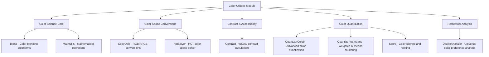

# Color Utilities Module

## Overview

The color-utilities module provides a comprehensive set of color science algorithms and utilities for the Material Design Components library. This module implements advanced color processing capabilities including color space conversions, contrast calculations, color quantization, and perceptual color harmony algorithms.

## Purpose

The color-utilities module serves as the computational foundation for Material Design's dynamic color system, enabling:

- **Dynamic Color Extraction**: Extracting harmonious color palettes from images
- **Contrast Compliance**: Ensuring accessibility standards (WCAG) are met
- **Color Space Conversions**: Converting between different color representations (RGB, HCT, CAM16, L*a*b*, XYZ)
- **Perceptual Color Harmony**: Creating aesthetically pleasing color combinations based on human perception
- **Color Quantization**: Reducing image colors while maintaining visual quality

## Architecture



## Core Components

### Color Science Foundation

#### [Blend](blend.md)
Provides color blending algorithms in HCT (Hue, Chroma, Tone) and CAM16 color spaces. Implements harmonization functions that shift colors towards key colors while maintaining recognizability.

#### [MathUtils](math-utils.md)
Utility class providing mathematical operations essential for color calculations, including linear interpolation, degree sanitization, and matrix operations for color space transformations.

### Color Space Conversions

#### [ColorUtils](color-utils.md)
Comprehensive color space conversion utilities supporting transformations between RGB, ARGB, XYZ, L*a*b*, and linear RGB color spaces. Includes gamma correction and white point calculations.

#### [HctSolver](hct-solver.md)
Advanced solver for the HCT (Hue, Chroma, Tone) color space, implementing the CAM16 color appearance model. Solves complex color equations to find colors with specific perceptual properties.

### Contrast & Accessibility

#### [Contrast](contrast.md)
Implements WCAG-compliant contrast ratio calculations and provides utilities to find colors that meet specific contrast requirements. Essential for ensuring accessibility compliance in UI design.

### Color Quantization & Analysis

#### [QuantizerCelebi](quantizer-celebi.md)
Advanced color quantization algorithm that improves upon standard K-means by using Wu quantizer output as initial state. Optimized for extracting representative colors from images.

#### [QuantizerWsmeans](quantizer-wsmeans.md)
Weighted square means K-means implementation with optimizations for speed, including pixel deduplication and triangle inequality rules for efficient clustering.

#### [Score](score.md)
Intelligent color scoring system that ranks colors based on their suitability for UI themes. Filters out universally disliked colors and considers chroma, usage frequency, and hue distribution.

### Perceptual Analysis

#### [DislikeAnalyzer](dislike-analyzer.md)
Implements color psychology research to identify and correct universally disliked colors (particularly dark yellow-greens associated with biological waste and rotting food).

## Integration with Material Design System

The color-utilities module integrates with other Material Design modules:

- **[Dynamic Colors](dynamic-colors.md)**: Uses quantization and scoring for extracting color schemes from wallpapers
- **[Color Harmonization](color-harmonization.md)**: Applies blend functions to create harmonious color variations
- **[Contrast Control](contrast-control.md)**: Leverages contrast calculations for accessibility compliance
- **[Core Material Colors](core-material-colors.md)**: Provides scientific foundation for color space operations

## Key Algorithms

### HCT Color Space
The module implements the HCT (Hue, Chroma, Tone) color space, which is perceptually uniform and designed for UI applications. HCT is based on CAM16, the latest color appearance model from the CIE.

### Color Harmony
Implements scientifically-backed color harmony algorithms that consider human perceptual preferences and cultural color associations.

### Accessibility Compliance
All contrast calculations follow WCAG 2.1 guidelines, ensuring that generated color combinations meet accessibility standards for users with visual impairments.

## Usage Patterns

### Color Extraction from Images
```java
// Quantize image to extract key colors
Map<Integer, Integer> colorToPopulation = QuantizerCelebi.quantize(pixels, maxColors);
List<Integer> scoredColors = Score.score(colorToPopulation);
```

### Ensuring Contrast Compliance
```java
// Find a color that meets contrast requirements
double targetTone = Contrast.lighter(backgroundTone, 4.5); // WCAG AA ratio
```

### Color Space Conversions
```java
// Convert between color spaces
double[] labValues = ColorUtils.labFromArgb(argbColor);
int argbColor = ColorUtils.argbFromLab(l, a, b);
```

## Performance Considerations

The module is optimized for performance with:
- Efficient matrix operations for color transformations
- Cached calculations for frequently used values
- Optimized quantization algorithms that reduce computational complexity
- Memory-efficient data structures for large image processing

## Dependencies

The color-utilities module is self-contained and does not depend on Android-specific APIs, making it suitable for cross-platform color science applications. It only depends on standard Java libraries and Android's annotation framework for scope restrictions.