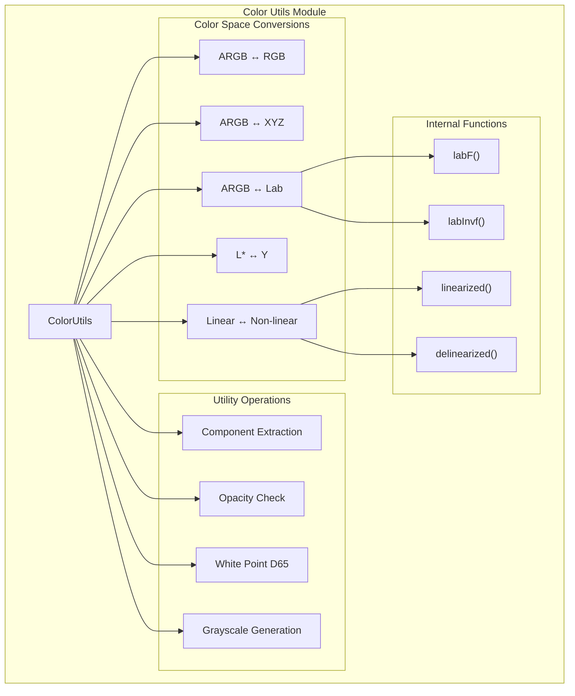
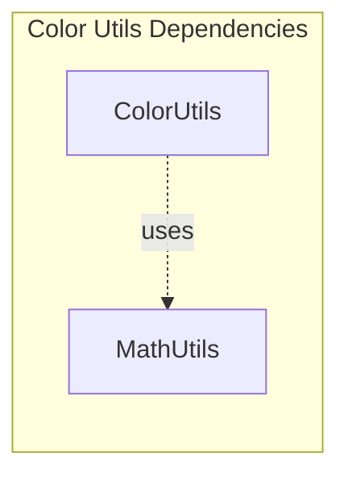
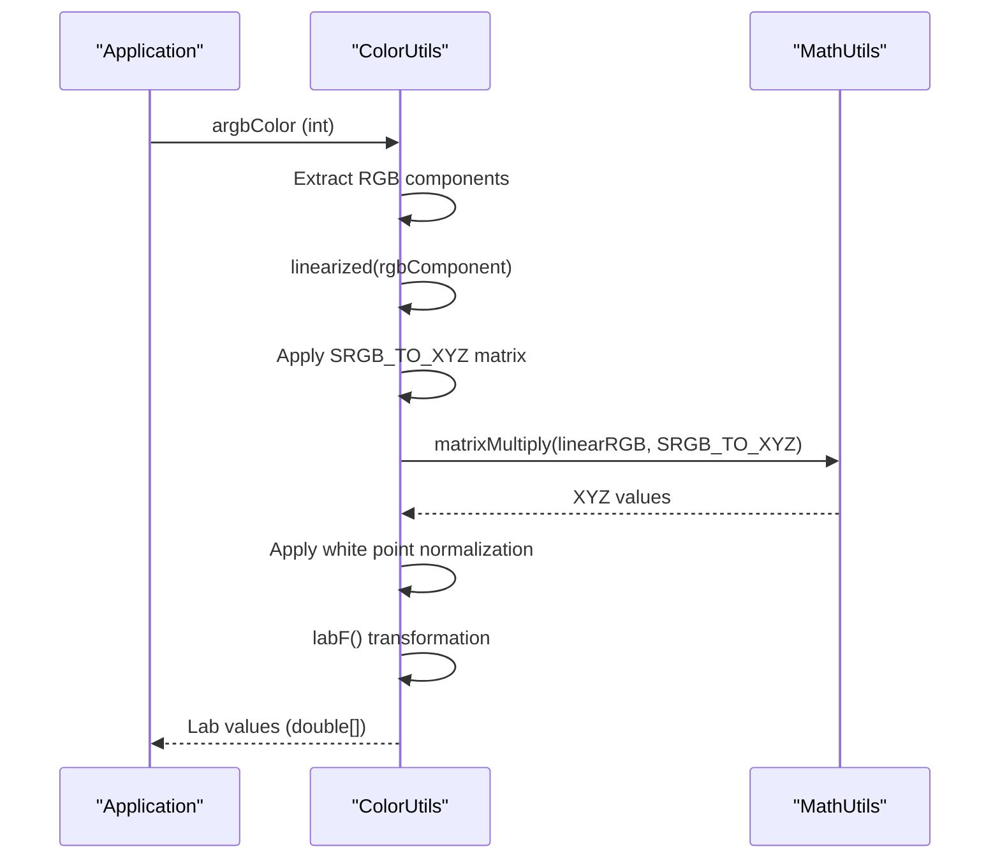
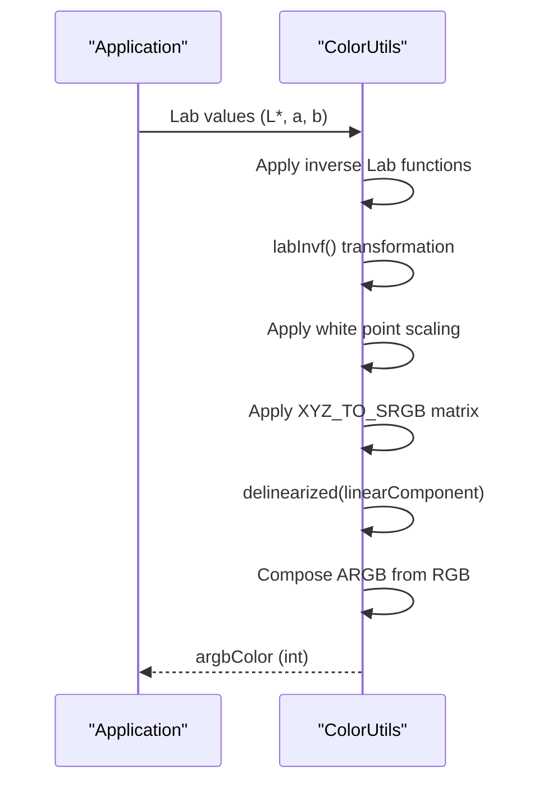
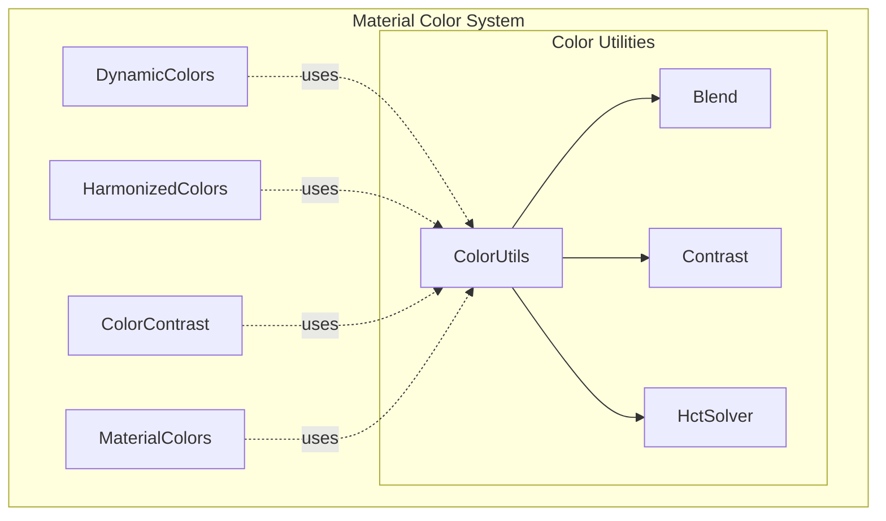
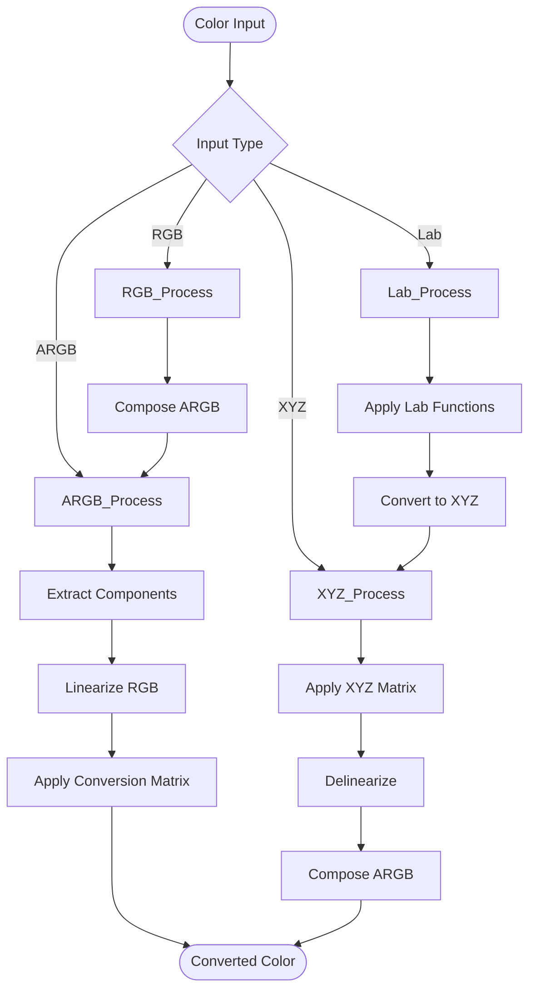

# Color Utils Module

The color-utils module provides fundamental color science utilities and color space conversion algorithms for the Material Design Components library. It serves as the mathematical foundation for advanced color operations used throughout the Material Design color system.

## Overview

Color Utils is a core utility module that implements color science algorithms and color space conversions. It provides essential mathematical operations for converting between different color representations (ARGB, XYZ, Lab, L*) and handles linear/non-linear RGB transformations. This module is primarily used internally by other color-related modules in the Material Design system.

## Core Functionality

### Color Space Conversions
The module provides comprehensive color space conversion utilities:

- **ARGB ↔ RGB**: Basic color component extraction and composition
- **ARGB ↔ XYZ**: Conversion between display color space and CIE XYZ color space
- **ARGB ↔ Lab**: Conversion to/from perceptually uniform L*a*b* color space
- **L* ↔ Y**: Luminance conversions between Lab and XYZ color spaces
- **Linear ↔ Non-linear RGB**: Gamma correction and linearization operations

### Color Science Operations
- **White Point Management**: D65 standard illuminant support
- **Component Extraction**: Alpha, red, green, blue channel extraction from ARGB
- **Opacity Detection**: Determine if colors are fully opaque
- **Grayscale Generation**: Create grayscale colors from L* values

## Architecture

### Component Structure

### Dependencies

The ColorUtils class depends on [MathUtils](math-utils.md) for matrix multiplication operations and integer clamping functions.

## Data Flow

### Color Conversion Pipeline

### Reverse Conversion Flow

## Key Components

### ColorUtils Class
The main utility class providing static methods for color operations:

- **Color Space Matrices**: Pre-defined conversion matrices for sRGB ↔ XYZ transformations
- **White Point Constants**: D65 standard illuminant values
- **Conversion Methods**: Bidirectional color space conversions
- **Utility Functions**: Component extraction and color property checks

### Mathematical Functions
- **labF()**: Forward Lab transformation function
- **labInvf()**: Inverse Lab transformation function
- **linearized()**: RGB linearization with gamma correction
- **delinearized()**: Reverse gamma correction

## Integration with Material Design System

### Usage Context

The ColorUtils module serves as the foundation for:
- [Dynamic Colors](dynamic-colors.md): Color extraction and palette generation
- [Color Harmonization](color-harmonization.md): Color harmony calculations
- [Contrast Control](contrast-control.md): Accessibility contrast computations
- [Core Material Colors](core-material-colors.md): Base color operations

## Process Flow

### Typical Color Conversion Workflow

## API Reference

### Public Methods

#### Color Component Operations
- `argbFromRgb(int red, int green, int blue)`: Creates ARGB from RGB components
- `alphaFromArgb(int argb)`: Extracts alpha component
- `redFromArgb(int argb)`: Extracts red component
- `greenFromArgb(int argb)`: Extracts green component
- `blueFromArgb(int argb)`: Extracts blue component
- `isOpaque(int argb)`: Checks if color is fully opaque

#### Color Space Conversions
- `argbFromXyz(double x, double y, double z)`: XYZ to ARGB conversion
- `xyzFromArgb(int argb)`: ARGB to XYZ conversion
- `argbFromLab(double l, double a, double b)`: Lab to ARGB conversion
- `labFromArgb(int argb)`: ARGB to Lab conversion
- `argbFromLstar(double lstar)`: L* to grayscale ARGB
- `lstarFromArgb(int argb)`: ARGB to L* conversion

#### Utility Functions
- `yFromLstar(double lstar)`: L* to Y (luminance) conversion
- `lstarFromY(double y)`: Y to L* conversion
- `linearized(int rgbComponent)`: RGB linearization
- `delinearized(double rgbComponent)`: RGB delinearization
- `whitePointD65()`: Returns standard D65 white point

## Best Practices

### Performance Considerations
- All methods are static for efficient utility access
- Conversion matrices are pre-computed constants
- Minimal object allocation in conversion operations
- Direct mathematical computations without intermediate objects

### Usage Guidelines
- Use for internal color science operations
- Integrate with higher-level color modules for user-facing features
- Consider color space characteristics when choosing conversion methods
- Account for gamma correction in linear/non-linear transformations

## Related Documentation

- [Color Utilities - Blend](blend.md)
- [Color Utilities - Math Utils](math-utils.md)
- [Color Utilities - HCT Solver](hct-solver.md)
- [Color Utilities - Contrast](contrast.md)
- [Color Utilities - Quantizer Celebi](quantizer-celebi.md)
- [Color Utilities - Quantizer Wsmeans](quantizer-wsmeans.md)
- [Color Utilities - Score](score.md)
- [Color Utilities - Dislike Analyzer](dislike-analyzer.md)