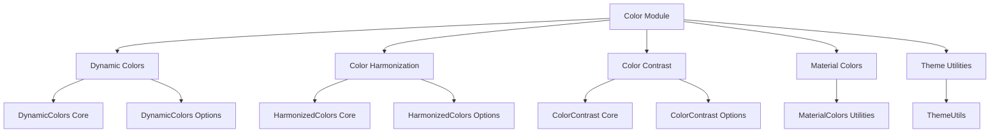

# Color Module Documentation

## Overview

The Material Design Color module provides comprehensive color management capabilities for Android applications, implementing Material Design 3 color principles. This module enables dynamic color theming, color harmonization, contrast support, and utilities for working with color resources in Material Design applications.

## Architecture

The color module is organized into several key sub-modules that work together to provide a complete color management system:



## Core Functionality

### Dynamic Colors
The dynamic colors system allows applications to adapt their color schemes based on user preferences, system settings, or content-based sources. It supports both traditional theme-based dynamic colors and content-based dynamic colors that extract color palettes from images.

**Key Components:**
- [DynamicColors Core](dynamic-colors-core.md) - Main implementation for applying dynamic colors
- [DynamicColors Options](dynamic-colors-options.md) - Configuration options for dynamic color behavior

### Color Harmonization
Color harmonization ensures visual consistency by adjusting colors to work well together. This system can harmonize color resources and theme attributes with a primary color, creating cohesive color schemes.

**Key Components:**
- [HarmonizedColors Core](harmonized-colors-core.md) - Core harmonization functionality
- [HarmonizedColors Options](harmonized-colors-options.md) - Configuration for harmonization behavior

### Color Contrast
The contrast system provides support for accessibility features, allowing applications to adapt to different contrast levels (medium and high contrast) as specified by the Android system.

**Key Components:**
- [ColorContrast Core](color-contrast-core.md) - Contrast application and management
- [ColorContrast Options](color-contrast-options.md) - Configuration for contrast themes

### Material Colors Utilities
A comprehensive utility class providing color manipulation functions, color role generation, and helper methods for working with Material Design color tokens.

**Key Components:**
- [MaterialColors Utilities](material-colors-utilities.md) - Color manipulation and utility functions

### Theme Utilities
Low-level utilities for applying theme overlays and managing theme application across activities and contexts.

**Key Components:**
- [ThemeUtils](theme-utils.md) - Theme application utilities

## Integration with Other Modules

The color module integrates with various other Material Design components:

- **[Theme Module](theme.md)**: Provides color tokens and theme attributes
- **[Shape Module](shape.md)**: Coordinates with color for visual consistency
- **[AppBar Module](appbar.md)**: Supports dynamic colors in app bars
- **[Button Module](button.md)**: Enables dynamic colors for button components

## Usage Patterns

### Basic Dynamic Colors Setup
```java
// Apply dynamic colors to all activities
DynamicColors.applyToActivitiesIfAvailable(application);

// Apply to specific activity
DynamicColors.applyToActivityIfAvailable(activity);
```

### Color Harmonization
```java
// Harmonize colors with primary color
HarmonizedColors.applyToContextIfAvailable(context, options);

// Create harmonized context
Context harmonizedContext = HarmonizedColors.wrapContextIfAvailable(context, options);
```

### Contrast Support
```java
// Apply contrast to activities
ColorContrast.applyToActivitiesIfAvailable(application, contrastOptions);

// Apply to specific activity
ColorContrast.applyToActivityIfAvailable(activity, contrastOptions);
```

## System Requirements

- **Minimum SDK**: API 21 (Android 5.0)
- **Dynamic Colors**: API 31+ (Android 12+)
- **Color Harmonization**: API 30+ (Android 11+)
- **Contrast Support**: API 34+ (Android 14+)

## Key Features

1. **Automatic Color Adaptation**: Seamlessly adapts to system color preferences
2. **Content-Based Colors**: Extracts color palettes from images
3. **Accessibility Support**: Full support for contrast requirements
4. **Backward Compatibility**: Graceful degradation on older Android versions
5. **Performance Optimized**: Efficient color resource management
6. **Developer Friendly**: Simple APIs with comprehensive options

## Best Practices

1. **Early Initialization**: Apply dynamic colors in Application.onCreate()
2. **Consistent Application**: Use the same color options across your app
3. **Accessibility First**: Always test with different contrast levels
4. **Performance Considerations**: Minimize color calculations in UI threads
5. **Theme Consistency**: Coordinate with other Material Design modules

## Related Documentation

- [Material Design 3 Color System](https://m3.material.io/styles/color/overview)
- [Android Dynamic Colors Guide](https://developer.android.com/develop/ui/views/theming/dynamic-colors)
- [Accessibility Color Guidelines](https://www.w3.org/WAI/WCAG21/Understanding/contrast-minimum.html)