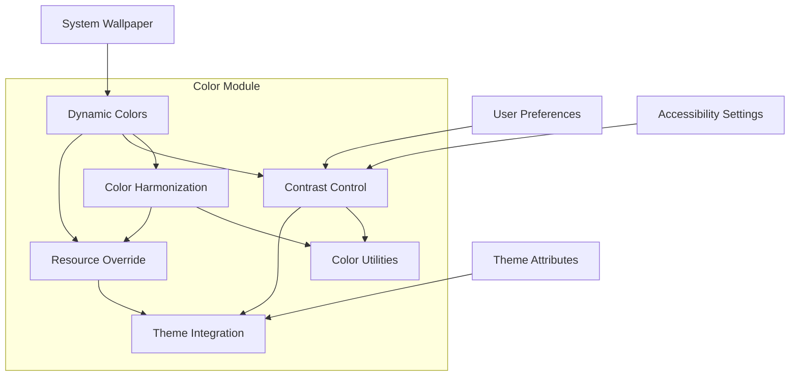

# Color Module Documentation

## Overview

The Material Design Color module provides a comprehensive system for managing colors in Android applications, supporting dynamic theming, color harmonization, contrast control, and advanced color science utilities. This module enables developers to create visually consistent and accessible user interfaces that adapt to system preferences and user content.

## Architecture

The color module is organized into several key sub-modules that work together to provide a complete color management solution:


```mermaid
graph TB
    subgraph "Color Module"
        A[Dynamic Colors] --> B[Color Harmonization]
        A --> C[Contrast Control]
        B --> D[Color Utilities]
        C --> D
        A --> E[Resource Override]
        B --> E
        C --> F[Theme Integration]
        E --> F
    end
    
    G[System Wallpaper] --> A
    H[User Preferences] --> C
    I[Accessibility Settings] --> C
    J[Theme Attributes] --> F
```

## Core Functionality

### Dynamic Colors
The dynamic colors system automatically generates color palettes from system wallpapers or user-provided content, creating personalized themes that maintain Material Design principles while adapting to user preferences.

### Color Harmonization
Harmonization ensures color consistency across the application by adjusting secondary colors to work harmoniously with primary colors, creating visually cohesive interfaces.

### Contrast Control
Provides automatic contrast adjustment based on system accessibility settings, ensuring text and UI elements meet accessibility standards while maintaining visual appeal.

### Resource Override System
Enables runtime color replacement without requiring app restarts, allowing for dynamic theme switching and content-based color generation.

## Sub-modules

### [Dynamic Colors](dynamic-colors.md)
Handles automatic color palette generation from wallpapers and content, including device compatibility checks and theme application. Supports both system-driven and content-based color extraction with comprehensive manufacturer compatibility.

### [Color Harmonization](color-harmonization.md)
Provides color harmonization utilities to ensure visual consistency across different color schemes and themes. Automatically adjusts secondary colors to work harmoniously with primary colors while maintaining accessibility standards.

### [Contrast Control](contrast-control.md)
Manages accessibility-compliant contrast levels and automatic contrast adjustment based on system settings. Integrates with Android's contrast APIs to provide real-time contrast adaptation for improved accessibility.

### [Color Utilities](color-utilities.md)
Contains advanced color science algorithms including HCT color space, blending functions, and color quantization. Provides perceptually accurate color manipulation using CAM16 color appearance modeling and efficient quantization algorithms.

### [Resource Override](resource-override.md)
Implements runtime color resource replacement using Android's ResourcesLoader system for dynamic theming. Enables seamless theme switching without application restart through efficient resource table manipulation.

### [Core Material Colors](core-material-colors.md)
Provides fundamental color utilities for Material Design theming, including color role generation, harmonization functions, and theme attribute resolution. Serves as the foundation for all color operations in the Material Design system.

## Key Features

- **Automatic Theme Generation**: Creates cohesive color schemes from wallpapers or images
- **Accessibility Compliance**: Ensures WCAG contrast ratios are met automatically
- **Runtime Theme Switching**: Apply themes without app restart
- **Device Compatibility**: Works across different Android versions and manufacturer implementations
- **Color Science Integration**: Advanced algorithms for perceptually accurate color manipulation
- **Performance Optimized**: Efficient color quantization and caching mechanisms

## Integration Points

The color module integrates with:
- [Theme System](theme.md) - For applying color schemes to UI components
- [Material Components](material-components.md) - For component-specific color handling
- [Resources System](resources.md) - For runtime resource replacement
- [Accessibility Services](accessibility.md) - For contrast and readability optimization

## Usage Examples

### Basic Dynamic Colors
```java
// Apply dynamic colors to entire application
DynamicColors.applyToActivitiesIfAvailable(application);

// Apply to specific activity
DynamicColors.applyToActivityIfAvailable(activity);
```

### Content-Based Colors
```java
// Generate colors from an image
Bitmap image = getUserImage();
DynamicColorsOptions options = new DynamicColorsOptions.Builder()
    .setContentBasedSource(image)
    .build();
DynamicColors.applyToActivityIfAvailable(activity, options);
```

### Color Harmonization
```java
// Harmonize error colors with primary color
HarmonizedColorsOptions options = HarmonizedColorsOptions.createMaterialDefaults();
HarmonizedColors.applyToContextIfAvailable(context, options);
```

### Contrast Control
```java
// Apply contrast-aware theming
ColorContrastOptions options = new ColorContrastOptions.Builder()
    .setMediumContrastThemeOverlay(R.style.ThemeOverlay_MediumContrast)
    .setHighContrastThemeOverlay(R.style.ThemeOverlay_HighContrast)
    .build();
ColorContrast.applyToActivitiesIfAvailable(application, options);
```

## Technical Implementation

The module uses several advanced techniques:

- **HCT Color Space**: Hue, Chroma, Tone color space for perceptually uniform color manipulation
- **CAM16 Color Appearance Model**: Advanced color appearance modeling for accurate color perception
- **ResourcesLoader API**: Android R+ feature for runtime resource replacement
- **Quantization Algorithms**: Wu and Wsmeans algorithms for efficient color palette extraction
- **Contrast Ratio Calculations**: WCAG-compliant contrast ratio calculations using XYZ color space

## Performance Considerations

- Color quantization is optimized for performance with caching and early termination
- Resource override operations are batched to minimize system calls
- Color calculations use efficient mathematical approximations where possible
- Memory usage is optimized through careful resource management and cleanup

## Compatibility

- **Minimum SDK**: API 21 (Android 5.0) for basic functionality
- **Dynamic Colors**: API 31 (Android 12) with manufacturer-specific support
- **Resource Override**: API 30 (Android 11) for runtime color replacement
- **Contrast Control**: API 34 (Android 14) for system contrast integration

The module provides graceful degradation for older Android versions, ensuring core functionality remains available while taking advantage of newer platform features when available.