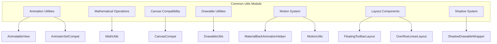

# Common Utils Module Documentation

## Overview

The **common-utils** module provides essential utility classes and helper functions that serve as the foundation for Material Design Components across the entire library. This module contains cross-cutting concerns including animation utilities, mathematical operations, canvas compatibility, drawable utilities, motion system helpers, and specialized layout components.

## Architecture



## Module Purpose

The common-utils module serves as the foundational layer that provides:

1. **Cross-platform compatibility** - Handles API level differences and provides consistent behavior across Android versions
2. **Mathematical operations** - Essential geometric calculations and interpolation functions
3. **Animation support** - Base interfaces and compatibility utilities for smooth animations
4. **Drawing utilities** - Canvas and drawable manipulation helpers
5. **Motion system integration** - Back gesture handling and motion theme resolution
6. **Specialized layouts** - Advanced layout components for complex UI patterns

## Sub-modules

### 1. Animation Utilities
Provides foundational animation interfaces and compatibility utilities.

**Key Components:**
- `AnimatableView` - Interface for views that support animation callbacks
- `AnimatorSetCompat` - Compatibility utilities for AnimatorSet operations

[Detailed Documentation](animation-utilities.md)

### 2. Mathematical Operations
Mathematical utility functions for geometric calculations and interpolations.

**Key Components:**
- `MathUtils` - Distance calculations, linear interpolation, fuzzy comparisons

[Detailed Documentation](mathematical-operations.md)

### 3. Canvas Compatibility
Cross-version compatibility for Canvas operations.

**Key Components:**
- `CanvasCompat` - Layer alpha operations with API level compatibility

[Detailed Documentation](canvas-compatibility.md)

### 4. Drawable Utilities
Comprehensive drawable manipulation and utility functions.

**Key Components:**
- `DrawableUtils` - Tinting, compositing, state management, and outline operations

[Detailed Documentation](drawable-utilities.md)

### 5. Motion System
Material Design motion system integration and back gesture handling.

**Key Components:**
- `MaterialBackAnimationHelper` - Base helper for back gesture animations
- `MotionUtils` - Theme-based motion duration and interpolator resolution

[Detailed Documentation](motion-system.md)

### 6. Layout Components
Specialized layout components for advanced UI patterns.

**Key Components:**
- `FloatingToolbarLayout` - Floating toolbar with Material Design styling
- `OverflowLinearLayout` - Automatic overflow management for linear layouts

[Detailed Documentation](layout-components.md)

### 7. Shadow System
Legacy shadow rendering support for Material Design elevation.

**Key Components:**
- `ShadowDrawableWrapper` - Shadow rendering around drawables (deprecated)

[Detailed Documentation](shadow-system.md)

## Integration with Other Modules

The common-utils module provides foundational support for numerous other modules in the Material Design Components library:

- **[Animation System](animation.md)** - Uses animation utilities for smooth transitions
- **[Theme System](theme.md)** - Integrates with motion system for consistent theming
- **[Shape System](shape.md)** - Utilizes mathematical operations for path calculations
- **[Component Behaviors](behavior.md)** - Leverages motion utilities for gesture handling
- **[Drawable Components](drawable.md)** - Extends drawable utilities for specialized components
- **[App Bar](appbar.md)** - Uses mathematical utilities for positioning calculations
- **[Color System](color.md)** - Integrates with drawable utilities for color state management
- **[Transition System](transition.md)** - Leverages animation utilities and motion system for complex transitions

## Usage Patterns

### Animation Integration
```java
// Using AnimatableView interface
public class CustomView extends View implements AnimatableView {
    @Override
    public void startAnimation(@NonNull Listener listener) {
        // Custom animation implementation
    }
    
    @Override
    public void stopAnimation() {
        // Stop animation logic
    }
}
```

### Mathematical Operations
```java
// Distance calculation
float distance = MathUtils.dist(x1, y1, x2, y2);

// Linear interpolation
float interpolated = MathUtils.lerp(startValue, endValue, amount);
```

### Motion System Integration
```java
// Resolving motion attributes from theme
int duration = MotionUtils.resolveThemeDuration(context, R.attr.motionDurationMedium2, 300);
TimeInterpolator interpolator = MotionUtils.resolveThemeInterpolator(context, R.attr.motionEasingStandard, new LinearInterpolator());
```

## Best Practices

1. **Version Compatibility** - Always use compatibility utilities when dealing with API-specific features
2. **Theme Integration** - Leverage theme-based motion attributes for consistent user experience
3. **Performance** - Use mathematical utilities for efficient geometric calculations
4. **Accessibility** - Ensure proper content descriptions and tooltips in layout components
5. **Deprecation Handling** - Migrate from deprecated components (like ShadowDrawableWrapper) to newer alternatives

## Migration Notes

- `ShadowDrawableWrapper` is deprecated in favor of `MaterialShapeDrawable` for shadow effects
- Use theme-based motion attributes instead of hardcoded animation values
- Prefer `MaterialBackAnimationHelper` for back gesture handling over custom implementations

## Dependencies

The common-utils module has minimal external dependencies, primarily relying on:
- Android Support Library components
- Material Design theme attributes
- Core Android framework APIs

This design ensures maximum compatibility and minimal overhead for consuming modules.