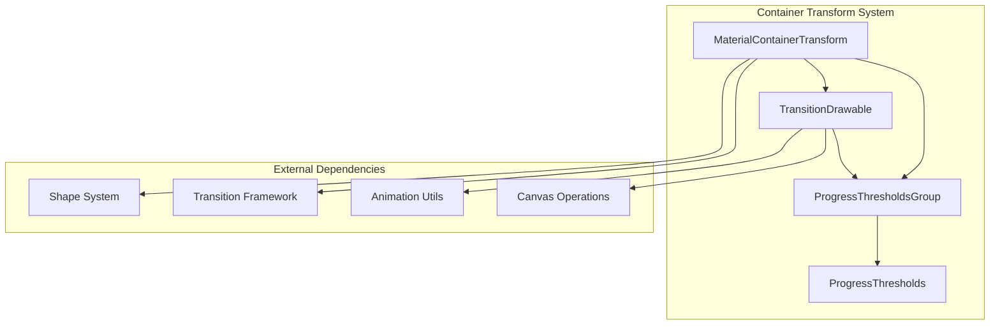
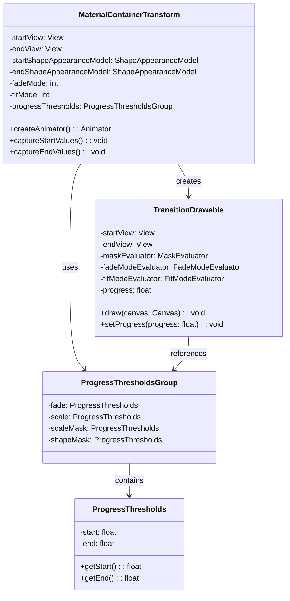
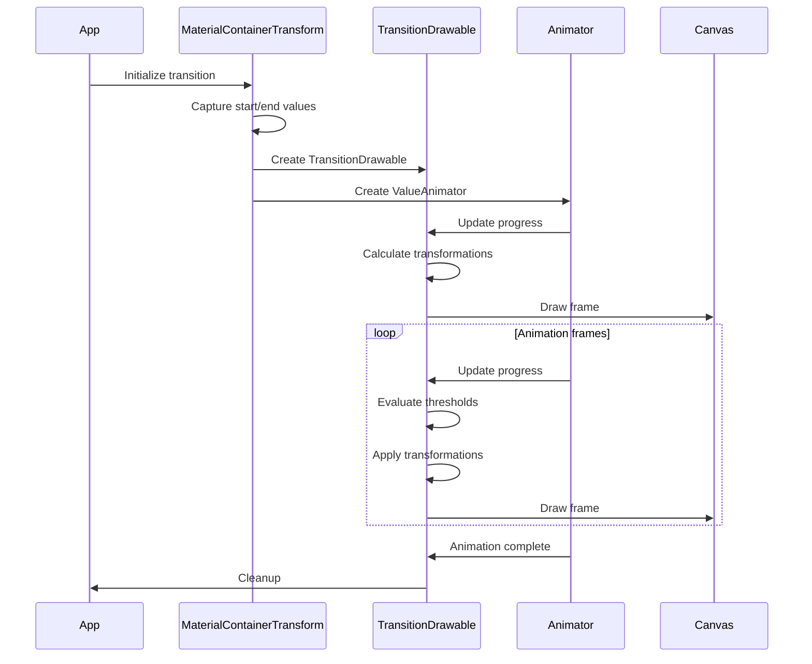
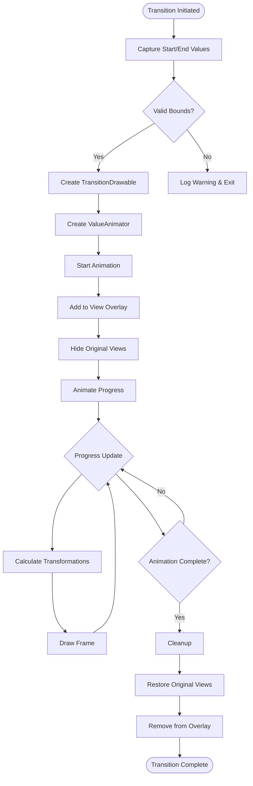

# Container Transform System Module

## Introduction

The Container Transform System is a sophisticated animation framework within the Material Design Components library that enables seamless morphing transitions between UI containers. This module provides the core functionality for implementing Material Design's container transform pattern, which creates fluid, meaningful transitions between different UI states by animating the transformation of one container into another.

The system is designed to handle complex shared element transitions between Activities, Fragments, Views, or any combination thereof, providing a visually cohesive experience that maintains context and spatial relationships during navigation flows.

## Core Architecture

### Primary Components

The Container Transform System is built around four main components that work in concert to create smooth, customizable transitions:

#### 1. MaterialContainerTransform
The central orchestrator that extends Android's `Transition` class to provide container morphing capabilities. This component captures start and end views, manages the animation lifecycle, and coordinates all aspects of the transformation including shape, size, position, and content fading.

#### 2. TransitionDrawable
A specialized `Drawable` implementation that handles the actual rendering of the transformation at each animation frame. This component manages the complex drawing operations including shape morphing, elevation shadows, content scaling, and cross-fading between start and end states.

#### 3. ProgressThresholds
Defines precise timing windows within the overall animation progress (0.0 to 1.0) for different animation aspects. This allows fine-grained control over when specific transformations occur, such as when fading begins/ends, scaling happens, or shape morphing occurs.

#### 4. ProgressThresholdsGroup
A collection container that organizes multiple `ProgressThresholds` instances for different animation dimensions (fade, scale, scale mask, shape mask), ensuring coordinated timing across all transformation aspects.

## System Architecture



## Component Relationships



## Data Flow Architecture



## Key Features and Capabilities

### Shape Morphing
The system seamlessly morphs between different shape appearances, supporting complex transformations from rectangular containers to rounded shapes, cut corners, or custom path-based shapes. This is achieved through integration with the [Shape System](shape.md) module's `ShapeAppearanceModel`.

### Content Management
Multiple fade modes provide flexibility in how content is transitioned:
- **FADE_MODE_IN**: Incoming content fades in while outgoing content remains visible
- **FADE_MODE_OUT**: Outgoing content fades out while incoming content remains visible  
- **FADE_MODE_CROSS**: Both contents cross-fade simultaneously
- **FADE_MODE_THROUGH**: Sequential fade out then fade in

### Elevation and Shadow Support
The system provides sophisticated elevation shadow rendering that approximates native Android shadows, with automatic fallback to `MaterialShapeDrawable` for older API levels. Shadow positioning dynamically adjusts based on the container's position relative to the screen's light source.

### Path Motion Integration
Supports custom motion paths including arc motions and material arc motions, allowing containers to follow curved trajectories during transformation. The system automatically adjusts animation thresholds based on the motion path type for optimal visual results.

## Process Flow



## Integration with Other Systems

### Shape System Integration
The Container Transform System heavily relies on the [Shape System](shape.md) for defining and morphing between different container shapes. The `ShapeAppearanceModel` from the shape system provides the foundation for all shape-based transformations.

### Animation Framework Integration
Built on top of Android's `Transition` framework, the system integrates with the broader [Animation Providers](animation-providers.md) module for consistent easing, duration, and interpolation behaviors across the Material Design system.

### Canvas Operations
The system utilizes advanced canvas operations from the [Canvas Utilities](canvas-compat.md) module for efficient drawing, clipping, and transformation operations during the animation frames.

## Configuration and Customization

### Theme Integration
The system supports theme-based configuration for:
- Motion interpolators and easing curves
- Animation durations based on transition direction
- Default path motions
- Shape appearances

### Runtime Customization
Developers can customize transitions through:
- Custom fade modes and timing
- Fit modes for content scaling
- Progress thresholds for fine-grained control
- Custom path motions
- Elevation and shadow settings
- Container colors and scrim effects

## Performance Considerations

### Hardware Acceleration
The system is optimized for hardware acceleration on API 28+ with native shadow rendering. For older versions, it provides compatibility fallbacks using `MaterialShapeDrawable`.

### Memory Management
Efficient memory usage through:
- View overlay management
- Drawable lifecycle management
- Automatic cleanup on animation completion
- Optional frame holding for return transitions

### Rendering Optimization
- Path-based clipping for complex shapes
- Optimized shadow rendering for common shapes (rounded rectangles)
- Efficient canvas transformations
- Debug mode for performance analysis

## Error Handling and Edge Cases

The system includes comprehensive error handling for:
- Invalid or null view bounds
- Missing start/end views
- Unsupported shape configurations
- Hardware acceleration limitations
- Memory pressure scenarios

## Usage Patterns

### Basic Container Transform
```java
MaterialContainerTransform transform = new MaterialContainerTransform();
transform.setStartView(startView);
transform.setEndView(endView);
```

### Themed Container Transform
```java
MaterialContainerTransform transform = 
    new MaterialContainerTransform(context, entering);
```

### Custom Progress Thresholds
```java
ProgressThresholds fadeThresholds = new ProgressThresholds(0.2f, 0.8f);
transform.setFadeProgressThresholds(fadeThresholds);
```

This comprehensive system provides the foundation for creating fluid, meaningful transitions that enhance user experience by maintaining visual continuity and spatial relationships during navigation flows.