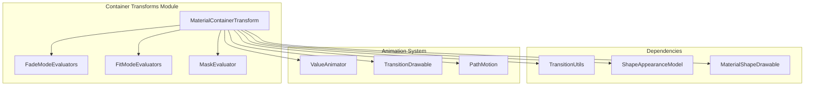

# Container Transforms Module

## Overview

The container-transforms module is a core component of the Material Design transition system, providing sophisticated shared element transitions that transform one container into another. This module implements the MaterialContainerTransform class, which enables smooth morphing animations between UI elements during navigation transitions.

## Purpose

Container transforms create visually appealing transitions by:
- Morphing the shape and size of containers from start to end states
- Managing content fade animations during the transformation
- Providing customizable motion paths and timing
- Supporting elevation shadows and scrim effects
- Handling complex shape interpolations

## Architecture



## Core Components

### MaterialContainerTransform
The main transition class that orchestrates the container transformation animation. It handles:
- Capturing start and end view states
- Creating and managing the transition drawable
- Coordinating fade, scale, and shape animations
- Managing elevation shadows and scrim effects

### FadeModeEvaluators
Provides different strategies for fading content during transitions:
- **IN**: Fade in incoming content only
- **OUT**: Fade out outgoing content only  
- **CROSS**: Cross-fade both contents simultaneously
- **THROUGH**: Sequential fade out then fade in

### FitModeEvaluators
Handles content scaling strategies:
- **WIDTH**: Fit content to width while maintaining aspect ratio
- **HEIGHT**: Fit content to height while maintaining aspect ratio
- **AUTO**: Automatically choose best fit mode

### MaskEvaluator
Manages the morphing container's shape during animation:
- Interpolates between start and end shape appearance models
- Calculates clipping paths for the transforming container
- Handles API-level differences in path operations

## Key Features

### Progress Thresholds
The module uses progress thresholds to control animation timing:
- **Fade Thresholds**: Control when content fading occurs
- **Scale Thresholds**: Manage container scaling animation
- **Shape Mask Thresholds**: Handle shape morphing timing
- **Scale Mask Thresholds**: Control content masking

### Motion Paths
Supports customizable motion paths for container movement:
- Linear paths (default)
- Arc motion paths
- Custom path motions
- Automatic trajectory calculation for overshoot

### Elevation Shadows
Provides realistic elevation shadow effects:
- Native shadow layers (API 28+)
- MaterialShapeDrawable compatibility (API 21+)
- Dynamic shadow positioning based on screen location
- Configurable shadow colors and offsets

## Usage Patterns

### Basic Container Transform
```java
MaterialContainerTransform transform = new MaterialContainerTransform();
transform.setStartView(startView);
transform.setEndView(endView);
transform.setContainerColor(containerColor);
transform.setScrimColor(scrimColor);
```

### Custom Progress Thresholds
```java
ProgressThresholds fadeThresholds = new ProgressThresholds(0.2f, 0.8f);
transform.setFadeProgressThresholds(fadeThresholds);
```

### Shape Morphing
```java
transform.setStartShapeAppearanceModel(startShape);
transform.setEndShapeAppearanceModel(endShape);
```

## Integration with Other Modules

The container-transforms module integrates with several other Material Design components:

- **[Shape System](shape.md)**: Uses ShapeAppearanceModel for container shapes
- **[Animation Utilities](animation-providers.md)**: Leverages animation interpolators and timing
- **[Theme System](theme.md)**: Respects theme-based motion values
- **[Platform Compatibility](platform-compatibility.md)**: Handles API-level differences

## Performance Considerations

- **Hardware Acceleration**: Optimized for hardware-accelerated rendering
- **Path Complexity**: Complex shapes may impact performance
- **Shadow Rendering**: Elevation shadows can be disabled for better performance
- **Memory Usage**: Creates temporary drawables during animation

## Best Practices

1. **View Measurement**: Ensure start and end views are properly measured before transition
2. **Background Colors**: Set appropriate container colors to prevent visual artifacts
3. **Duration**: Use appropriate animation durations based on transition distance
4. **Testing**: Test on various screen sizes and API levels
5. **Performance**: Monitor performance with complex shapes and large containers

## Sub-modules

### [Animation Providers](animation-providers.md)
Provides custom animation strategies for fade, scale, and slide effects. Includes FadeProvider, ScaleProvider, SlideDistanceProvider, and VisibilityAnimatorProvider for creating custom transition animations.

### [Platform Compatibility](platform-compatibility.md)
Handles API-level differences and platform-specific implementations. Contains platform-specific versions of evaluators and transition utilities to ensure consistent behavior across Android versions.

### [Utilities and Helpers](utilities-helpers.md)
Supporting utility classes including TransitionUtils for common operations, MaterialArcMotion for curved paths, and result classes for fade and fit mode evaluations.

## Related Documentation

- [Visibility Transitions](visibility-transitions.md) - Other transition types