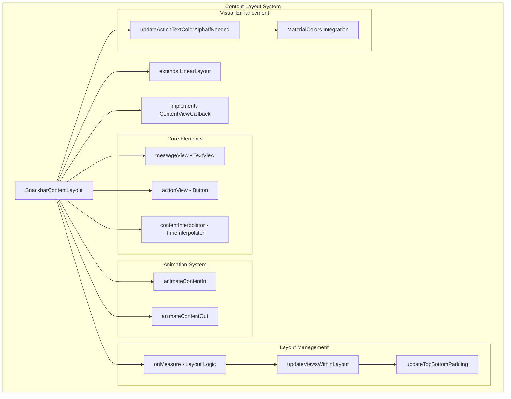
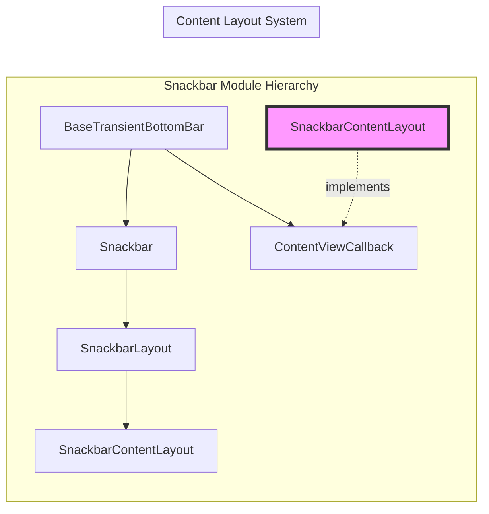
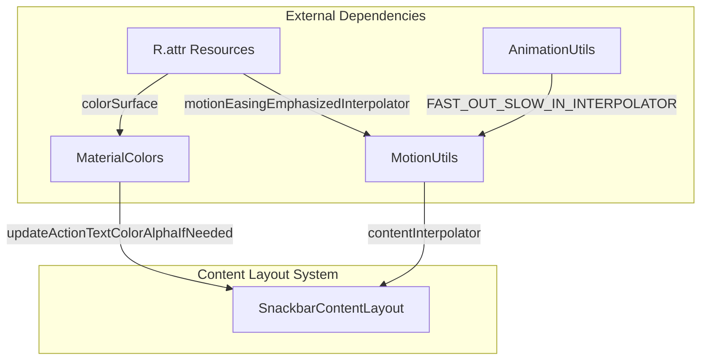
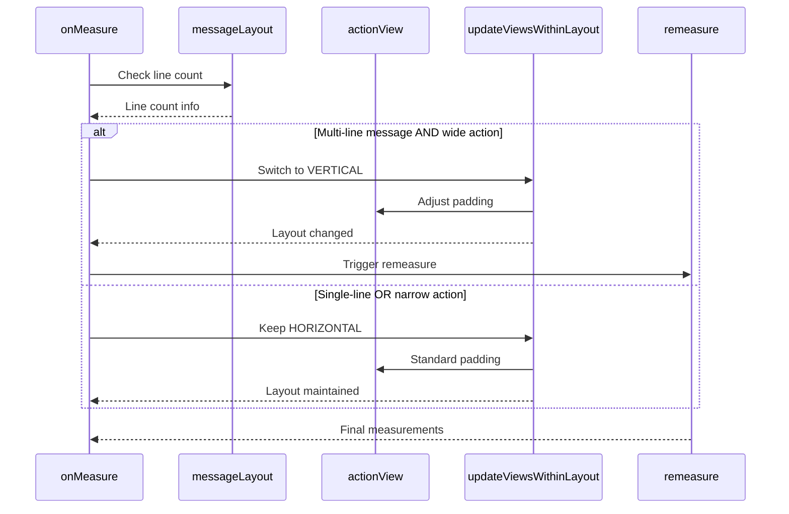
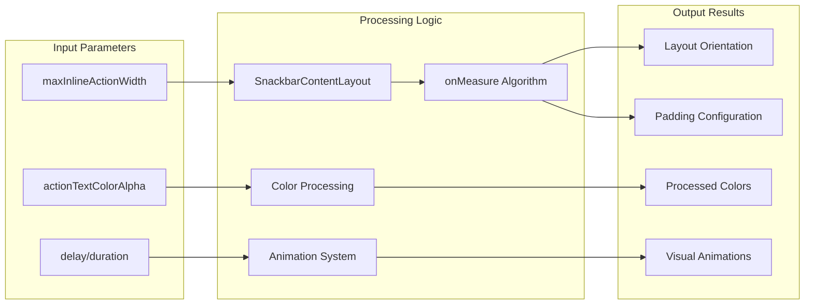

# Content Layout System Module

## Introduction

The Content Layout System module is a specialized component within the Material Design Components library that handles the internal layout and presentation of snackbar content. This module provides the `SnackbarContentLayout` class, which serves as the core container for organizing and displaying message text and action buttons within snackbars, ensuring proper responsive behavior and visual hierarchy.

## Module Overview

The content-layout-system is a sub-module of the larger [snackbar](snackbar.md) module, specifically focused on managing the internal content arrangement and visual presentation of snackbar messages. It implements sophisticated layout logic that adapts to different content lengths, screen sizes, and action button configurations while maintaining Material Design guidelines.

## Core Architecture

### Primary Component

#### SnackbarContentLayout
The `SnackbarContentLayout` class extends `LinearLayout` and implements the `ContentViewCallback` interface, serving as the primary container for snackbar content. This component is responsible for:

- **Dynamic Layout Management**: Automatically switches between horizontal and vertical orientations based on content requirements
- **Responsive Content Arrangement**: Adapts layout when action buttons are too wide or message text spans multiple lines
- **Animation Coordination**: Handles fade-in/fade-out animations for both message text and action buttons
- **Material Design Compliance**: Ensures proper spacing, padding, and visual hierarchy according to Material Design specifications

### Architecture Diagram

## Component Relationships

### Integration with Snackbar System

### Dependency Flow

## Key Features and Functionality

### 1. Intelligent Layout Management

The system implements sophisticated logic to determine optimal layout orientation:

- **Horizontal Layout**: Default orientation for single-line messages with reasonably-sized action buttons
- **Vertical Layout**: Automatically switches when action buttons exceed maximum width or message text spans multiple lines
- **Dynamic Padding Adjustment**: Adapts padding based on content configuration and orientation

### 2. Responsive Content Adaptation

### 3. Animation System

The module provides coordinated animations for content appearance and disappearance:

- **Synchronized Fading**: Message and action elements fade in/out together
- **Customizable Timing**: Supports configurable delay and duration parameters
- **Conditional Animation**: Action button animations only occur when visible
- **Material Motion**: Uses Material Design motion curves for natural movement

### 4. Visual Enhancement Features

- **Alpha Blending**: Supports semi-transparent action text colors through alpha channel manipulation
- **Material Color Integration**: Leverages Material Design color system for consistent theming
- **Surface Color Awareness**: Adapts action text color based on surface background

## Data Flow Architecture

## Integration Points

### With BaseTransientBottomBar
The `SnackbarContentLayout` implements `ContentViewCallback`, allowing it to integrate seamlessly with the base transient bottom bar system for coordinated content animations.

### With Material Design System
- **Color System**: Integrates with [color](color.md) module for Material Design color theming
- **Motion System**: Utilizes [transition](transition.md) module concepts for animation timing
- **Resource System**: Leverages dimension resources for consistent spacing

## Usage Patterns

### Standard Implementation
The content layout system is typically used internally by the snackbar implementation and doesn't require direct instantiation by developers. It automatically handles content arrangement based on the provided message and action configuration.

### Customization Points
- **Maximum Action Width**: `setMaxInlineActionWidth()` controls when layout switches to vertical
- **Animation Timing**: Content animations respect system-wide Material Design motion specifications
- **Color Integration**: Action text colors automatically adapt to surface backgrounds

## Technical Specifications

### Performance Considerations
- **Efficient Remeasuring**: Only triggers remeasure when layout changes are actually needed
- **View Recycling**: Leverages existing view instances for optimal performance
- **Animation Optimization**: Uses hardware-accelerated property animations

### Accessibility Features
- **Text Scaling Support**: Properly handles system font size changes
- **Layout Adaptation**: Maintains readable layouts across different screen sizes and orientations
- **Color Contrast**: Ensures proper contrast ratios through Material Design color system

## Related Documentation

- [Snackbar Module](snackbar.md) - Parent module containing the complete snackbar system
- [Base Transient Bottom Bar](base-transient-bottom-bar.md) - Foundation component for transient UI messages
- [Material Design Motion](transition.md) - Animation and transition system guidelines
- [Material Colors](color.md) - Color system and theming integration

## Conclusion

The Content Layout System module represents a sophisticated solution for managing snackbar content presentation within the Material Design Components library. By providing intelligent layout adaptation, coordinated animations, and seamless integration with the broader Material Design system, it ensures that snackbar messages maintain optimal readability and visual appeal across diverse content configurations and device contexts.