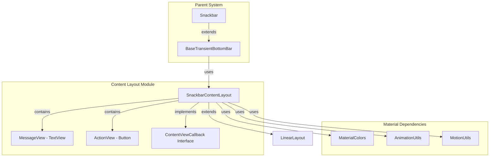
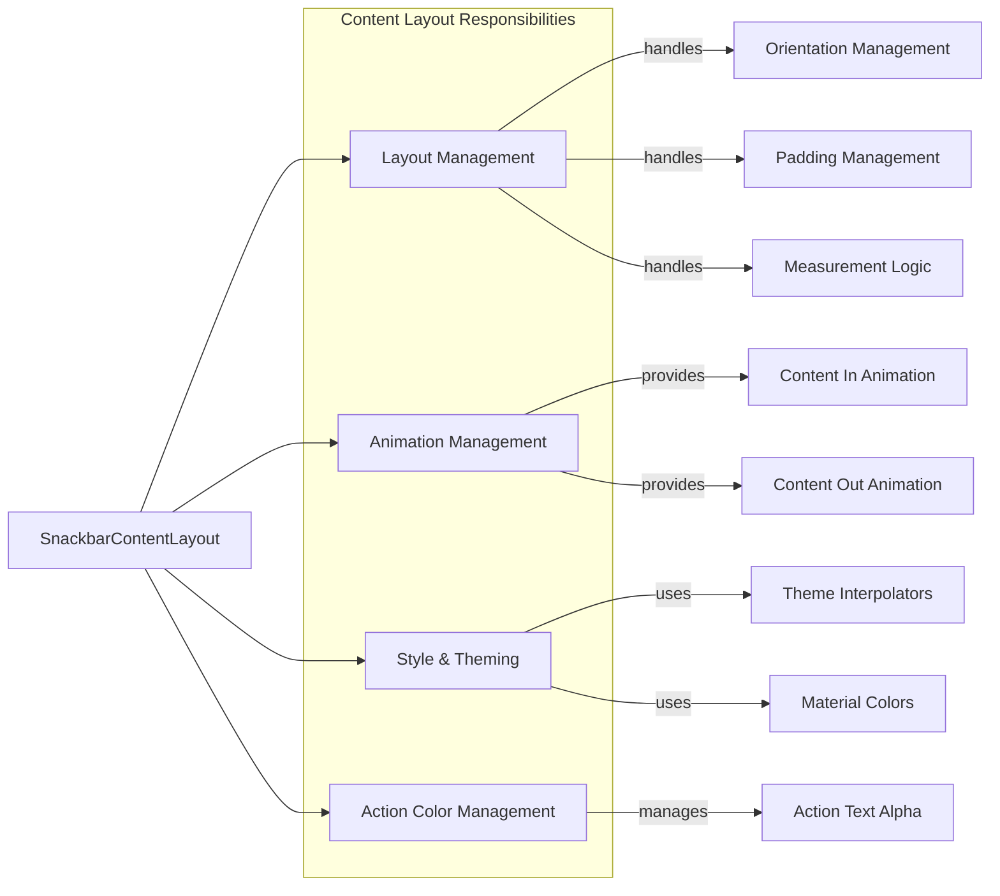
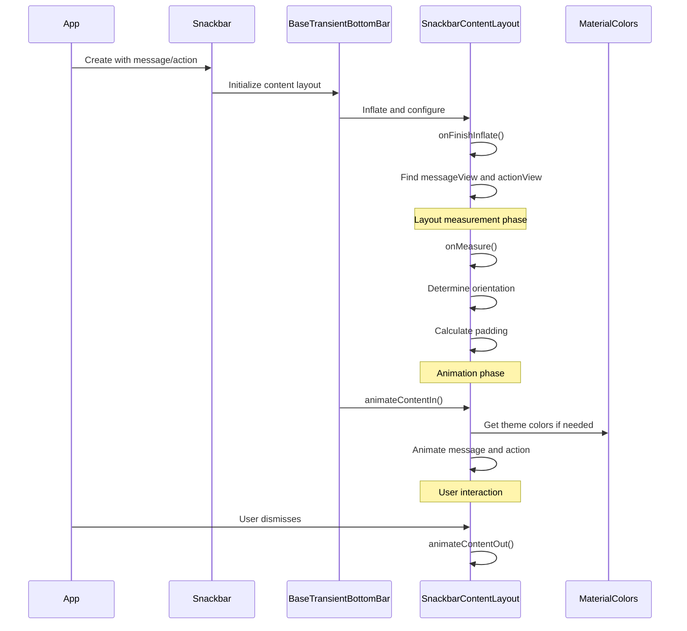
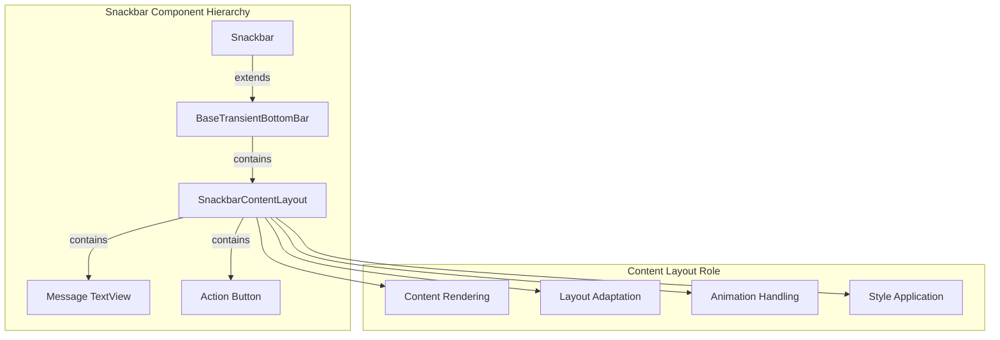

# Content Layout Module Documentation

## Introduction

The content-layout module is a specialized component within the Material Design Components library that provides the layout infrastructure for snackbar notifications. It implements the `SnackbarContentLayout` class, which serves as the primary container for snackbar content, managing the arrangement and presentation of message text and action buttons.

This module is part of the broader [snackbar](snackbar.md) system and works in conjunction with other snackbar components to deliver consistent, accessible, and animated notification experiences across Android applications.

## Architecture Overview

### Core Component Structure



### Component Relationships



## Core Functionality

### Layout Management

The `SnackbarContentLayout` extends `LinearLayout` and implements intelligent layout logic that adapts based on content requirements:

1. **Horizontal Layout**: Default orientation when message and action can fit inline
2. **Vertical Layout**: Automatically switches when action button width exceeds `maxInlineActionWidth` and message text would be ellipsized
3. **Dynamic Padding**: Adjusts padding based on whether the message is single-line or multi-line

### Animation System

The module provides smooth content animations using Material Design motion principles:

- **Content In Animation**: Fades in message and action views with customizable delay and duration
- **Content Out Animation**: Fades out content with consistent timing and interpolation
- **Interpolator**: Uses emphasized motion interpolator for natural, Material-compliant animations

### Theming Integration

The content layout integrates with Material Design theming system:

- **Color Management**: Uses `MaterialColors` for consistent theming
- **Motion Integration**: Resolves theme-based interpolators via `MotionUtils`
- **Alpha Blending**: Supports action text color alpha blending for visual hierarchy

## Data Flow



## Key Features

### Adaptive Layout Strategy

The content layout implements a sophisticated measurement algorithm that:

1. **Measures content** in horizontal orientation first
2. **Evaluates constraints** based on action button width and message line count
3. **Switches orientation** to vertical when inline layout would compromise readability
4. **Adjusts padding** appropriately for single vs. multi-line messages

### Accessibility Considerations

- **Text Scaling**: Respects system text size preferences
- **Touch Targets**: Ensures action buttons meet minimum touch target requirements
- **Color Contrast**: Integrates with Material color system for proper contrast ratios

### Performance Optimizations

- **Efficient Remeasurement**: Only remeasures when layout parameters actually change
- **View Recycling**: Reuses existing views rather than creating new ones
- **Animation Optimization**: Uses hardware-accelerated alpha animations

## Integration with Snackbar System



## Dependencies

The content-layout module relies on several Material Design Components:

- **[Material Colors](color.md)**: For theme-aware color management and alpha blending
- **[Animation Utils](common-utils.md)**: For standard animation interpolators
- **[Motion Utils](common-utils.md)**: For theme-based motion curve resolution

## Usage Patterns

### Standard Implementation

The content layout is typically used internally by the snackbar system, but understanding its behavior helps in:

1. **Custom Snackbar Extensions**: When creating specialized snackbar variants
2. **Theming Customization**: Understanding how content layout responds to theme changes
3. **Layout Debugging**: Diagnosing layout issues in snackbar presentations

### Customization Points

While primarily internal, the content layout provides several customization opportunities:

- **Max Inline Action Width**: Control when layout switches from horizontal to vertical
- **Animation Timing**: Customize fade in/out durations and delays
- **Color Alpha**: Adjust action text transparency for visual hierarchy

## Best Practices

### Layout Optimization

1. **Action Button Text**: Keep action labels concise to prevent unnecessary vertical layout
2. **Message Length**: Consider message length when designing snackbar content
3. **Theme Consistency**: Ensure proper theme attributes are defined for consistent styling

### Animation Performance

1. **Duration Selection**: Use appropriate animation durations for the context
2. **Delay Timing**: Consider user attention and interaction patterns for animation delays
3. **Interpolator Selection**: Leverage theme-based interpolators for consistent motion

## Technical Implementation Details

### Measurement Algorithm

The layout measurement follows this logic:

```
1. Measure in horizontal orientation
2. Check if message is multi-line
3. Evaluate action button width against maxInlineActionWidth
4. If constraints violated, switch to vertical orientation
5. Adjust padding based on line count
6. Remeasure if orientation or padding changed
```

### Animation Sequence

Content animations are synchronized:

```
1. Set initial alpha state (0 for in, 1 for out)
2. Apply animation with theme interpolator
3. Use specified duration and delay
4. Handle both message and action views conditionally
```

This ensures smooth, coordinated animations that enhance the user experience while maintaining Material Design principles.

## Related Documentation

- [Snackbar Module](snackbar.md) - Parent module containing content layout
- [Base Transient Bottom Bar](snackbar.md) - Base class that utilizes content layout
- [Material Colors](color.md) - Color system used for theming
- [Common Utilities](common-utils.md) - Animation and motion utilities