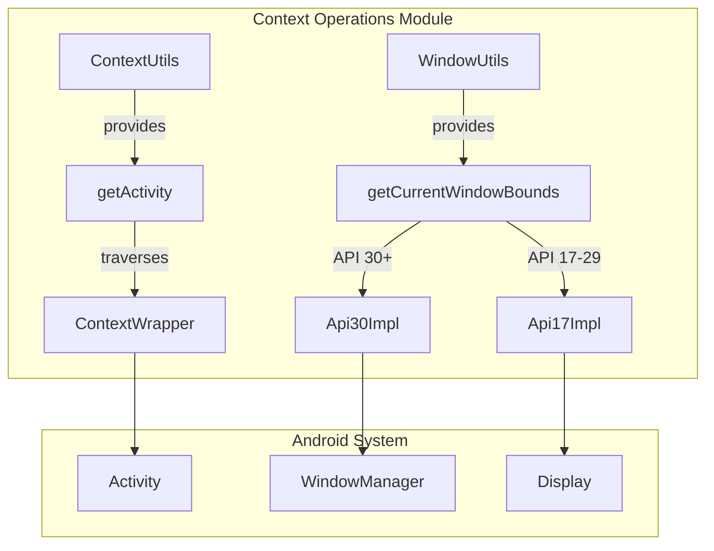
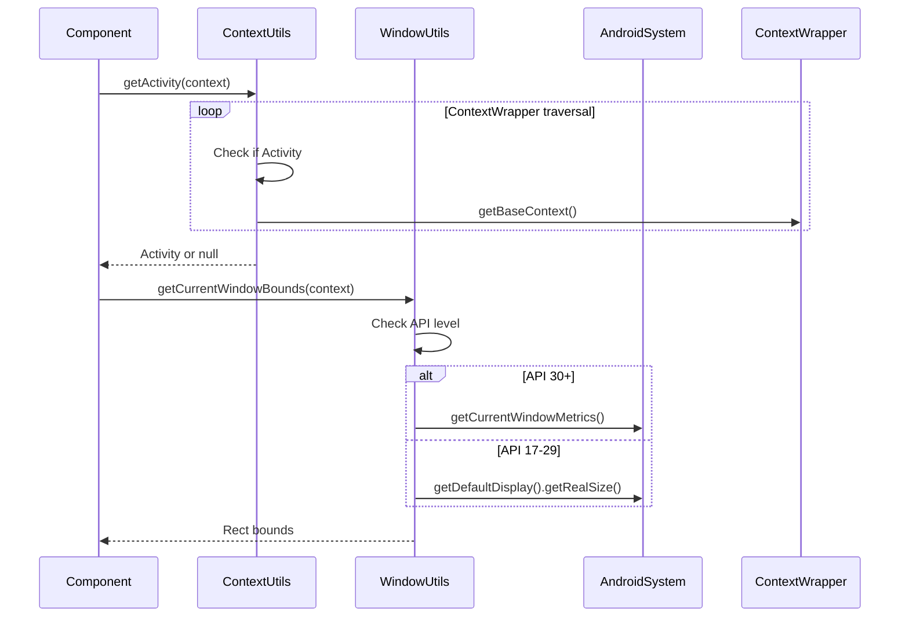
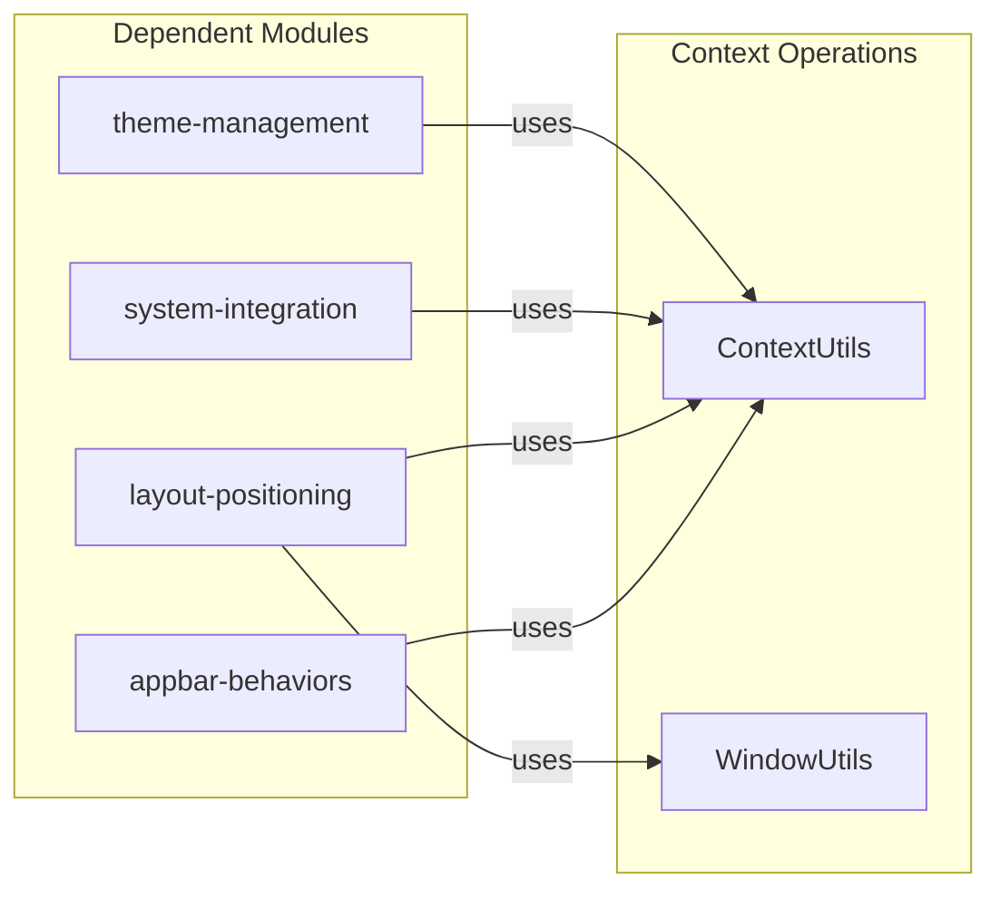
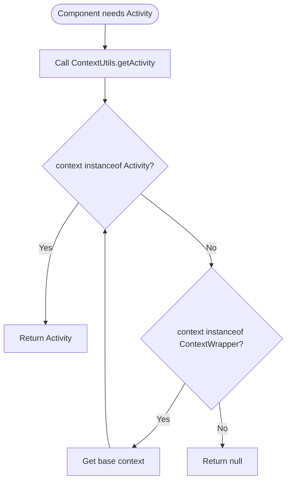
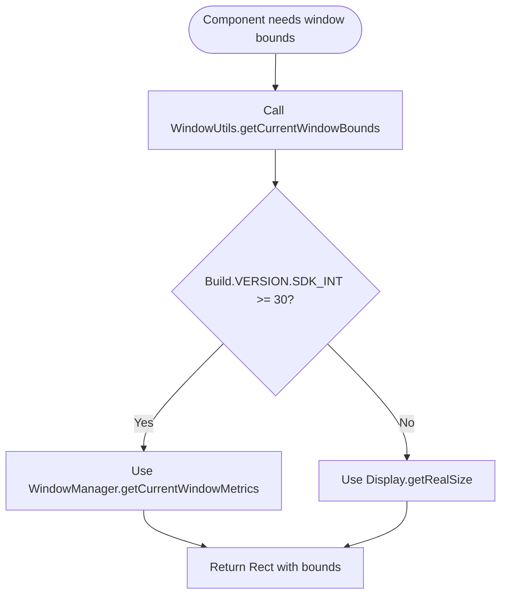

# Context Operations Module

## Brief Introduction

The context-operations module provides essential utility functions for handling Android Context and Window operations within the Material Design Components library. This module serves as a foundational layer that enables other components to safely extract Activity instances from Context hierarchies and obtain window boundary information across different Android API levels.

## Comprehensive Documentation

### Module Overview

The context-operations module is part of the internal utilities package and provides two primary utility classes:

1. **ContextUtils** - Safely extracts Activity instances from Context objects
2. **WindowUtils** - Provides window boundary information with API-level compatibility

These utilities are crucial for components that need to interact with the Android window system or require Activity context for their operations.

### Architecture



### Core Components

#### ContextUtils

**Purpose**: Safely extracts Activity instances from Context objects, handling ContextWrapper hierarchies.

**Key Features**:
- Traverses ContextWrapper chains to find the underlying Activity
- Returns null if no Activity is found in the hierarchy
- Handles nested ContextWrapper scenarios safely

**Usage Pattern**:
```java
Activity activity = ContextUtils.getActivity(context);
if (activity != null) {
    // Safe to use activity-specific operations
}
```

#### WindowUtils

**Purpose**: Provides window boundary information with automatic API-level compatibility.

**Key Features**:
- API 30+ support using WindowManager.getCurrentWindowMetrics()
- Fallback for API 17-29 using Display.getRealSize()
- Returns Rect object with current window bounds

**Implementation Strategy**:
- Uses version-specific implementations (Api30Impl, Api17Impl)
- Automatically selects appropriate implementation based on runtime API level
- Provides consistent Rect interface regardless of underlying API

### Data Flow



### Component Interactions

The context-operations module serves as a foundational utility that other Material Design Components depend on:



### Process Flow

#### Activity Context Resolution



#### Window Bounds Retrieval



### Integration with Other Modules

The context-operations module provides essential services to various parts of the Material Design Components library:

- **[appbar-behaviors](appbar-behaviors.md)**: Uses ContextUtils to obtain Activity context for coordinating AppBar scrolling behaviors
- **[layout-positioning](layout-positioning.md)**: Leverages both ContextUtils and WindowUtils for calculating view positions and handling window insets
- **[system-integration](system-integration.md)**: Depends on ContextUtils for system-level operations that require Activity context
- **[theme-management](theme-management.md)**: Uses ContextUtils to access Activity for theme overlay applications

### Best Practices

1. **Null Safety**: Always check for null return values from ContextUtils.getActivity()
2. **API Compatibility**: WindowUtils automatically handles API differences, but be aware of potential behavioral differences
3. **Performance**: ContextUtils traversal is efficient but avoid repeated calls in performance-critical paths
4. **Context Lifecycle**: Ensure the provided Context is valid and not destroyed before using extracted Activity

### Error Handling

The module implements defensive programming practices:

- **ContextUtils**: Returns null instead of throwing exceptions when no Activity is found
- **WindowUtils**: Provides fallback implementations for different API levels
- **Type Safety**: Uses annotations (@NonNull, @Nullable) to clearly indicate contract expectations

### Version Compatibility

- **ContextUtils**: Compatible with all Android API levels (minimum API 14 for Material Components)
- **WindowUtils**: 
  - Full functionality: API 30+ (Android 11+)
  - Fallback functionality: API 17-29 (Android 4.2 to Android 10)
  - Graceful degradation for older versions

This module ensures that Material Design Components can reliably interact with the Android system across different API levels while maintaining backward compatibility and providing consistent behavior.