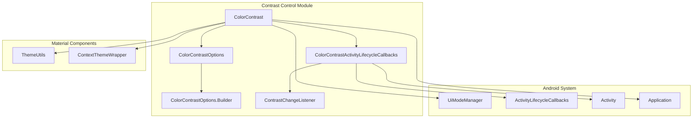
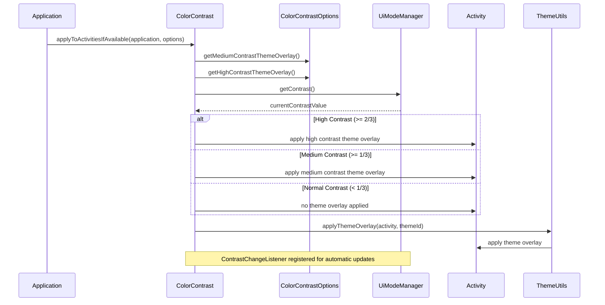
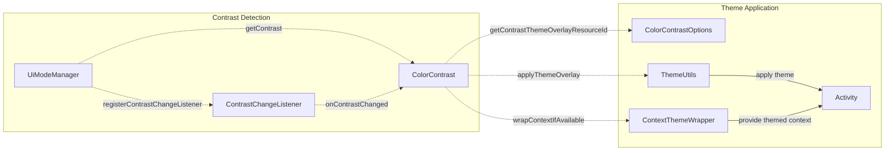
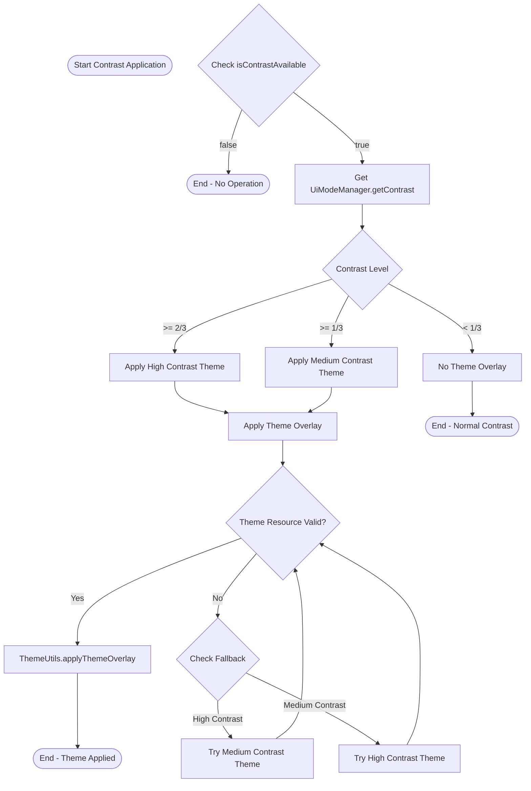

# Contrast Control Module

## Introduction

The contrast-control module provides utilities for managing color contrast in Android applications, ensuring accessibility compliance and optimal visual experience across different contrast levels. This module is part of the Material Design Components library and specifically targets Android U+ (API level 34+) where contrast control is natively supported.

## Overview

The contrast-control module enables developers to apply contrast-aware theming to their applications, automatically adapting UI colors based on system-wide contrast settings. It provides a comprehensive solution for handling medium and high contrast modes while maintaining backward compatibility with older Android versions.

## Core Components

### ColorContrast

The `ColorContrast` class is the main utility for applying contrast colors to applications and activities. It provides static methods to:

- Apply contrast to all activities through application-level lifecycle callbacks
- Apply contrast to individual activities
- Wrap contexts with contrast-aware theme overlays
- Check contrast availability on the current SDK level

### ColorContrastOptions

The `ColorContrastOptions` class serves as a configuration wrapper for specifying theme overlay resources for different contrast levels. It uses a builder pattern to define:

- Medium contrast theme overlay resource IDs
- High contrast theme overlay resource IDs

## Architecture



## Data Flow



## Component Interactions



## Process Flow



## Key Features

### Automatic Contrast Detection
The module automatically detects the current system contrast level using `UiModeManager.getContrast()` and applies appropriate theme overlays based on predefined thresholds:

- **Normal Contrast**: Less than 1/3 (no theme overlay applied)
- **Medium Contrast**: 1/3 to less than 2/3 (medium contrast theme)
- **High Contrast**: 2/3 and above (high contrast theme)

### Lifecycle-Aware Contrast Management
The `ColorContrastActivityLifecycleCallbacks` class manages contrast application across the entire application lifecycle:

- Registers a system-level `ContrastChangeListener` when the first activity is created
- Automatically recreates all activities when contrast level changes
- Properly cleans up listeners when no activities are in the stack
- Prevents memory leaks by tracking activity references

### Fallback Mechanism
The module implements intelligent fallback logic for theme overlay resources:

- If high contrast theme is not specified, falls back to medium contrast theme
- If medium contrast theme is not specified, falls back to high contrast theme
- Returns 0 (no overlay) if neither theme is specified

### Context Wrapping
Provides the ability to wrap contexts with contrast-aware theme overlays for view creation, ensuring consistent contrast support throughout the application.

## Usage Patterns

### Application-Wide Contrast
```java
public class YourApplication extends Application {
    @Override
    public void onCreate() {
        super.onCreate();
        ColorContrastOptions options = new ColorContrastOptions.Builder()
            .setMediumContrastThemeOverlay(R.style.ThemeOverlay_MediumContrast)
            .setHighContrastThemeOverlay(R.style.ThemeOverlay_HighContrast)
            .build();
        ColorContrast.applyToActivitiesIfAvailable(this, options);
    }
}
```

### Individual Activity Contrast
```java
ColorContrastOptions options = new ColorContrastOptions.Builder()
    .setMediumContrastThemeOverlay(R.style.ThemeOverlay_MediumContrast)
    .setHighContrastThemeOverlay(R.style.ThemeOverlay_HighContrast)
    .build();
ColorContrast.applyToActivityIfAvailable(activity, options);
```

### Context Wrapping
```java
Context themedContext = ColorContrast.wrapContextIfAvailable(context, options);
View contrastAwareView = new View(themedContext);
```

## Dependencies

The contrast-control module integrates with several other Material Design Components:

- **[Theme Utils](theme-utils.md)**: For applying theme overlays to activities and contexts
- **[Dynamic Colors](dynamic-colors.md)**: Contrast control complements dynamic color theming
- **[Color Harmonization](color-harmonization.md)**: Works alongside color harmonization features

## System Requirements

- **Minimum SDK**: Android U+ (API level 34) for full contrast control functionality
- **Backward Compatibility**: Gracefully degrades on older Android versions
- **System Integration**: Requires `UiModeManager` system service for contrast detection

## Best Practices

1. **Early Initialization**: Apply contrast in `Application.onCreate()` for consistent behavior
2. **Theme Resource Planning**: Define comprehensive theme overlays for both medium and high contrast modes
3. **Testing**: Test across all three contrast levels to ensure visual consistency
4. **Accessibility**: Use contrast control in conjunction with other accessibility features
5. **Performance**: The module is designed for minimal performance impact with efficient listener management

## Related Documentation

- [Dynamic Colors Module](dynamic-colors.md) - For automatic color theming
- [Color Harmonization Module](color-harmonization.md) - For color palette harmonization
- [Theme Utilities](theme-utils.md) - For theme overlay application
- [Material Colors](core-material-colors.md) - For core color utilities